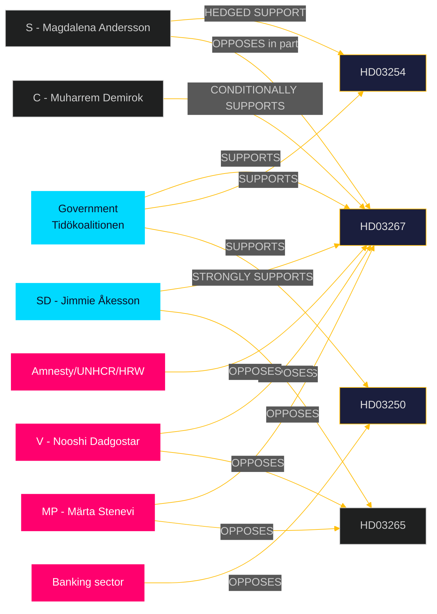

# Stakeholder Perspectives — Propositions 2026-05-26

**📋 Owner:** CEO | **📅 Date:** 2026-05-26 | **🏷️ Classification:** Public

## Stakeholder Map

## Detailed Stakeholder Positions

### 🏛️ Government / Coalition Parties

**M (Moderaterna) — Johan Forssell, Ulf Kristersson**
- **HD03267**: Strongly supports; positions as "protecting Sweden's security without compromising legitimate asylum"
- **HD03254**: Strongly supports; NATO integration is M's flagship foreign policy achievement
- **HD03250/HD03261**: Supports; frames as "modernising the Swedish state"
- **Electoral framing**: M uses this batch to demonstrate governing competence and Tidöavtalet delivery

**SD (Sverigedemokraterna) — Jimmie Åkesson, Tobias Billström**
- **HD03267**: Most important proposition for SD; will campaign on it as fulfilment of migration promises
- **HD03265**: Supports as complementary; wants stricter implementation than proposed
- **Risk**: SD may publicly demand stronger provisions during committee stage to maintain voter base pressure

**KD (Kristdemokraterna) — Erik Slottner, Jakob Forssmed**
- **HD03250**: KD minister's flagship digital policy; strongly supports
- **HD03251**: KD minister's (Forssmed) social care proposition; strongly supports; aligns with KD's Christian social values
- **HD03267**: Supports but will emphasise ECHR compliance

**L (Liberalerna) — Johan Pehrson**
- **HD03267/HD03265**: Conditionally supports with rule-of-law safeguards; most likely coalition party to demand amendments
- **HD03250**: Strongly supports (L values digital freedom/access)

### 🔴 Opposition Parties

**S (Socialdemokraterna) — Magdalena Andersson, Lena Rådström Baastad**
- **HD03267**: Hedged — will support in principle but seek procedural safeguards amendments
- **HD03254**: Strongly supports (S has bipartisan defence consensus)
- **HD03251**: Supports in principle but will claim credit as S legacy policy
- **HD03250**: Supports but will critique BankID privatisation that S previously allowed

**V (Vänsterpartiet) — Nooshi Dadgostar**
- **HD03267**: Strongly opposes; will campaign on human rights grounds
- **HD03265**: Strongly opposes
- **HD03251**: Supports strongly (V prioritises welfare spending)
- **HD03254**: Opposes (V was anti-NATO)

**MP (Miljöpartiet — de gröna) — Märta Stenevi**
- **HD03267/HD03265**: Strongly opposes; will use as anti-SD coalition argument
- **HD03254**: Abstains / opposes (traditional pacifism strand)
- **HD03248/HD03249**: Conditionally supports (EU integration positive for MP)

**C (Centerpartiet) — Muharrem Demirok**
- **HD03267**: Conditionally supports with proportionality safeguards; C has moved rightward on migration
- **HD03254**: Strongly supports (NATO integration)
- **HD03250**: Strongly supports (digital/entrepreneurship agenda)

### 🌐 Civil Society & External Stakeholders

**Amnesty International Sweden**
- **HD03267**: Will oppose publicly; likely to commission legal opinion on ECHR compatibility

**Migrationsverket (Swedish Migration Agency)**
- **HD03267/HD03265**: Operational implications; will provide formal remiss (consultation response)

**SÄPO (Säkerhetspolisen)**
- **HD03267**: Operational beneficiary; supports broader expulsion powers

**Bankgirot / Swedish Bankers' Association**
- **HD03250**: Opposes state e-ID as competitive threat to BankID monopoly

**Försvarsmakten (Swedish Armed Forces)**
- **HD03254**: Strongly supports; needed for NATO Host Nation Support operations

## Evidence Table

| Claim | Evidence | Confidence |
|-------|----------|------------|
| S defence consensus | S party programme, defence committee votes 2022-26 | 🟩 HIGH |
| V anti-NATO position | V 2024 NATO accession vote record | 🟦 VERY HIGH |
| MP rights-based opposition | MP proposition statements 2024-2026 | 🟩 HIGH |
| BankID commercial interest | BankID ownership structure (public knowledge) | 🟩 HIGH |

## 🔄 Pass-2 Self-Audit
- [x] All 8 Riksdag parties covered
- [x] Named party leaders/ministers
- [x] External stakeholders identified
- [x] Mermaid diagram with cyberpunk theming
- [x] Balanced analysis across coalition and opposition
