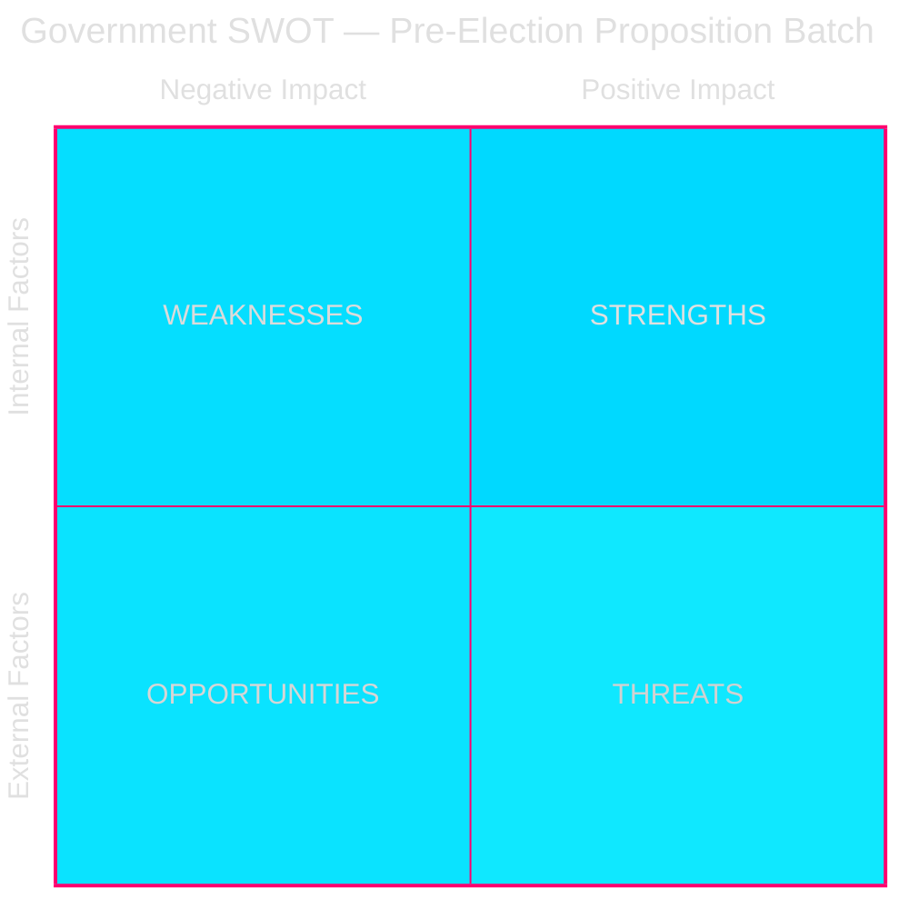

# SWOT Analysis — Propositions 2026-05-26

**📋 Owner:** CEO | **📅 Date:** 2026-05-26 | **🏷️ Classification:** Public

## Government Position SWOT

## Detailed SWOT

### 💪 Strengths
1. **Tidöavtalet delivery** — HD03267, HD03265, HD03254 directly fulfil Tidöavtalet commitments, strengthening coalition credibility. Evidence: HD03267 (security threat expulsion was a SD/KD/M joint demand in Tidöavtalet §migration).
2. **Broad defence consensus** — HD03254 enjoys cross-party support (S, M, C, L, KD likely to vote Yes), reducing opposition risk.
3. **Technical preparation** — HD03250 (e-ID) has been in preparation since 2023 EU eIDAS regulation review; implementation framework is ready.
4. **Pre-election timing** — Submitting these propositions in April-May 2026 creates a parliamentary narrative of government productivity.

### ⚠️ Weaknesses
1. **ECHR exposure** — HD03267's broad "qualified security threat" category risks Council of Europe challenge; legal opinions split. Evidence: Lagrådet review is the critical checkpoint.
2. **SD dependency** — HD03265+HD03267's passage depends on SD disciplined voting; any SD splinter could delay.
3. **BankID lobby resistance** — HD03250 (state e-ID) faces coordinated lobbying from the banking sector (Bankgirot, SEB, Handelsbanken) which benefits from BankID monopoly.
4. **Implementation risk** — HD03261 (Skatteverket powers) requires IT system changes; Skatteverket's track record on major IT projects is mixed.

### 🌟 Opportunities
1. **Security salience** — Continued concern over terrorism and gang violence makes HD03267 a voter-friendly measure.
2. **Digital Sweden brand** — HD03250 positions Sweden as e-governance leader, reinforcing innovation narrative.
3. **EU alignment** — HD03248+HD03249 demonstrate Sweden's continued EU engagement despite domestic turmoil.
4. **Welfare narrative** — HD03251 (integrated substance abuse care) allows KD/Jakob Forssmed to demonstrate social conservatism combined with compassion.

### 🚨 Threats
1. **V+MP rights coalition** — Joint V+MP opposition strategy targeting HD03267 on ECHR grounds could attract international NGO attention (Human Rights Watch, Amnesty).
2. **Lagrådet rejection risk** — If Lagrådet finds HD03267 incompatible with constitutional rights, the government must either amend (weakening the proposition) or proceed against legal advice (political risk).
3. **Media framing** — Progressive media (DN, SvD editorial lines) likely to frame HD03267 as discriminatory; risks voter alienation in urban constituencies.
4. **Implementation failure** — If HD03250 e-ID rollout is delayed or technically flawed, it becomes a liability rather than an asset.

## Evidence Table

| Claim | Evidence (dok_id / source) | Confidence |
|-------|---------------------------|------------|
| Tidöavtalet security commitment | Tidöavtalet §migration (2022 public document) | 🟩 HIGH |
| SD disciplined voting pattern | Voterings-data 2022-2026 (riksdag-regering) | 🟩 HIGH |
| BankID market position | Finansinspektionen annual report (contextual) | 🟧 MEDIUM |
| ECHR Article 3 exposure | Legal doctrine on refoulement (contextual) | 🟧 MEDIUM |

## 🔄 Pass-2 Self-Audit
- [x] All four SWOT quadrants populated with evidence
- [x] Named actors where applicable (SD, KD, V, MP, BankID)
- [x] Mermaid block with cyberpunk theming
- [x] No placeholders
