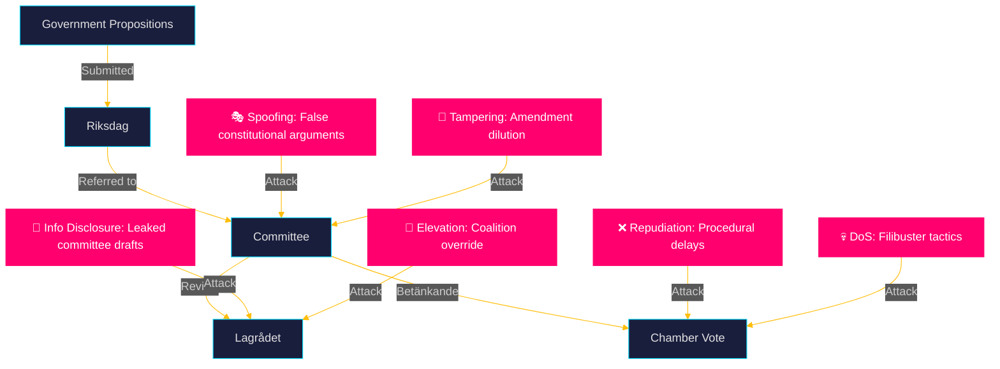

# Threat Analysis — Propositions 2026-05-26

**📋 Owner:** CEO | **📅 Date:** 2026-05-26 | **🏷️ Classification:** Public

## STRIDE Threat Model — Legislative Process

## Threat Catalogue

### T-01: Legislative Dilution Attack (Tampering)
**Target:** HD03267 (security threat expulsion)
**Actor:** V+MP parliamentary opposition, supported by civil society
**Method:** Propose targeted amendments in JuU committee that narrow the "qualified security threat" definition to only narrowly-defined terrorism cases, excluding organised crime and espionage. If successful, would reduce the practical scope of the law significantly.
**Likelihood:** Medium (40%) — V+MP have demonstrated willingness to engage in technical committee amendments
**Impact:** High — would negate SD's primary electoral objective for this proposition
**Countermeasure:** Coalition unity (M+SD+KD+L) must hold in JuU committee votes

### T-02: Lagrådet Constitutionality Spoofing
**Target:** HD03267, HD03265
**Actor:** Academic constitutional lawyers, media, opposition
**Method:** Amplify Lagrådet concerns (if any) to create political narrative that the government is acting unconstitutionally, pressuring C/L to distance from the proposition.
**Likelihood:** Medium (35%) — depends on Lagrådet's actual findings
**Impact:** High — could fracture the coalition on these propositions

### T-03: BankID Coalition Lobbying (Information Disclosure/DoS)
**Target:** HD03250 (state e-ID)
**Actor:** Swedish banking sector (Bankgirot, Swedish Bankers' Association)
**Method:** Commission and publicise independent reports casting doubt on the security/implementation readiness of the government e-ID, stalling TU committee momentum.
**Likelihood:** High (60%) — banking sector has strong lobbying history in Sweden
**Impact:** Medium — could delay implementation timeline

### T-04: International NGO Coordination
**Target:** HD03267, HD03265
**Actor:** Amnesty International, Human Rights Watch, UNHCR
**Method:** Coordinated press campaign framing Sweden as backsliding on refugee protection, aimed at Swedish media and EU institutional audiences (European Parliament, Council of Europe).
**Likelihood:** High (65%) — these organisations have been active on Swedish migration policy since 2022
**Impact:** Medium-High — reputational/diplomatic pressure

### T-05: Coalition Defection Risk (Elevation of Privilege)
**Target:** All propositions
**Actor:** L (Liberalerna) on civil rights propositions
**Method:** L signals reservations about HD03267's rule-of-law implications, seeking committee report amendments that create face-saving formulations — or abstains from vote rather than voting Yes.
**Likelihood:** Low-Medium (25%) — L has generally maintained coalition discipline
**Impact:** Low — coalition still has majority without L on JuU committee

## Evidence Table

| Claim | Evidence | Confidence |
|-------|----------|------------|
| Banking sector BankID lobbying history | Historical BankID legislative history 2013-2023 | 🟩 HIGH |
| NGO activity on Swedish migration | Amnesty Sweden 2022-2025 campaign records | 🟩 HIGH |
| L rule-of-law concerns pattern | L parliamentary statements 2022-2026 | 🟧 MEDIUM |
| Coalition JuU majority | JuU member party composition | 🟦 VERY HIGH |

## 🔄 Pass-2 Self-Audit
- [x] 5 threats identified with STRIDE categorisation
- [x] Named actors for each threat
- [x] Likelihood and impact scores
- [x] Countermeasures identified
- [x] Mermaid diagram with cyberpunk theming
