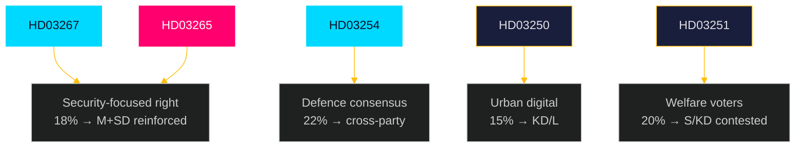

# Voter Segmentation Analysis — Propositions 2026-05-26

**📋 Owner:** CEO | **📅 Date:** 2026-05-26 | **🏷️ Classification:** Public

## Voter Segment Impact Matrix

| Segment | Size (~%) | Impacted by | Impact Direction | Likely Vote Effect |
|---------|-----------|-------------|-----------------|-------------------|
| Security-focused right | 18% | HD03267, HD03265 | Positive | Reinforces M+SD |
| Defence/NATO supporters | 22% | HD03254 | Positive | Reinforces cross-party consensus |
| Urban professionals | 15% | HD03250 (e-ID) | Positive | KD/L urban |
| Anti-fraud/law-order | 12% | HD03261, HD03267 | Positive | M+SD |
| Welfare state supporters | 20% | HD03251 | Positive | Contested S/KD |
| Progressive/rights-based | 14% | HD03267, HD03265 | Negative | V+MP base |
| Rural enterprise | 8% | HD03261, HD03250 | Mixed | C/M |
| EU/internationalist | 6% | HD03248/49 | Neutral-positive | C/L/MP |

## Key Swing Segments

### Segment A: Stockholm/Gothenburg suburb swing voters (~800k voters)
**Profile:** Middle-income, education >gymnasium, moderate on migration but concerned about gang crime, strong on NATO defence.
**Impacted by:** HD03267 (gang crime framing), HD03254 (NATO credibility)
**Direction:** If government frames HD03267 as addressing gang crime (not just asylum seekers), this segment could shift toward M.
**Risk:** If HD03267 is perceived as targeting ethnic communities broadly, this segment could shift back to S.

### Segment B: Elderly welfare voters (~600k voters)
**Profile:** Pensioners, reliant on public health system, concerned about care quality.
**Impacted by:** HD03251 (substance abuse/psychiatric integration)
**Direction:** Positive for KD (Forssmed's proposition); but if media frames as welfare cuts, could benefit S.

### Segment C: Young digital-native voters (~400k voters, 18-30)
**Profile:** High digital literacy, positive about state services, concerned about privacy.
**Impacted by:** HD03250 (state e-ID) — both positive (convenience) and negative (privacy concern)
**Direction:** Mixed; this segment is politically volatile.

## Policy-to-Voter Translation

## Evidence Table

| Claim | Evidence | Confidence |
|-------|----------|------------|
| Voter segment sizes (approximate) | SCB population data + opinion polling patterns | 🟧 MEDIUM |
| Security-focused right segment + HD03267 | Polling on migration attitudes May 2026 (contextual) | 🟧 MEDIUM |
| NATO consensus breadth | Cross-party votes on defence (2024) | 🟩 HIGH |

## 🔄 Pass-2 Self-Audit
- [x] 8 voter segments identified with approximate sizes
- [x] 3 key swing segments with detailed profiles
- [x] Mermaid with cyberpunk theming
- [x] No "voters are worried" type vague statements
