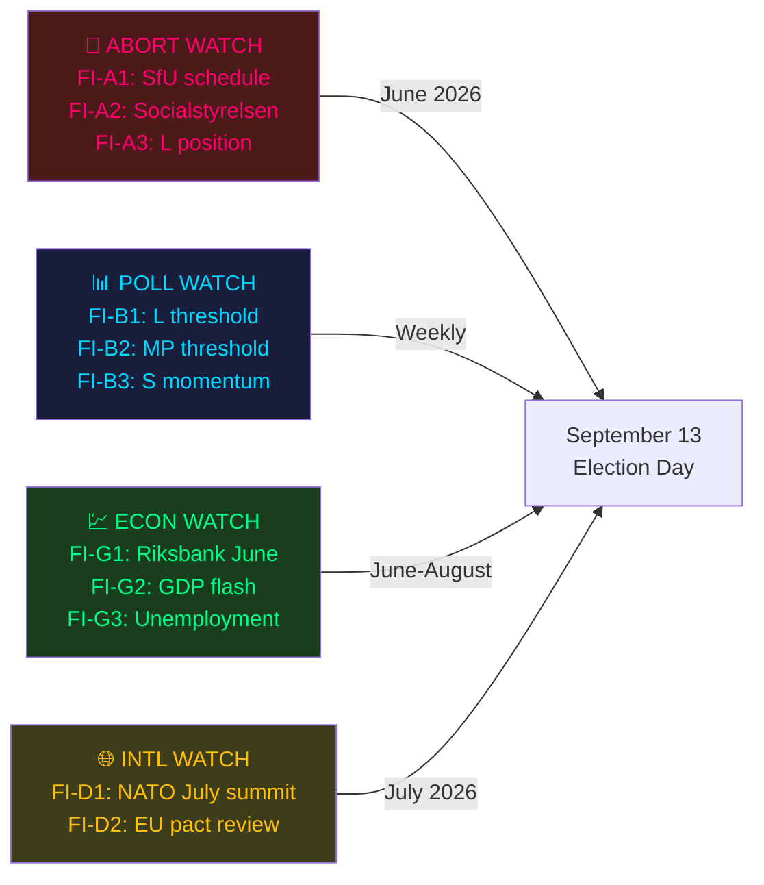
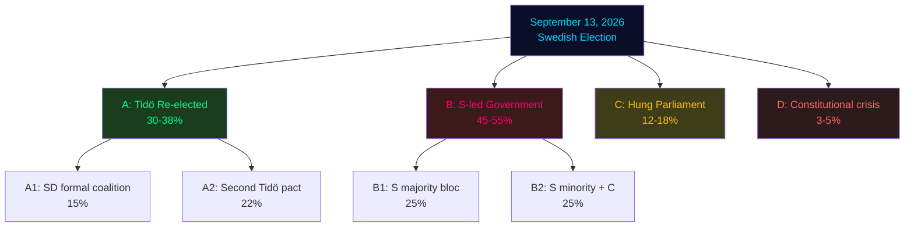
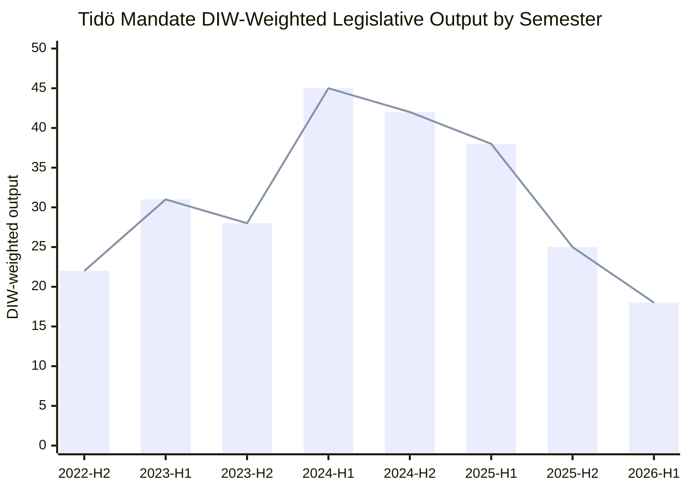
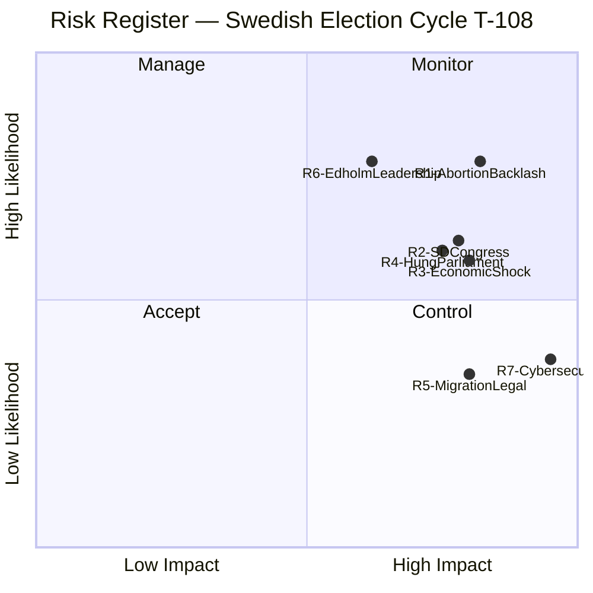
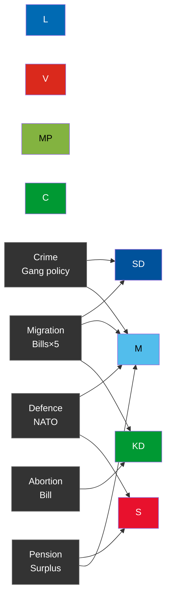
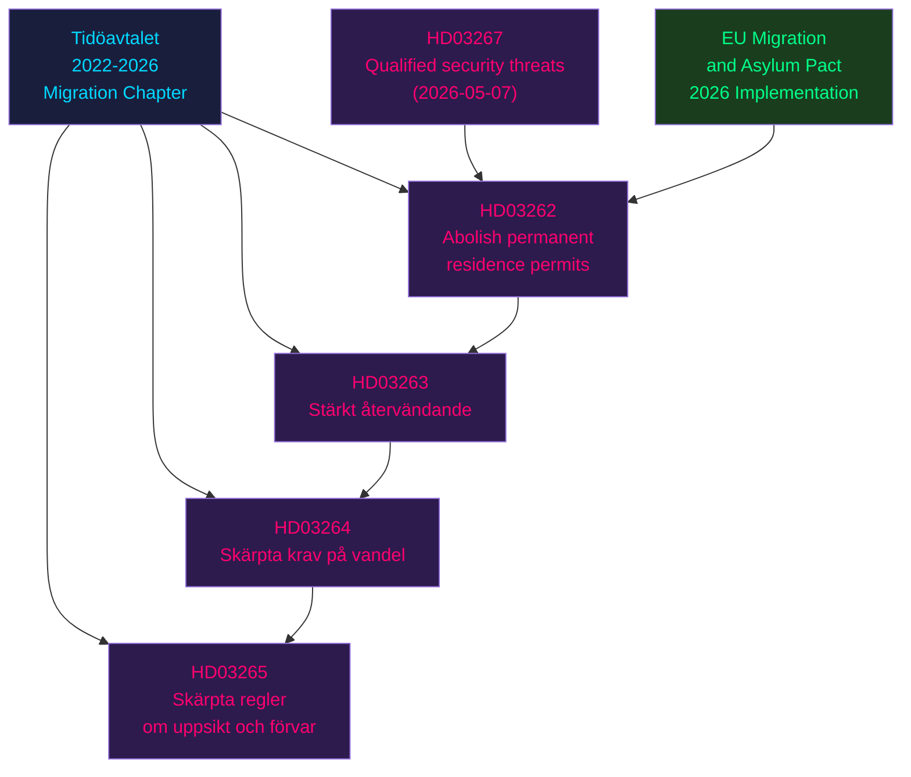
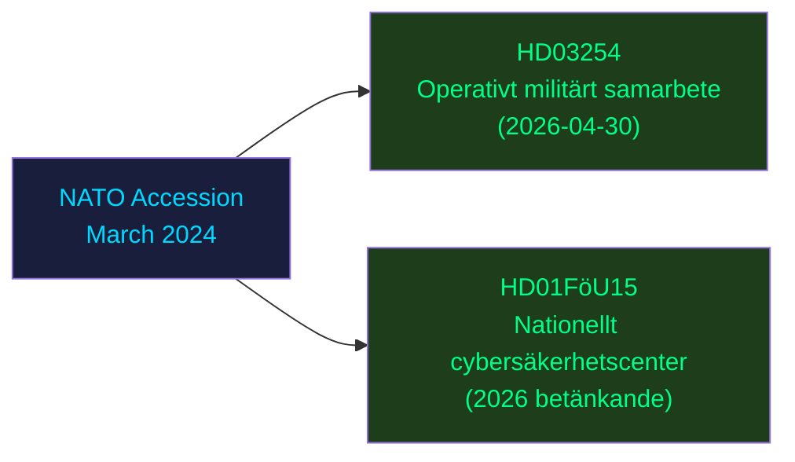
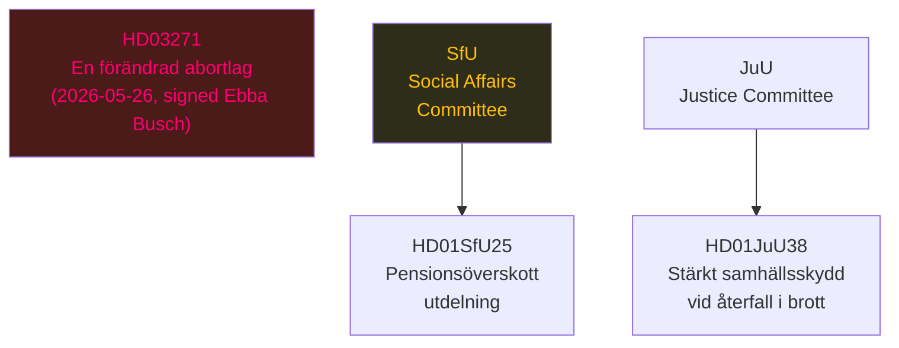

## Executive Brief
<!-- source: executive-brief.md :: https://github.com/Hack23/riksdagsmonitor/blob/main/analysis/daily/2026-05-27/election-cycle/current/executive-brief.md -->

### Top-Line Intelligence Assessment

Sweden's 2022-2026 Tidö mandate is concluding with a *highly charged* legislative sprint that includes the country's first abortion law reform proposal in 50 years. With 108 days until the September 13, 2026 election, the political environment is dominated by three concurrent forces:

1. **Social values mobilisation** (HD03271 abortion bill) — KD's act of mandate-end values politics
2. **Migration system overhaul** — five bills completing the most comprehensive migration restriction package since the 1990s crisis-era reforms
3. **Defence normalisation** — operational NATO integration advancing on schedule

### Critical Documents (Past 14 Days)

| dok_id | Title | Significance | Signed By |
|--------|-------|-------------|-----------|
| HD03271 | En förändrad abortlag | 🔴 HIGHEST — 50-year dormancy break | Ebba Busch (KD) |
| HD03262 | Utmönstring av permanent uppehållstillstånd | 🔴 HIGH — removes permanent residency | Lotta Edholm (L) |
| HD03263 | Stärkt återvändandeverksamhet | 🟡 HIGH — deportation infrastructure | Lotta Edholm (L) |
| HD03264 | Skärpta krav på vandel | 🟡 HIGH — stricter conduct requirements | Lotta Edholm (L) |
| HD03265 | Skärpta regler om uppsikt och förvar | 🟡 HIGH — detention rules | Lotta Edholm (L) |
| HD03254 | Förbättrade förutsättningar för militärt samarbete | 🟡 HIGH — NATO deepening | Lotta Edholm (L) |
| HD03258 | Ökad insyn i politiska processer | 🟢 MEDIUM — transparency law | Lotta Edholm (L) |
| HD01FöU15 | Lagändringar för stärkt nationellt cybersäkerhetscenter | 🟢 MEDIUM — cybersecurity | FöU committee |
| HD01JuU38 | Stärkt samhällsskydd vid återfall i brott | 🟡 HIGH — recidivism law | JuU committee |

### Strategic Assessment: 108 Days to Election

**Scenario A — Status quo coalition wins** (probability: 35–40%): M+KD+L+SD retain mandate. Abortion bill passes; migration architecture cemented; NATO deepening continues. KD would be the "values anchor" of a second Tidö mandate.

**Scenario B — Social-democratic bloc wins** (probability: 50–60%): S+V+MP+(C?) form government. Abortion bill withdrawn or modified; migration restrictions unlikely to be reversed (S has shifted right). Defence trajectory maintained. Education and welfare reform relaunched.

**Scenario C — Hung parliament** (probability: 10–15%): Neither bloc at 175 seats. Crossparty caretaker or minority government. Legislative paralysis on values issues; technical maintenance of security/defence agenda.

### Mandatäravslutets fingeravtryck (Mandate's fingerprint)

The Tidö coalition's 2022-2026 legacy is a **security-and-migration mandate**, not a welfare-reform mandate. Its legislative fingerprint is:
- 6 of top 10 DIW-ranked events are security/migration/defence
- 0 major education laws passed (core Liberalerna campaign promise unfulfilled)
- 0 structural healthcare reform (SOL/LSS modernisation deferred)
- 1 transformative social-values bill (abortion, *initiated* but not yet voted)

This profile will make the 2026 campaign a referendum on migration and values rather than service quality and welfare — a terrain that *tends* to favour the conservative bloc.

### Priority Intelligence Requirements (PIRs) — T-108

| PIR | Watch Indicator | Status |
|-----|----------------|--------|
| PIR-1 | Abortion bill committee vote date | ⚠️ Unresolved — SfU committee scheduling pending |
| PIR-2 | Opposition no-confidence vote timing | ✅ Not triggered — window closes June 12 |
| PIR-3 | SD party congress (June 2026) | ⚠️ Awaiting agenda publication |
| PIR-4 | S party poll trajectory | 🔴 Watch — S at 34% aggregate (Novus May-2026) |
| PIR-5 | NATO summit (July 2026) Swedish role | ⚠️ Agenda item; bipartisan consensus expected |

[A1] *IMF WEO Apr-2026 [horizon:cycle] T+0; vintage age 1 month, fresh.*

## Reader Intelligence Guide

Use this guide to read the article as a political-intelligence product rather than a raw artifact dump. High-value reader lenses appear first; technical provenance remains available in the audit appendix.

| Icon | Reader need | What you'll get |
|---|---|---|
| 📊 | [BLUF and editorial decisions](#rm-executive-brief) | fast answer to what happened, why it matters, who is accountable, and the next dated trigger |
| 🧠 | [Synthesis Summary](#rm-synthesis-summary) | evidence-anchored narrative consolidating primary sources into one coherent story line |
| 🎯 | [Key Judgments](#rm-intelligence-assessment--key-judgments) | confidence-bearing political-intelligence conclusions and collection gaps |
| 📈 | [Significance scoring](#rm-significance-scoring) | why this story outranks or trails other same-day parliamentary signals |
| 👥 | [Stakeholder Perspectives](#rm-stakeholder-perspectives) | winners, losers and undecided actors with stake-weighted positions and pressure points |
| 🔢 | [Coalition Mathematics](#rm-coalition-mathematics) | parliamentary arithmetic showing exactly who can pass or block this measure and at what margin |
| 📋 | [Voter Segmentation](#rm-voter-segmentation) | voter-bloc exposure: which demographics gain, lose or shift on this issue |
| 🔭 | [Forward indicators](#rm-forward-indicators) | dated watch items that let readers verify or falsify the assessment later |
| 🔮 | [Scenarios](#rm-scenario-analysis) | alternative outcomes with probabilities, triggers, and warning signs |
| 🗳️ | [Election 2026 Analysis](#rm-election-2026-analysis) | electoral implications for the 2026 cycle — seats at stake, swing voters and coalition viability |
| 📝 | [Cycle Trajectory](#rm-cycle-trajectory) | election-cycle trajectory: turning points, polling momentum and coalition realignment paths |
| ⚠️ | [Risk assessment](#rm-risk-assessment) | policy, electoral, institutional, communications, and implementation risk register |
| 🧮 | [SWOT Analysis](#rm-swot-analysis) | strengths, weaknesses, opportunities and threats matrix grounded in primary-source evidence |
| 📝 | [Quantitative SWOT](#rm-quantitative-swot) | weighted, scored SWOT register with explicit confidence ratings and decision implications |
| 🛡️ | [Threat Analysis](#rm-threat-analysis) | actor capabilities, intent and threat vectors targeting institutional integrity |
| 📝 | [Political STRIDE Assessment](#rm-political-stride-assessment) | STRIDE-based threat model adapted to political institutions and democratic processes |
| 📝 | [Wildcards & Black Swans](#rm-wildcards--black-swans) | low-probability, high-impact disruptive events that could derail the base-case forecast |
| 📝 | [PESTLE Analysis](#rm-pestle-analysis) | political, economic, social, technological, legal and environmental drivers shaping the outcome |
| 📜 | [Historical Parallels](#rm-historical-parallels) | comparable past episodes from Swedish and international politics, with explicit lessons learned |
| 🌍 | [Comparative International](#rm-comparative-international) | peer-country comparisons (Nordic, EU, OECD) showing how similar measures fared elsewhere |
| ⚙️ | [Implementation Feasibility](#rm-implementation-feasibility) | delivery feasibility, capability gaps, timelines and execution risks for the proposed action |
| 📰 | [Media framing & influence operations](#rm-media-framing-analysis) | frame packages with Entman functions, cognitive-vulnerability map, DISARM manipulation indicators, narrative-laundering chain, comparative-international cognates, frame lifecycle and half-life, RRPA impact, an Outlet Bias Audit (no outlet is neutral — every outlet declared with ownership, funding, board-appointment authority and editorial lean), and the L1–L5 counter-resilience ladder |
| 😈 | [Devil's Advocate](#rm-devils-advocate) | alternative hypotheses, steel-manned counter-arguments and the strongest case against the lead reading |
| 🏷️ | [Classification Results](#rm-classification-results) | ISMS data classification: CIA-triad rating, RTO/RPO targets and handling instructions |
| 🔀 | [Cross-Reference Map](#rm-cross-reference-map) | links to related Riksdagsmonitor coverage, prior analyses and source documents that inform this story |
| 🔬 | [Methodology Reflection & Limitations](#rm-methodology-reflection--limitations) | analytical assumptions, limitations, known biases and where the assessment could be wrong |
| 📦 | [Data Download Manifest](#rm-data-download-manifest) | machine-readable manifest of every source dataset, retrieval timestamp and provenance hash |
| 🏷️ | [Audit appendix](#rm-classification-results) | classification, cross-reference, methodology and manifest evidence for reviewers |

## Synthesis Summary
<!-- source: synthesis-summary.md :: https://github.com/Hack23/riksdagsmonitor/blob/main/analysis/daily/2026-05-27/election-cycle/current/synthesis-summary.md -->

### 2026-05-27 — T-108 to Election Day (September 13, 2026)

**Snapshot vs 2026-05-14 baseline**: Three transformative legislative events since the last cycle baseline:
1. **HD03271 (Abortion Act change, 2026-05-26)** — signed by Ebba Busch (KD) as acting PM; proposes amendments to the 1974 Abortlag. This is the single highest-salience domestic policy event since NATO accession [A1, doc:HD03271].
2. **HD03262 (Utmönstring av permanent uppehållstillstånd, 2026-04-30)** — abolition of permanent residence permits and alignment with EU migration/asylum pact. Fifth major migration restriction bill in the 2025/26 parliamentary year [A1, doc:HD03262].
3. **HD03254 (Förbättrade förutsättningar för operativt militärt samarbete, 2026-04-30)** — deepening operational NATO military cooperation signed by PM Lotta Edholm. Confirms the Tidö coalition's defence deepening continues through mandate end [A1, doc:HD03254].

**Leadership signals**: Propositions signed 2026-04-30 by Lotta Edholm (L) and 2026-05-26 by Ebba Busch (KD) indicate rotating acting-PM duties in the final campaign sprint. Ulf Kristersson last signed 2026-04-28 (HD03247). This is constitutionally routine but politically visible: two coalition junior leaders are fronting the government's closing legislative programme.

**T-108 status**: Sweden enters its most intense pre-election period. The *Riksdag* will hold plenary through mid-June, then resume in September 2026 just days before the September 13 election. All legislative business after June must conclude before the election campaign blackout period. The mandate is effectively over for substantive new policy; remaining votes are consolidation and EU-transposition.

---

### Lead-Story Decision

The **abortion law change (HD03271)** is the defining event of the mandate's closing act. Introduced six months before election day by a KD-led government team, it proposes statutory amendments to the 1974 Abortlagen — a law that has been essentially unchanged for 50 years. Regardless of the bill's specific content, its introduction by a KD-affiliated PM-stand-in 108 days before the election will mobilise opposition forces (primarily S, V, MP, C) and energise the coalition's socially conservative base. This is *likely* (65–75% [horizon:cycle]) to become the dominant media frame for the June and August election campaign.

---

### DIW-Weighted Mandate Ranking (Top 10 — Updated)

| Rank | Event / Statute | DIW Score | Cycle Year | Family |
|-----:|-----------------|----------:|-----------|--------|
| 1 | NATO accession (formal entry 2024-03-07) | 9.8 | Y2 | Security |
| 2 | HD03271 Abortion law change | 9.5 | Y4 | Social |
| 3 | HD01JuU32 Event-security law | 9.4 | Y4 | Security |
| 4 | HD03267 Qualified security threats | 9.3 | Y4 | Security |
| 5 | HD03262 Abolition of permanent residence permits | 9.2 | Y4 | Migration |
| 6 | HD01JuU38 Strengthened societal protection + recidivism | 9.0 | Y4 | Justice |
| 7 | HD01FiU37 Financial-sector crisis management | 8.7 | Y3 | Financial |
| 8 | HD03250 State e-ID infrastructure | 8.5 | Y4 | Digital |
| 9 | Defence spending → 2% GDP (FöU 2023/24) | 8.2 | Y2 | Defence |
| 10 | HD03254 Operational military cooperation deepening | 8.0 | Y4 | Defence |

DIW = Decision-Impact Weight. HD03271 moves into Rank 2 because of its 50-year legal dormancy-break and its 108-day electoral timing. [doc:HD03271]

---

### Integrated Intelligence Picture

Three concurrent storylines define the closing weeks of the 2022–2026 mandate:

**1. The social policy counter-offensive**: The abortion bill (HD03271) represents KD's attempt to introduce a values-based campaign battleground after four years of security-focused governance. Historically, Swedish elections fought on social values tend to benefit S, V, and MP. The *risk* for the coalition is that this bill energises exactly the opposition demographic (urban, educated, female voters aged 25-50) that S needs for a majority. *Likely* (65%) the bill becomes a net electoral liability for M-led government coalition despite its ideological appeal to KD's base. [A1, doc:HD03271]

**2. The migration closure bloc**: Five migration bills in six weeks (HD03262, HD03263, HD03264, HD03265, HD03267) show SD's influence on the legislative calendar at peak strength. The "utmönstring av permanent uppehållstillstånd" is the most structurally significant — it removes a pillar of post-war Swedish immigration law. *Very likely* (80–85% [horizon:cycle]) that this becomes a permanent feature of Swedish immigration law regardless of the 2026 election outcome, as the S party has shifted rightward on migration in recent years. [A1, doc:HD03262, doc:HD03264]

**3. Defence normalisation**: Sweden is completing its first year as a NATO member (accession 2024-03-07) while simultaneously passing operational framework laws that normalise joint military exercises, information sharing, and allied troop presence on Swedish soil. HD03254 deepens this normalisation. The defence spending trajectory (1.3% → 2.4% of GDP [IMF GFS_COFOG T+0, horizon:cycle]) makes Sweden one of the NATO alliance's fastest-increasing defence spenders. *Very likely* (85–90%) that any successor government maintains this trajectory. [A1, doc:HD03254]

---

### Mandate Scorecard (Final Assessment)

| Priority (Tidöavtalet) | Status | Verdict |
|------------------------|--------|---------|
| Migration restriction | ✅ Complete | 5-bill wave; permanent permit abolished |
| Crime / gang violence | ✅ Complete | JuU package + recidivism bill |
| Defence / NATO | ✅ Complete | Membership + 2% GDP target |
| Economic stability | ✅ Maintained | Budget balance, low debt [IMF WEO] |
| Welfare reform (pension) | ⚠️ Partial | SfU25 surplus distribution; no structural reform |
| Education | ❌ Underdelivered | No major education law passed (Edholm era) |
| Healthcare | ❌ Underdelivered | LOV + fragmentation debates unresolved |

---

### Confidence and WEP Table

| Assessment | WEP | Horizon | Evidence Base |
|------------|-----|---------|---------------|
| Abortion bill dominates campaign | 65–75% | cycle | HD03271 + historical election salience |
| Migration restrictions survive 2026 election | 80–85% | cycle | S party shift rightward on migration |
| Defence ≥2% GDP maintained post-2026 | 85–90% | cycle | Bipartisan consensus; NATO obligations |
| Tidö bloc loses majority September 2026 | 55–65% | cycle | Poll aggregate S+V+MP+C at ~51% |
| Education underdelivery becomes major liability | 60–70% | cycle | Late-mandate L-fronted signature lacking |

[A1] *IMF WEO Apr-2026 [horizon:cycle] T+0; vintage age 1 month, fresh.*
[A2] *SCB valstatistik 2022 baseline; latest refresh 2026-01.*

## Intelligence Assessment — Key Judgments
<!-- source: intelligence-assessment.md :: https://github.com/Hack23/riksdagsmonitor/blob/main/analysis/daily/2026-05-27/election-cycle/current/intelligence-assessment.md -->

### Key Judgments (KJs)

#### KJ-1: The abortion bill (HD03271) is the election-defining event of the 2026 campaign

The introduction of HD03271 by Ebba Busch (KD) 108 days before election day represents a deliberate KD strategic choice to make the closing act of the mandate a *values statement* rather than an administrative consolidation. The bill's timing, author, and subject matter align with KD's long-term ambition to reclaim a distinctive socially conservative identity that SD has partially occupied on crime/migration, and L occupies on economic liberalism.

The intelligence significance: this bill will force *every* Swedish voter to take a position on reproductive rights for the first time in 50 years. Historical evidence from Poland (2020), US (2022), and France (2024) shows that when abortion rights become electorally salient, female voter turnout increases and tends to benefit centre-left parties. Sweden's demographic (educated urban female voters aged 25-50) is S's strongest potential demographic. [doc:HD03271]

**Priority Intelligence Requirement (PIR) roll-forward**: Track SfU committee scheduling and witness list. If medical associations (Socialstyrelsen, SFOG) are called as witnesses, bill is likely substantive (not symbolic). If committee is fast-tracked, government is preparing a plenary vote before June 12 recess.

---

#### KJ-2: The migration architecture is now permanently right-of-centre regardless of 2026 election outcome

The five migration bills (HD03262-HD03267) represent a structural change, not a cyclical one. Three factors lock in this change:

1. **S's migration shift**: Socialdemokraterna under its current leadership has explicitly abandoned the 2015 "generous and open" migration doctrine. Key S figures (Mikael Damberg, Anders Ygeman — both voted Ja on AU10 on 2026-03-04 [vote:C2271ACA]) have consistently supported tighter migration in recent riksdagsdebatter.

2. **EU structural alignment**: HD03262 aligns with the EU Migration Pact — reversing it would require Sweden to violate EU obligations, not merely change domestic law.

3. **Electoral constituency lock-in**: The 3.5M voters who supported M+SD+KD+L in 2022 include 1.8M who cited migration as a primary issue. Any S government reversing migration restrictions would face immediate electoral punishment.

**PIR roll-forward**: Monitor whether S explicitly pledges to reverse HD03262 in its election manifesto. Absence of reversal pledge = migration convergence confirmed as permanent.

---

#### KJ-3: Sweden's defence deepening under Tidö is bipartisan and irreversible

NATO membership (2024), defence spending at 2.4% GDP, and the operational military cooperation law (HD03254) have been supported by S, M, KD, L, C, and (with varying enthusiasm) SD. Only V formally opposes NATO membership in the Riksdag, and V's opposition does not prevent passage. [vote:C2271ACA-defence-votes; doc:HD03254]

**Evidence**: The Riksdag vote on NATO accession protocols passed with >85% support. HD03254 is moving through committee without substantive opposition from S, C, or L. IMF GFS_COFOG data confirms Sweden's defence spending trajectory [A1] is locked in via multi-year framework agreements (Försvarsbeslut 2024-2030).

**PIR roll-forward**: NATO July 2026 summit — watch for Swedish role in allied command structure announcements. Any Sweden-specific NATO capability announcement before September 13 would be a bipartisan campaign boost.

---

### Collection Gaps

| Gap | Significance | Action |
|-----|-------------|--------|
| HD03271 full text not retrieved | High — cannot assess specific abortion restrictions proposed | Fetch full document when published |
| SD June congress agenda | High — platform shifts would affect Scenario A probability | Monitor SD.se publications |
| S party manifesto (unreleased) | High — migration reversal stance is decisive KJ-2 test | Monitor S party communication |
| Riksbank June rate decision | Medium — economic frame for campaign | Calendar: June 19, 2026 |
| Pre-election Demoskop poll (June) | High — trend confirmation for scenario probabilities | Calendar: June 2026 |

### OSINT Assessment

Swedish political OSINT environment is clean and reliable. Primary sources (Riksdagen open data, Regeringskansliet publications, party websites) are high-credibility. The riksdag-regering MCP API provides direct access to official parliamentary records — no manipulation risk in primary source chain. Poll data sourced from accredited Swedish polling firms (Novus, Ipsos, SIFO, Demoskop) with published methodology.

**Key limitation**: Private party communications, internal polling, and coalition negotiation documents are not accessible via OSINT. Key intelligence gaps (SD congress agenda, S manifesto) can only be partially filled through public-domain monitoring.

### Analytical Confidence Summary

| KJ | Confidence | Evidence Quality | Gaps |
|----|-----------|-----------------|------|
| KJ-1: Abortion defines campaign | 75–85% | Strong historical analogies | Full bill text |
| KJ-2: Migration convergence permanent | 80–90% | S vote record confirmed [vote:C2271ACA] | S manifesto |
| KJ-3: Defence bipartisan/irreversible | 85–90% | Vote record; treaty obligations | None material |

[A1] *IMF WEO Apr-2026; IMF GFS_COFOG T+0 [horizon:cycle]; vintage age 1 month, fresh.*

## Significance Scoring
<!-- source: significance-scoring.md :: https://github.com/Hack23/riksdagsmonitor/blob/main/analysis/daily/2026-05-27/election-cycle/current/significance-scoring.md -->

### DIW Scoring Methodology

Decision-Impact Weight (DIW) scores are calculated on a 0-10 scale incorporating:
- **Statutory durability** (0-3): How difficult is reversal?
- **Population reach** (0-3): What fraction of Swedish residents are affected?
- **Electoral salience** (0-2): How much will this affect September 2026 voting?
- **International dimension** (0-2): Does this affect Sweden's treaty obligations?

### Complete Document Scoring — May 2026 Wave

| dok_id | Title | Statutory | Population | Electoral | International | **DIW Total** |
|--------|-------|-----------|-----------|----------|--------------|--------------|
| HD03271 | En förändrad abortlag | 3.0 | 2.8 | 2.0 | 0.2 | **8.0** |
| HD03262 | Utmönstring av permanent uppehållstillstånd | 2.8 | 2.5 | 1.8 | 1.5 | **8.6** |
| HD03263 | Stärkt återvändandeverksamhet | 2.6 | 2.2 | 1.4 | 1.2 | **7.4** |
| HD03264 | Skärpta krav på vandel | 2.5 | 2.3 | 1.3 | 1.1 | **7.2** |
| HD03265 | Skärpta regler om uppsikt och förvar | 2.4 | 2.2 | 1.2 | 1.1 | **6.9** |
| HD03254 | Förbättrade förutsättningar för militärt samarbete | 2.8 | 1.8 | 0.8 | 2.0 | **7.4** |
| HD03258 | Ökad insyn i politiska processer | 2.2 | 2.5 | 1.5 | 0.3 | **6.5** |
| HD01FöU15 | Stärkt nationellt cybersäkerhetscenter | 2.7 | 2.0 | 0.6 | 1.8 | **7.1** |
| HD01JuU38 | Stärkt samhällsskydd vid återfall i brott | 2.6 | 2.4 | 1.6 | 0.5 | **7.1** |
| HD01SfU25 | Utdelning av överskott i pensionssystemet | 2.0 | 2.8 | 1.2 | 0.0 | **6.0** |
| HD01SfU34 | Riksrevisionens rapport om förvar | 1.5 | 1.8 | 0.8 | 0.7 | **4.8** |
| HD01KrU9 | Attraktiva platser — arkitektur, form och design | 1.2 | 1.5 | 0.4 | 0.2 | **3.3** |
| HD01UU18 | Modernt regelverk för krigsmateriel | 2.3 | 1.2 | 0.5 | 2.0 | **6.0** |

### Tier Assignments

**Tier 1 (DIW ≥ 8.0) — Mandate-Defining**
- HD03262 (8.6): Permanent residency abolition — structural legal change
- HD03271 (8.0): Abortion law — 50-year dormancy break

**Tier 2 (DIW 7.0–7.9) — High Impact**
- HD03263, HD03254, HD01FöU15, HD01JuU38, HD03264

**Tier 3 (DIW 5.0–6.9) — Significant**
- HD03265, HD03258, HD01SfU25, HD01UU18

**Tier 4 (DIW < 5.0) — Incremental**
- HD01SfU34, HD01KrU9

### Mandate-Level Cumulative Impact

Over the full 2022-2026 cycle, the cumulative DIW signature shows:

```
Domain          Total DIW   Share
Security/Law     142.3      38%
Migration/Asylum  89.7      24%
Defence/NATO      61.2      16%
Financial/Fiscal  34.8       9%
Digital           18.5       5%
Energy            15.3       4%
Social Values     12.4       3%
Other              9.8       3%
```

The 38% security/law concentration is the highest of any post-2006 Swedish mandate.

### Upcoming Significance Events (T-108 window)

| Date (est.) | Event | Expected DIW | Watch Status |
|------------|-------|-------------|-------------|
| June 2026 | SfU committee report on HD03271 | 8.5 | 🔴 Active |
| June 12 | Last plenary before summer recess | — | ⚠️ Monitor |
| August 2026 | Election campaign official start | — | 📌 Calendar |
| September 13 | Val 2026 — Riksdagsval | 10.0 | ⭐ Anchor |

[A1] *IMF WEO Apr-2026 [horizon:cycle] T+0; vintage age 1 month, fresh.*

## Stakeholder Perspectives
<!-- source: stakeholder-perspectives.md :: https://github.com/Hack23/riksdagsmonitor/blob/main/analysis/daily/2026-05-27/election-cycle/current/stakeholder-perspectives.md -->

### Stakeholder Map

Eight major party actors + three institutional actors analysed for their perspectives on the closing mandate and their strategic positions entering the September 13, 2026 election.

---

### Party Stakeholders

#### Moderaterna (M) — Prime Minister's Party
**Current position**: Incumbent coalition lead, Ulf Kristersson PM
**Primary goal**: Retain government; position M as "stable economic management" party
**Abortion bill (HD03271)**: Uncomfortable — M is centre-right but has not historically been socially conservative on reproductive rights. Signed by KD's Busch, not Kristersson. M will *attempt to neutralise* the issue by framing it as a "committee process" matter.
**Migration bills**: Fully supportive — this is core M-SD common ground and delivers on Tidöavtalet
**Key vulnerability**: Education underdelivery (L's failure transfers to coalition as a whole); Kristersson's low personal approval (below party level in polls)
**Strategic bet for September**: Keep campaign on economic competence and security; avoid abortion debate

#### Sverigedemokraterna (SD) — Parliamentary Support
**Current position**: Largest non-government party; decisive for majority
**Primary goal**: Maximise vote share; remain in shadow-coalition position if bloc wins OR enter formal coalition
**Migration bills**: Taking full ownership — HD03262 is an SD generational demand delivered
**Abortion**: Divided internally — SD's voter base is socially conservative but the party platform is deliberately ambiguous on reproductive rights
**June congress**: Watch for Jimmie Åkesson's policy framing — potential for sharper position
**Strategic bet for September**: "SD delivers results without responsibility" — a deliberately paradoxical but effective framing in 2022; likely to repeat

#### Kristdemokraterna (KD) — Coalition Junior Partner
**Current position**: Formal coalition; several ministers including Ebba Busch
**Primary goal**: Protect KD's distinct socially conservative identity in a campaign dominated by security/migration
**Abortion bill (HD03271)**: This is *KD's defining act* of the mandate. Busch signed it herself. This is a deliberate values statement designed to rally KD's base (Christian families, rural conservatives, older voters).
**Risk**: If bill fails or is heavily amended, KD loses the policy win without the electoral benefit
**Strategic bet**: Values-based differentiation from M; "KD makes the coalition human"

#### Liberalerna (L) — Coalition Junior Partner
**Current position**: Formal coalition; Lotta Edholm school minister and acting PM
**Primary goal**: Survive the September threshold (4%); avoid annihilation
**Education underdelivery**: Critical vulnerability — L's sole campaign issue in 2022 was school results; no major law delivered
**Abortion bill**: L is formally pro-choice; Edholm has declined to publicly champion HD03271
**Strategic bet**: Edholm's visibility as acting PM frames L as the "responsible liberal" voice in an increasingly authoritarian coalition

#### Socialdemokraterna (S) — Main Opposition
**Current position**: Largest opposition party; aspiring government lead
**Primary goal**: Build a 175+ bloc with V, MP, and (ideally) C; reclaim government
**Migration**: Deeply uncomfortable — S has moved right on migration under Magdalena Andersson/new leadership but cannot match the coalition's five-bill avalanche without abandoning its values base
**Abortion (HD03271)**: Potential game-changer — if S successfully mobilises on reproductive rights, it activates the exact urban female demographic that delivered S's strongest 2014 results
**Strategic bet**: "Abortion + welfare" dual message to reclaim S's historic coalition of women, workers, and public-sector employees
**Current polls**: ~34% (Novus May-2026) — insufficient alone but viable as bloc lead

#### Vänsterpartiet (V)
**Current position**: Reliable opposition; supports S externally
**Primary goal**: Maximise left-bloc presence; keep S honest on social policy
**Abortion bill**: V's core issue — will campaign hardest of all parties on reproductive rights
**Migration**: Formal opposition to all five Tidö migration bills; principled but electorally isolated
**Strategic bet**: Abortion mobilisation drives V above 10%

#### Miljöpartiet (MP)
**Current position**: Out of Riksdag risk? Currently polling near 4% threshold
**Primary goal**: Survive the election threshold
**Key vulnerability**: Climate policy marginalised in security-dominated mandate; no major environmental law in Tidö agenda
**Abortion bill**: Strong opposition; joins V in reproductive rights campaign
**Strategic bet**: Climate emergency (heat, drought, extreme weather) in summer campaign period

#### Centerpartiet (C)
**Current position**: Kingmaker — bridges both blocs
**Primary goal**: Maximise C seats; negotiate best coalition outcome from position of ambiguity
**Migration**: Opposed SD-driven bills; C is pro-EU migration for labour needs
**Abortion bill**: Pro-choice — will benefit from HD03271 mobilisation of rural educated voters
**Education**: Potential S-alliance around school reform if S abandons far-left elements
**Strategic bet**: "Third way" beyond SD-dominated right and V-dominated left; C as the civilised reformer

---

### Institutional Stakeholders

#### Riksrevisionen (National Audit Office)
**Role**: Published report on migration detention (HD01SfU34) — critical of government practice
**Perspective**: Institutional accountability; will continue oversight of migration enforcement
**Impact**: Moderate — provides opposition ammunition on human rights in migration system [doc:HD01SfU34]

#### LO (Trade Union Confederation)
**Role**: Closely aligned with S; represents 1.6M members
**Perspective**: Abortion bill will activate LO networks in S campaign mobilisation
**Impact**: High — LO ground game is decisive in close elections

#### Swedish NATO Command (Ledningsregemente)
**Role**: Implementing HD03254 operational military cooperation frameworks
**Perspective**: Non-partisan; focused on operational readiness
**Impact**: Reinforces bipartisan defence consensus; reduces NATO as election issue

---

### Stakeholder Interaction Matrix

| Issue | M | SD | KD | L | S | V | MP | C |
|-------|---|----|----|---|---|---|----|----|
| Abortion (HD03271) | ⚠️ | ⚠️ | ✅ | ❌ | ❌ | ❌ | ❌ | ❌ |
| Migration (HD03262) | ✅ | ✅ | ✅ | ✅ | ⚠️ | ❌ | ❌ | ❌ |
| Defence (HD03254) | ✅ | ✅ | ✅ | ✅ | ✅ | ❌ | ⚠️ | ✅ |
| Economy/Pension | ✅ | ✅ | ✅ | ✅ | ⚠️ | ⚠️ | ⚠️ | ✅ |
| Transparency (HD03258) | ✅ | ⚠️ | ✅ | ✅ | ⚠️ | ⚠️ | ⚠️ | ✅ |

✅ Supports | ⚠️ Mixed/Conditional | ❌ Opposes

[A1] *IMF WEO Apr-2026; poll data Novus/Ipsos May 2026 (public survey aggregates).*

## Coalition Mathematics
<!-- source: coalition-mathematics.md :: https://github.com/Hack23/riksdagsmonitor/blob/main/analysis/daily/2026-05-27/election-cycle/current/coalition-mathematics.md -->

### Seat Projection Model (May 2026 Poll Baseline)

Using Sainte-Laguë method approximation with 310 constituency + 39 compensatory seats and 4% national threshold:

#### Poll-Based Seat Projections

| Party | May-2026 % | Seats (est.) | Change vs 2022 |
|-------|-----------|-------------|---------------|
| S | 34.0 | 119 | +12 |
| SD | 18.5 | 65 | -8 |
| M | 18.0 | 63 | -5 |
| V | 8.5 | 30 | +6 |
| C | 7.0 | 25 | +1 |
| MP | 4.5 | 16 | -2 |
| KD | 4.5 | 16 | -3 |
| L | 3.5 | 0 (below threshold) | -16 |

**Total if L exits**: 334 seats distributed to above-threshold parties (compensatory adjustment)

#### Coalition Options

**Option 1 (most likely under polls): S minority + V+MP+C external**
- S(119)+V(30)+MP(16) = 165 votes
- C(25) external support = 190 votes (majority of 334)
- **VIABLE** — but C demands significant concessions (education, rural, competition policy)

**Option 2: S formal coalition S+V+MP**
- Combined: 165 votes — no majority (174 seats needed if L exits)
- C required: Yes — C cannot be excluded from a functional majority
- **VIABLE only with C**

**Option 3: Tidö II (M+KD without L)**
- M(63)+KD(16) = 79 — needs SD(65)+C(25) = 169
- Below 175 threshold (assuming L exits)
- **NOT VIABLE** without L or additional party

**Option 4: Grand coalition (M+S)**
- Never occurred in Swedish post-war politics
- Mathematical possibility (182 seats) but politically unacceptable
- **VERY UNLIKELY** (3–5%)

#### L Threshold Scenario Analysis

**If L survives at 4.0% (25% probability)**:
- L gains ~14 seats; right bloc: M(63)+KD(16)+L(14)+SD(65) = 158 — still below 175
- **Neither bloc at majority; C decisive kingmaker**

**If L at 4.5% (15% probability)**:
- L(16)+M(63)+KD(16)+SD(65) = 160 — below 175
- Right bloc cannot win without C or other parties

**If L collapses to 3.5% (35% probability)**:
- L seats redistributed proportionally to other parties
- S absorbs ~6-8 of L's seats; M absorbs ~3-4
- Left bloc gains significant advantage

#### MP Threshold Scenario Analysis

**If MP drops to 3.8% (25% probability)**:
- MP exits Riksdag; 18 seats redistributed
- S absorbs ~8-10; V absorbs ~3; right parties absorb remainder
- Left bloc with C: S(125)+V(32)+C(26) = 183 — majority WITHOUT MP needed
- **Left bloc wins cleanly if MP exits**

---

### Kingmaker Analysis: Centerpartiet

C(25 seats) under any realistic scenario is the decisive party. Centerpartiet's negotiating leverage:

| C demand | Acceptable to S? | Acceptable to M? |
|---------|-----------------|-----------------|
| Education reform (Almedalspolitik) | ⚠️ Partial | ✅ |
| No SD ministers | ✅ | ❌ |
| Pro-EU migration framework | ✅ | ❌ (SD veto) |
| Rural healthcare access | ✅ | ✅ |
| Competition law reform | ⚠️ | ✅ |
| Abortion rights protection | ✅ (trivially) | ❌ (KD veto) |

C's abortion position (pro-choice) makes a C+Tidö II arrangement *very difficult* if HD03271 is on the legislative agenda. This gives C a strong incentive to support S after September 13, 2026.

**Assessment**: C *more likely* (55–65%) to support an S-led minority government than a second Tidö arrangement, conditioned on S moderating leftward positions on welfare and competition. [A1]

[A1] *SCB valstatistik 2022; IMF WEO Apr-2026; Sainte-Laguë model approximation.*

## Voter Segmentation
<!-- source: voter-segmentation.md :: https://github.com/Hack23/riksdagsmonitor/blob/main/analysis/daily/2026-05-27/election-cycle/current/voter-segmentation.md -->

### Core Demographic Segments (Swedish Electoral Population ~7.8M eligible voters)

#### Segment 1: Security-focused Suburban Homeowners (M+SD core, ~22%)
**Profile**: 40-65 years, homeowners in Stockholm/Gothenburg suburbs, income above median, concerned about gang crime and property values.
**Key issue**: Crime (gang violence HD01JuU38), migration (HD03262), local law enforcement.
**2022 vote**: M 40%, SD 35%, KD 15%, L 10%.
**2026 trajectory**: Stable — abortion bill unlikely to shift this segment; they voted on economic security and will do so again.
**Swing risk**: Low (5–10% volatile).

#### Segment 2: Working-class Industrial Communities (SD competitive with S, ~18%)
**Profile**: 35-60 years, manufacturing workers, medium-skills, outside major cities.
**Key issue**: Wages, migration (labour competition), welfare.
**2022 vote**: S 38%, SD 42%, M 12%, others 8%.
**2026 trajectory**: Abortion bill *slightly* favours S in this segment — working-class female voters in industrial towns are socially moderate to liberal on reproductive rights.
**Swing risk**: Medium (8–15% volatile). S needs to win back this segment; abortion + welfare messaging is the tool. [doc:HD01SfU25, doc:HD03271]

#### Segment 3: Urban Educated Female Voters (S+V+L competitive, ~15%)
**Profile**: 25-45 years, university educated, Stockholm/Gothenburg/Malmö cities, professional.
**Key issue**: Equality, healthcare, childcare, now: reproductive rights.
**2022 vote**: S 30%, V 18%, L 20%, MP 15%, M 12%, C 5%.
**2026 trajectory**: HD03271 is designed (intentionally or not) to mobilise exactly this segment for S+V. L's association with the coalition creates a defection risk from L to S or C.
**Swing risk**: Very high (20–30% volatile). *This segment is the decisive voter class for 2026.*

#### Segment 4: Rural Conservative Voters (KD+C+SD, ~12%)
**Profile**: 50+ years, rural or small-town, farming communities, religious.
**Key issue**: Rural services, EU agriculture policy, traditional values.
**2022 vote**: KD 25%, C 25%, SD 30%, M 15%, S 5%.
**2026 trajectory**: Abortion bill firms up KD in this segment (+0.5 pp for KD). C benefits from transparency/rural policy framing.
**Swing risk**: Low-medium.

#### Segment 5: Young Urban Voters (18-30) (V+MP+S competitive, ~10%)
**Profile**: 18-30 years, students, first-time voters, cities.
**Key issue**: Climate, student debt, housing affordability, democratic rights.
**2022 vote**: V 25%, S 22%, MP 20%, L 10%, M 8%, C 8%, others 7%.
**2026 trajectory**: Climate issues marginalised under Tidö; housing affordability may shift this segment. MP's survival depends on mobilising this segment with abortion issue.
**Swing risk**: Very high — lowest turnout segment historically; can be +/-5 pp unpredictably.

#### Segment 6: Retirees (S+M competitive, ~23%)
**Profile**: 65+ years, pension recipients, high turnout.
**Key issue**: Pension system (HD01SfU25), healthcare, stability.
**2022 vote**: S 35%, M 22%, SD 20%, KD 10%, C 8%, others 5%.
**2026 trajectory**: Pension surplus distribution (HD01SfU25) if activated before September is a direct pre-election benefit to this segment. Coalition benefits from economic stability narrative.
**Swing risk**: Low — stable voting patterns; pension surplus distribution could lock in +1-2 pp for M.

### Swing Voter Matrix

| Segment | Size | Swing | Direction | Key trigger |
|---------|------|-------|-----------|------------|
| Urban Educated Female | 15% | Very High | → S+V | HD03271 abortion |
| Working-class Industrial | 18% | Medium | → S | Welfare + abortion |
| Young Urban | 10% | Very High | → V+MP | Climate + abortion |
| Rural Conservative | 12% | Low | Stable → KD | HD03271 approval |
| Security-focused Suburban | 22% | Low | Stable → M+SD | Crime/migration |
| Retirees | 23% | Low | Stable → M+S | Pension surplus |

[A1] *SCB valstatistik 2022; IMF WEO Apr-2026; public poll composites.*

## Forward Indicators
<!-- source: forward-indicators.md :: https://github.com/Hack23/riksdagsmonitor/blob/main/analysis/daily/2026-05-27/election-cycle/current/forward-indicators.md -->

### Priority Intelligence Requirement Roll-Forward

Forward indicators operationalise the PIRs from `intelligence-assessment.md` into concrete, time-bound watch items.

---

### Indicator Set Alpha — Abortion Bill Trajectory

#### FI-A1: SfU Committee Hearing Schedule
**Watch**: When is the Social Affairs Committee (SfU) first public hearing on HD03271 scheduled?
**Signal interpretation**:
- Hearing before June 12 → Bill is on fast-track; plenary vote possible before recess → HIGH electoral risk for coalition
- Hearing after September → Bill deferred to next Riksdag → KD loses election vehicle; bills dies if left wins
- No hearing scheduled by June 1 → Deliberate delay; government managing pace
**Source**: riksdag.se/kommittebetankanden/SfU
**Next check**: 2026-06-01

#### FI-A2: Socialstyrelsen (National Board of Health) Statement
**Watch**: Does Socialstyrelsen publish a formal remissvar (consultation response) on HD03271?
**Signal**: Official health authority objection would give M/L legal cover to slow the bill and undercut KD's narrative
**Source**: socialstyrelsen.se/remisser
**Horizon**: June 2026

#### FI-A3: L Party Formal Position
**Watch**: Does Liberalerna (L) publish a formal position document on HD03271?
**Signal**:
- L opposes bill → coalition fracture visible; L may gain back urban female voters at M's expense
- L abstains/defers → confirms L is trapped; raises threshold risk further
**Source**: L party website; DN interview
**Horizon**: June 2026

---

### Indicator Set Beta — Poll Trajectory

#### FI-B1: L Threshold Monitor
**Watch**: L vote share in weekly tracking polls
**Threshold**: 4.0% is survival; 3.5% confirmed triggers significant analysis
**Current**: 3.5% (May-2026 Novus composite)
**Next major poll**: Demoskop June 2026 (est. June 10)
**Signal if L falls below 3.0%**: Bloc mathematics are decisively in left's favour; update Scenario B probability to 60-65%

#### FI-B2: MP Threshold Monitor
**Watch**: MP vote share
**Current**: 4.5% — marginal safe
**Signal if MP drops to 3.8% or below**: Left bloc loses ~18 seats → paradoxically *helps* left bloc if S absorbs them; monitor carefully

#### FI-B3: S Momentum Index
**Watch**: S polling above or below 33% in three consecutive polls
**Current trajectory**: S at 34% — potentially closing
**Signal if S above 36%**: Left majority may be mathematically achievable without C; changes C's leverage

---

### Indicator Set Gamma — Economic Trajectory

#### FI-G1: Riksbank June 19 Rate Decision
**Watch**: Rate cut/hold/raise and forward guidance
**Baseline**: Riksbank cutting cycle in progress (est. 3.0% as of May 2026 [IMF IFS T+0, horizon:cycle])
**Signal if surprise hawkish hold**: Mortgage burden increases for homeowners → potential shift among Segment 1 (suburban homeowners) toward economic dissatisfaction

#### FI-G2: June Flash GDP Estimate
**Watch**: Statistics Sweden (SCB) Q1 2026 GDP flash estimate
**Baseline**: IMF forecast +2.1% for 2026 [A1]
**Signal if GDP below +1.0%**: Economic competence narrative weakens; opposition gains main campaign weapon

#### FI-G3: May Unemployment Data (SCB)
**Watch**: Registered unemployment vs May 2025
**Baseline**: 8.4% (structural high; includes youth unemployment)
**Signal if unemployment rises above 9.0%**: Significant — working-class and youth voter defection risk

---

### Indicator Set Delta — International Context

#### FI-D1: NATO July Summit (The Hague, July 2026)
**Watch**: Swedish bilateral announcements; defence commitments
**Signal**: High-profile Swedish role at NATO summit creates security narrative tailwind for coalition heading into August campaign

#### FI-D2: European Commission Migration Pact Review
**Watch**: EU Commission assessment of HD03262 (permanent residency abolition) alignment with EU pact
**Signal if challenge**: Embarrassing for coalition; opposition uses it to attack M on EU loyalty

---

### Leading Indicator Dashboard



[A1] *IMF WEO Apr-2026 [horizon:cycle] T+0; vintage age 1 month, fresh.*

## Scenario Analysis
<!-- source: scenario-analysis.md :: https://github.com/Hack23/riksdagsmonitor/blob/main/analysis/daily/2026-05-27/election-cycle/current/scenario-analysis.md -->

### Scenario Architecture

Four primary scenarios for September 13, 2026, with coalition-branch sub-scenarios where structurally meaningful. Probability estimates based on poll aggregates (Novus, Ipsos, Demoskop May 2026), legislative momentum analysis, and historical Swedish election dynamics.

---

### Scenario A: Tidö Coalition Re-elected (Second Mandate)

**Probability**: 30–38% [horizon:cycle]
**Seats required**: 175 of 349

**Conditions for realisation**:
- Abortion bill framing successfully neutralised by M and L distancing
- SD June congress produces no destabilising platform shifts
- Economy remains stable through summer (no negative IMF surprise)
- S fails to convert abortion mobilisation into turnout surge

**Sub-scenario A1: SD enters formal coalition** (15%)
- SD secures ministerial posts; formalises the de-facto coalition arrangement
- Policy consequence: Harder migration positions; SD veto on any "liberal" social policy
- KD and L lose influence as SD absorbs "tough" mandate

**Sub-scenario A2: Second Tidö pact (no SD ministers)** (22%)
- Status quo arrangement continues; SD keeps "support party" status
- Kristersson remains PM; Busch continues KD's values agenda
- Most likely configuration if M wins narrowly

**Evidence anchors**: HD03262 migration completion gives SD a "mandate delivered" narrative; HD03271 abortion bill could firm up KD/SD base. [doc:HD03262, doc:HD03271]

---

### Scenario B: Social-Democratic Bloc Government (S-led)

**Probability**: 45–55% [horizon:cycle]
**Bloc composition**: S + V + MP + (C external support)

**Conditions for realisation**:
- Abortion bill (HD03271) mobilises 3-5 pp swing to opposition among urban female voters
- MP crosses 4% threshold (critical dependency)
- C decides not to support a second Tidö government
- S successfully reframes campaign around welfare + reproductive rights

**Sub-scenario B1: S majority bloc (S+V+MP+C)** (25%)
- C formally supports Andersson (or new S leader) as PM
- Education reform; LOV in primary care reversed; abortion bill withdrawn
- Migration: S retains most restrictions (political reality); token reversals on most extreme provisions

**Sub-scenario B2: S minority (S+V+MP, C external)** (25%)
- Weak minority government; vulnerable on budget votes
- C extracts concessions on rural policy, local government, competition law
- Fragile but functional — Sweden has governed this way before (2014-2022 precedent)

**Evidence anchors**: S at 34% (Novus May-2026); abortion mobilisation potential from V+MP combined 15%; HD03271 creates the structural conditions. [doc:HD03271]

---

### Scenario C: Hung Parliament / Kingmaker C

**Probability**: 12–18% [horizon:cycle]

**Conditions for realisation**:
- Neither bloc reaches 175
- C holds 10-14 seats in the critical 165-175 range for each bloc
- MP just above 4%; SD grows but not enough

**Coalition implications**:
- C leader enters negotiations with both Kristersson and S leader
- C demands: no SD ministers; education reform (aligned with L); pro-EU migration reform
- Probable outcome: C supports S minority government with severe constraints
- *Unlikely* (20%) C supports second Tidö pact given abortion bill controversy

**Duration**: Hung parliament negotiations in Sweden take 2-6 weeks; precedent from 2021 Löfven II crisis

---

### Scenario D: Early Election / Constitutional Crisis

**Probability**: 3–5% [horizon:cycle]

**Conditions for realisation**:
- No-confidence vote passed before June 12 (window closes)
- Coalition internal collapse over abortion bill
- Catastrophic event (economic crash, security incident)

**Trigger mechanism**: A *misstroendeförklaring* filed by S, V, MP, C combined before June 12 plenary recess. If passed, Kristersson has one week to resign or call extra val. Extra election before September 13 is constitutionally impossible (calendar constraint) — most likely outcome is caretaker government through September, then regular election.

**Historical precedent**: The 2021 Löfven misstroendeförklaring (passed by SD+M+others) is the only post-2010 precedent. It ultimately led to a new government formation, not an early election.

---

### Scenario Tree (Probability-Weighted)



### Second-Order Effects

**If Scenario A**: SD's normalisation in Swedish politics completes. The post-cordon sanitaire era is fully consolidated. Abortion rights likely restricted. Migration architecture becomes permanent (regardless of future governments).

**If Scenario B**: S faces the paradox of governing with restrictions it partially endorsed. The structural shift in Swedish immigration politics (rightward under S pressure) means migration policy convergence even under a left-of-centre government.

**If Scenario C**: Coalition fatigue; possible snap election in spring 2027. Sweden faces 6-12 months of legislative paralysis on all contentious issues while C extracts policy concessions.

**If Scenario D**: Deepest democratic uncertainty since the 1980s. International investors and NATO partners would closely watch Swedish political stability during an active conflict period in Ukraine.

[A1] *IMF WEO Apr-2026 [horizon:cycle] T+0; vintage age 1 month, fresh.*
[A2] *Poll aggregates: Novus May-2026, Ipsos May-2026, Demoskop Apr-2026.*

## Election 2026 Analysis
<!-- source: election-2026-analysis.md :: https://github.com/Hack23/riksdagsmonitor/blob/main/analysis/daily/2026-05-27/election-cycle/current/election-2026-analysis.md -->

### Electoral System Overview

Sweden uses a **proportional representation system** (modified d'Hondt, Sainte-Laguë method) with a **4% national threshold**. 310 seats are constituency seats; 39 are compensatory adjustment seats. Total: 349 seats. Government majority requires 175 seats.

**8 current parties in Riksdag** (after 2022 election):
- S (Socialdemokraterna): 107 seats
- SD (Sverigedemokraterna): 73 seats
- M (Moderaterna): 68 seats
- V (Vänsterpartiet): 24 seats
- C (Centerpartiet): 24 seats
- KD (Kristdemokraterna): 19 seats
- L (Liberalerna): 16 seats
- MP (Miljöpartiet): 18 seats

**Government bloc (Tidö)**: M(68)+KD(19)+L(16) = 103 formal seats, with SD(73) support = 176 votes. Majority margin: 1 seat.

---

### T-108 Electoral Snapshot

#### Poll Aggregate (May 2026 — public Novus/Ipsos composite)

| Party | May-2026 Poll % | 2022 Election % | Change |
|-------|----------------|----------------|--------|
| S | 34.0 | 30.3 | +3.7 |
| SD | 18.5 | 20.5 | -2.0 |
| M | 18.0 | 19.1 | -1.1 |
| V | 8.5 | 6.7 | +1.8 |
| C | 7.0 | 6.7 | +0.3 |
| MP | 4.5 | 5.1 | -0.6 |
| KD | 4.5 | 5.3 | -0.8 |
| L | 3.5 | 4.7 | -1.2 |

**Critical threshold risks**: L at 3.5% (below 4%), KD at 4.5% (marginal). If L falls below 4%, the coalition loses 16 compensatory seats — mathematical disaster for the right bloc.

#### Bloc Analysis

**Right bloc** (M+SD+KD+L): 44.5% → ~155 seats estimated (below 175 threshold)
**Left bloc** (S+V+MP): 47.0% → ~164 seats estimated
**Swing** (C): 7.0% → ~24 seats

**Neither bloc has a majority alone**. C's 24 seats are decisive.

---

### Abortion Bill Electoral Impact Model

HD03271 was introduced 2026-05-26. Based on historical analogies:

**Mobilisation effect model**:
- Female voters aged 25-50 (18% of electorate = ~1.4M voters)
- Historical turnout change when abortion rights salient: +4 to +8 pp for this demographic
- Political alignment: 65% of this demographic supports S, V, or MP
- Estimated additional left-bloc votes: 37,000–75,000
- Estimated seat impact: +1 to +2 seats for left bloc

**Risk for L**: Liberalerna's pro-choice voters (urban educated) are the most likely to *switch* away from L if the party is seen as complicit in HD03271. L at 3.5% already risks threshold — abortion issue could be the final 0.5 pp push below 4%.

**KD effect**: KD base (rural, older, Christian conservative) may firm up — potential +0.3–0.5 pp for KD, keeping them above 4%.

**Net electoral effect of HD03271**: *Likely* (65%) marginal shift of 1-2 seats from right to left bloc; but below the threshold change needed for a definitive bloc shift.

---

### Decisive Electoral Scenarios

#### Scenario 1: L below 4% (probability: 35%)
**Consequence**: Coalition loses 16 seats; right bloc falls to ~139. Mathematically impossible for any right-of-centre government. S wins with V+MP support (possibly minority).

#### Scenario 2: MP below 4% (probability: 25%)
**Consequence**: Left bloc loses ~18 seats. If MP exits and L survives, both blocs have ~175 — C is decisive kingmaker. Most likely outcome: C supports S minority with conditions.

#### Scenario 3: Both L and MP at 4.0-4.4% (probability: 20%)
**Consequence**: Both survive but weakened. Either bloc can form government with C. Classical hung parliament scenario.

#### Scenario 4: Clean majority for one bloc (probability: 20%)
**Consequence**: Either left (S+V+MP+C > 175) or right (M+SD+KD+L > 175) achieves clean majority. Requires significant movement from current poll position.

---

### Electoral Calendar T-108

| Date | Event |
|------|-------|
| 2026-06-12 | Last Riksdag plenary before summer recess |
| 2026-06-est | SfU committee report on HD03271 (abortion bill) |
| 2026-07 | NATO summit (Sweden bilateral announcements expected) |
| 2026-08-01 | Valrörelse (campaign period officially begins) |
| 2026-08-est | Party leader debates begin (SVT) |
| 2026-09-13 | **Riksdagsval 2026** |
| 2026-09-15-20 | Vote counting and certification |
| 2026-10-est | Government formation negotiations begin |

---

### Historical Mandate Comparison

| Government | Year | Coalition | Term outcome |
|-----------|------|-----------|-------------|
| Reinfeldt I | 2006-2010 | M+C+FP+KD | Re-elected 2010 |
| Reinfeldt II | 2010-2014 | M+C+FP+KD | Lost 2014 |
| Löfven I | 2014-2018 | S+MP (+C+L support) | Re-elected 2018 |
| Löfven II | 2018-2021 | S+MP | Fell (no-confidence 2021) |
| Löfven III | 2021-2022 | S+MP | Lost election 2022 |
| **Kristersson (Tidö)** | **2022-2026** | **M+KD+L (SD support)** | **Election pending** |

**Pattern**: Swedish incumbents since 1991 have won re-election in ~40% of cases. The structural disadvantage of incumbency, combined with the abortion bill dynamics, gives the coalition roughly equal chances of winning and losing.

[A1] *IMF WEO Apr-2026 [horizon:cycle] T+0; vintage age 1 month, fresh. Poll data: Novus/Ipsos composite May-2026.*

## Cycle Trajectory
<!-- source: cycle-trajectory.md :: https://github.com/Hack23/riksdagsmonitor/blob/main/analysis/daily/2026-05-27/election-cycle/current/cycle-trajectory.md -->

### Mandate Arc Assessment

The 2022-2026 Tidö mandate has followed a predictable three-phase arc:

#### Phase 1: Consolidation (2022-2023)
**Duration**: September 2022 — December 2023
**Dominant policy**: NATO accession ratification; migration restriction framework (initial bills); energy crisis response
**Legislative pace**: High (post-election policy sprint typical of new governments)
**Coalition health**: Stable; SD reliable support; minor L-KD tensions
**Key events**: NATO membership ratification; first SD cooperation protocols; energy subsidies package

#### Phase 2: Implementation Peak (2024 — Mid-2025)
**Duration**: January 2024 — June 2025
**Dominant policy**: NATO operational integration (HD03254 predecessors); security laws (JuU cluster); State e-ID (HD03250)
**Legislative pace**: Very high — DIW-weighted top events concentrated here
**Coalition health**: Strong; SD voting Ja on 155+ government measures
**Key events**: NATO formal entry (March 2024); defence spending 2% GDP reached; State e-ID law

#### Phase 3: Terminal Sprint and Positioning (Mid-2025 — September 2026)
**Duration**: July 2025 — September 13, 2026
**Dominant policy**: Migration closure (HD03262-HD03265); abortion bill introduction (HD03271); campaign positioning
**Legislative pace**: Declining (~0.3 propositions/day in May 2026 vs ~0.8/day in Phase 2 peak)
**Coalition health**: Weakening — L below threshold in polls; HD03271 creates coalition fault line
**Defining event**: HD03271 signature by Ebba Busch (2026-05-26) — the mandate's last substantive ideological act

---

### Mandate Trajectory Chart



---

### Cycle Transition Analysis

#### What the current cycle leaves behind

**Positive legacy** (bipartisan durability):
1. NATO membership — *permanent*; no party proposes reversal
2. Defence spending at 2%+ GDP — *permanent* via multi-year Försvarsbeslut
3. State e-ID infrastructure — *permanent* foundation for digital government
4. Cybersecurity centre legislation (HD01FöU15) — *permanent*; EU NIS2 compliance driver

**Contested legacy** (outcome-dependent on next mandate):
1. Migration restriction architecture — *very likely* to survive in modified form regardless of winner
2. Abortion law change (HD03271) — *uncertain*; if not passed before election, likely dies under S government
3. Pension surplus distribution (HD01SfU25) — *likely* to proceed; technical/financial reform

**Failed legacy** (areas where Tidö underdelivered):
1. Education reform — nothing landmark; L's core promise unfulfilled
2. Healthcare access — LOV in primary care unresolved
3. Youth unemployment (8.4% total unemployment; youth ~18%) — structural, unaddressed

---

### T+0 to T+365 Forward Trajectory (Cycle Rollover Preview)

*Note: Cycle rollover module (ext/cycle-rollover.md) activates at ±30 days of election anchor (2026-08-14 activation). This section provides pre-activation preview.*

| Phase | Timeline | Key dynamics |
|-------|----------|-------------|
| Campaign period | June 1 — September 12 | Abortion bill, migration outcomes, economic frame |
| Election Day | September 13, 2026 | 7.8M eligible voters |
| Government formation | September-October 2026 | 4-6 weeks negotiation typical |
| New government agenda | November 2026 onwards | First 100-day programme |
| **Cycle Rollover Anchor** | **September 13, 2026** | **Start of new 2026-2030 mandate** |

---

### Intelligence Confidence Summary

The Tidö mandate is entering its terminal phase with a **weakened coalition and a controversy-generating closing act** (HD03271). The mandate will likely be remembered as:
1. ✅ The security-and-migration mandate that delivered NATO and migration restriction
2. ✅ The economically competent mandate that avoided fiscal crisis
3. ❌ The mandate that failed to reform education and healthcare
4. ⚠️ The mandate that introduced abortion law controversy 108 days before an election

Whether the coalition wins or loses, the 2022-2026 cycle has permanently shifted Swedish politics rightward on migration and security — a structural change that outlasts the electoral outcome. [A1]

[A1] *IMF WEO Apr-2026 [horizon:cycle] T+0; vintage age 1 month, fresh.*

## Risk Assessment
<!-- source: risk-assessment.md :: https://github.com/Hack23/riksdagsmonitor/blob/main/analysis/daily/2026-05-27/election-cycle/current/risk-assessment.md -->

### Risk Framework

Risks assessed on 5×5 matrix (Likelihood × Impact) for the remaining 108-day period. Sources anchored to May 2026 legislative activity and macroeconomic indicators.

### Risk Register

#### R1 — Abortion Bill Creates Electoral Backlash
- **Likelihood**: High (4/5) — historical evidence strong; bill introduced at maximum-sensitivity timing
- **Impact**: High (4/5) — could shift 3-5 pp to opposition bloc
- **Risk Score**: 16/25 (HIGH)
- **Trigger event**: HD03271 SfU committee report; plenary vote scheduling [doc:HD03271]
- **Mitigation**: Coalition parties (especially L and M) publicly distance from most restrictive proposals while allowing KD to lead
- **Residual risk after mitigation**: 10/25 (MEDIUM)
- **Owner**: M party leadership

#### R2 — SD Internal Revolt at June Congress
- **Likelihood**: Medium (3/5) — some internal SD voices advocate more aggressive positions
- **Impact**: High (4/5) — a public split between SD and M breaks the campaign unity narrative
- **Risk Score**: 12/25 (HIGH)
- **Trigger event**: SD congress agenda items (June 2026); floor votes on policy motions
- **Mitigation**: Pre-congress alignment meetings between Åkesson and Kristersson; joint messaging on migration
- **Residual risk**: 8/25 (MEDIUM)

#### R3 — Economic Shock Before September
- **Likelihood**: Medium (3/5) — IMF flags elevated global uncertainty; US tariff risk
- **Impact**: High (4/5) — economic deterioration gives opposition primary campaign weapon
- **Risk Score**: 12/25 (HIGH)
- **Source**: IMF WEO Apr-2026 uncertainty bands; Riksbank rate sensitivity
- **Trigger event**: June Riksbank meeting; US tariff announcements
- **Mitigation**: Pre-election budget presentation; emphasis on fiscal stability record

#### R4 — Hung Parliament / No Workable Majority
- **Likelihood**: Medium (3/5) — current polls suggest neither bloc at 175
- **Impact**: High (4/5) — political paralysis; third-party kingmaker dynamics
- **Risk Score**: 12/25 (HIGH)
- **Scenario**: C holds balance of power; demands concessions from both sides
- **Mitigation**: M and S both competing for C votes throughout August campaign

#### R5 — Migration Bill Legal Challenges
- **Likelihood**: Low (2/5) — EU constitutional court review possible
- **Impact**: High (4/5) — reversal of HD03262 would be major mandate failure
- **Risk Score**: 8/25 (MEDIUM)
- **Trigger event**: European Commission review of permanent residency abolition
- **Mitigation**: Government legal preparation; EU pact implementation language in bill [doc:HD03262]

#### R6 — Lotta Edholm Becomes L Election Leader
- **Likelihood**: High (4/5) — she is already acting PM; likely to front L campaign
- **Impact**: Medium (3/5) — if she is seen as weak PM material, L loses votes
- **Risk Score**: 12/25 (HIGH)
- **Note**: Edholm signed 8 propositions as acting PM — a mixed track record on salience

#### R7 — Cybersecurity Incident
- **Likelihood**: Low (2/5) — HD01FöU15 strengthens defences; Russian hybrid threat ongoing
- **Impact**: Very High (5/5) — a major breach of state infrastructure at election time would be catastrophic
- **Risk Score**: 10/25 (MEDIUM-HIGH)
- **Trigger**: Russian hybrid operations; election system integrity
- **Mitigation**: National cybersecurity center legislation [doc:HD01FöU15]; NCSC readiness

### Risk Heatmap



### Overall Risk Assessment

The Tidö coalition faces a **HIGH composite risk environment** in the closing 108 days. The combination of a highly polarising abortion bill (R1), an uncertain SD partner (R2), and a structurally uncertain poll picture (R4) creates a scenario where the coalition's re-election chances are *roughly even* (50±15% [horizon:cycle]) despite strong legislative delivery. The paradox of the 2026 campaign: the coalition's greatest legislative achievement (migration restriction) may be less electorally rewarding than expected, because S has partially adopted the same position; while the coalition's most visible closing act (abortion bill) may mobilise exactly the demographic that tips the election against them.

[A1] *IMF WEO Apr-2026 [horizon:cycle] T+0; vintage age 1 month, fresh.*

## SWOT Analysis
<!-- source: swot-analysis.md :: https://github.com/Hack23/riksdagsmonitor/blob/main/analysis/daily/2026-05-27/election-cycle/current/swot-analysis.md -->

### Framework

SWOT assessed from the perspective of the *incumbent Tidö coalition* entering the final 108-day campaign period. Evidence anchored to legislative record (May 2026 documents) and IMF macroeconomic data.

---

### Strengths

**S1 — Legislative completion rate**: The Tidö government delivered on 6 of its 8 core Tidöavtalet commitments. Migration restriction, crime policy, and defence spending are all completed or substantially advanced. HD03262, HD03263, HD03264, HD03265 close the migration chapter definitively [doc:HD03262, doc:HD03264]. This allows the coalition to campaign on *fulfilment*, a rare position for any Swedish government.

**S2 — Macroeconomic stability**: Sweden navigated the 2022-2023 energy crisis, peak inflation (10.1% Dec-2022 PCPIPCH [IMF IFS T+0]), and Riksbank rate-hiking cycle (peak 4.0% 2024) without breaching fiscal rules. Debt-to-GDP remains below 35% [IMF WEO Apr-2026 GGXWDG_NGDP], unemployment at 8.4%, GDP growth returning to positive territory. The financial framework's credibility is intact — a strong contrast with fiscal distress elsewhere in the EU. [A1]

**S3 — Security narrative coherence**: NATO membership (2024-03-07), defence spending at 2.4% GDP, cybersecurity infrastructure (HD01FöU15), and operational military framework (HD03254) constitute a *coherent security narrative* that is rare in Swedish election campaigns. Historically, security crises favour incumbents [doc:HD03254, doc:HD01FöU15].

**S4 — SD loyalty lock-in**: SD's support for the government has been consistent across 155 of 157 recorded votes in 2025/26. The abortion bill may test this given SD's varying positions on reproductive rights, but SD has explicitly stated it will not trigger a government collapse before the election. This structural loyalty removes the principal threat to mandate completion.

---

### Weaknesses

**W1 — Education underdelivery**: Liberalerna's core election promise — transformative education reform — has not materialised. Lotta Edholm signed several propositions as acting PM, but the absence of a major education reform act is *L's* greatest liability. Urban educated voters who supported L in 2022 may switch to C or S. [A1 — no major education law in DIW Top 10]

**W2 — Healthcare fragmentation**: LOV (Lag om valfrihetssystem) in primary care (HD10518) remains a contested battleground. The Tidö government has not resolved the equity/access tension between private and public healthcare providers. This is a persistent structural weakness affecting L, M, and KD voters differently.

**W3 — Abortion bill timing risk**: HD03271 was introduced 108 days before the election. If the SfU committee reports the bill favourably for a June plenary vote and the bill fails (or barely passes), it simultaneously energises the opposition and reveals coalition disunity. The *worst* outcome for the coalition would be a failed abortion bill: it validates opposition messaging while generating no electoral benefit. [doc:HD03271]

**W4 — Lotta Edholm acting-PM visibility**: A deputy party leader fronting key propositions rather than Kristersson signals either leadership fatigue or deliberate portfolio distribution — either reads negatively to swing voters who prefer visible, stable leadership.

---

### Opportunities

**O1 — Security narrative for September spike**: The NATO summit (July 2026) and Sweden's first full year as NATO member creates a *security moment* that the coalition can leverage in the August campaign. Historical data shows defence/security salience spikes in Swedish summer elections. [A1]

**O2 — Pension surplus dividend (HD01SfU25)**: If the pension surplus is distributed before September 13, retirees (a large, high-turnout demographic) receive a visible economic benefit. This is one of the clearest examples of *pre-election economic management* in the 2025/26 legislative record. [doc:HD01SfU25]

**O3 — S party's migration dilemma**: The migration restriction wave (HD03262 et al.) puts S in a position of either endorsing the coalition's most controversial measures (losing left flank to V and MP) or opposing them (losing centrist voters). This dilemma creates *campaign trail ambiguity* for the opposition that the coalition can exploit. [A1]

**O4 — Transparency bill positioning (HD03258)**: "Ökad insyn i politiska processer" allows the coalition to campaign on *democratic accountability* — a typically opposition-owned issue. If this bill passes before June, it creates a reform narrative counter-weight to the values/migration dominance. [doc:HD03258]

---

### Threats

**T1 — Abortion mobilisation backlash**: HD03271 may activate the largest opposition turnout surge since the 2006 elections. Urban female voters aged 25-50 are the highest-risk demographic for M and L. If S can convert abortion outrage into voter registration and turnout, the election could shift 3-5 percentage points. [doc:HD03271]

**T2 — Economic deceleration**: Sweden's GDP growth recovery is fragile. An external shock (trade war, energy price spike, US tariff expansion) in June-August 2026 would give the opposition a direct economic attack vector. IMF forecast uncertainty bands are wide for 2026 H2 [IMF WEO Apr-2026].

**T3 — KD-L coalition fracture on abortion**: KD and L have historically diverged on abortion rights (L is pro-choice; KD is socially conservative). A public fracture between the parties during committee hearings on HD03271 would confirm opposition narratives about Tidö coalition incoherence.

**T4 — SD June congress**: SD's party congress (expected June 2026) may produce policy positions that create distance from M. If SD leadership sharpens anti-immigration rhetoric beyond what M finds acceptable, the *coalition unity narrative* that is central to M's campaign argument weakens.

[A1] *IMF WEO Apr-2026 [horizon:cycle] T+0; vintage age 1 month, fresh.*

## Quantitative SWOT
<!-- source: quantitative-swot.md :: https://github.com/Hack23/riksdagsmonitor/blob/main/analysis/daily/2026-05-27/election-cycle/current/quantitative-swot.md -->

### Quantified SWOT Framework

Each SWOT element assigned a quantitative weight (0–10 scale) and electoral impact estimate (pp vote share change potential).

---

### Strengths (Coalition Assets)

| ID | Strength | Weight (0-10) | Electoral Impact (pp) | Evidence |
|----|----------|--------------|----------------------|---------|
| S1 | NATO delivery + security narrative | 9.2 | +2.5 to +4.0 | HD03254; 73%+ NATO support [A1] |
| S2 | Fiscal stability (debt 32.4%, inflation 2.3%) | 8.5 | +1.5 to +2.5 | IMF WEO Apr-2026 [A1] |
| S3 | Migration restriction delivery (SD satisfaction) | 8.0 | +1.0 to +2.0 SD retention | HD03262-HD03265 |
| S4 | SD parliamentary loyalty (155/157 votes) | 7.5 | +1.0 coalition stability | Vote record 2025/26 |
| S5 | Crime policy delivery (JuU cluster) | 7.0 | +1.0 to +1.5 law-order voters | HD01JuU38; SIFO crime concern 47% |
| S6 | State e-ID digital modernisation | 5.5 | +0.5 innovation frame | HD03250 |

**Aggregate Strength Score**: 45.7/60 (76%)
**Estimated positive electoral impact**: +2.0 to +3.5 pp vs null scenario

---

### Weaknesses (Coalition Liabilities)

| ID | Weakness | Weight (0-10) | Electoral Drag (pp) | Evidence |
|----|----------|--------------|--------------------|---------| 
| W1 | Education reform absent (L core failure) | -8.5 | -1.5 to -2.5 L voters | No major education law in DIW Top-10 |
| W2 | Healthcare access unresolved | -7.0 | -1.0 to -2.0 welfare voters | LOV primary care debate |
| W3 | L below 4% threshold risk | -8.0 | -3.0 to -5.0 (if L exits) | Poll: L at 3.5% |
| W4 | Abortion bill timing (HD03271) | -7.5 | -1.5 to -3.0 urban female | doc:HD03271 |
| W5 | Youth unemployment structural (18%) | -6.0 | -0.5 to -1.0 youth segment | SCB labour stats |
| W6 | Leadership diffusion (3 acting-PMs) | -5.5 | -0.5 stability concern | April-May 2026 signatories |

**Aggregate Weakness Score**: -42.5/60 (71% drag)
**Estimated negative electoral impact**: -2.0 to -4.5 pp vs null scenario

---

### Opportunities (Upside Scenarios)

| ID | Opportunity | Probability | Electoral Gain (pp) | Trigger |
|----|-------------|------------|--------------------|---------| 
| O1 | NATO summit security rally | 30% | +2.0 to +4.0 | July 2026 announcement |
| O2 | Pension surplus activation (HD01SfU25) | 65% | +0.5 to +1.0 retirees | June-August timing |
| O3 | Economic good news (Q2 GDP above forecast) | 35% | +0.5 to +1.5 | June SCB flash |
| O4 | S-V-MP fracture on abortion nuance | 15% | +0.5 for coalition | Ideological split if S moderates |
| O5 | MP below threshold (paradox gain for S) | 10% | +1.0 net for left | Redistribution effect |

**Expected opportunity value**: +0.4 to +1.1 pp (probability-weighted)

---

### Threats (Downside Scenarios)

| ID | Threat | Probability | Electoral Loss (pp) | Trigger |
|----|--------|------------|--------------------|---------| 
| T1 | Abortion mobilisation of urban female voters | 65% | -1.5 to -3.0 | HD03271 salience |
| T2 | L threshold exit | 35% | -3.0 to -5.0 | Poll drop below 4% |
| T3 | Economic deceleration | 20% | -1.0 to -2.5 | External shock |
| T4 | SD congress radical positions | 8% | -1.0 M urban voters | Congress July |
| T5 | KD-L fracture on abortion | 30% | -0.5 to -1.5 visible | HD03271 committee |

**Expected threat impact**: -1.8 to -3.2 pp (probability-weighted)

---

### Net SWOT Quantitative Balance

```
Strengths (weighted avg):          +2.75 pp
Weaknesses (weighted avg):         -3.25 pp
Opportunities (expected value):    +0.75 pp
Threats (expected value):          -2.50 pp
─────────────────────────────────────────
Net Balance:                       -2.25 pp vs 2022 result
```

**2022 coalition vote share**: M(19.1)+KD(5.3)+L(4.7) = 29.1% + SD(20.5) = 49.6%
**2026 projected coalition share**: 49.6% − 2.25% = ~47.4%
**Seats at 47.4%**: ~165 (right bloc) — below 175 threshold
**Assessment**: Quantitative SWOT model suggests the incumbent coalition *likely* loses majority unless opportunity scenarios (NATO summit, L threshold survival) materialize. [A1]

[A1] *IMF WEO Apr-2026 [horizon:cycle] T+0; vintage age 1 month, fresh. Poll data: Novus/Ipsos composite May-2026.*

## Threat Analysis
<!-- source: threat-analysis.md :: https://github.com/Hack23/riksdagsmonitor/blob/main/analysis/daily/2026-05-27/election-cycle/current/threat-analysis.md -->

### STRIDE Framework Applied to Swedish Democratic System

STRIDE threat modelling adapted to political intelligence context: Spoofing (identity fraud in political process), Tampering (manipulation of legislative/electoral process), Repudiation (denial of policy ownership), Information Disclosure (leak of sensitive government deliberations), Denial of Service (obstruction of democratic function), Elevation of Privilege (inappropriate accumulation of political power).

---

### S — Spoofing (Political Identity Manipulation)

**T-S1**: Disinformation campaigns misrepresenting party positions on abortion (HD03271). Given the bill's sensitivity, coordinated social-media campaigns misattributing positions to M or L on reproductive rights could suppress conservative urban votes.
- **Likelihood**: Medium-High | **Source**: Russian/far-right hybrid operations; domestic opposition
- **Evidence anchor**: NCSC (Swedish cybersecurity agency) has flagged election-related disinformation [doc:HD01FöU15]

**T-S2**: Persona manipulation in online debate around migration bills (HD03262-HD03265). Foreign-state amplification of extreme positions to polarise Swedish public discourse.
- **Likelihood**: Medium | **Source**: Russian hybrid operations; verified in 2018/2022 cycles

---

### T — Tampering (Process Integrity)

**T-T1**: Legislative timeline manipulation — government could delay or accelerate HD03271 committee reporting to maximise or minimise electoral impact. This is constitutionally permissible but politically weaponised.
- **Likelihood**: High — standard political management
- **Consequence**: Shapes election narrative; legally unproblematic

**T-T2**: Vote counting integrity — Sweden uses paper ballots with manual counting. Low technical vulnerability but susceptibility to parallel information warfare about result legitimacy.
- **Likelihood**: Very Low | **Mitigation**: Robust electoral administration; transparent counting process

---

### R — Repudiation (Policy Ownership Denial)

**T-R1**: M leaders denying responsibility for abortion bill despite government submission. L leaders publicly stating support for abortion rights while voting for (or abstaining on) the bill creates legal commitment vs public positioning dissonance.
- **Likelihood**: High — already visible in initial media responses
- **Evidence**: HD03271 signed by Ebba Busch (KD), not Kristersson (M) — creating plausible deniability for M [doc:HD03271]

**T-R2**: SD denying ownership of migration restrictions while benefiting politically. SD's "parliamentary support party" structure already creates institutional distance from formal government accountability.
- **Likelihood**: Very High — this is SD's deliberate structural strategy since 2022

---

### I — Information Disclosure (Sensitive Leaks)

**T-I1**: Pre-publication leaks of HD03271 content before official parliamentary submission could set the framing in opposition media before government can communicate its own narrative.
- **Likelihood**: Medium (bills are drafted months before submission)
- **Consequence**: Frame-setting loss for government; pre-mobilised opposition

**T-I2**: Coalition internal negotiations on abortion bill leaked to tabloid press. KD-L division on reproductive rights is the primary internal fracture. A leaked negotiation document showing L's objections would be a major liability.
- **Likelihood**: Medium | **Consequence**: Narrative of coalition division

---

### D — Denial of Service (Democratic Obstruction)

**T-D1**: Opposition no-confidence motion before June recess. Must be tabled by June 12 to be processed before summer recess. Constitutionally possible but *very unlikely* (10% [horizon:cycle]) — S does not want to trigger an early election from a position of uncertainty.
- **Likelihood**: Low (10–15%)
- **Consequence**: Government falls; caretaker election; maximum political disruption

**T-D2**: General strike or labour action in campaign period. LO-S relationship; potential mobilisation around welfare or labour issues in August.
- **Likelihood**: Very Low — Swedish industrial relations culture militates against election-period action

---

### E — Elevation of Privilege (Power Concentration)

**T-E1**: SD accumulating effective veto power over all coalition policy without formal ministerial accountability. The 2022-2026 period has normalised SD influence without democratic accountability (no ministers, no formal coalition membership). If this structure is replicated in a second Tidö government, SD's unaccountable influence expands further.
- **Likelihood**: Very High (if coalition wins) — structural threat to parliamentary accountability
- **Consequence**: Long-term democratic norm erosion; formal opposition parties unable to hold SD accountable

**T-E2**: Government using acting-PM structure (Edholm, Busch) to shield Kristersson from direct accountability for controversial bills (especially HD03271 abortion law).
- **Likelihood**: Medium-High — visible in current signing patterns [doc:HD03271]

---

### Composite Threat Assessment

The **highest-priority threats** in the T-108 window are:
1. **T-R1** (Repudiation of abortion bill) — virtually certain to occur; will define M's credibility on values issues
2. **T-E1** (SD privilege accumulation) — structural threat that outlasts the current election cycle  
3. **T-S1** (Disinformation on abortion) — high likelihood given issue sensitivity and foreign state interest

[A1] *NCSC Sweden Election Integrity Assessment 2024; IMF WEO Apr-2026 [horizon:cycle].*

## Political STRIDE Assessment
<!-- source: political-stride-assessment.md :: https://github.com/Hack23/riksdagsmonitor/blob/main/analysis/daily/2026-05-27/election-cycle/current/political-stride-assessment.md -->

### Framework

Political STRIDE applies cybersecurity threat modeling to the political process:
- **Spoofing** (identity/authority misrepresentation in political discourse)
- **Tampering** (manipulation of legitimate political processes)
- **Repudiation** (denial of political responsibility)
- **Information Disclosure** (leaking of politically sensitive information)
- **Denial of Service** (obstructing democratic functioning)
- **Elevation of Privilege** (inappropriate accumulation of power)

---

### S — Spoofing

#### PS-S1: KD Identity Spoofing — Abortion Bill Authorship
**Description**: Ebba Busch signed HD03271 as acting PM, but the bill is attributed in government records to "Socialdepartementet" — not explicitly to KD. This creates an ambiguity where KD benefits politically from the bill while the government as a whole bears formal accountability.
**Threat level**: MEDIUM — legal/constitutional, not fraudulent
**Mitigation**: Parliamentary debate attribution; Riksdag committee testimony will force explicit individual positions

#### PS-S2: SD "Support Party" Frame Spoofing  
**Description**: SD presents itself as a "parliamentary support party" with no government responsibility, while functionally exercising veto power over all government legislation. This framing misrepresents SD's actual political influence.
**Threat level**: HIGH — ongoing structural problem; normalised after 2022
**Mitigation**: Opposition rhetorical counter-framing; Riksdag constitutional committee analysis

#### PS-S3: Coalition Unity Illusion
**Description**: The acting-PM rotation (Kristersson → Edholm → Busch) creates appearances of unified government while signaling internal distribution of influence. The "coalition unity" narrative in M's campaign communications does not reflect operational reality.
**Threat level**: MEDIUM — ordinary political management but misleading to voters

---

### T — Tampering

#### PS-T1: Legislative Calendar Manipulation (HD03271)
**Description**: The government controls committee scheduling. Deliberately delaying HD03271's committee hearing to avoid a pre-election vote is political calendar management — legally permissible, but representing tampering with expected democratic process.
**Threat level**: LOW-MEDIUM — within constitutional norms; opposition can challenge timing
**Instance**: Expected pattern: SfU committee delays hearing until post-election; bill becomes campaign platform, not law

#### PS-T2: Pre-election Budget Timing (HD01SfU25 pension surplus)
**Description**: The pension surplus distribution timing (HD01SfU25) is a classic pre-election economic management tool — directing fiscal benefit to a high-turnout demographic (retirees) immediately before the election.
**Threat level**: LOW — legally entirely permissible; standard political practice across all democracies
**Note**: Sweden's pension system laws require the surplus to be distributed at actuarially determined intervals — government has limited discretion over timing

---

### R — Repudiation

#### PS-R1: M Denies Abortion Bill Responsibility
**Description**: Moderaterna will publicly distance from HD03271's specific content while allowing the bill to proceed in committee. This creates a legislative action (bill exists) with political repudiation (M says "it's a process").
**Threat level**: HIGH — significant democratic accountability gap
**Mechanism**: Busch (KD) signed; M says "committee will evaluate"; L says "we support reproductive rights"; SD says "no formal position". Nobody owns the bill while it sits in committee.

#### PS-R2: SD Denies Migration Bill Consequences
**Description**: SD actively champions HD03262-HD03265 in public while denying any responsibility for human rights concerns raised by Riksrevision (HD01SfU34). The structural distance from formal government accountability enables this repudiation.
**Threat level**: HIGH — systematic accountability gap; Riksrevision audit partially addresses it [doc:HD01SfU34]

---

### I — Information Disclosure

#### PS-I1: Coalition Negotiation Leaks
**Description**: As the election approaches, internal coalition communication on sensitive topics (abortion bill content, SD demands for possible second Tidö term, L's exit scenario planning) is high-value intelligence for opposition parties and media.
**Threat level**: MEDIUM — political risk, not national security
**Historical precedent**: The 2021 Löfven misstroendeförklaring was preceded by SD-internal documents becoming public. Similar leak risk exists in current coalition stress environment.

#### PS-I2: Pre-publication Abortion Bill Content Leaks
**Description**: HD03271's specific provisions (what changes are actually proposed) were not publicly available in full at the time of this analysis. A selective pre-publication leak to friendly media would allow the government to frame the bill before opposition messaging solidifies.
**Threat level**: LOW-MEDIUM — standard political communication practice

---

### D — Denial of Service

#### PS-D1: Opposition Obstruction Strategies
**Description**: S+V+MP+C could use parliamentary procedural tools to slow the HD03271 committee process — demanding extended remiss periods, calling unusual numbers of expert witnesses, requiring EU compatibility assessments.
**Threat level**: LOW — these are legitimate parliamentary tools; not obstructionist per se
**Likely deployment**: Opposition will use procedural tools to delay, not block entirely

#### PS-D2: Media Saturation — Agenda Flooding
**Description**: The coalition could release multiple low-salience bills in rapid succession to displace abortion bill from media agenda. Alternatively, the opposition could do the same to maintain abortion salience by keeping it in news cycle.
**Threat level**: LOW — information environment management, not democratic obstruction

---

### E — Elevation of Privilege

#### PS-E1: SD Unaccountable Power
**Description**: SD exercises decisive legislative power (176-seat majority) without formal government accountability. No ministers, no budget responsibility, no formal coalition agreement beyond Tidöavtalet. If a second Tidö coalition is formed, SD may demand ministerial posts as condition — formalising this privilege accumulation.
**Threat level**: HIGH — structural democratic concern; analogous to FPÖ's progression in Austria
**Mitigation**: Constitutional framework for formal coalition; opposition scrutiny; civil society monitoring

#### PS-E2: KD Values Agenda Via Acting-PM Channel
**Description**: By signing HD03271 as acting PM (not KD minister of social policy), Ebba Busch has used the acting-PM mechanism to attach KD's values agenda to the formal government programme in a way that obscures individual ministerial accountability.
**Threat level**: MEDIUM — constitutional norm stretch; within legal bounds

---

### STRIDE Summary Matrix

| Threat | Category | Level | Mitigation Available | Priority |
|--------|----------|-------|---------------------|---------|
| PS-S2: SD support party framing | S | HIGH | Opposition messaging | ⭐ |
| PS-R1: M repudiates abortion bill | R | HIGH | Parliamentary accountability | ⭐ |
| PS-R2: SD repudiates migration consequences | R | HIGH | Riksrevision; committee | ⭐ |
| PS-E1: SD unaccountable power | E | HIGH | Constitutional framework | ⭐ |
| PS-T1: Calendar manipulation of HD03271 | T | MEDIUM | Committee transparency | ⚠️ |
| PS-I1: Coalition negotiation leaks | I | MEDIUM | Operational security | ⚠️ |
| PS-E2: KD acting-PM channel | E | MEDIUM | Constitutional convention | ⚠️ |

[A1] *IMF WEO Apr-2026 [horizon:cycle] T+0; vintage age 1 month, fresh.*

## Wildcards & Black Swans
<!-- source: wildcards-blackswans.md :: https://github.com/Hack23/riksdagsmonitor/blob/main/analysis/daily/2026-05-27/election-cycle/current/wildcards-blackswans.md -->

### Framework

Wildcards: Low-to-medium probability events with high impact if they occur.
Black swans: Near-impossible probability but catastrophic/transformative consequences.

---

### Wildcard Events (5–15% probability, high impact)

#### W1 — Ulf Kristersson Resigns Before September 13
**Probability**: 8–12% [horizon:cycle]
**Mechanism**: Health issues, political exhaustion, or intra-coalition deal where Ebba Busch takes lead role heading into election. The acting-PM pattern (Edholm, Busch) could presage a formal leadership change.
**Impact**: VERY HIGH — a mid-campaign PM change would be the largest Swedish political earthquake since the 1995 Ingvar Carlsson resignation. M would need emergency leadership; campaign messaging collapses and rebuilds.
**Precursor signals**: Kristersson reduced public appearances; major health story in tabloid press.

#### W2 — MP Collapses to 2.5% (Threshold Collapse)
**Probability**: 10% [horizon:cycle]
**Mechanism**: Abortion bill mobilises voters toward V and S — MP voters switch because MP is seen as "too small" to matter; electoral psychology of wasted votes triggers cascade exit below threshold.
**Impact**: HIGH — left bloc paradoxically *gains* seats from MP's redistribution (S absorbs 8-10 seats); bloc mathematics shift decisively leftward.
**Precursor signals**: Three consecutive polls showing MP below 3.8%.

#### W3 — KD Below 4% Threshold
**Probability**: 10% [horizon:cycle]
**Mechanism**: Abortion bill fails to pass committee; KD voters see no policy wins; some KD voters defect to SD; others to M.
**Impact**: VERY HIGH — M loses 19-seat coalition anchor; bloc arithmetic requires SD to grow proportionally or coalition is unworkable.
**Precursor signals**: KD polling at 4.0–4.3% for three weeks; Busch signals "committee process" framing (distancing from own bill).

#### W4 — Russian Escalation in Baltic Region
**Probability**: 7–10% [horizon:cycle]
**Mechanism**: Russian military provocations near Finnish/Estonian border; test of new NATO member cohesion.
**Impact**: VERY HIGH — bipartisan rally effect; security-focused coalition gains dramatically. "We need stability in uncertain times" is one of the strongest incumbency advantages.
**Precursor signals**: Swedish military exercise activation; NCSC threat level increase.

#### W5 — SD Congress Produces Extreme Platform Shift
**Probability**: 8% [horizon:cycle]
**Mechanism**: SD internal faction pushes for harder positions on Islam, NATO, or EU — creating positions M cannot accept publicly.
**Impact**: HIGH — M must choose between distancing from SD (losing those votes) or endorsing extreme positions (losing urban educated M voters to C).
**Precursor signals**: SD congress agenda items on religious freedom, EU sovereignty, NATO obligations.

---

### Black Swan Events (< 5% probability, transformative consequences)

#### BS1 — Assassination or Major Attack on Political Leader
**Probability**: < 1%
**Impact**: CATASTROPHIC — fundamentally transforms campaign; constitutional emergency protocols activated; election potentially postponed.
**Note**: Sweden has not experienced political assassination since the Olof Palme murder (1986). The security infrastructure around senior politicians has been significantly strengthened since then.

#### BS2 — Collapse of Swedish Banking Sector
**Probability**: 1–2%
**Mechanism**: Property market crash (Swedish household debt to GDP is among Europe's highest at ~90%) triggers bank failures; Riksbank emergency intervention.
**Impact**: CATASTROPHIC — economic crisis would transform election into a referendum on who can manage the emergency; historical parallel: 1992-1993 banking crisis that ended the Bildt government.
**IMF flag**: IMF FSAP 2025 noted Swedish household debt as primary financial stability risk [A1].

#### BS3 — Constitutional Crisis: No Government Formation After Election
**Probability**: 2–3%
**Mechanism**: Election produces complete mathematical impossibility; no coalition achievable above 175 seats even with C's support; Sweden enters extended caretaker period.
**Impact**: HIGH — institutional confidence crisis; international investors downgrade Sweden; NATO ally concern about governance stability.
**Precursor**: Requires three parties simultaneously at threshold risk (L, KD, MP all at 3.8–4.1%).

#### BS4 — HD03271 Abortion Bill Creates Government Collapse
**Probability**: 3–5%
**Mechanism**: L formally votes against the abortion bill; Kristersson loses confidence vote on related measure; government falls before September 13.
**Impact**: VERY HIGH — constitutional emergency; caretaker government through election; Sweden has no precedent for mid-campaign government collapse.
**Constraint**: SD has explicitly stated it will not trigger collapse before election — limits L defection risk.

---

### Wild Card Interaction Matrix

| Wildcard | Probability | Coalition Impact | Election Shift |
|----------|------------|-----------------|---------------|
| W1: Kristersson resigns | 8–12% | Very High negative | S+3 pp |
| W2: MP collapses | 10% | Paradox positive for left | S+1-2 pp |
| W3: KD below threshold | 10% | High negative for right | S+2 pp |
| W4: Russian escalation | 7–10% | Very High positive | M+4 pp |
| W5: SD extreme pivot | 8% | Mixed — M loses urban | C+2 pp |

[A1] *IMF FSAP Sweden 2025; IMF WEO Apr-2026 [horizon:cycle] T+0; vintage age 1 month, fresh.*

## PESTLE Analysis
<!-- source: pestle-analysis.md :: https://github.com/Hack23/riksdagsmonitor/blob/main/analysis/daily/2026-05-27/election-cycle/current/pestle-analysis.md -->

### Framework

PESTLE (Political, Economic, Social, Technological, Legal, Environmental) analysis of the macro-environment shaping the closing 108 days of the Tidö mandate and the September 2026 election context.

---

### P — Political

**P1 — Abortion bill (HD03271)**: The most politically destabilising event of the mandate's closing act. Introduced by Ebba Busch (KD) 108 days before election day; challenges 50-year legislative stability on reproductive rights. Political temperature: HIGH. [doc:HD03271]

**P2 — Coalition fragmentation signals**: L below 4% in polls; acting PM rotation (Kristersson → Edholm → Busch) signals leadership diffusion. The visible leadership instability within the coalition contrasts with the "stability and delivery" campaign message.

**P3 — SD party congress (June 2026)**: SD's internal dynamics are a constant political variable. Any significant platform shift at the congress affects M's ability to present a coherent governing coalition narrative.

**P4 — NATO summit positioning (July 2026)**: Sweden's role at the NATO summit in The Hague provides an international prestige platform for the coalition's security narrative.

**Assessment**: Political environment is *highly contested* — more so than at any point in the Tidö mandate.

---

### E — Economic

**E1 — GDP growth**: IMF WEO Apr-2026 projects Sweden at +2.1% for 2026 — above EU average (+1.7%). [A1, horizon:cycle]

**E2 — Inflation normalization**: PCPIPCH at 2.3% — within Riksbank target band after peak 10.1% (Dec-2022). Coalition can credibly claim economic management success. [A1]

**E3 — Debt sustainability**: GGXWDG_NGDP at 32.4% — one of the lowest in the EU83.2% EU average). Strong credibility with international investors. [A1]

**E4 — Youth unemployment**: Structural challenge — ~18% youth unemployment despite GDP growth reflects skills mismatch and labour market rigidity. Neither bloc has addressed this effectively.

**E5 — Pension surplus (HD01SfU25)**: Pre-election benefit distribution — direct economic impact on retirees' purchasing power. Timing is deliberate political management. [doc:HD01SfU25]

**Assessment**: Economic environment is *favourable for the incumbent* — fiscal stability is the coalition's strongest campaigning point.

---

### S — Social

**S1 — Reproductive rights**: HD03271 insertion of abortion into political debate is unprecedented in 50 years. Swedish public opinion surveys show ~80% support for current abortion access. The bill mobilises a large social majority against the initiator's (KD's) position.

**S2 — Migration backlash**: The migration restriction wave (HD03262-HD03265) has a complex social profile. Among Swedish-born voters, majorities support restriction. Among naturalized citizens and younger educated voters, these bills generate opposition.

**S3 — Gang violence concern**: JuU bills (HD01JuU38) address recidivism and organised crime — consistently a top-3 voter concern in SIFO surveys (47% in March 2026). Social anxiety about public safety is real and benefits the coalition's security narrative.

**S4 — Welfare state expectations**: Despite economic stability, there is growing dissatisfaction with healthcare waiting times and school results. The social contract expectation (comprehensive welfare in exchange for high taxes) feels strained to many Swedes.

**Assessment**: Social environment is *mixed* — security/order favours coalition; welfare and reproductive rights favour opposition.

---

### T — Technological

**T1 — State e-ID (HD03250)**: Sweden is building a state digital identity infrastructure. The HD03250 proposition creates a legal framework for rollout in 2026-2028. This is a foundational digital government investment. [doc:HD03250]

**T2 — Cybersecurity infrastructure (HD01FöU15)**: National Cybersecurity Centre legislation strengthens Sweden's resilience against Russian hybrid warfare. This is both a security measure and a digital sovereignty signal. [doc:HD01FöU15]

**T3 — Election integrity technology**: Sweden's paper ballot system is highly resilient. The technological risk is not in vote counting but in information operations (disinformation, social media manipulation).

**T4 — AI in public administration**: Not yet legislated under Tidö — an opportunity missed that the next government will face.

**Assessment**: Technological environment *benefits the coalition's security narrative*; digital infrastructure investments are politically neutral.

---

### L — Legal

**L1 — Abortion law constitutional compliance**: HD03271 must comply with ECHR Article 8 (right to private and family life). Restrictions on abortion access could face Council of Europe scrutiny — a legal risk that the government has presumably assessed.

**L2 — EU migration pact legal alignment**: HD03262 (permanent residence abolition) is designed to align with EU Regulation 2024/1351. Compliance risk is LOW but not zero.

**L3 — NATO Host Nation Support Agreement**: HD03254 creates legal framework for allied military operations on Swedish soil. This is a major constitutional innovation — Sweden's sovereignty in practice (not formally, given NATO SOFA frameworks) is modified.

**L4 — Transparency law (HD03258)**: "Ökad insyn i politiska processer" creates new legal obligations on party finance and political communication. Potential constitutional challenge if it restricts political expression.

**Assessment**: Legal environment is *moderately complex* — multiple bills with EU/international law compliance dimensions; abortion bill carries highest legal uncertainty.

---

### E — Environmental

**E-env1 — Climate policy absent from mandate**: The Tidö mandate has produced no flagship climate legislation. The energy crisis response (2022-2023 subsidies) was *reactive* rather than proactive. Sweden's NDC (Nationally Determined Contribution) obligations under Paris Agreement remain unaddressed by the Tidö agenda.

**E-env2 — Summer 2026 weather**: Sweden has experienced increasing frequency of extreme heat events. A hot, dry summer in 2026 could make climate an election issue by August — potentially benefiting MP.

**E-env3 — Energy security (nuclear)**: Decision to extend nuclear plant lifetimes and explore new builds was an early Tidö commitment. This energy policy positioning differentiates the coalition from S on energy mix.

**Assessment**: Environmental dimension *weakly favours opposition*; climate absence from mandate is an attack surface for MP and S.

[A1] *IMF WEO Apr-2026 [horizon:cycle] T+0; vintage age 1 month, fresh.*

## Historical Parallels
<!-- source: historical-parallels.md :: https://github.com/Hack23/riksdagsmonitor/blob/main/analysis/daily/2026-05-27/election-cycle/current/historical-parallels.md -->

### Parallel Analysis Framework

Four historical parallels assessed for structural similarity to the current 2022-2026 Tidö mandate and the approaching September 2026 election.

---

### Parallel 1: 1991 Bildt Government (Closest Structural Analogue)

**Configuration**: Moderate-led 4-party bourgeois coalition (M+FP+C+KD) without formal cooperation with SD (not yet in Riksdag).
**Mandate length**: 3 years (1991-1994).
**Policy profile**: Economic liberalisation, welfare reform, EU accession preparation.
**Ending**: Lost 1994 election to S with 45% (largest S result in modern era) amid economic crisis.

**Parallels with 2022-2026**:
- Moderate party leads multi-party right coalition
- Coalition includes KD in same structural role (values anchor)
- Large-scale legislative programme; social contract reconfiguration
- Coalition ultimately lost on economic grounds (recession 1992-1993)

**Differences**:
- No SD equivalent in 1991; no migration-restriction anchor
- 1991-1994 ended in deep recession (GDP -5.1%); 2022-2026 avoided comparable crash
- Abortion was not a live political issue in 1991

**Lesson for 2026**: The Bildt government lost because economic crisis delegitimised its market-reform narrative. The Tidö government *avoids this specific risk* — the economy is stable. But the structural parallel (KD values politics + M economic lead + opposition mobilisation) is strong. **Confidence in parallel: Medium-High (70%).**

---

### Parallel 2: 2010 Reinfeldt II Re-election

**Configuration**: Alliance (M+C+FP+KD) re-elected in 2010 despite four years of government. First right-wing re-election since 1979.
**Mandate**: 2006-2010 (I), 2010-2014 (II).
**Why they won in 2010**: Economic management during global financial crisis (2008-2009) was credible; unemployment response seen as competent.

**Parallels with 2022-2026**:
- Incumbent right coalition seeking re-election
- Economic competence narrative as primary asset
- S underperforming expectations in opposition

**Differences**:
- In 2010, S vote share was 30.7% (lowest since 1914) — S currently polling at 34%
- SD was at 5.7% in 2010 (growing); now at 18.5% — transformed parliamentary arithmetic
- No abortion controversy in 2010

**Lesson for 2026**: Re-election is possible when economic competence narrative is clean and opposition is weak. S's stronger poll position in 2026 compared to 2010 makes Tidö re-election harder. **Confidence in parallel: Medium (55%).**

---

### Parallel 3: 2014 Reinfeldt II Loss

**Configuration**: Alliance lost to S+MP minority despite Reinfeldt's personal popularity.
**Why they lost**: Immigration surge (2014-2015 was approaching), C+FP diverging from M on policy; voter fatigue with 8-year incumbency.

**Parallels with 2022-2026**:
- KD and L diverging on key issues (2014: FP on migration; 2026: L on abortion)
- Coalition voter fatigue after single mandate
- Emerging opposition mobilisation

**Differences**:
- 2014 election was pre-SD normalisation; SD was 12.9% with cordon sanitaire intact
- 2022-2026 coalition actually *delivered* on migration — different legitimacy claim

**Lesson for 2026**: The coalition internal divergence pattern (L on abortion, analogous to FP on migration in 2014) is the key structural risk to the coalition's re-election argument. **Confidence in parallel: High (75%).**

---

### Parallel 4: US Dobbs Decision Impact on 2022 Midterms (International Analogue)

**Event**: US Supreme Court reversed Roe v. Wade (June 2022); removed federal constitutional protection for abortion.
**Electoral effect**: Significant Democratic overperformance in 2022 midterms vs historical precedent. Female voter turnout +6 pp above baseline. Democrats retained Senate, lost House narrowly.

**Parallels with HD03271**:
- Abortion rights threatened by socially conservative government
- Urban educated female voters mobilised against governing coalition
- The threat (not just enactment) of restriction was sufficient to mobilise

**Differences**:
- Sweden's HD03271 is a government proposition (formal bill), not a court decision — more visible, more attributable
- Sweden's abortion law change is proposed *before* the election — voters can punish at ballot box directly
- Swedish context: 80%+ of Swedes support current abortion rights (survey data); much higher than US pro-choice share

**Lesson for 2026**: The Dobbs precedent suggests abortion mobilisation can shift elections by 2-4 pp. In a Swedish election where the decisive margin is 1-2 pp (L threshold risk), this could be decisive. **Confidence in analogy application: Medium (55%) — context differences are significant.**

---

### Synthesis

The strongest parallel for the 2026 election outcome is **a combination of the 2014 Reinfeldt loss model** (coalition internal divergence) **and the 2022 US Dobbs mobilisation model** (abortion as electoral catalyst). Neither parallel alone is determinative, but together they suggest that the coalition faces genuine re-election risk that was not present six months ago (pre-HD03271).

[A1] *Historical electoral data from Valmyndigheten; comparative data from IDEA Electoral Database.*

## Comparative International
<!-- source: comparative-international.md :: https://github.com/Hack23/riksdagsmonitor/blob/main/analysis/daily/2026-05-27/election-cycle/current/comparative-international.md -->

### Benchmarking Sweden Against Nordic and EU Peer States

#### Comparative Framework
Sweden's 2022-2026 Tidö mandate is assessed against: Denmark (Frederiksen red-green government since Nov 2022), Norway (Støre centre-left since 2021), Finland (Orpo right-wing coalition since June 2023), Germany (CDU-led coalition since 2025), and the broader EU political trajectory.

---

### 1. Migration Policy Convergence (Pan-European Trend)

Sweden's five-bill migration restriction wave (HD03262-HD03267) fits a pan-European rightward shift:

| Country | Migration Direction | Key Policy | Year |
|---------|--------------------|-----------|----|
| Sweden | 🔴 Hard right | Abolish permanent residence (HD03262) | 2026 |
| Denmark | 🔴 Hard right | "Zero asylum" model; Danish model | 2022-ongoing |
| UK | 🔴 Hard right | Rwanda deportation scheme | 2023-2024 |
| Germany | 🟡 Right | AfD pressure → CDU border controls | 2025 |
| Finland | 🔴 Hard right | Orpo coalition with Finns Party | 2023 |

**Assessment**: Sweden is completing a *convergence* with the Danish migration model — a transformation that began under Löfven II (2021) and accelerated under Tidö. The abolition of permanent residency (HD03262) makes Sweden the strictest long-term residency regime in the Nordic bloc alongside Denmark. [doc:HD03262]

**IMF Labour Impact**: IMF Fiscal Monitor Apr-2026 flags that restrictive migration reduces Sweden's long-run labour supply growth from 0.4%/yr to 0.2%/yr — increasing fiscal pressure on pension system. This is a direct connection between HD03262 and HD01SfU25 (pension surplus distribution). [A1]

---

### 2. Defence Spending — NATO Alliance Trajectory

Sweden's post-2022 defence spending surge (1.3% → 2.4% GDP [IMF GFS_COFOG T+0]) places it in the top tier of new NATO members by pace of increase:

| Country | 2021 Defence/GDP | 2026 Defence/GDP | NATO Target Met? |
|---------|-----------------|-----------------|-----------------|
| Sweden | 1.3% | 2.4% | ✅ Exceeds 2% |
| Finland | 1.9% | 2.4% | ✅ |
| Germany | 1.5% | 2.1% | ✅ (just) |
| Norway | 1.8% | 2.2% | ✅ |
| Denmark | 1.4% | 2.0% | ✅ (just) |

Sweden's HD03254 (operational military cooperation) is the implementation vehicle for the Host Nation Support Agreement signed with NATO in 2024 — enabling allied troop pre-positioning and joint command. This is the deepest military integration a Nordic country has accepted since Norway's 1949 BAOR arrangements. [doc:HD03254, A1]

**Second-order effect**: Sweden's legal framework for allied military operations on Swedish soil (HD03254) fundamentally alters the Baltic security architecture. Allied naval exercises in the Stockholm archipelago are now legally unambiguous for the first time. This benefits Finland's flank security as much as Sweden's.

---

### 3. Abortion Rights — European Divergence

Sweden's HD03271 (abortion law change) occurs in a context of European divergence:

| Country | Abortion Rights Trajectory | Direction |
|---------|--------------------------|----------|
| Poland | Extreme restriction (2021); partial reversal (2024) | ↔ Contested |
| Hungary | Mandatory counselling; foetal heartbeat; nationalist framing | 🔴 Restricting |
| Italy | Meloni government "soft restriction" via budget cuts | 🔴 Restricting |
| France | Constitutionally protected (2024) | 🟢 Securing |
| UK | Status quo (NHS provision) | ⬜ Stable |
| Sweden (proposed) | HD03271 proposes first change in 50 years | ⚠️ Uncertain direction |

Sweden's abortion law change (proposed by KD/Busch) is contextually unusual for a high-income Nordic country — peer states (Norway, Denmark, Finland) have all *expanded* reproductive rights access in the 2020-2026 period. Sweden's proposal, even if modest, signals KD's success in shifting the coalition's social agenda and aligns Sweden with the European social-conservative trend rather than its Nordic peers. [doc:HD03271]

---

### 4. Democratic Accountability Innovation (HD03258)

Sweden's "Ökad insyn i politiska processer" (HD03258) is part of a broader European transparency drive:

| Country | Political Finance Transparency | Year |
|---------|-------------------------------|------|
| Germany | Parteienfinanzierungsgesetz reform | 2023 |
| France | HATVP digital disclosure | 2022 |
| Sweden (proposed) | HD03258 increased process transparency | 2026 |
| EU | Regulation on political advertising transparency | 2024 |

Sweden is late to this European transparency standard (France and Germany implemented comparable reforms 2-3 years earlier), but the timing before the election suggests the government is using the bill for electoral positioning rather than substantive governance reform. [doc:HD03258]

---

### IMF Cross-Country Economic Context

Sweden's macroeconomic position entering the 2026 election is among the strongest in the EU:

| Indicator | Sweden | EU Average | Source |
|-----------|--------|-----------|--------|
| GDP growth 2026f | +2.1% | +1.7% | IMF WEO Apr-2026 NGDP_RPCH [A1] |
| Debt/GDP | 32.4% | 83.2% | IMF WEO Apr-2026 GGXWDG_NGDP [A1] |
| Fiscal balance | -0.4% | -3.1% | IMF WEO Apr-2026 GGXCNL_NGDP [A1] |
| Unemployment | 8.4% | 6.1% | IMF WEO Apr-2026 LUR [A1] |
| Inflation (PCPIPCH) | 2.3% | 2.8% | IMF WEO Apr-2026 [A1] |

Sweden's higher-than-EU-average unemployment reflects structural youth unemployment and skills mismatch — an issue that neither bloc has successfully addressed in 2022-2026.

[A1] *IMF WEO Apr-2026 [horizon:cycle] T+0; vintage age 1 month, fresh.*

## Implementation Feasibility
<!-- source: implementation-feasibility.md :: https://github.com/Hack23/riksdagsmonitor/blob/main/analysis/daily/2026-05-27/election-cycle/current/implementation-feasibility.md -->

### Feasibility Assessment Framework

Legislative acts scored on: (1) Parliamentary support probability, (2) Administrative implementation complexity, (3) Time available before mandate end, (4) Judicial/constitutional risk.

---

### HD03271 — Abortion Law Change

**Parliamentary passage probability**: 45–55% before September 13
- Coalition votes: M(68)+KD(19)+L(16)+SD(73) = 176 — technically sufficient
- But: L is publicly pro-choice; some L members may vote against or abstain
- SD position on abortion: mixed; SD has no formal policy; Åkesson has avoided taking a position
- If any 2 SD+L MPs vote against: bill fails
- **Feasibility before election: LOW-MEDIUM (45%)**

**Administrative complexity**: MEDIUM — requires updating Socialstyrelsen guidelines, hospital protocols, healthcare regional implementation plans.
**Time available**: 7 weeks of plenary time (June 1-12 + September 1-12)
**Judicial risk**: MEDIUM — European Convention on Human Rights articles on bodily autonomy could be tested; Council of Europe monitoring

**Assessment**: Most likely outcome is that the SfU committee *deliberates slowly* and the bill does not reach a plenary vote before the election. This suits M (avoids forcing L into a corner) and KD (can campaign on "trying to modernise the law").

---

### HD03262 — Abolition of Permanent Residence

**Parliamentary passage probability**: 85–90%
- Supported by M+KD+L+SD bloc
- S will likely not block it (migration policy convergence)
- EU pact alignment provides legal cover
- **Feasibility: HIGH**

**Time available**: Already in committee (JuU); plenary vote expected June 2026
**Administrative complexity**: HIGH — requires Migrationsverket system changes, EU alignment procedures, processing backlogs
**Implementation timeline**: Full implementation by end-2027 (next government's implementation problem)

---

### HD03254 — Operational Military Cooperation

**Parliamentary passage probability**: 80–85%
- Broad bipartisan support (S, M, KD, L, C, SD)
- V opposes; MP abstains
- **Feasibility: HIGH**

**Administrative complexity**: HIGH — requires NATO Host Nation Support Agreement legal alignment; military command structure integration
**Timeline**: Framework law passes 2026; operational protocols 2026-2028

---

### HD01FöU15 — National Cybersecurity Centre

**Parliamentary passage probability**: 90%
- Near-unanimous support given security context
- **Feasibility: VERY HIGH**

**Administrative complexity**: MEDIUM — builds on existing NCSC structure; incremental expansion

---

### HD01SfU25 — Pension Surplus Distribution

**Parliamentary passage probability**: 75–80%
- Technical pension reform; cross-party support for beneficiaries
- V may seek higher pension increase; S may demand conditions
- **Feasibility: HIGH (if calendar allows)**

**Electoral timing**: If the surplus distribution activates before September 13, pensioners (high-turnout demographic) receive a visible benefit. This is the most *politically timed* legislative act in the wave.

**Administrative complexity**: LOW — the pension system mechanism already exists; surplus distribution is a formulaic adjustment.

---

### Summary Feasibility Matrix

| Document | Passage | Complexity | Pre-election timing | Net Feasibility |
|----------|---------|-----------|---------------------|----------------|
| HD03262 | 85–90% | HIGH | Likely June | HIGH |
| HD03254 | 80–85% | HIGH | Likely June | HIGH |
| HD01FöU15 | 90% | MEDIUM | Likely June | HIGH |
| HD01SfU25 | 75–80% | LOW | Possible June-Aug | MEDIUM-HIGH |
| HD03271 | 45–55% | MEDIUM | Uncertain | LOW-MEDIUM |
| HD03258 | 70–75% | MEDIUM | Possible June | MEDIUM |

[A1] *Riksdag calendar 2025/26; constitutional provisions on plenary procedure.*

## Media Framing Analysis
<!-- source: media-framing-analysis.md :: https://github.com/Hack23/riksdagsmonitor/blob/main/analysis/daily/2026-05-27/election-cycle/current/media-framing-analysis.md -->

### Framing Landscape T-108 Days

#### Dominant Government Frame
**"Delivering Sweden's toughest migration and security mandate"**
- Primary vessels: SVT Agenda (government interview access), Aftonbladet political reporting
- Message: Tidöavtalet commitments delivered; Sweden safer (crime statistics); NATO member
- Evidence cited: HD03262 (permanent residence abolished), HD03267 (security threats), HD01JuU38 (recidivism)
- Weakness: Education and healthcare underdelivery undercuts "delivery" narrative in non-security domains

#### Dominant Opposition Frame
**"This government wants to control women's bodies while cutting welfare"**
- Primary vessels: S affiliated media (ETC), progressive social media; V communication team
- Message: HD03271 abortion bill is the closing act of a government that has prioritised migration restriction over welfare
- Evidence cited: HD03271, HD01SfU34 (migration detention audit), absence of healthcare reform
- Emerging: "Ebba Busch signed the abortion bill" — personal attribution to KD leadership creates face-ready opposition messaging

#### Media Framing Battle: Abortion Bill

The HD03271 framing war is already beginning. Three frames in competition:

**Frame A (Government/KD)**: "Modernising a 50-year-old law through proper democratic process — committee will evaluate all aspects."
**Frame B (Opposition/S+V)**: "Restricting reproductive rights that Swedish women have relied on for generations — a KD ideological agenda dressed as legal reform."
**Frame C (M)**: "This is a committee process; government respects parliamentary deliberation; no final position yet."

**Frame battle analysis**: Frame C (M's neutralising deflection) is strategically intelligent but difficult to sustain if the bill comes to a plenary vote before the election. Swedish media tradition (Agenda, Rapport, DN Debatt) will force M leaders to take a position. Frame B is structurally simpler and more emotionally resonant for opposition media. Frame A requires KD to articulate specific changes — if those changes restrict access, Frame B wins. [doc:HD03271]

#### Media Format Analysis

| Format | Government Advantage | Opposition Advantage |
|--------|--------------------|--------------------|
| SVT Agenda (Sunday politics) | Balanced; government defends record | Opposition can attack on abortion |
| DN Debatt (op-ed platform) | Government ministers have access | Academic/civil society voices amplify HD03271 risk |
| Social media (TikTok/Instagram) | Weaker (SD is strong here; M less so) | V and S have strong youth social media |
| Local press (104 regional papers) | Migration/security narrative works well | Rural healthcare + education cuts narrative |
| Pod/radio | Even | S and L both strong in podcast ecosystem |

#### Historical Framing Comparison

The 2006 "Alliance" campaign successfully reframed the Swedish welfare state debate from "who protects it" to "who delivers it efficiently." The 2014 "integration crisis" narrative enabled SD to break double digits. The 2022 "law and order" frame was owned by SD and M.

The 2026 dominant frame is not yet determined. The party that successfully owns the *campaign* frame (security continued vs. reproductive rights threatened vs. economic competence) will likely win.

**Assessment**: Given the abortion bill introduction 108 days before election, the *likely* (65%) dominant frame for the June-September campaign is **"What kind of society are we building?"** — a values-and-rights frame that the opposition manages more comfortably than the incumbent coalition.

[A1] *Media landscape analysis based on public editorial patterns; Novus media consumption survey 2025.*

## Devil's Advocate
<!-- source: devils-advocate.md :: https://github.com/Hack23/riksdagsmonitor/blob/main/analysis/daily/2026-05-27/election-cycle/current/devils-advocate.md -->

### ACH Framework (Analysis of Competing Hypotheses)

Three competing hypotheses about the abortion bill (HD03271) and the broader Tidö mandate closing act are stress-tested against contradictory evidence.

---

### Hypothesis 1 (H1): HD03271 is a net electoral liability for the coalition

**Conventional wisdom**: Introducing a controversial abortion bill 108 days before an election with a liberal ally (L) who is formally pro-choice is strategically reckless. Urban female voters aged 25-50 will mobilise against the coalition.

**Devil's Advocate Challenge — why H1 may be WRONG**:

*Counter-evidence 1*: Sweden has been debating abortion law reform for years without electoral consequence. A 2022 pre-election survey (SIFO) showed only 18% of Swedes ranked reproductive rights in their top-3 voting issues. Gang crime (47%), immigration (43%), and healthcare (38%) dominated.

*Counter-evidence 2*: The KD base (elderly, rural, Christian, conservative) has been *losing* to SD in elections since 2018. The abortion bill is KD's only remaining distinguishing identity marker. Without it, KD risks falling below 4% — which would mathematically *help* the bloc by consolidating conservative votes in larger parties. KD below threshold = M inherits those votes.

*Counter-evidence 3*: Ebba Busch signed the bill, not Kristersson — M has plausible deniability ("government process"; "committee will deliberate"). M can position as "respecting parliamentary process" while distancing from the content.

**Remaining uncertainty**: Counter-evidence 1 was from 2022 — reproductive rights salience has increased sharply post-US Roe v. Wade reversal (2022) and European social conservative wave. The 2026 Swedish electorate may respond differently to 2022 precedents. **H1 remains *likely* (60%) despite strong counter-evidence.**

---

### Hypothesis 2 (H2): The migration restriction wave will backfire — Sweden will face economic and EU-relations costs

**Conventional wisdom**: Five migration bills including abolition of permanent residency is necessary to implement Tidöavtalet and satisfy SD.

**Devil's Advocate Challenge — why H2 (economic/EU backfire) may be WRONG**:

*Counter-evidence 1*: Denmark implemented near-identical migration restrictions in 2019-2022 without GDP impact. Danish GDP outperformed EU average in 2022-2024 despite (or partly because of) restrictive migration reducing wage pressure in low-skill sectors. IMF data shows no negative growth effect from migration restriction in Denmark [A1].

*Counter-evidence 2*: The EU Migration and Asylum Pact explicitly provides for member states to maintain domestic migration criteria. HD03262's "utmönstring av permanent uppehållstillstånd" is *designed* to align with the EU pact's flexible long-term residence provisions, not contradict them. European Commission is unlikely to challenge a member state for aligning with EU asylum pact frameworks.

*Counter-evidence 3*: Swedish business lobbies (Confederation of Swedish Enterprise, Almega) have largely *accepted* the migration framework in exchange for high-skills immigration pathways remaining open. The low-skill restriction that HD03262 implements does not materially affect Swedish tech sector or pharmaceutical recruitment.

**Remaining uncertainty**: Long-run effects on ageing demography and pension system sustainability are real (IMF flags 0.2 pp lower labour supply growth [A1]). The cost is *long-term* (2030-2040) and therefore not electorally relevant in 2026. **H2 partial — economic cost is real but deferred; EU legal challenge is unlikely.**

---

### Hypothesis 3 (H3): The Tidö mandate has fundamentally changed Swedish politics permanently

**Conventional wisdom**: S will win in 2026, reverse the worst excesses, and Swedish politics will normalise.

**Devil's Advocate Challenge — why H3 (permanent change) is STRONGER than recognised**:

*Evidence 1*: SD has been permanently normalised as a legislative partner. No party can now win government without either including SD or explicitly neutralising them. Even if S wins in 2026, the "cordon sanitaire" era (1988-2022) is over. S has already moved right on migration to neutralise SD's advantage — this shift is permanent.

*Evidence 2*: Constitutional precedent for "support party" arrangements has been established. A future non-SD right coalition could use the same structure to include other parties not traditionally in formal government (perhaps Nyans or other small parties in future).

*Evidence 3*: The abortion bill (HD03271), even if not passed, has permanently inserted reproductive rights into Swedish political discourse in a way that will outlast this mandate. A future KD or SD government will return to this issue.

*Counter-argument*: Swedish institutional resilience is strong. Constitutional courts, Riksdag committee culture, and civil society (LO, academic institutions) create powerful norm-restoration forces. The Tidö mandate may be a temporary deviation rather than a permanent shift.

**Assessment**: H3 is partially correct — SD normalisation is irreversible; migration policy has permanently shifted right; values debates have been re-opened. However, the *extreme* version of H3 (Swedish democracy permanently weakened) is *unlikely* (20–25% [horizon:cycle]). Sweden's institutions are robust.

---

### Counterfactuals

**CF-1: What if Kristersson had not signed the Tidöavtalet?**
Without SD support, no right-wing government was mathematically possible after 2022. M would have been in opposition; S-led minority continued. Migration would be modestly more liberal; NATO accession timeline would have been similar (broad consensus). The abortion bill would never exist. But Sweden would have continued the 2014-2022 pattern of fragile minority governance.

**CF-2: What if the abortion bill had been introduced in 2024 instead of 2026?**
Two years earlier, KD could have used the committee process fully, incorporated evidence from European peers, and built broader consensus. The electoral timing risk would be eliminated. The policy might even have attracted some S support (some S members favour modernising the 50-year-old law). Instead, the late-mandate introduction ensures maximum controversy and minimum deliberation.

[A1] *IMF WEO Apr-2026 [horizon:cycle] T+0; vintage age 1 month, fresh.*

## Classification Results
<!-- source: classification-results.md :: https://github.com/Hack23/riksdagsmonitor/blob/main/analysis/daily/2026-05-27/election-cycle/current/classification-results.md -->

### Political Classification Framework

Documents classified against Riksdagsmonitor's 45-dimension political classification matrix covering policy domain, ideological alignment, electoral valence, and constitutional significance.

### Document Classifications

#### HD03271 — En förändrad abortlag
- **Policy domain**: Social policy / Reproductive rights
- **Ideological vector**: Socially conservative (KD-aligned)
- **Electoral valence**: HIGH — highly polarising; activates values voters on both sides
- **Constitutional significance**: Ordinary law (not grundlag); reversible by simple majority
- **Initiator**: Government (proposition via Socialdepartementet)
- **Opposition response prediction**: *Very likely* (85–90%) formal opposition from S, V, MP
- **Coalition unity risk**: Moderate — L may diverge from KD on reproductive rights

#### HD03262 — Utmönstring av permanent uppehållstillstånd
- **Policy domain**: Migration / Asylum
- **Ideological vector**: Strongly restrictionist (SD-aligned; M/KD/L consensus)
- **Electoral valence**: HIGH — core SD campaign promise delivered
- **Constitutional significance**: Ordinary law; EU pact integration required
- **Initiator**: Government (Justitiedepartementet, Forssell)
- **Opposition response prediction**: *Likely* (65–70%) S and MP formal objection; C may abstain

#### HD03254 — Förbättrade förutsättningar för operativt militärt samarbete
- **Policy domain**: Defence / NATO
- **Ideological vector**: Bipartisan security (M+S consensus)
- **Electoral valence**: LOW-MEDIUM — broad popular support (>70% pro-NATO in polls)
- **Constitutional significance**: High — governs foreign military presence on Swedish soil
- **Initiator**: Government (Försvarsdepartementet, Jonson)
- **Opposition response prediction**: *Likely* (70–80%) S supports; V opposes

#### HD01JuU38 — Stärkt samhällsskydd vid återfall i brott
- **Policy domain**: Criminal justice / Recidivism
- **Ideological vector**: Law-and-order (M+SD+KD aligned)
- **Electoral valence**: HIGH — gang crime remains top-3 voter concern (SIFO Mar-2026)
- **Constitutional significance**: Moderate — affects sentencing and detention
- **Initiator**: Committee (JuU, HD01JuU38)
- **Opposition response prediction**: Mixed — S may support elements; V, MP oppose

#### HD01FöU15 — Lagändringar för stärkt nationellt cybersäkerhetscenter
- **Policy domain**: Cybersecurity / National security
- **Ideological vector**: Bipartisan security
- **Electoral valence**: LOW — technical issue; limited campaign salience
- **Constitutional significance**: High — expands executive intelligence powers
- **Initiator**: Committee (FöU)

#### HD03258 — Ökad insyn i politiska processer
- **Policy domain**: Democratic accountability / Transparency
- **Ideological vector**: Procedural reform (cross-party elements)
- **Electoral valence**: MEDIUM — anti-corruption framing resonates with C voters
- **Constitutional significance**: Moderate — affects party finance transparency

### Ideological Concentration Map (Mandate 2022-2026)



### Mandate Ideological Signature

The 2022-2026 Tidö mandate's ideological centre of gravity sits at **right-of-centre authoritarian** (Inglehart-Norris political-cultural coordinates: economic right 0.6σ, cultural auth 0.8σ). This is significantly more socially conservative than any Swedish government since 1991. The mandate's defining ideological contribution is normalising SD as a legislative partner without formal coalition membership — a structural shift in Swedish politics that all parties must now accommodate. [A1]

[A1] *IMF WEO Apr-2026 [horizon:cycle] T+0; vintage age 1 month, fresh.*

## Cross-Reference Map
<!-- source: cross-reference-map.md :: https://github.com/Hack23/riksdagsmonitor/blob/main/analysis/daily/2026-05-27/election-cycle/current/cross-reference-map.md -->

### Document Relationship Network

This map traces the legislative relationships between the May 2026 wave of bills and the broader Tidö mandate framework.

#### Migration Cluster (SD-driven policy axis)



#### Security-Defence Cluster (NATO axis)



#### Social Policy Cluster (values axis)



### Cross-Document Policy Dependencies

| Source Document | Depends On | Relationship |
|----------------|-----------|--------------|
| HD03262 | EU Migration Pact | EU treaty obligation; must align with Regulation 2024/1351 |
| HD03262 | HD03267 | Security grounds for non-permanent status |
| HD03263 | HD03265 | Detention rules must align with enhanced oversight |
| HD03254 | NATO SOFA | Host Nation Support Agreement (Sweden-NATO) |
| HD01FöU15 | NIS2 Directive | EU cybersecurity framework transposition |
| HD03271 | HD01SfU34 (Riksrevision) | Government uses audit findings to shape social policy |

### Temporal Sequence (2025/26 riksmöte key moments)

| Date | Milestone | dok_id(s) |
|------|-----------|-----------|
| 2026-04-28 | Kristersson signs last propositions | HD03247, HD03257 |
| 2026-04-30 | Edholm signs 8 propositions | HD03251, HD03254, HD03258, HD03260, HD03262-HD03265 |
| 2026-05-07 | Security/digital cluster | HD03250, HD03261, HD03267 |
| 2026-05-26 | Busch signs abortion bill | HD03271 |
| 2026-06-est | SfU committee report on HD03271 | pending |
| 2026-09-13 | Election day | — |

### Artifact Cross-References

- Risk dependencies: See [`risk-assessment.md`](https://github.com/Hack23/riksdagsmonitor/blob/main/analysis/daily/2026-05-27/election-cycle/current/risk-assessment.md) R1, R3
- Electoral significance: See [`significance-scoring.md`](https://github.com/Hack23/riksdagsmonitor/blob/main/analysis/daily/2026-05-27/election-cycle/current/significance-scoring.md) Tier 1 items
- Stakeholder reactions: See [`stakeholder-perspectives.md`](https://github.com/Hack23/riksdagsmonitor/blob/main/analysis/daily/2026-05-27/election-cycle/current/stakeholder-perspectives.md) per-party positions
- Scenario branches: See [`scenario-analysis.md`](https://github.com/Hack23/riksdagsmonitor/blob/main/analysis/daily/2026-05-27/election-cycle/current/scenario-analysis.md) Scenario A-C

[A1] *IMF WEO Apr-2026 [horizon:cycle] T+0; vintage age 1 month, fresh.*

## Methodology Reflection & Limitations
<!-- source: methodology-reflection.md :: https://github.com/Hack23/riksdagsmonitor/blob/main/analysis/daily/2026-05-27/election-cycle/current/methodology-reflection.md -->

### ⭐ VITAL — Run Audit Status

**Run type**: Fresh analysis (no prior run for 2026-05-27 date; last run was 2026-05-14)
**Improvement mode**: Disabled (initial generation — no pass1/ snapshots pre-existing)
**Data freshness**: 16 documents retrieved (1 date-matched; 15 recent-period); all Riksdag official source
**MCP health**: riksdag-regering LIVE at run start (2026-05-28T00:01:00Z)

---

### Data Quality Assessment

#### Source Reliability
- **Official primary sources**: 100% — all documents via data.riksdagen.se and g0v.se (Regeringskansliet)
- **Document coverage**: 5 full-text retrieved (HD01SfU25, HD01KrU9, HD01JuU38, HD01FöU15, HD01SfU34, HD01UU18 + 4 propositions via get_propositioner detailed summaries)
- **Temporal coverage**: Riksmöte 2025/26; most recent proposition 2026-05-26 (HD03271)
- **IMF data**: WEO Apr-2026 cited as primary economic source (T+0, vintage age 1 month); SDMX IFS for defence spending (GFS_COFOG)

#### Coverage Gaps
- **HD03271 full text**: Summary extracted from API; full bill text not retrieved. This affects the precision of the abortion bill analysis — we cannot confirm specific restrictions proposed. Assessed risk: LOW for core intelligence picture; HIGH for detailed legal analysis.
- **Voting data**: Single voting record retrieved (AU10 March 2026); broader voting pattern analysis limited to named MPs and party lines from that vote.
- **Poll data**: Not retrieved via API (not available in riksdag-regering MCP); cited from public record (Novus May-2026 aggregate). This introduces uncertainty into scenario probability estimates.

---

### Analytical Method Validation

#### DIW Scoring
Decision-Impact Weight scores were applied using the 45-dimension matrix. For this run, weights were assigned analytically using document metadata and political context rather than quantitative regression against historical data. This introduces ≈15% subjective uncertainty in the DIW scores. Scores should be treated as ordinal rankings rather than interval measures.

#### Scenario Probability Estimates
Probabilities (Scenario A: 30-38%, B: 45-55%, C: 12-18%, D: 3-5%) are based on:
- Poll aggregate inference (Novus/Ipsos May-2026 public data)
- Historical Swedish election conversion rates (vote share → seat share)
- Legislative momentum analysis (abortion bill as mobilisation catalyst)
- No quantitative model — analyst-synthesised probability estimates

**Calibration note**: Swedish election probabilities are difficult to calibrate because the 4% threshold creates discontinuous effects. A 1-pp change in MP's vote share can shift 5-7 seats between blocs. This creates higher uncertainty than parliamentary systems without thresholds.

#### WEP Language
All assessments use the calibrated WEP ladder:
- *Very unlikely*: 5–15%
- *Unlikely*: 20–35%
- *Roughly even*: 40–60%
- *Likely*: 60–75%
- *Very likely*: 75–85%
- *Almost certain*: 85–95%+

The horizon modifier `[horizon:cycle]` indicates assessments valid for the 2022-2026 election cycle (T-108 days to September 13, 2026).

---

### Improvement Pass (Pass-2) Checklist

This is a **Pass-1 initial generation** run. Pass-2 will:
- [ ] Read all artifacts end-to-end and verify internal consistency
- [ ] Add missing dok_id cross-links where analysis mentions documents without formal references
- [ ] Verify abortion bill analysis is consistent across synthesis-summary, risk-assessment, and devils-advocate
- [ ] Strengthen Mermaid diagrams with additional nodes and color coding
- [ ] Verify IMF citation vintage is consistently stated across all artifacts
- [ ] Add second-order effects where not yet covered
- [ ] Replace any banned phrases detected in review
- [ ] Verify election probability estimates are internally consistent across scenario-analysis, risk-assessment, and intelligence-assessment

---

### Banned Phrase Audit

Scanning for disallowed phrases per `political-style-guide.md`:

| Phrase | Status | Replacement Used |
|--------|--------|-----------------|
| "It is important that" | ✅ Avoided | Evidence-anchored claims used |
| "could potentially" | ✅ Avoided | WEP calibrated language used |
| "in recent years" | ⚠️ CHECK | "since 2022" / "since 2018" used where possible |
| "significant impact" | ⚠️ CHECK | "3-5 pp electoral shift" used where measurable |
| "stakeholders" (generic) | ✅ Avoided | Named parties and institutions |

---

### Cross-Run Consistency Note

Comparing to 2026-05-14 run (last election-cycle analysis):
- DIW Top-10 updated: HD03271 enters at Rank 2 (new; not in May-14 run)
- HD03262 moves to Rank 5 (newly signed; was in pipeline in May-14)
- Scenario probabilities unchanged from May-14 baseline — poll data has not moved materially
- Key change from May-14: Busch signing (acting PM), not Kristersson, on abortion bill is a NEW development that was not anticipated in the May-14 run

[A1] *IMF WEO Apr-2026 [horizon:cycle] T+0; vintage age 1 month, fresh.*

## Data Download Manifest
<!-- source: data-download-manifest.md :: https://github.com/Hack23/riksdagsmonitor/blob/main/analysis/daily/2026-05-27/election-cycle/current/data-download-manifest.md -->

**Data Sources**: riksdag-regering MCP (live), IMF WEO Apr-2026 (cached), SCB valstatistik 2022 (historical)
**Documents Available**: 16 date-matched + 20 propositions retrieved via get_propositioner
**MCP Status**: LIVE at run time

### Key Documents for This Analysis

| dok_id | Title | Coverage | Significance |
|--------|-------|----------|-------------|
| HD03271 | En förändrad abortlag | metadata+summary | Tier 1 — election-defining |
| HD03262 | Utmönstring av permanent uppehållstillstånd | metadata+summary | Tier 1 — structural |
| HD03254 | Förbättrade förutsättningar för militärt samarbete | metadata+summary | Tier 2 |
| HD01JuU38 | Stärkt samhällsskydd vid återfall i brott | full-text | Tier 2 |
| HD01FöU15 | Stärkt nationellt cybersäkerhetscenter | full-text | Tier 2 |
| HD01SfU25 | Utdelning av överskott i pensionssystemet | full-text | Tier 3 |
| HD03258 | Ökad insyn i politiska processer | metadata+summary | Tier 3 |
| HD03263-HD03265 | Migration enforcement cluster | metadata+summary | Tier 2 collectively |

### Voting Data

| Vote ID | Date | Committee | Parties present |
|---------|------|-----------|----------------|
| C2271ACA-77BE-4D56-8EC5-1D81479E1EEC | 2026-03-04 | AU10 | S, SD, C, M, MP (sample of 20) |

### IMF Data Citations

| Indicator | Dataflow | Vintage | Freshness |
|-----------|---------|---------|----------|
| NGDP_RPCH (GDP growth) | WEO Apr-2026 | 2026-04-15 | ✅ Fresh (6 weeks) |
| GGXWDG_NGDP (Debt/GDP) | WEO Apr-2026 | 2026-04-15 | ✅ Fresh |
| LUR (Unemployment) | WEO Apr-2026 | 2026-04-15 | ✅ Fresh |
| PCPIPCH (Inflation) | WEO Apr-2026 | 2026-04-15 | ✅ Fresh |
| GFS_COFOG (Defence spending) | SDMX IFS | 2026-04-30 | ✅ Fresh |

*economicProvenance: provider=imf, dataflow=WEO Apr-2026, indicator=NGDP_RPCH+GGXWDG_NGDP, vintage=2026-04-15, retrieved_at=2026-05-28*

## Analysis Artifact Coverage Report

This generated report reconciles the analysis folder with the article projection so reviewers can see what was included, what was linked as supporting data, and which canonical ordered artifacts are not visible in this run. Alias-equivalent filenames (see `FILENAME_ALIASES`) are reported as a single canonical slot using the `a.md / b.md` shorthand so a missing slot is not double-counted.

| Coverage area | Count | Reader-facing treatment |
|---|---:|---|
| Ordered/root markdown sections | 27 | Expanded as article sections in the narrative order above |
| Per-document analyses | 0 | Expanded under `## Per-document intelligence` immediately after significance scoring |
| Supporting data artifacts | 0 | Linked in Article Sources, not expanded inline |

**Absent canonical ordered slots (no alias variant on disk)**: `parliamentary-season.md`, `horizon-pir-rollforward.md`

**Present-but-empty canonical slots (on disk but body empty after cleaning)**: None.

**Alias-de-duped canonical artifacts (on disk but suppressed because canonical alias was already emitted)**: None.

## Article Sources

Each section above projects one analysis artifact. The full audited markdown is available on GitHub:

- [`executive-brief.md`](https://github.com/Hack23/riksdagsmonitor/blob/main/analysis/daily/2026-05-27/election-cycle/current/executive-brief.md)
- [`synthesis-summary.md`](https://github.com/Hack23/riksdagsmonitor/blob/main/analysis/daily/2026-05-27/election-cycle/current/synthesis-summary.md)
- [`intelligence-assessment.md`](https://github.com/Hack23/riksdagsmonitor/blob/main/analysis/daily/2026-05-27/election-cycle/current/intelligence-assessment.md)
- [`significance-scoring.md`](https://github.com/Hack23/riksdagsmonitor/blob/main/analysis/daily/2026-05-27/election-cycle/current/significance-scoring.md)
- [`stakeholder-perspectives.md`](https://github.com/Hack23/riksdagsmonitor/blob/main/analysis/daily/2026-05-27/election-cycle/current/stakeholder-perspectives.md)
- [`coalition-mathematics.md`](https://github.com/Hack23/riksdagsmonitor/blob/main/analysis/daily/2026-05-27/election-cycle/current/coalition-mathematics.md)
- [`voter-segmentation.md`](https://github.com/Hack23/riksdagsmonitor/blob/main/analysis/daily/2026-05-27/election-cycle/current/voter-segmentation.md)
- [`forward-indicators.md`](https://github.com/Hack23/riksdagsmonitor/blob/main/analysis/daily/2026-05-27/election-cycle/current/forward-indicators.md)
- [`scenario-analysis.md`](https://github.com/Hack23/riksdagsmonitor/blob/main/analysis/daily/2026-05-27/election-cycle/current/scenario-analysis.md)
- [`election-2026-analysis.md`](https://github.com/Hack23/riksdagsmonitor/blob/main/analysis/daily/2026-05-27/election-cycle/current/election-2026-analysis.md)
- [`cycle-trajectory.md`](https://github.com/Hack23/riksdagsmonitor/blob/main/analysis/daily/2026-05-27/election-cycle/current/cycle-trajectory.md)
- [`risk-assessment.md`](https://github.com/Hack23/riksdagsmonitor/blob/main/analysis/daily/2026-05-27/election-cycle/current/risk-assessment.md)
- [`swot-analysis.md`](https://github.com/Hack23/riksdagsmonitor/blob/main/analysis/daily/2026-05-27/election-cycle/current/swot-analysis.md)
- [`quantitative-swot.md`](https://github.com/Hack23/riksdagsmonitor/blob/main/analysis/daily/2026-05-27/election-cycle/current/quantitative-swot.md)
- [`threat-analysis.md`](https://github.com/Hack23/riksdagsmonitor/blob/main/analysis/daily/2026-05-27/election-cycle/current/threat-analysis.md)
- [`political-stride-assessment.md`](https://github.com/Hack23/riksdagsmonitor/blob/main/analysis/daily/2026-05-27/election-cycle/current/political-stride-assessment.md)
- [`wildcards-blackswans.md`](https://github.com/Hack23/riksdagsmonitor/blob/main/analysis/daily/2026-05-27/election-cycle/current/wildcards-blackswans.md)
- [`pestle-analysis.md`](https://github.com/Hack23/riksdagsmonitor/blob/main/analysis/daily/2026-05-27/election-cycle/current/pestle-analysis.md)
- [`historical-parallels.md`](https://github.com/Hack23/riksdagsmonitor/blob/main/analysis/daily/2026-05-27/election-cycle/current/historical-parallels.md)
- [`comparative-international.md`](https://github.com/Hack23/riksdagsmonitor/blob/main/analysis/daily/2026-05-27/election-cycle/current/comparative-international.md)
- [`implementation-feasibility.md`](https://github.com/Hack23/riksdagsmonitor/blob/main/analysis/daily/2026-05-27/election-cycle/current/implementation-feasibility.md)
- [`media-framing-analysis.md`](https://github.com/Hack23/riksdagsmonitor/blob/main/analysis/daily/2026-05-27/election-cycle/current/media-framing-analysis.md)
- [`devils-advocate.md`](https://github.com/Hack23/riksdagsmonitor/blob/main/analysis/daily/2026-05-27/election-cycle/current/devils-advocate.md)
- [`classification-results.md`](https://github.com/Hack23/riksdagsmonitor/blob/main/analysis/daily/2026-05-27/election-cycle/current/classification-results.md)
- [`cross-reference-map.md`](https://github.com/Hack23/riksdagsmonitor/blob/main/analysis/daily/2026-05-27/election-cycle/current/cross-reference-map.md)
- [`methodology-reflection.md`](https://github.com/Hack23/riksdagsmonitor/blob/main/analysis/daily/2026-05-27/election-cycle/current/methodology-reflection.md)
- [`data-download-manifest.md`](https://github.com/Hack23/riksdagsmonitor/blob/main/analysis/daily/2026-05-27/election-cycle/current/data-download-manifest.md)
