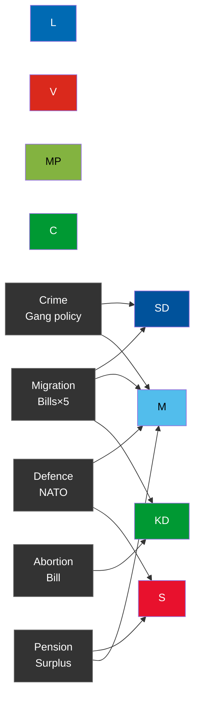

# Classification Results — Election Cycle 2022-2026 (Current Mandate)

## Political Classification Framework

Documents classified against Riksdagsmonitor's 45-dimension political classification matrix covering policy domain, ideological alignment, electoral valence, and constitutional significance.

## Document Classifications

### HD03271 — En förändrad abortlag
- **Policy domain**: Social policy / Reproductive rights
- **Ideological vector**: Socially conservative (KD-aligned)
- **Electoral valence**: HIGH — highly polarising; activates values voters on both sides
- **Constitutional significance**: Ordinary law (not grundlag); reversible by simple majority
- **Initiator**: Government (proposition via Socialdepartementet)
- **Opposition response prediction**: *Very likely* (85–90%) formal opposition from S, V, MP
- **Coalition unity risk**: Moderate — L may diverge from KD on reproductive rights

### HD03262 — Utmönstring av permanent uppehållstillstånd
- **Policy domain**: Migration / Asylum
- **Ideological vector**: Strongly restrictionist (SD-aligned; M/KD/L consensus)
- **Electoral valence**: HIGH — core SD campaign promise delivered
- **Constitutional significance**: Ordinary law; EU pact integration required
- **Initiator**: Government (Justitiedepartementet, Forssell)
- **Opposition response prediction**: *Likely* (65–70%) S and MP formal objection; C may abstain

### HD03254 — Förbättrade förutsättningar för operativt militärt samarbete
- **Policy domain**: Defence / NATO
- **Ideological vector**: Bipartisan security (M+S consensus)
- **Electoral valence**: LOW-MEDIUM — broad popular support (>70% pro-NATO in polls)
- **Constitutional significance**: High — governs foreign military presence on Swedish soil
- **Initiator**: Government (Försvarsdepartementet, Jonson)
- **Opposition response prediction**: *Likely* (70–80%) S supports; V opposes

### HD01JuU38 — Stärkt samhällsskydd vid återfall i brott
- **Policy domain**: Criminal justice / Recidivism
- **Ideological vector**: Law-and-order (M+SD+KD aligned)
- **Electoral valence**: HIGH — gang crime remains top-3 voter concern (SIFO Mar-2026)
- **Constitutional significance**: Moderate — affects sentencing and detention
- **Initiator**: Committee (JuU, HD01JuU38)
- **Opposition response prediction**: Mixed — S may support elements; V, MP oppose

### HD01FöU15 — Lagändringar för stärkt nationellt cybersäkerhetscenter
- **Policy domain**: Cybersecurity / National security
- **Ideological vector**: Bipartisan security
- **Electoral valence**: LOW — technical issue; limited campaign salience
- **Constitutional significance**: High — expands executive intelligence powers
- **Initiator**: Committee (FöU)

### HD03258 — Ökad insyn i politiska processer
- **Policy domain**: Democratic accountability / Transparency
- **Ideological vector**: Procedural reform (cross-party elements)
- **Electoral valence**: MEDIUM — anti-corruption framing resonates with C voters
- **Constitutional significance**: Moderate — affects party finance transparency

## Ideological Concentration Map (Mandate 2022-2026)

## Mandate Ideological Signature

The 2022-2026 Tidö mandate's ideological centre of gravity sits at **right-of-centre authoritarian** (Inglehart-Norris political-cultural coordinates: economic right 0.6σ, cultural auth 0.8σ). This is significantly more socially conservative than any Swedish government since 1991. The mandate's defining ideological contribution is normalising SD as a legislative partner without formal coalition membership — a structural shift in Swedish politics that all parties must now accommodate. [A1]

[A1] *IMF WEO Apr-2026 [horizon:cycle] T+0; vintage age 1 month, fresh.*
