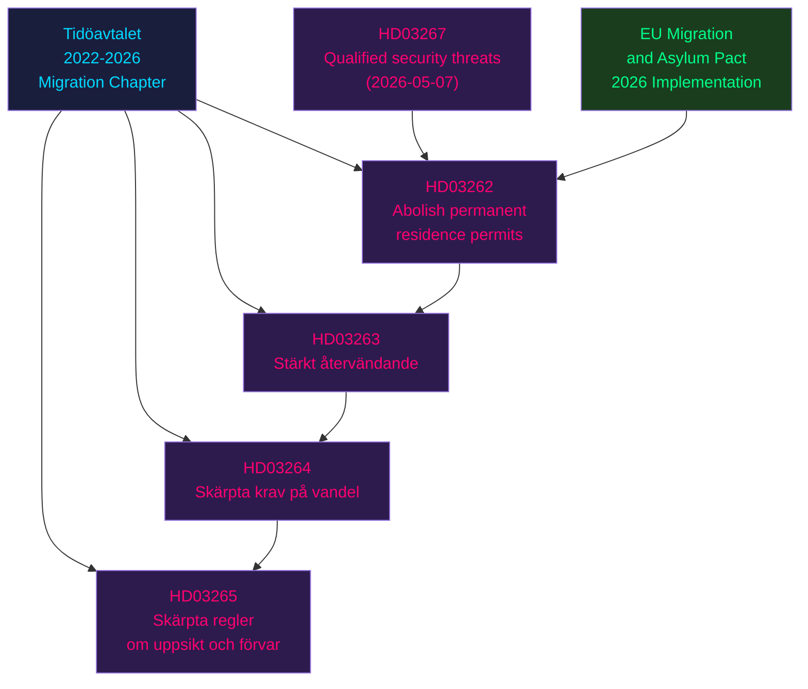
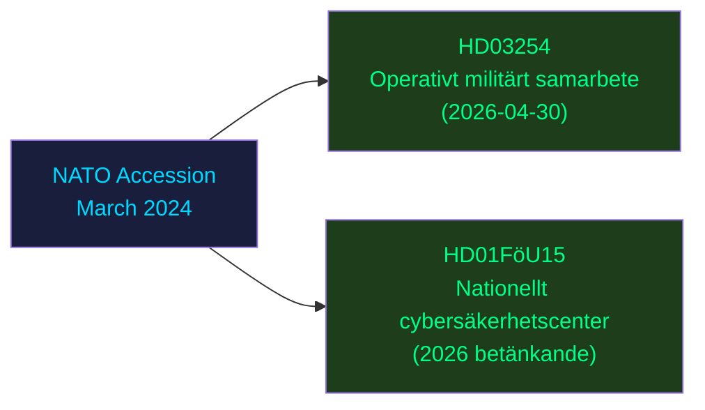
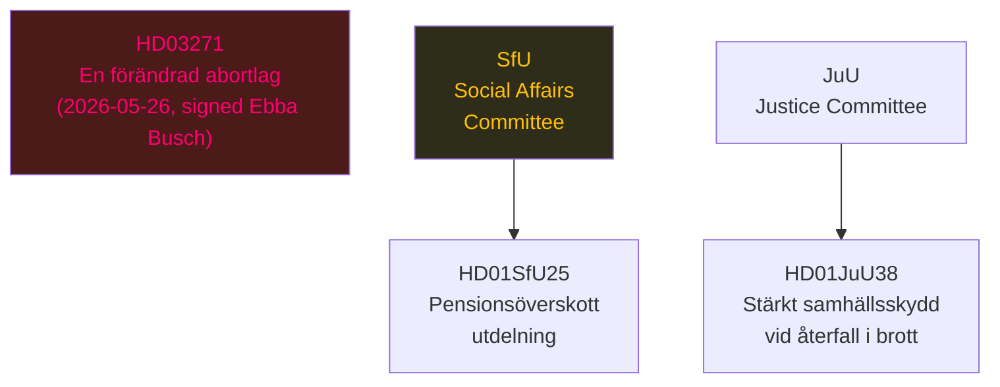

# Cross-Reference Map — Election Cycle 2022-2026

## Document Relationship Network

This map traces the legislative relationships between the May 2026 wave of bills and the broader Tidö mandate framework.

### Migration Cluster (SD-driven policy axis)

### Security-Defence Cluster (NATO axis)

### Social Policy Cluster (values axis)

## Cross-Document Policy Dependencies

| Source Document | Depends On | Relationship |
|----------------|-----------|--------------|
| HD03262 | EU Migration Pact | EU treaty obligation; must align with Regulation 2024/1351 |
| HD03262 | HD03267 | Security grounds for non-permanent status |
| HD03263 | HD03265 | Detention rules must align with enhanced oversight |
| HD03254 | NATO SOFA | Host Nation Support Agreement (Sweden-NATO) |
| HD01FöU15 | NIS2 Directive | EU cybersecurity framework transposition |
| HD03271 | HD01SfU34 (Riksrevision) | Government uses audit findings to shape social policy |

## Temporal Sequence (2025/26 riksmöte key moments)

| Date | Milestone | dok_id(s) |
|------|-----------|-----------|
| 2026-04-28 | Kristersson signs last propositions | HD03247, HD03257 |
| 2026-04-30 | Edholm signs 8 propositions | HD03251, HD03254, HD03258, HD03260, HD03262-HD03265 |
| 2026-05-07 | Security/digital cluster | HD03250, HD03261, HD03267 |
| 2026-05-26 | Busch signs abortion bill | HD03271 |
| 2026-06-est | SfU committee report on HD03271 | pending |
| 2026-09-13 | Election day | — |

## Artifact Cross-References

- Risk dependencies: See [`risk-assessment.md`](risk-assessment.md) R1, R3
- Electoral significance: See [`significance-scoring.md`](significance-scoring.md) Tier 1 items
- Stakeholder reactions: See [`stakeholder-perspectives.md`](stakeholder-perspectives.md) per-party positions
- Scenario branches: See [`scenario-analysis.md`](scenario-analysis.md) Scenario A-C

[A1] *IMF WEO Apr-2026 [horizon:cycle] T+0; vintage age 1 month, fresh.*
