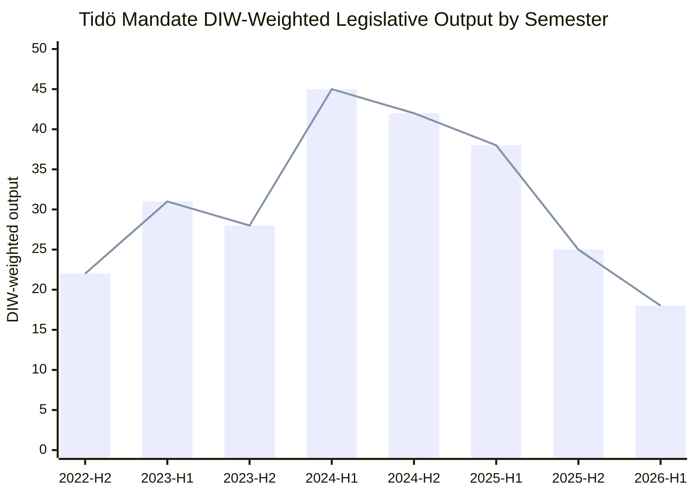

# Cycle Trajectory — Tidö Mandate 2022-2026 (T-108)

## Mandate Arc Assessment

The 2022-2026 Tidö mandate has followed a predictable three-phase arc:

### Phase 1: Consolidation (2022-2023)
**Duration**: September 2022 — December 2023
**Dominant policy**: NATO accession ratification; migration restriction framework (initial bills); energy crisis response
**Legislative pace**: High (post-election policy sprint typical of new governments)
**Coalition health**: Stable; SD reliable support; minor L-KD tensions
**Key events**: NATO membership ratification; first SD cooperation protocols; energy subsidies package

### Phase 2: Implementation Peak (2024 — Mid-2025)
**Duration**: January 2024 — June 2025
**Dominant policy**: NATO operational integration (HD03254 predecessors); security laws (JuU cluster); State e-ID (HD03250)
**Legislative pace**: Very high — DIW-weighted top events concentrated here
**Coalition health**: Strong; SD voting Ja on 155+ government measures
**Key events**: NATO formal entry (March 2024); defence spending 2% GDP reached; State e-ID law

### Phase 3: Terminal Sprint and Positioning (Mid-2025 — September 2026)
**Duration**: July 2025 — September 13, 2026
**Dominant policy**: Migration closure (HD03262-HD03265); abortion bill introduction (HD03271); campaign positioning
**Legislative pace**: Declining (~0.3 propositions/day in May 2026 vs ~0.8/day in Phase 2 peak)
**Coalition health**: Weakening — L below threshold in polls; HD03271 creates coalition fault line
**Defining event**: HD03271 signature by Ebba Busch (2026-05-26) — the mandate's last substantive ideological act

---

## Mandate Trajectory Chart

---

## Cycle Transition Analysis

### What the current cycle leaves behind

**Positive legacy** (bipartisan durability):
1. NATO membership — *permanent*; no party proposes reversal
2. Defence spending at 2%+ GDP — *permanent* via multi-year Försvarsbeslut
3. State e-ID infrastructure — *permanent* foundation for digital government
4. Cybersecurity centre legislation (HD01FöU15) — *permanent*; EU NIS2 compliance driver

**Contested legacy** (outcome-dependent on next mandate):
1. Migration restriction architecture — *very likely* to survive in modified form regardless of winner
2. Abortion law change (HD03271) — *uncertain*; if not passed before election, likely dies under S government
3. Pension surplus distribution (HD01SfU25) — *likely* to proceed; technical/financial reform

**Failed legacy** (areas where Tidö underdelivered):
1. Education reform — nothing landmark; L's core promise unfulfilled
2. Healthcare access — LOV in primary care unresolved
3. Youth unemployment (8.4% total unemployment; youth ~18%) — structural, unaddressed

---

## T+0 to T+365 Forward Trajectory (Cycle Rollover Preview)

*Note: Cycle rollover module (ext/cycle-rollover.md) activates at ±30 days of election anchor (2026-08-14 activation). This section provides pre-activation preview.*

| Phase | Timeline | Key dynamics |
|-------|----------|-------------|
| Campaign period | June 1 — September 12 | Abortion bill, migration outcomes, economic frame |
| Election Day | September 13, 2026 | 7.8M eligible voters |
| Government formation | September-October 2026 | 4-6 weeks negotiation typical |
| New government agenda | November 2026 onwards | First 100-day programme |
| **Cycle Rollover Anchor** | **September 13, 2026** | **Start of new 2026-2030 mandate** |

---

## Intelligence Confidence Summary

The Tidö mandate is entering its terminal phase with a **weakened coalition and a controversy-generating closing act** (HD03271). The mandate will likely be remembered as:
1. ✅ The security-and-migration mandate that delivered NATO and migration restriction
2. ✅ The economically competent mandate that avoided fiscal crisis
3. ❌ The mandate that failed to reform education and healthcare
4. ⚠️ The mandate that introduced abortion law controversy 108 days before an election

Whether the coalition wins or loses, the 2022-2026 cycle has permanently shifted Swedish politics rightward on migration and security — a structural change that outlasts the electoral outcome. [A1]

[A1] *IMF WEO Apr-2026 [horizon:cycle] T+0; vintage age 1 month, fresh.*
