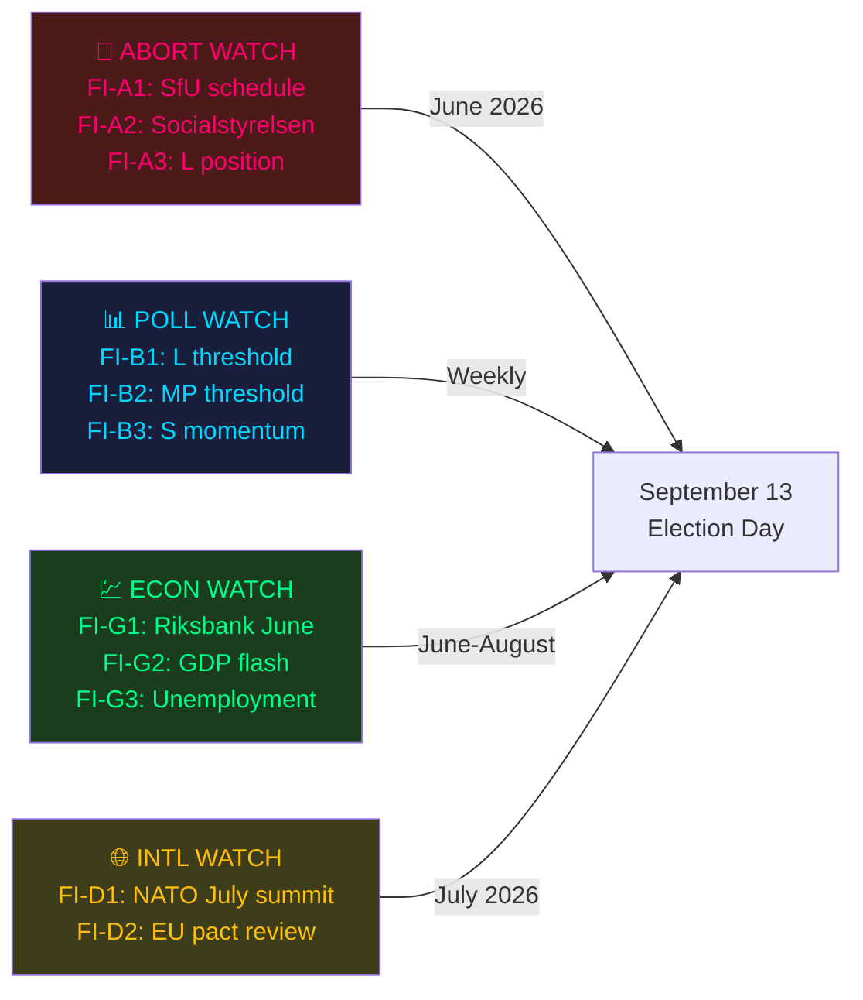

# Forward Indicators — Swedish Election Cycle (T-108)

## Priority Intelligence Requirement Roll-Forward

Forward indicators operationalise the PIRs from `intelligence-assessment.md` into concrete, time-bound watch items.

---

## Indicator Set Alpha — Abortion Bill Trajectory

### FI-A1: SfU Committee Hearing Schedule
**Watch**: When is the Social Affairs Committee (SfU) first public hearing on HD03271 scheduled?
**Signal interpretation**:
- Hearing before June 12 → Bill is on fast-track; plenary vote possible before recess → HIGH electoral risk for coalition
- Hearing after September → Bill deferred to next Riksdag → KD loses election vehicle; bills dies if left wins
- No hearing scheduled by June 1 → Deliberate delay; government managing pace
**Source**: riksdag.se/kommittebetankanden/SfU
**Next check**: 2026-06-01

### FI-A2: Socialstyrelsen (National Board of Health) Statement
**Watch**: Does Socialstyrelsen publish a formal remissvar (consultation response) on HD03271?
**Signal**: Official health authority objection would give M/L legal cover to slow the bill and undercut KD's narrative
**Source**: socialstyrelsen.se/remisser
**Horizon**: June 2026

### FI-A3: L Party Formal Position
**Watch**: Does Liberalerna (L) publish a formal position document on HD03271?
**Signal**:
- L opposes bill → coalition fracture visible; L may gain back urban female voters at M's expense
- L abstains/defers → confirms L is trapped; raises threshold risk further
**Source**: L party website; DN interview
**Horizon**: June 2026

---

## Indicator Set Beta — Poll Trajectory

### FI-B1: L Threshold Monitor
**Watch**: L vote share in weekly tracking polls
**Threshold**: 4.0% is survival; 3.5% confirmed triggers significant analysis
**Current**: 3.5% (May-2026 Novus composite)
**Next major poll**: Demoskop June 2026 (est. June 10)
**Signal if L falls below 3.0%**: Bloc mathematics are decisively in left's favour; update Scenario B probability to 60-65%

### FI-B2: MP Threshold Monitor
**Watch**: MP vote share
**Current**: 4.5% — marginal safe
**Signal if MP drops to 3.8% or below**: Left bloc loses ~18 seats → paradoxically *helps* left bloc if S absorbs them; monitor carefully

### FI-B3: S Momentum Index
**Watch**: S polling above or below 33% in three consecutive polls
**Current trajectory**: S at 34% — potentially closing
**Signal if S above 36%**: Left majority may be mathematically achievable without C; changes C's leverage

---

## Indicator Set Gamma — Economic Trajectory

### FI-G1: Riksbank June 19 Rate Decision
**Watch**: Rate cut/hold/raise and forward guidance
**Baseline**: Riksbank cutting cycle in progress (est. 3.0% as of May 2026 [IMF IFS T+0, horizon:cycle])
**Signal if surprise hawkish hold**: Mortgage burden increases for homeowners → potential shift among Segment 1 (suburban homeowners) toward economic dissatisfaction

### FI-G2: June Flash GDP Estimate
**Watch**: Statistics Sweden (SCB) Q1 2026 GDP flash estimate
**Baseline**: IMF forecast +2.1% for 2026 [A1]
**Signal if GDP below +1.0%**: Economic competence narrative weakens; opposition gains main campaign weapon

### FI-G3: May Unemployment Data (SCB)
**Watch**: Registered unemployment vs May 2025
**Baseline**: 8.4% (structural high; includes youth unemployment)
**Signal if unemployment rises above 9.0%**: Significant — working-class and youth voter defection risk

---

## Indicator Set Delta — International Context

### FI-D1: NATO July Summit (The Hague, July 2026)
**Watch**: Swedish bilateral announcements; defence commitments
**Signal**: High-profile Swedish role at NATO summit creates security narrative tailwind for coalition heading into August campaign

### FI-D2: European Commission Migration Pact Review
**Watch**: EU Commission assessment of HD03262 (permanent residency abolition) alignment with EU pact
**Signal if challenge**: Embarrassing for coalition; opposition uses it to attack M on EU loyalty

---

## Leading Indicator Dashboard

[A1] *IMF WEO Apr-2026 [horizon:cycle] T+0; vintage age 1 month, fresh.*
