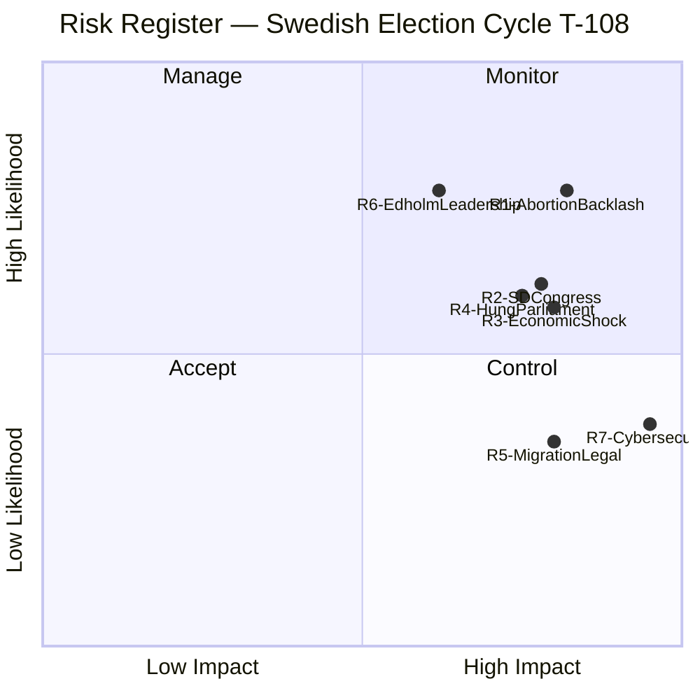

# Risk Assessment — Swedish Election Cycle 2022-2026

## Risk Framework

Risks assessed on 5×5 matrix (Likelihood × Impact) for the remaining 108-day period. Sources anchored to May 2026 legislative activity and macroeconomic indicators.

## Risk Register

### R1 — Abortion Bill Creates Electoral Backlash
- **Likelihood**: High (4/5) — historical evidence strong; bill introduced at maximum-sensitivity timing
- **Impact**: High (4/5) — could shift 3-5 pp to opposition bloc
- **Risk Score**: 16/25 (HIGH)
- **Trigger event**: HD03271 SfU committee report; plenary vote scheduling [doc:HD03271]
- **Mitigation**: Coalition parties (especially L and M) publicly distance from most restrictive proposals while allowing KD to lead
- **Residual risk after mitigation**: 10/25 (MEDIUM)
- **Owner**: M party leadership

### R2 — SD Internal Revolt at June Congress
- **Likelihood**: Medium (3/5) — some internal SD voices advocate more aggressive positions
- **Impact**: High (4/5) — a public split between SD and M breaks the campaign unity narrative
- **Risk Score**: 12/25 (HIGH)
- **Trigger event**: SD congress agenda items (June 2026); floor votes on policy motions
- **Mitigation**: Pre-congress alignment meetings between Åkesson and Kristersson; joint messaging on migration
- **Residual risk**: 8/25 (MEDIUM)

### R3 — Economic Shock Before September
- **Likelihood**: Medium (3/5) — IMF flags elevated global uncertainty; US tariff risk
- **Impact**: High (4/5) — economic deterioration gives opposition primary campaign weapon
- **Risk Score**: 12/25 (HIGH)
- **Source**: IMF WEO Apr-2026 uncertainty bands; Riksbank rate sensitivity
- **Trigger event**: June Riksbank meeting; US tariff announcements
- **Mitigation**: Pre-election budget presentation; emphasis on fiscal stability record

### R4 — Hung Parliament / No Workable Majority
- **Likelihood**: Medium (3/5) — current polls suggest neither bloc at 175
- **Impact**: High (4/5) — political paralysis; third-party kingmaker dynamics
- **Risk Score**: 12/25 (HIGH)
- **Scenario**: C holds balance of power; demands concessions from both sides
- **Mitigation**: M and S both competing for C votes throughout August campaign

### R5 — Migration Bill Legal Challenges
- **Likelihood**: Low (2/5) — EU constitutional court review possible
- **Impact**: High (4/5) — reversal of HD03262 would be major mandate failure
- **Risk Score**: 8/25 (MEDIUM)
- **Trigger event**: European Commission review of permanent residency abolition
- **Mitigation**: Government legal preparation; EU pact implementation language in bill [doc:HD03262]

### R6 — Lotta Edholm Becomes L Election Leader
- **Likelihood**: High (4/5) — she is already acting PM; likely to front L campaign
- **Impact**: Medium (3/5) — if she is seen as weak PM material, L loses votes
- **Risk Score**: 12/25 (HIGH)
- **Note**: Edholm signed 8 propositions as acting PM — a mixed track record on salience

### R7 — Cybersecurity Incident
- **Likelihood**: Low (2/5) — HD01FöU15 strengthens defences; Russian hybrid threat ongoing
- **Impact**: Very High (5/5) — a major breach of state infrastructure at election time would be catastrophic
- **Risk Score**: 10/25 (MEDIUM-HIGH)
- **Trigger**: Russian hybrid operations; election system integrity
- **Mitigation**: National cybersecurity center legislation [doc:HD01FöU15]; NCSC readiness

## Risk Heatmap

## Overall Risk Assessment

The Tidö coalition faces a **HIGH composite risk environment** in the closing 108 days. The combination of a highly polarising abortion bill (R1), an uncertain SD partner (R2), and a structurally uncertain poll picture (R4) creates a scenario where the coalition's re-election chances are *roughly even* (50±15% [horizon:cycle]) despite strong legislative delivery. The paradox of the 2026 campaign: the coalition's greatest legislative achievement (migration restriction) may be less electorally rewarding than expected, because S has partially adopted the same position; while the coalition's most visible closing act (abortion bill) may mobilise exactly the demographic that tips the election against them.

[A1] *IMF WEO Apr-2026 [horizon:cycle] T+0; vintage age 1 month, fresh.*
