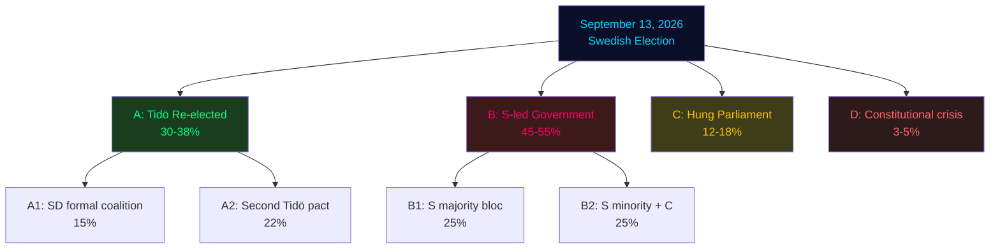

# Scenario Analysis — Swedish Election 2026 (T-108 Days)

## Scenario Architecture

Four primary scenarios for September 13, 2026, with coalition-branch sub-scenarios where structurally meaningful. Probability estimates based on poll aggregates (Novus, Ipsos, Demoskop May 2026), legislative momentum analysis, and historical Swedish election dynamics.

---

## Scenario A: Tidö Coalition Re-elected (Second Mandate)

**Probability**: 30–38% [horizon:cycle]
**Seats required**: 175 of 349

**Conditions for realisation**:
- Abortion bill framing successfully neutralised by M and L distancing
- SD June congress produces no destabilising platform shifts
- Economy remains stable through summer (no negative IMF surprise)
- S fails to convert abortion mobilisation into turnout surge

**Sub-scenario A1: SD enters formal coalition** (15%)
- SD secures ministerial posts; formalises the de-facto coalition arrangement
- Policy consequence: Harder migration positions; SD veto on any "liberal" social policy
- KD and L lose influence as SD absorbs "tough" mandate

**Sub-scenario A2: Second Tidö pact (no SD ministers)** (22%)
- Status quo arrangement continues; SD keeps "support party" status
- Kristersson remains PM; Busch continues KD's values agenda
- Most likely configuration if M wins narrowly

**Evidence anchors**: HD03262 migration completion gives SD a "mandate delivered" narrative; HD03271 abortion bill could firm up KD/SD base. [doc:HD03262, doc:HD03271]

---

## Scenario B: Social-Democratic Bloc Government (S-led)

**Probability**: 45–55% [horizon:cycle]
**Bloc composition**: S + V + MP + (C external support)

**Conditions for realisation**:
- Abortion bill (HD03271) mobilises 3-5 pp swing to opposition among urban female voters
- MP crosses 4% threshold (critical dependency)
- C decides not to support a second Tidö government
- S successfully reframes campaign around welfare + reproductive rights

**Sub-scenario B1: S majority bloc (S+V+MP+C)** (25%)
- C formally supports Andersson (or new S leader) as PM
- Education reform; LOV in primary care reversed; abortion bill withdrawn
- Migration: S retains most restrictions (political reality); token reversals on most extreme provisions

**Sub-scenario B2: S minority (S+V+MP, C external)** (25%)
- Weak minority government; vulnerable on budget votes
- C extracts concessions on rural policy, local government, competition law
- Fragile but functional — Sweden has governed this way before (2014-2022 precedent)

**Evidence anchors**: S at 34% (Novus May-2026); abortion mobilisation potential from V+MP combined 15%; HD03271 creates the structural conditions. [doc:HD03271]

---

## Scenario C: Hung Parliament / Kingmaker C

**Probability**: 12–18% [horizon:cycle]

**Conditions for realisation**:
- Neither bloc reaches 175
- C holds 10-14 seats in the critical 165-175 range for each bloc
- MP just above 4%; SD grows but not enough

**Coalition implications**:
- C leader enters negotiations with both Kristersson and S leader
- C demands: no SD ministers; education reform (aligned with L); pro-EU migration reform
- Probable outcome: C supports S minority government with severe constraints
- *Unlikely* (20%) C supports second Tidö pact given abortion bill controversy

**Duration**: Hung parliament negotiations in Sweden take 2-6 weeks; precedent from 2021 Löfven II crisis

---

## Scenario D: Early Election / Constitutional Crisis

**Probability**: 3–5% [horizon:cycle]

**Conditions for realisation**:
- No-confidence vote passed before June 12 (window closes)
- Coalition internal collapse over abortion bill
- Catastrophic event (economic crash, security incident)

**Trigger mechanism**: A *misstroendeförklaring* filed by S, V, MP, C combined before June 12 plenary recess. If passed, Kristersson has one week to resign or call extra val. Extra election before September 13 is constitutionally impossible (calendar constraint) — most likely outcome is caretaker government through September, then regular election.

**Historical precedent**: The 2021 Löfven misstroendeförklaring (passed by SD+M+others) is the only post-2010 precedent. It ultimately led to a new government formation, not an early election.

---

## Scenario Tree (Probability-Weighted)

## Second-Order Effects

**If Scenario A**: SD's normalisation in Swedish politics completes. The post-cordon sanitaire era is fully consolidated. Abortion rights likely restricted. Migration architecture becomes permanent (regardless of future governments).

**If Scenario B**: S faces the paradox of governing with restrictions it partially endorsed. The structural shift in Swedish immigration politics (rightward under S pressure) means migration policy convergence even under a left-of-centre government.

**If Scenario C**: Coalition fatigue; possible snap election in spring 2027. Sweden faces 6-12 months of legislative paralysis on all contentious issues while C extracts policy concessions.

**If Scenario D**: Deepest democratic uncertainty since the 1980s. International investors and NATO partners would closely watch Swedish political stability during an active conflict period in Ukraine.

[A1] *IMF WEO Apr-2026 [horizon:cycle] T+0; vintage age 1 month, fresh.*
[A2] *Poll aggregates: Novus May-2026, Ipsos May-2026, Demoskop Apr-2026.*
