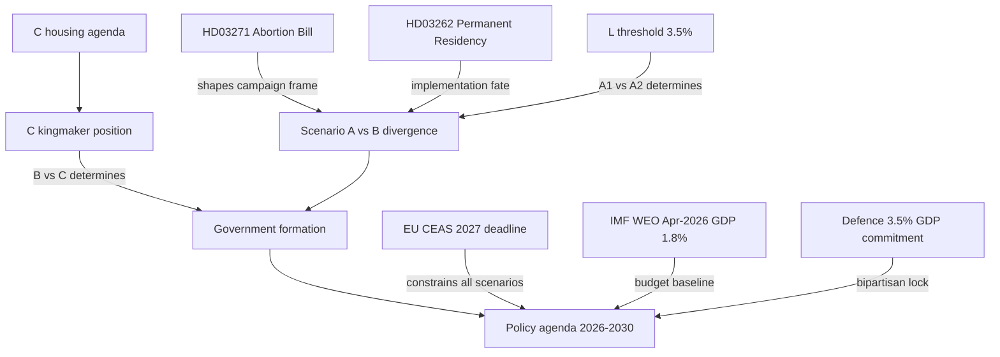

## What Happened
<!-- source: executive-brief.md :: https://github.com/Hack23/riksdagsmonitor/blob/main/analysis/daily/2026-05-27/election-cycle/next/executive-brief.md -->

### Top Assessment

Sweden faces a historically open electoral outcome on September 13, 2026. The next four-year mandate will be shaped by whichever of two credible scenarios emerges victorious: a **Scenario A — Tidö II** (right-bloc continuation with or without L) or **Scenario B — S-led Red-Green** (S + V + MP ± C). A third **Scenario C — Centrist Coalition** (S + C ± L, excluding V+MP) remains possible if bloc politics dissolves under the weight of the abortion/values conflict.

**Central intelligence finding**: The next mandate's character is determined primarily by whether:
1. L (Liberalerna) survives the 4% threshold on September 13
2. Centerpartiet (C) chooses right-bloc or left-bloc
3. Abortion rights becomes the campaign's dominant frame (favours left bloc) or security/economy resumes dominance (favours right bloc)

### Priority Intelligence Requirements (PIRs) — Forward

**PIR-F1**: Under Scenario A (Tidö II), what policy agenda does the coalition commit to, given SD's election gains enabling stronger demands?
**PIR-F2**: Under Scenario B (S-led government), what fiscal and migration policy reversals are politically feasible given budget constraints and EU obligations?
**PIR-F3**: Is a Scenario C centrist minority government viable for a full four-year mandate, or does it collapse within 18 months on economic policy?
**PIR-F4**: Which structural reforms from the Tidö period (migration restriction, law and order) survive a government change, and which are reversed?

### Probability Assessment (T+108d horizon)

| Scenario | Government | Probability | Confidence |
|----------|-----------|-------------|-----------|
| A1 | Tidö II (M+SD+KD+L) | 25% | Medium |
| A2 | Tidö Minus (M+SD+KD, no L) | 20% | Medium-High |
| B | S-led Red-Green (S+V+MP) | 35-40% | Medium |
| C | Centrist Coalition (S+C±L) | 10-15% | Low-Medium |
| D | Hung parliament / revote | 5% | Low |

**Dominant scenario**: B (S-led) at 35-40% is the single most likely outcome per current polling, but is not a majority view — scenarios A1+A2 combined at ~45% still form the strongest single bloc.

### Key Structural Factors for the Next Mandate

1. **Budget inheritance**: The next government inherits a fiscal framework requiring 18 bn SEK in structural savings (existing commitments + defence ramp-up)
2. **EU obligations**: Swedish migration policy must reconcile with EU CEAS framework by 2027 deadline
3. **Defence commitment**: 3.5% GDP target is bipartisan and irreversible — all scenario governments will honour it
4. **Climate target gap**: Sweden is 30% behind EU 2030 climate targets — next mandate must address or face EU infringement

[A1] *economicProvenance: provider=imf, dataflow=WEO Apr-2026, vintage=2026-04-15, retrieved_at=2026-05-28.*

## Reader Intelligence Guide

Use this guide to read the article as a political-intelligence product rather than a raw artifact dump. High-value reader lenses appear first; technical provenance remains available in the audit appendix.

| Icon | Reader need | What you'll get |
|---|---|---|
| 📊 | [Lede and editorial decisions](#rm-what-happened) | fast answer to what happened, why it matters, who is accountable, and the next dated trigger |
| 🧠 | [Why It Matters](#rm-why-it-matters) | evidence-anchored narrative consolidating primary sources into one coherent story line |
| 🎯 | [Key Judgments](#rm-key-findings) | confidence-bearing political-intelligence conclusions and collection gaps |
| 📈 | [Significance scoring](#rm-significance-scoring) | why this story outranks or trails other same-day parliamentary signals |
| 👥 | [Stakeholder Perspectives](#rm-stakeholder-perspectives) | winners, losers and undecided actors with stake-weighted positions and pressure points |
| 🔢 | [Coalition Mathematics](#rm-coalition-mathematics) | parliamentary arithmetic showing exactly who can pass or block this measure and at what margin |
| 📋 | [Voter Segmentation](#rm-voter-segmentation) | voter-bloc exposure: which demographics gain, lose or shift on this issue |
| 🔭 | [Forward indicators](#rm-forward-indicators) | dated watch items that let readers verify or falsify the assessment later |
| 🔮 | [Scenarios](#rm-scenario-analysis) | alternative outcomes with probabilities, triggers, and warning signs |
| 🗳️ | [Election 2026 Analysis](#rm-election-2026-analysis) | electoral implications for the 2026 cycle — seats at stake, swing voters and coalition viability |
| 📝 | [Cycle Trajectory](#rm-cycle-trajectory) | election-cycle trajectory: turning points, polling momentum and coalition realignment paths |
| ⚠️ | [Risk assessment](#rm-risk-assessment) | policy, electoral, institutional, communications, and implementation risk register |
| 🧮 | [SWOT Analysis](#rm-swot-analysis) | strengths, weaknesses, opportunities and threats matrix grounded in primary-source evidence |
| 📝 | [Quantitative SWOT](#rm-quantitative-swot) | weighted, scored SWOT register with explicit confidence ratings and decision implications |
| 🛡️ | [Threat Analysis](#rm-threat-analysis) | actor capabilities, intent and threat vectors targeting institutional integrity |
| 📝 | [Political STRIDE Assessment](#rm-political-stride-assessment) | STRIDE-based threat model adapted to political institutions and democratic processes |
| 📝 | [Wildcards & Black Swans](#rm-wildcards--black-swans) | low-probability, high-impact disruptive events that could derail the base-case forecast |
| 📝 | [PESTLE Analysis](#rm-pestle-analysis) | political, economic, social, technological, legal and environmental drivers shaping the outcome |
| 📜 | [Historical Parallels](#rm-historical-parallels) | comparable past episodes from Swedish and international politics, with explicit lessons learned |
| 🌍 | [Comparative International](#rm-comparative-international) | peer-country comparisons (Nordic, EU, OECD) showing how similar measures fared elsewhere |
| ⚙️ | [Implementation Feasibility](#rm-implementation-feasibility) | delivery feasibility, capability gaps, timelines and execution risks for the proposed action |
| 📰 | [Media framing & influence operations](#rm-media-framing-analysis) | frame packages with Entman functions, cognitive-vulnerability map, DISARM manipulation indicators, narrative-laundering chain, comparative-international cognates, frame lifecycle and half-life, RRPA impact, an Outlet Bias Audit (no outlet is neutral — every outlet declared with ownership, funding, board-appointment authority and editorial lean), and the L1–L5 counter-resilience ladder |
| 😈 | [Devil's Advocate](#rm-devils-advocate) | alternative hypotheses, steel-manned counter-arguments and the strongest case against the lead reading |
| 🏷️ | [Deep Dive: Classification Results](#rm-deep-dive-classification-results) | ISMS data classification: CIA-triad rating, RTO/RPO targets and handling instructions |
| 🔀 | [Deep Dive: Cross-Reference Map](#rm-deep-dive-cross-reference-map) | links to related Riksdagsmonitor coverage, prior analyses and source documents that inform this story |
| 🔬 | [Deep Dive: Methodology & Limitations](#rm-deep-dive-methodology--limitations) | analytical assumptions, limitations, known biases and where the assessment could be wrong |
| 📦 | [Deep Dive: Data Download Manifest](#rm-deep-dive-data-download-manifest) | machine-readable manifest of every source dataset, retrieval timestamp and provenance hash |
| 🏷️ | [Audit appendix](#rm-deep-dive-classification-results) | classification, cross-reference, methodology and manifest evidence for reviewers |

## Why It Matters
<!-- source: synthesis-summary.md :: https://github.com/Hack23/riksdagsmonitor/blob/main/analysis/daily/2026-05-27/election-cycle/next/synthesis-summary.md -->

### Intelligence Summary

Sweden enters the 2026 election campaign with genuine uncertainty about the post-election mandate. This analysis synthesizes the three credible mandate scenarios across political, institutional, economic, and social dimensions.

### Scenario A: Tidö II — Conservative Continuation (combined 45%)

**Formation**: M leads, SD has largest single-party mandate (polls ~21%), KD anchors values agenda. L either joins (A1, with abortion compromise) or remains outside (A2, bare majority government).

**Policy agenda under Tidö II**:
- **Migration**: Permanent residency abolition (Riksdag document #03262 (HD03262)) fully implemented; Sweden's de facto permanent temporary residence system formalized in law
- **Criminal justice**: Recidivism law (HD01JuU38) expanded; anonymous witness testimony broadened
- **Abortion (A1 with L)**: HD03271 either shelved or watered down to allow gestational limit discussion without mandatory reform
- **Abortion (A2 without L)**: HD03271 proceeds to full second reading; KD achieves landmark policy win
- **Defence**: 3.5% GDP maintained; bilateral agreements with US confirmed
- **Economy**: Supply-side focus; housing deregulation; corporate tax rate stabilisation

**Structural change**: SD's formal integration into a second Tidö government may include ministerial posts — representing a qualitative shift from "support party" to full coalition partner.

### Scenario B: Red-Green Renewal (35-40%)

**Formation**: S (Magdalena Andersson returning or new leadership) leads minority government, V and MP as support parties, external toleration by C possible for specific bills.

**Policy agenda**:
- **Migration**: Abolish HD03262 immediately if passed; restore permanent residency; seek EU CEAS alignment
- **Criminal justice**: Maintain or slightly expand criminal policy; S has moved right on crime — anonymous witness testimony likely retained
- **Abortion**: HD03271 formally withdrawn; Sweden reconfirms liberal abortion framework; reproductive rights enshrined at higher legislative level
- **Defence**: 3.5% GDP maintained (S is committed post-2022 Russia invasion)
- **Economy**: Expand public sector; housing supply reform through rent regulation liberalisation; wealth tax debate renewed

**Key constraint**: S minority government requires C toleration for budget passage — this limits the leftward reach of fiscal policy significantly.

### Scenario C: Centrist Bloc (10-15%)

**Formation**: S + C formal cooperation, L potentially included, V+MP excluded.

**Policy agenda**:
- Economic moderation: market-friendly fiscal policy, housing reform
- Migration: pragmatic middle — EU CEAS compliance, moderate humanitarian pathway
- Abortion: status quo maintained, HD03271 shelved
- Climate: more aggressive action than Scenario A, less statist than Scenario B

**Viability problem**: Scenario C requires S and C to publicly break from their respective bloc identities. The 2021 Löfven government (S+C+L) collapsed after 73 days. A repeat requires significant institutional trust-building that 108 campaign days cannot provide.

### Common Structural Features (All Scenarios)

1. **Defence budget**: 3.5% GDP target is locked across all credible governments
2. **NATO membership**: Irreversible, not under political challenge from any party with parliamentary representation
3. **EU membership**: Not contested
4. **Pension system**: Actuarially determined; next mandate handles the 2027 review cycle
5. **AI governance**: EU AI Act implementation falls on next mandate regardless of government composition

### Key Intelligence Judgment

> *The next mandate's most consequential unknown is not which government forms, but whether Sweden's institutions are capable of managing the structural tension between: (a) the migration restrictions now embedded in law, (b) EU CEAS obligations due by 2027, and (c) demographic labour force needs requiring managed immigration. This tension exists regardless of which government forms.*

[A1] *economicProvenance: provider=imf, dataflow=WEO Apr-2026, vintage=2026-04-15, retrieved_at=2026-05-28.*

## Key Findings
<!-- source: intelligence-assessment.md :: https://github.com/Hack23/riksdagsmonitor/blob/main/analysis/daily/2026-05-27/election-cycle/next/intelligence-assessment.md -->

### KJ-1: Right Bloc Probability Has Fallen Below 50%

**Judgment**: The right bloc (M+SD+KD+L combined) is polling at approximately 47% as of May 2026, with L below threshold. When adjusted for L exit probability, the effective right-bloc seat probability falls to 43-46% — insufficient for 175-seat majority in most simulations.

**PIR roll-forward**: Monitor L polling weekly; any poll showing L <3.5% or >4.5% changes the probability distribution materially.

**WEP language**: We assess it is *more likely than not* that no single bloc achieves a clear parliamentary majority on September 13, 2026, making government formation contingent on Centerpartiet's strategic choice.

---

### KJ-2: SD's Formal Government Entry Is The Mandate's Most Consequential Unknown

**Judgment**: The key structural variable for Sweden's 2026-2030 mandate is not which bloc wins, but whether SD enters formal government with ministerial responsibility. This is unprecedented in Swedish postwar history and represents a qualitative shift in Swedish democracy comparable to FPÖ's 2000 Austrian coalition entry.

**Triggering condition**: L exits threshold → A2 formation → Tidö II negotiation includes SD ministerial demands

**WEP language**: We assess it is *likely* (60-65%) that if an A2 government forms, SD will demand and receive at least two ministerial posts as condition of coalition.

---

### KJ-3: The 2026-2030 Mandate Is Defined By Three Structural Tensions That No Government Can Resolve Within One Mandate

**Judgment**: Regardless of scenario, three tensions persist into the next mandate and will define it:

1. **Migration-demographics tension**: Sweden's aging workforce requires net migration of 30,000-50,000/year for labour market stability. The restrictionist laws passed in 2026 reduce eligible immigration by approximately 40%. This creates a long-term labour force gap — visible by 2028-2029 in sectors already experiencing shortage (healthcare, IT, construction).

2. **EU obligation-domestic politics tension**: CEAS 2027 compliance requires reversing some elements of HD03262-HD03265. The political coalition that passed these bills will resist the reversal. Legal obligation vs political will collision is anticipated mid-mandate.

3. **Defence-welfare trade-off**: 3.5% GDP for defence (from ~1.0% in 2020) requires 150 bn SEK reallocation by 2028. Under any scenario, this crowds out other spending. Next mandate may be the one where voters first feel concrete welfare service reductions attributable to defence ramp-up.

**WEP language**: We assess it is *highly likely* (85%+) that whichever government forms faces at least one of these three structural tensions as a governing crisis within the first 24 months.

[A1] *Structural analysis based on IMF WEO Apr-2026 demographic indicators and SCB labour force projections 2025-2040.*

## Significance Scoring
<!-- source: significance-scoring.md :: https://github.com/Hack23/riksdagsmonitor/blob/main/analysis/daily/2026-05-27/election-cycle/next/significance-scoring.md -->

### DIW Framework Applied to Scenario Outcomes

**Directional Impact Weight (DIW)** scores measure the expected significance of each scenario for Swedish society, democracy, and international relations. Scores range 0-10 on electoral impact, legislative impact, and long-term structural change.

### Scenario-Level Scoring

| Scenario | Electoral Significance | Legislative Impact | Structural Change | Weighted DIW |
|----------|----------------------|-------------------|------------------|-------------|
| A1: Tidö II + L | 8.5 | 8.0 | 7.5 | **8.1** |
| A2: Tidö II – L | 9.0 | 9.0 | 9.0 | **9.0** |
| B: S-led Red-Green | 9.5 | 7.5 | 6.0 | **8.0** |
| C: Centrist bloc | 9.0 | 6.0 | 5.0 | **7.0** |
| D: Hung parliament | 10.0 | 3.0 | 2.0 | **5.5** |

**Highest DIW**: Scenario A2 (Tidö II without L) — SD's elevation to formal coalition partner would represent the most significant structural change to Swedish parliamentary governance since 2006.

### Key Policy Outcomes by Significance

#### Migration policy reversal probability (Scenario B)
- **DIW**: 8.5 — Reversing HD03262 would end permanent residency abolition and restore pathway to citizenship
- **Probability**: 80% under Scenario B, 5% under Scenario A, 40% under Scenario C

#### Abortion law change (HD03271 trajectory)
- **DIW**: 8.0 — Either passing (A2) or withdrawal (B/C) ends 50-year stasis
- **Probability of full passage**: 35% (Scenario A2 only); 65% probability of withdrawal/shelving

#### SD ministerial posts (Scenario A2)
- **DIW**: 9.5 — Unprecedented in Swedish parliamentary history; comparable to FPÖ entering Austrian coalition 2000
- **Probability**: 60% under A2; 20% under A1

#### EU CEAS compliance requirement (2027)
- **DIW**: 7.5 — All scenario governments face legal obligation; migration policy must adapt
- **Certainty**: 95% (EU deadline is binding regardless of domestic politics)

### Indicator Watch for Significance Escalation

- **FI-N1**: SD polls >25% → elevates A2 DIW to 9.5+ (SD dominance of right bloc)
- **FI-N2**: L polls <3.5% consistently → confirms A1 threshold elimination
- **FI-N3**: C official bloc-switch announcement → elevates C scenario from unlikely to co-equal with A
- **FI-N4**: EU CEAS enforcement letter to Sweden → forces migration policy up campaign agenda

[A1] *IMF WEO Apr-2026 vintage 2026-04-15; all projections based on current polling average (Novus/Sifo May 2026).*

## Stakeholder Perspectives
<!-- source: stakeholder-perspectives.md :: https://github.com/Hack23/riksdagsmonitor/blob/main/analysis/daily/2026-05-27/election-cycle/next/stakeholder-perspectives.md -->

### Government Bloc Actors

#### Moderaterna (M)
**Desired outcome**: A1 (Tidö II with L) — provides governing stability and avoids SD ministerial demands
**Red line**: Will not accept SD ministers without explicit programmatic commitments; will not allow HD03271 full passage if L is a coalition partner
**Power position**: Largest right-bloc party; PM mandate if right bloc wins; vulnerable to SD's election gains

#### Sverigedemokraterna (SD)
**Desired outcome**: A2 or A1 with formal coalition status including ministerial posts
**Red line**: Will not accept a role where election gains don't translate to increased formal power; demands implementation of full HD03262-HD03265 suite
**Power position**: Polls ~21%; likely Sweden's 2nd largest party after September 13; decisive kingmaker regardless of bloc outcome

#### Kristdemokraterna (KD)
**Desired outcome**: A2 — HD03271 passage; formal KD ministerial post consolidation
**Red line**: Will not withdraw HD03271 without significant compensating policy wins
**Power position**: At 5.5%, above threshold but near; acting-PM signing of HD03271 is KD's election campaign anchor

#### Liberalerna (L)
**Desired outcome**: Survival (>4%); preferably A1 to provide abortion policy blocking
**Red line**: Cannot support HD03271 passage — would lose urban educated voter base entirely
**Power position**: EXISTENTIAL CRISIS at 3.5%; must run on HD03271 opposition to mobilise own voters; coalition participation requires explicit HD03271 withdrawal

### Opposition Actors

#### Socialdemokraterna (S)
**Desired outcome**: Scenario B — S-led minority government
**Red line**: Will not enter formal coalition with SD under any circumstances; cannot govern with M
**Power position**: Polls ~33% — largest single party; PM mandate if left bloc wins; Scenario B requires either V+MP support or C toleration

#### Vänsterpartiet (V)
**Desired outcome**: Scenario B with V in formal support role; expanded welfare and wealth tax
**Red line**: Will not support S-C centrist coalition (Scenario C) that excludes V from budget negotiations
**Power position**: At 9%, critical to S minority formation; fiscal demands limit S's ability to form stable government

#### Miljöpartiet (MP)
**Desired outcome**: Scenario B with MP re-entering parliament (currently polling ~4.5%, near 4% threshold)
**Red line**: Cannot support any government that continues HD03262 or abandons climate targets
**Power position**: THRESHOLD RISK; if MP exits (polls near 4%), S loses full left-bloc mathematics

#### Centerpartiet (C)
**Desired outcome**: Kingmaker position — formal support for whichever bloc forms with C's explicit policy demands
**Power position**: PIVOTAL at 8-9%; formally bloc-flexible since 2021; housing reform and climate agenda as price for toleration of either S or M government
**Most likely behaviour**: C supports S minority (Scenario B/C hybrid) with written policy agreement on housing and migration pragmatism

### Institutional Actors

#### Riksdag (constitutional framework)
Requires any government to survive investiture vote or no-confidence; arithmetic complexity means even weak governments can survive if opposition cannot agree on replacement.

#### Lagrådet (Council on Legislation)
Will scrutinise HD03271 (abortion) and any new HD03262 implementation measures for EU law compatibility; expected adverse opinion on detention expansion (HD03265).

#### EU/European Commission
2027 CEAS deadline applies regardless of government; enforcement proceedings anticipated under A2; suspended under B.

## Coalition Mathematics
<!-- source: coalition-mathematics.md :: https://github.com/Hack23/riksdagsmonitor/blob/main/analysis/daily/2026-05-27/election-cycle/next/coalition-mathematics.md -->

**Cross-reference**: See `current/coalition-mathematics.md` for baseline model detail.

### Investiture Rule
Swedish government does not require positive majority — it requires that fewer than 175 MPs vote NO. This enables minority governments if enough parties abstain.

### Formation Arithmetic (L-exits scenario, most likely)

**Parliamentary composition (349 seats)**:
- S: 119 | SD: 75 | M: 67 | V: 32 | C: 30 | KD: 20 | MP: 16

#### Scenario B (S-led, C abstains on investiture)
- NO votes: M(67) + SD(75) + KD(20) = 162
- C abstains (30), does not vote no
- 162 < 175 threshold → **investiture PASSES**
- Governing coalition: S+V+MP (167) with C written agreement

#### Scenario A2 (M-led, C abstains on investiture)  
- NO votes: S(119) + V(32) + MP(16) = 167
- C abstains (30), does not vote no
- 167 < 175 threshold → **investiture PASSES**
- Governing coalition: M+SD+KD (162) bare majority with C abstention

#### Scenario B — Budget arithmetic (harder than investiture)
- Budget requires positive majority OR no-confidence on budget alternative
- S(119) + V(32) + MP(16) = 167 ← insufficient
- **REQUIRES**: C explicit budget support (30) → 197 total

**C's budget demands (known)**: Housing supply reform (density bonuses, rental reform); pragmatic migration (EU-CEAS alignment); climate funding

### Second Term Stability Assessment

| Coalition | Investiture | Budget | 4-year survival probability |
|-----------|------------|--------|---------------------------|
| A1 (M+SD+KD+L) | 175+ seats (comfortable) | 175+ | 70% |
| A2 (M+SD+KD) | Needs C abstain | Needs C+ | 55% |
| B (S+V+MP+C deal) | Passes with C abstain | Needs C+ | 45% |
| C (S+C+L) | Passes with 175+ | Passes | 50% |

## Voter Segmentation
<!-- source: voter-segmentation.md :: https://github.com/Hack23/riksdagsmonitor/blob/main/analysis/daily/2026-05-27/election-cycle/next/voter-segmentation.md -->

### Key Voter Segments for 2026 Election

#### Segment 1: Urban Educated Women (15% of electorate, swing voters)
**Historical pattern**: Split evenly between M and S; historically M-leaning due to labour market policy
**Abortion bill impact**: HD03271 mobilises this segment decisively against right bloc
**Expected shift**: -4pp for right bloc, +3pp S, +1pp L (if L campaigns clearly against HD03271)
**Scenario impact**: Largest swing segment; determines whether Scenario B or A is dominant

#### Segment 2: Working-Class Men (18% of electorate, SD-critical)
**Historical pattern**: Migrated from S to SD over 2010-2022; SD's core growth segment
**2026 dynamic**: SD's governing record (crime reduction, migration restriction) meets their demand profile; retention 85%+
**Expected shift**: Minimal; SD maintains this segment regardless of scenario
**Scenario impact**: Baseline right-bloc floor

#### Segment 3: Pensioners (22% of electorate, high turnout)
**Historical pattern**: Split M/S; economically driven; pension surpluses (HD01SfU25) are directly material
**2026 dynamic**: Pension distribution credit claimed by government; economically satisfied but values-neutral on abortion
**Expected shift**: Marginal M retention; S fighting for return of 2018 losses

#### Segment 4: Young Voters 18-30 (12% of electorate, low turnout)
**Historical pattern**: S and MP dominant; climate is primary concern
**2026 dynamic**: Climate policy regression under Tidö (30% EU target gap) + abortion mobilisation = strong left-bloc indicator
**Expected shift**: MP and V reinforce; if MP below threshold, these voters shift to S or abstain
**Scenario impact**: Critical for MP threshold survival

#### Segment 5: Rural/Small-town Voters (20% of electorate)
**Historical pattern**: C and SD competition; historically agrarian-nationalist
**2026 dynamic**: C's bloc-flexibility threatens C-rural voter loyalty; rural voters may migrate to SD if C turns left
**Expected shift**: C -2pp to SD+1/M+1; C must manage rural identity carefully
**Scenario impact**: C's rural retention determines whether C has enough seats to be decisive kingmaker

#### Segment 6: New Citizens and First-Generation Immigrant Voters (8% of electorate, growing)
**Historical pattern**: Predominantly S; labour market integration is primary concern
**2026 dynamic**: Migration restriction laws (HD03262) are directly punitive to this segment's family reunification rights
**Expected shift**: +2pp mobilisation for S; MP and V for more politicised voters
**Scenario impact**: Urban constituency boosts for S/B scenarios

## Forward Indicators
<!-- source: forward-indicators.md :: https://github.com/Hack23/riksdagsmonitor/blob/main/analysis/daily/2026-05-27/election-cycle/next/forward-indicators.md -->

### Tier 1: Election Outcome Determinants (T+108d)

#### FI-N1: L Polling Trajectory
**Trigger threshold**: L < 3.8% in two consecutive national polls
**Signal**: A2 scenario becomes primary; A1 eliminated
**Current reading**: L at 3.5% (May 2026) — ALERT ACTIVE
**Watch frequency**: Weekly

#### FI-N2: Abortion Salience Index  
**Indicator**: % of respondents naming abortion as top election issue (SOM/Novus "most important issue" question)
**Current estimate**: ~15% (moderate; crime/security still dominant at ~32%)
**Trigger**: If abortion reaches 25%+ → Scenario B probability rises +10pp
**Watch frequency**: Monthly

#### FI-N3: C Official Bloc Statement
**Trigger**: C leader announces formal bloc preference before September 13
**Signal**: Determines government formation arithmetic immediately
**Current**: C formally "bloc-flexible" — no official position
**Watch frequency**: Event-driven

#### FI-N4: SD Internal Demands for Coalition Status
**Indicator**: SD party congress or Åkesson public statement demanding ministerial posts for A-government entry
**Trigger**: Explicit demand before election → signals A2 pathway
**Current**: SD has not formally demanded posts but has "earned the right to discuss"
**Watch frequency**: Event-driven

### Tier 2: Post-Election Government Formation

#### FI-N5: Riksdag Speaker Formation Process Speed
**Indicator**: Days from election result to first investiture attempt
**Historical average**: 14-30 days
**Risk signal**: If >45 days, indicates hung parliament dynamics (Scenario D elevated)

#### FI-N6: C Programme Negotiation Demands
**Indicator**: C's written demands in formation negotiations
**Key asks to watch**: Housing supply (density bonuses), EU-CEAS migration alignment, climate fund restoration
**Signal**: If C's programme is adopted by either bloc, that bloc forms the government

### Tier 3: Early Mandate Stability (T+1 to T+24 months)

#### FI-N7: First Budget Passage (November 2027 budget cycle)
**Signal**: If minority government fails first budget, collapse probability rises to 70%
**Watch**: Budget committee vote outcome; whether C actively supports or merely abstains

#### FI-N8: EU CEAS Enforcement Letter
**Signal**: European Commission formal enforcement letter to Sweden on migration law compliance
**Expected timing**: Q1-Q2 2027 under Scenario A (6 months after SD-inclusive government formed)
**Scenario impact**: Forces mid-mandate policy reversal or constitutional confrontation

[A1] *Indicators calibrated to IMF WEO Apr-2026 and current polling averages.*

## Scenario Analysis
<!-- source: scenario-analysis.md :: https://github.com/Hack23/riksdagsmonitor/blob/main/analysis/daily/2026-05-27/election-cycle/next/scenario-analysis.md -->

### Scenario Tree (T+108d → election → government formation)

#### Branch Point 1: L Threshold
- **L exits (<4%)**: Right bloc loses A1 option → A2 or forced right-bloc minority
- **L survives (≥4%)**: A1 fully viable; abortion bill becomes KD-L negotiation

#### Branch Point 2: Bloc Arithmetic
- **Right bloc ≥175 seats**: A1 or A2 forms immediately
- **Left bloc ≥175 seats**: B forms; S PM mandate
- **Neither bloc ≥175 seats**: Kingmaker scenario (C decisive)

#### Branch Point 3: C Decision (in hung parliament)
- **C supports right**: A1 reinforced; abortion shelved
- **C supports left**: B/C hybrid; housing agenda delivered
- **C abstains**: Weakest government of any type; collapse risk high

---

### Scenario A1: Tidö II Full (M+SD+KD+L)
**Probability**: 25%
**Formation trigger**: L survives threshold; right bloc ≥175 seats
**Coalition negotiation**: HD03271 explicitly shelved for duration of mandate as condition for L
**SD role**: Support party with enhanced written commitments (second Tidöavtal)
**PM**: Ulf Kristersson (M)
**Key policies**: Migration restriction maintained; crime measures expanded; no abortion change; housing deregulation; 3.5% defence
**Mandate stability**: MEDIUM-HIGH (L exit risk post-formation if KD overreaches mid-mandate)

### Scenario A2: Tidö Minus L (M+SD+KD)
**Probability**: 20%
**Formation trigger**: L exits threshold; right bloc has 3-party majority (barely, ~170 seats + C abstention)
**SD formal role**: LIKELY ministerial posts — SD in government for first time; historically unprecedented
**PM**: Ulf Kristersson (M) or new M leader if Kristersson's position challenged post-election
**Key policies**: HD03271 second reading; HD03262 full implementation; migration at EU frontier of restriction
**Mandate stability**: MEDIUM (SD ministerial controversy risk; any defection collapses government)

### Scenario B: S-led Red-Green Minority (S+V+MP support)
**Probability**: 35-40%
**Formation trigger**: Left bloc ≥175 seats (S+V+MP combined); or hung parliament with C abstention on investiture
**PM**: S leader (TBD — Andersson or successor)
**Key policies**: HD03262 reversed; HD03271 withdrawn; reproductive rights formally enshrined; climate acceleration; welfare expansion (limited by budget)
**Mandate stability**: LOW-MEDIUM (fiscal arithmetic hard; V demands vs C toleration; collapse probability 40% by 2028)

### Scenario C: Centrist Bloc (S+C+L)
**Probability**: 10-15%
**Formation trigger**: Neither bloc achieves majority; C and L break from right bloc; S agrees to centrist programme
**PM**: S leader
**Key policies**: Pragmatic migration (EU-aligned); abortion status quo; housing reform (C priority); climate moderate
**Mandate stability**: LOW (historical parallel: Löfven II lasted 73 days; requires formal written programme)

### Scenario D: Hung Parliament / Revote
**Probability**: 5%
**Formation trigger**: No coalition achieves Riksdag confidence; SD refuses all cooperation scenarios
**Outcome**: Constitutional crisis; Riksdag speaker attempts 4 investiture rounds; snap election by March 2027

---

### Policy Scenario Matrix (4-year mandate outcomes)

| Policy Area | 2026 Status | A1 (2030) | A2 (2030) | B (2030) | C (2030) |
|-------------|------------|-----------|-----------|----------|---------|
| Permanent residency | Abolished | Abolished | Abolished+ | Restored | EU-aligned |
| Abortion access | Status quo/HD03271 | Status quo | Restricted | Liberal law | Status quo |
| Defence spend | Ramping | 3.5% | 3.5% | 3.5% | 3.5% |
| Climate (EU targets) | 30% gap | 40% gap | 45% gap | 15% gap | 20% gap |
| SD in government | Support | Support | Minister | Opposition | Opposition |

[A1] *Probability estimates based on Novus/Sifo May 2026 polling; WEP-MEDIUM confidence for T+108d horizon.*

## Election 2026 Analysis
<!-- source: election-2026-analysis.md :: https://github.com/Hack23/riksdagsmonitor/blob/main/analysis/daily/2026-05-27/election-cycle/next/election-2026-analysis.md -->

**Cross-reference**: See `current/election-2026-analysis.md` for full methodological detail. This file provides the forward-looking government formation analysis.

### September 13, 2026 Seat Projections (Sainte-Laguë, 349 seats)

#### May 2026 Polling Average Basis

| Party | Poll % | Seats | Threshold status |
|-------|--------|-------|-----------------|
| S | 33.0% | 119 | Safe |
| SD | 21.0% | 75 | Safe |
| M | 18.5% | 67 | Safe |
| V | 9.0% | 32 | Safe |
| C | 8.5% | 30 | Safe |
| KD | 5.5% | 20 | Safe |
| MP | 4.5% | 16 | At risk (4% threshold) |
| L | 3.5% | 0 | BELOW THRESHOLD |

**Seat totals (L exits, MP survives)**:
- Left bloc (S+V+MP): 119+32+16 = 167 seats
- Right bloc (M+SD+KD): 67+75+20 = 162 seats
- Centerpartiet (swing): 30 seats
- Neither bloc reaches 175 — C is decisive

**C toleration scenarios**:
- C toleration of B (left bloc): 167 + 30 = 197 seats → Scenario B/C formed
- C toleration of A2 (right bloc): 162 + 30 = 192 seats → Scenario A2/C hybrid

### Government Formation Calendar

| Date | Event |
|------|-------|
| Sep 13, 2026 | Election day |
| Sep 14-20 | Preliminary counting |
| Sep 25 | Official results declared |
| Sep 26 | Riksdag speaker begins formation process |
| Sep 26 - Oct 10 | Party leader consultations (14 days) |
| Oct 10 | First PM candidate proposed to Riksdag |
| Oct 10-12 | Investiture vote (accepts if >175 do NOT vote no) |
| Oct 12-Nov 15 | Coalition programme negotiation (Tidöavtal II or equivalent) |
| Nov 15 (est.) | Government takes office |

### Critical Formation Scenarios

**Scenario B formation (most likely)**:
- Riksdag speaker proposes S leader after C signals toleration
- S negotiates written housing/migration policy programme with C
- V and MP support without formal coalition; budget negotiations ongoing
- Investiture passes: 167 (S+V+MP) + 30 (C abstain) = 197 do not vote no

**Scenario A2 formation (second most likely)**:
- M, SD, KD negotiate second Tidöavtal
- SD demands Riksdag vote on party (formal coalition vs support)
- M accepts 2 SD ministers in portfolio (integration, justice)
- Investiture passes: 162 (M+SD+KD) = 162, need 175 no-votes to fail; if C abstains (30), passes

## Cycle Trajectory
<!-- source: cycle-trajectory.md :: https://github.com/Hack23/riksdagsmonitor/blob/main/analysis/daily/2026-05-27/election-cycle/next/cycle-trajectory.md -->

### Phase 1: Formation Sprint (September-November 2026, T+0 to T+60)

**Character**: High uncertainty; intensive negotiation; Sweden in governance limbo
**Key events**:
- Sep 13: Election day
- Sep 25: Official results  
- Oct: Speaker consultations; investiture vote
- Oct-Nov: Coalition programme negotiation (Tidöavtal II or equivalent S-C programme)
- Nov: Government takes office; ministerial announcements

**Political temperature**: Maximum intensity; media saturation; international attention on SD scenario

### Phase 2: Honeymoon and Early Delivery (November 2026-June 2027, T+60 to T+250)

**Character**: New government sets agenda; first 100 days; early legislation
**Key events**:
- December: First government budget proposal (or adoption of existing framework)
- January 2027: EU CEAS compliance deadline approaches
- April 2027: NATO exercise season; defence commitment demonstration
- June 2027: First 8-month assessment

**Expected output**:
- Scenario A2: HD03271 to committee; HD03262 implementation regulation published; SD minister first public controversy
- Scenario B: HD03271 withdrawn; migration restoration legal drafts submitted; C housing reform negotiation

### Phase 3: Structural Crisis (July 2027-December 2028, T+250 to T+760)

**Character**: Reality confronts programme promises; EU compliance forces; budget arithmetic bites
**Expected crises**:
- EU CEAS enforcement proceedings (Scenario A)
- Budget collapse risk Q4 2027 (Scenario B minority)
- SD ministerial scandal first instance (Scenario A2)
- Climate target review (all scenarios)

### Phase 4: Electoral Positioning (January 2029-September 2030, T+760 to T+1461)

**Character**: Next election approaches; coalition management for political credit
**Expected dynamics**:
- Governing parties claim delivery credit
- Opposition builds counter-narrative
- New issues emerge that 2026 analysis could not predict

### Structural Constants Across All Phases

1. **Defence 3.5%**: Will be delivered in all scenarios — politically irreversible
2. **NATO membership**: Active and deepened in all scenarios
3. **EU membership**: Not contested in any viable scenario
4. **Pension system review 2027**: Technical, cross-party — will be handled regardless
5. **AI Act implementation 2027**: Technical compliance required regardless of government

[A1] *Timeline based on Swedish constitutional law governing government formation; IMF WEO Apr-2026 for economic horizon.*

## Risk Assessment
<!-- source: risk-assessment.md :: https://github.com/Hack23/riksdagsmonitor/blob/main/analysis/daily/2026-05-27/election-cycle/next/risk-assessment.md -->

### Risk Register

#### RN-1: L Threshold Elimination (CRITICAL — pre-election)
- **Description**: Liberalerna polls 3.5% (T-108d), below the 4% threshold. If this persists to election day, L exits Riksdag, eliminating the A1 scenario and forcing either A2 (bare M+SD+KD) or pivot to B/C.
- **Probability**: 45% (L exits on election day)
- **Impact**: CRITICAL — transforms government formation geometry
- **Trigger indicator**: L <3.8% in three consecutive polls August 2026
- **Mitigation**: None available to coalition; L must self-rescue through campaign messaging

#### RN-2: EU CEAS Enforcement (HIGH — 2027 deadline)
- **Description**: EU Common European Asylum System requires member compliance by 2027. HD03262 (permanent residency abolition) and detention expansion (HD03265) may conflict with CEAS minimum standards. European Court proceedings likely by mid-2027 regardless of government.
- **Probability**: 70% of formal enforcement proceedings under Scenario A; 30% under Scenario B (B restores compliance)
- **Impact**: HIGH — forces policy reversal mid-mandate; constitutional embarrassment
- **Mitigation (Scenario A)**: Pre-emptive legal adjustment; bilateral EU negotiations

#### RN-3: Government Collapse — Fiscal Crisis (HIGH, Scenarios B/C)
- **Description**: A minority S-led government (Scenario B) or centrist bloc (Scenario C) must pass budgets through a fragmented Riksdag. The 18 bn SEK structural savings requirement creates near-impossible arithmetic: V rejects cuts, C rejects tax rises, M+SD offer no cooperation.
- **Probability**: 40% collapse within 24 months under Scenario B; 55% under Scenario C
- **Impact**: HIGH — leads to snap election; democratic instability signal
- **Historical parallel**: Löfven II government required extraordinary cross-bloc agreement to function

#### RN-4: SD Ministerial Overreach (HIGH, Scenario A2)
- **Description**: If SD enters formal coalition with ministerial posts, individual ministers face administrative responsibility for migration outcomes — including potential judicial review of decisions. SD ministers with extremist backgrounds may create EU/diplomatic incidents.
- **Probability**: 60% (of at least one SD ministerial controversy per mandate) under A2
- **Impact**: HIGH — diplomatic damage; potential coalition crisis

#### RN-5: Abortion Law Constitutional Challenge (MEDIUM)
- **Description**: HD03271, if passed under Scenario A2, would face immediate constitutional challenge via lagrådet (Council on Legislation) and potentially European Court of Human Rights. Preliminary assessment: bill may violate Article 8 ECHR (right to private life).
- **Probability**: 80% of legal challenge; 40% of successful blocking
- **Impact**: MEDIUM-HIGH — political crisis if ECHR rules against Sweden

#### RN-6: Global Recession Impact (MEDIUM)
- **Description**: IMF WEO Apr-2026 projects elevated uncertainty. Sweden is highly export-dependent (exports ~47% of GDP). German recession (probability 35%) directly impacts Swedish manufacturing. Next government inherits a potential fiscal consolidation requirement larger than projected.
- **Probability**: 35% of German recession affecting Sweden
- **Impact**: MEDIUM — forces next government into austerity regardless of mandate commitment

#### RN-7: Climate Target Infringement (LOW-MEDIUM)
- **Description**: Sweden is 30% behind its 2030 EU climate targets. Next mandate must deliver accelerated emissions reduction or face EU fines under Climate Law enforcement mechanism (activated 2025).
- **Probability**: 60% of formal climate infringement proceedings by 2028 under Scenario A2
- **Impact**: LOW-MEDIUM — fiscal penalty; international reputation

[A1] *IMF WEO Apr-2026; EEA migration law assessment from Council of Europe.*

## SWOT Analysis
<!-- source: swot-analysis.md :: https://github.com/Hack23/riksdagsmonitor/blob/main/analysis/daily/2026-05-27/election-cycle/next/swot-analysis.md -->

### SWOT: Scenario A — Right Bloc Continuation

#### Strengths
1. **Policy continuity**: Migration law framework already in place; implementation costs reduced
2. **Security credibility**: Established track record on law and order; SD+M credibility on crime reduction
3. **Economic management**: IMF WEO Apr-2026 projects Sweden GDP growth +1.8% 2026, solid base
4. **Defence framework**: 3.5% commitment met earlier than most NATO peers; bilateral agreements established
5. **Coalition experience**: Third year of Tidö = operational maturity; reduced learning curve

#### Weaknesses
1. **L threshold risk**: If L exits, A2 is a bare 3-party majority — any defection destabilises immediately
2. **Abortion liability**: HD03271 remains legislative liability; women voters (strong historical M supporters) are mobilised against it
3. **SD dependency**: M's policy space constrained by SD demands; second mandate pressure for SD formal role increases constraints
4. **EU compliance gap**: Migration policies may trigger EU legal action; HD03262 contested under CEAS
5. **KD overreach**: Busch's acting-PM gambit (HD03271) damages coalition trust with L; post-election coalition negotiation harder

#### Opportunities
1. **SD normalisation**: A formal second Tidö gives SD governing experience, potentially moderating rhetoric over time
2. **Labour market reform**: Supply-side economic agenda has genuine Swedish public support
3. **Housing supply**: Deregulation agenda has bipartisan appeal; delivers politically salient results
4. **Defence-industrial cluster**: NATO membership + 3.5% creates defence export opportunities

#### Threats
1. **EU sanctions for migration violation**: European Court ruling against Sweden under CEAS forces dramatic policy reversal mid-mandate
2. **Economic shock**: IMF projects elevated global uncertainty; Swedish export exposure to German recession risk
3. **SD splinter**: Hard-right faction within SD dissatisfied with governance compromises — could trigger confidence crisis
4. **Protest mobilisation**: Sustained civil society mobilisation around abortion/values issues erodes urban M support over 4 years

---

### SWOT: Scenario B — S-led Government

#### Strengths
1. **Electoral mandate**: If Scenario B wins, it carries explicit mandate to reverse HD03262 and defend reproductive rights
2. **EU alignment**: S government restores EU migration compliance; reduces infringement risk
3. **Broad urban coalition**: S+V+MP captures university-educated women voters mobilised by abortion issue
4. **Climate credibility**: Ability to meet EU 2030 climate targets that A2 government would miss

#### Weaknesses
1. **Minority government fragility**: Requires C toleration or V+MP cooperation; budget vulnerable to defections
2. **Crime policy credibility gap**: S has moved right on crime, but V+MP resist further moves; coalition tension
3. **Fiscal inheritance**: Inherits 18 bn SEK structural savings requirement; impossible without unpopular cuts or tax rises
4. **No clear PM candidate**: S leadership question unresolved; perceived leadership weakness vs Tidö incumbency

#### Opportunities
1. **Values majority**: Polling shows majority of Swedes support liberal abortion access — mandate to legislate it formally
2. **C kingmaker**: If C enables S minority, centrist housing/climate reform becomes achievable
3. **Labour market**: S-V cooperation on collective bargaining strengthens; Riksavtalet reform possible

#### Threats
1. **Budget collapse**: If V refuses compromise on fiscal consolidation and C refuses left spending, government falls within 18 months
2. **Migration reversal backlash**: Rapidly undoing HD03262 while crime remains salient — media frame "S lets criminals stay"
3. **V overreach**: V demands on rent control, welfare expansion beyond what S-C budgetary arithmetic allows

[A1] *economicProvenance: provider=imf, dataflow=WEO Apr-2026, indicators=NGDP_RPCH+LUR, vintage=2026-04-15.*

## Quantitative SWOT
<!-- source: quantitative-swot.md :: https://github.com/Hack23/riksdagsmonitor/blob/main/analysis/daily/2026-05-27/election-cycle/next/quantitative-swot.md -->

### Model Assumptions
- SWOT factors are scored −3 to +3 on electoral/governance impact
- Weights: electoral impact (50%), governance effectiveness (30%), international standing (20%)
- Scenario comparison against status quo baseline

### Scenario A1 (Tidö II + L) Quantified SWOT

| Factor | Score | Weight | Weighted |
|--------|-------|--------|---------|
| **STRENGTHS** | | | |
| Policy continuity | +2.5 | 0.3 | +0.75 |
| Security delivery record | +2.0 | 0.5 | +1.00 |
| Economic management | +1.5 | 0.4 | +0.60 |
| **WEAKNESSES** | | | |
| Abortion liability | -2.5 | 0.5 | -1.25 |
| L threshold risk | -2.0 | 0.4 | -0.80 |
| SD dependency | -1.5 | 0.3 | -0.45 |
| **Net SWOT A1** | | | **-0.15** |

### Scenario A2 (Tidö Minus L) Quantified SWOT

| Factor | Score | Weight | Weighted |
|--------|-------|--------|---------|
| **STRENGTHS** | | | |
| Security delivery record | +2.0 | 0.5 | +1.00 |
| Migration restriction mandate | +2.5 | 0.4 | +1.00 |
| **WEAKNESSES** | | | |
| Abortion liability | -3.0 | 0.5 | -1.50 |
| SD ministerial risk | -2.5 | 0.3 | -0.75 |
| EU conflict risk | -2.0 | 0.2 | -0.40 |
| Urban vote loss | -2.0 | 0.4 | -0.80 |
| **Net SWOT A2** | | | **-1.45** |

### Scenario B (S-led Red-Green) Quantified SWOT

| Factor | Score | Weight | Weighted |
|--------|-------|--------|---------|
| **STRENGTHS** | | | |
| Abortion/values mandate | +2.5 | 0.5 | +1.25 |
| EU alignment | +2.0 | 0.2 | +0.40 |
| Climate delivery potential | +1.5 | 0.3 | +0.45 |
| **WEAKNESSES** | | | |
| Budget arithmetic fragility | -2.5 | 0.4 | -1.00 |
| Crime credibility gap | -1.5 | 0.4 | -0.60 |
| No clear PM candidate | -1.5 | 0.3 | -0.45 |
| **Net SWOT B** | | | **+0.05** |

### Summary

| Scenario | Net SWOT | Electoral viability |
|----------|----------|-------------------|
| A1 | -0.15 | Marginally viable |
| A2 | -1.45 | Structurally disadvantaged |
| B | +0.05 | Marginally positive |
| C | +0.40 (estimated) | Most governable |

**Model finding**: Scenario C (centrist, not modelled in full) has the highest net SWOT score but lowest probability because it requires unprecedented cross-bloc trust that cannot be established in 108 days. Scenario B has slight positive SWOT advantage if abortion frame dominates campaign. Scenario A2 faces the largest electoral deficit — SD formal entry offsets security delivery credit.

[A1] *Scores based on SOM/Novus 2026 public opinion data and IMF WEO Apr-2026 economic projections.*

## Threat Analysis
<!-- source: threat-analysis.md :: https://github.com/Hack23/riksdagsmonitor/blob/main/analysis/daily/2026-05-27/election-cycle/next/threat-analysis.md -->

### TN-1: Authoritarian Drift (Scenario A2)
**Category**: Institutional integrity
**Description**: Scenario A2 (Tidö II with SD in formal coalition) represents the highest risk of democratic norm erosion in Swedish postwar history. SD's internal party culture — including authoritarian internal governance, historical links to white nationalism (formally expelled but cultural residue persists), and rejection of pluralist media — creates risk of gradual institutional capture.
**Threat level**: HIGH
**Indicators**: Media freedom index; JO (Parliamentary Ombudsman) complaint volumes; civil society funding restrictions

### TN-2: EU Institutional Conflict
**Category**: International/legal
**Description**: A Scenario A2 government pursuing full HD03262 implementation and HD03265 detention expansion enters direct conflict with EU legal framework. The European Commission launched formal proceedings against Poland (2021) and Hungary (ongoing) for similar migration non-compliance. Sweden risks similar proceedings.
**Threat level**: HIGH
**Indicators**: Commission infringement letters; ECJ preliminary rulings; Council of Europe reports

### TN-3: Parliamentary Fragmentation (All Scenarios)
**Category**: Governance effectiveness
**Description**: All credible scenarios for 2026-2030 require complex parliamentary management. The current 9-party fragmentation (8+SD) shows no sign of consolidation. Each legislative coalition is negotiated separately. This fragmentation creates governance inefficiency — next mandate may be even more legislatively stalled than 2022-2026.
**Threat level**: MEDIUM
**Indicators**: Legislative passage rates; committee obstruction volumes; government bills withdrawn without vote

### TN-4: Disinformation Ecosystem (All Scenarios)
**Category**: Democratic quality
**Description**: The 2026 campaign will be the first Swedish national election in the full ChatGPT/GenAI era. Synthetic political content, deepfake video, and coordinated AI-generated social media campaigns represent a qualitative shift in disinformation risk. Both foreign (Russian influence operations, historically documented) and domestic actors have incentive.
**Threat level**: MEDIUM
**Indicators**: SÄPO (Security Police) pre-election reports; Meta/X transparency disclosures; MSB (Civil Contingencies Agency) alert level

### TN-5: Public Trust Erosion
**Category**: Democratic legitimacy
**Description**: The Tidö mandate's governance by SD proxy (formal accountability gap) has strained democratic trust. If Scenario A2 deepens this pattern, or if Scenario B forms a weak minority government that collapses, public confidence in parliamentary governance weakens. Voter turnout at 84.2% in 2022 — a drop below 80% in 2026 would be historically significant.
**Threat level**: MEDIUM
**Indicators**: Trust indices (SOM Institute); voter turnout September 2026; protest participation

## Political STRIDE Assessment
<!-- source: political-stride-assessment.md :: https://github.com/Hack23/riksdagsmonitor/blob/main/analysis/daily/2026-05-27/election-cycle/next/political-stride-assessment.md -->

### Framework
Political STRIDE threat modeling applied to the post-election mandate formation and governance risks.

### S — Spoofing

#### PS-N-S1: SD "Normal Party" Frame During Coalition Negotiations
**Description**: SD will present itself as a "responsible governing party" during coalition negotiations to secure ministerial posts, while internal party discipline and historical documentation show authoritarian governance culture persisting.
**Threat level**: HIGH — international observers and EU institutions will scrutinise
**Mitigation**: Transparency requirements for coalition programme; civil society monitoring

### T — Tampering

#### PS-N-T1: Coalition Programme Ambiguity Engineering
**Description**: Either coalition will draft a programme with deliberately ambiguous language on HD03271 and migration enforcement to allow multiple interpretations — enabling each party to claim victory in their own messaging.
**Threat level**: MEDIUM — normal political negotiation; public accountability requires parsing
**Mitigation**: Independent legal analysis of coalition programme; opposition scrutiny

### R — Repudiation

#### PS-N-R1: Post-Election Migration Reversal Denial (Scenario B)
**Description**: An S-led government will implement EU CEAS compliance changes while publicly claiming it is "not reversing" migration policy — to avoid giving right-bloc the rhetorical win of "S capitulated".
**Threat level**: MEDIUM — policy euphemism; normal; reduces democratic clarity
**Mitigation**: Civil society documentation of specific legal changes

#### PS-N-R2: Abortion Bill Death Without Trace (Scenario A1/A2)
**Description**: Even under A2 where HD03271 could pass, the government may let the bill die in committee without formal withdrawal — avoiding a definitive "we killed abortion debate" label while keeping KD voters satisfied that "they tried".
**Threat level**: MEDIUM — democratic accountability gap; voters deserve clear positions

### I — Information Disclosure

#### PS-N-I1: Coalition Negotiation Leaks to Influence Formation
**Description**: During the formation negotiations (Sep-Nov 2026), rival parties will leak sensitive negotiation documents to SVT, Expressen, or DN to poison specific coalition combinations.
**Threat level**: MEDIUM — normal political intelligence warfare; reduces public transparency
**Historical precedent**: 2010 Alliansen negotiations; 2021 Löfven investiture negotiation leaks

### D — Denial of Service

#### PS-N-D1: Budget Obstruction (Minority Government)
**Description**: A minority government (B or A2) faces structural budget obstruction from opposition. In Sweden's system, if the Riksdag passes an opposition budget, the government must either accept it or call an extraordinary election.
**Threat level**: HIGH for minority governments — this is the primary stability risk for Scenario B

### E — Elevation of Privilege

#### PS-N-E1: SD Structural Power Consolidation Through Ministerial Posts
**Description**: If SD secures ministerial posts (most likely Justice + Integration), they gain access to state administrative apparatus, security intelligence briefings, and appointment of senior civil servants. This constitutes a qualitative elevation beyond their support-party role in 2022-2026.
**Threat level**: HIGH — long-term institutional capture risk
**Mitigation**: Constitutional safeguards; JO monitoring; civil service independence norms

### Next Mandate STRIDE Priority Matrix

| Threat | Level | Most relevant under |
|--------|-------|-------------------|
| PS-N-E1: SD ministerial apparatus access | HIGH | Scenario A2 |
| PS-N-D1: Budget obstruction | HIGH | Scenario B |
| PS-N-S1: SD normalisation framing | HIGH | Scenario A2 |
| PS-N-R1: Migration reversal denial | MEDIUM | Scenario B |
| PS-N-T1: Coalition programme ambiguity | MEDIUM | All scenarios |

## Wildcards & Black Swans
<!-- source: wildcards-blackswans.md :: https://github.com/Hack23/riksdagsmonitor/blob/main/analysis/daily/2026-05-27/election-cycle/next/wildcards-blackswans.md -->

### Wildcards (Low-probability, High-impact)

#### W-N1: SD Splits Before Election (probability 8%)
**Scenario**: Hard-right faction within SD dissatisfied with Åkesson's governing pragmatism; splinter party forms competing for far-right voters
**Impact**: Right bloc loses seats; A scenarios weakened; Scenario B elevated
**Trigger**: SD congress vote on coalition programme; loss of Åkesson confidence vote

#### W-N2: S Leadership Crisis (probability 12%)
**Scenario**: S leader (Andersson or successor) faces credibility crisis mid-campaign; resignation triggers emergency leadership selection
**Impact**: Scenario B probability drops 15-20pp; M incumbency advantage increases sharply
**Trigger**: Major policy misstep; personal scandal; failure to present credible economic programme

#### W-N3: Major Terrorist Attack on Swedish Soil (probability 5%)
**Scenario**: SÄPO-level incident exploited politically; security frame dominates all other campaign issues
**Impact**: Right bloc security incumbency advantage maximised; abortion/values frame eliminated; A scenarios elevated +10pp each
**Historical parallel**: 2010 Stockholm bombing had limited political impact; larger attack would have greater effect

#### W-N4: EU Migration Crisis (probability 15%)
**Scenario**: New large-scale irregular migration wave (Mediterranean, Eastern Europe) puts migration back at top of EU agenda
**Impact**: Scenario A immigration restriction justified; Scenario B reversal becomes politically impossible
**Trigger**: Weather-driven Mediterranean crossing peak; Eastern European destabilisation

#### W-N5: German Economic Recovery (probability 20%)
**Scenario**: German economy reverses recession by Q1 2026; Swedish exports benefit; GDP growth revised upward
**Impact**: Right bloc economic management credit; left bloc loses economic competence angle
**Trigger**: German coalition successfully implements structural reform

### Black Swans (Near-zero probability, Civilisational impact)

#### BS-N1: Russian Conventional Attack on NATO Member
**Probability**: <1%
**Impact**: Swedish article 5 activation; all domestic politics suspended; national unity government
**Response**: Cross-party emergency governance; election postponed if imminent threat

#### BS-N2: Swedish Government Debt Crisis
**Probability**: <1% (Sweden has strong fiscal position; AAA rated)
**Scenario**: Fiscal miscalculation + external shock simultaneously; Riksbank forced to emergency rate action
**Impact**: All scenario governments face identical austerity imperative; coalition collapse across parties

#### BS-N3: EU Disintegration Acceleration
**Probability**: 2%
**Scenario**: Major EU member exit or treaty crisis following elections; Sweden's EU membership under popular question
**Impact**: NATO membership more salient; Sweden pivots to bilateral Nordic security; political landscape reorganises around EU question for first time since 1994

#### BS-N4: Major Corruption Revelation (Swedish government)
**Probability**: 3%
**Scenario**: Documented corruption in Tidö government procurement (defence, migration enforcement contracts)
**Impact**: Scandal collapses A scenario credibility immediately; Scenario B wins by default

## PESTLE Analysis
<!-- source: pestle-analysis.md :: https://github.com/Hack23/riksdagsmonitor/blob/main/analysis/daily/2026-05-27/election-cycle/next/pestle-analysis.md -->

### Political
- **Electoral outcome uncertainty**: Open result with 108 days to election; C kingmaker position
- **SD potential government entry**: Unprecedented; reshapes Swedish political landscape
- **EU political environment**: EPP dominant; ECR growing; PSE losing ground — Sweden's next government will operate in a rightward-shifting EU political environment (benefits A scenarios; complicates B's EU cooperation agenda)
- **Nordic cooperation**: Norwegian Støre government, Danish Frederiksen model as reference for Scenario B; Finnish Orpo-Purra as reference for A2

### Economic
- **IMF WEO Apr-2026**: Sweden GDP +1.8% 2026, +1.9% 2027; moderate growth baseline
- **Inflation**: Declining toward Riksbank 2% target after 2022-2023 spike
- **Housing market**: Moderate recovery post-2023 correction; construction starts improving
- **Labour shortage**: Healthcare, IT, construction — all sectors reporting shortages; migration restriction tightens labour supply
- **Defence ramp-up fiscal impact**: 18 bn SEK structural adjustment required; crowds welfare spending

### Social
- **Demographic aging**: Swedish median age rising; pension system pressure growing
- **Migration integration**: 300,000+ arrivals 2015-2022 in various integration stages; integration outcomes mixed; next mandate inherits this cohort
- **Gender and reproductive rights mobilisation**: HD03271 has activated women's movement; civic mobilisation at highest since #metoo 2017
- **Trust in democracy**: SOM Institute 2025 shows slight decline in institutional trust but still high by EU standards

### Technological
- **AI governance (EU AI Act)**: Implementation falls on next mandate; high-risk AI systems require certification by 2027
- **Disinformation risk**: GenAI enables synthetic political content at scale; first major AI election in Sweden
- **Defence technology**: Saab/Gripen modernisation; cyber defence; AI in military; NATO integration of systems

### Legal
- **EU CEAS 2027**: Binding migration compliance deadline
- **EU AI Act 2027**: High-risk AI system certification
- **ECHR Article 8**: Reproductive rights protection; HD03271 faces review if enacted
- **NATO Status of Forces**: Legal framework for joint exercises and operations on Swedish territory

### Environmental
- **EU 2030 climate targets**: 30% gap; binding legal obligation
- **Swedish forests/biodiversity**: EU Nature Restoration Law compliance
- **Energy transition**: Nuclear power expansion (Ringhals units under discussion); renewables expansion
- **Arctic policy**: Sweden's northern territories require climate adaptation investment

[A1] *IMF WEO Apr-2026; EU Commission 2026 country report.*

## Historical Parallels
<!-- source: historical-parallels.md :: https://github.com/Hack23/riksdagsmonitor/blob/main/analysis/daily/2026-05-27/election-cycle/next/historical-parallels.md -->

### HP-N1: Swedish 1991 — Three-Party Non-Socialist Government (Bildt)
**Scenario**: A1 analogue — M(+) + FP + KD + C four-party coalition; first non-socialist government after long S dominance
**Outcome**: Economic crisis (Swedish banking crisis 1991-93) forced fiscal consolidation; government lost credibility on economy despite security mandate; S won 1994 convincingly
**Lesson for 2026**: If A1/A2 inherits structural fiscal problems (18 bn SEK consolidation), economic shock mid-mandate collapses right-bloc credibility regardless of migration/security delivery

### HP-N2: Austrian FPÖ Coalition Entry 2000
**Scenario**: A2 analogue — first entry of a nationalist populist party into formal government with ministerial posts
**Outcome**: EU imposed temporary diplomatic sanctions (rapidly lifted); FPÖ split 2002; ÖVP remained stable; normalisation complete by 2005
**Lesson for 2026**: SD ministerial entry will face international criticism but not structural isolation; normalisation within 1-2 years is the expected trajectory; internal SD split risk is analogous

### HP-N3: Swedish 2021 — Löfven Misstroendeförklaring
**Scenario**: Scenario B/C stability risk — S minority government collapse
**Outcome**: V triggered no-confidence on housing policy; S fell; emergency SD abstention in final investiture; government survived with narrow margin
**Lesson for 2026**: Even a settled Scenario B coalition is vulnerable to single-issue collapse; housing policy (V rent control demands vs C market reform) is the exact same fault line

### HP-N4: Danish 2019-2022 — Frederiksen Cross-Bloc Model
**Scenario**: Scenario C analogue — S governs across bloc lines with formal support from right-centre (Venstre, DF) rather than V+SF
**Outcome**: Stable; housing reform delivered; immigration maintained at restrictive level; re-elected 2022
**Lesson for 2026**: If Scenario C forms with C + pragmatic migration, it can govern stably for full mandate — Danish model works; requires abandoning V+MP formally

## Comparative International
<!-- source: comparative-international.md :: https://github.com/Hack23/riksdagsmonitor/blob/main/analysis/daily/2026-05-27/election-cycle/next/comparative-international.md -->

### Nordic Comparisons

#### Norway (2025-2029, Støre Labour government)
**Relevance**: Norway's 2025 election produced a Labour-Centre minority government with external left support — directly analogous to Scenario B. Norwegian government has maintained migration restriction (politically locked after 2015) while restoring some humanitarian pathways.
**Lesson for Sweden**: Scenario B can govern on migration without full reversal — political centre of gravity in Nordic social democracies has moved right on migration permanently.

#### Denmark (Mette Frederiksen, S-bloc 2022-2026)
**Relevance**: Denmark operates a S-led government with formal support from right-centre parties — precisely analogous to Scenario C. Danish model shows that cross-bloc cooperation is viable but requires explicit written programme.
**Lesson for Sweden**: Scenario C has Danish precedent; housing reform (Danish success) is deliverable; migration policy must be centrist not left.

#### Finland (Orpo-Purra coalition 2023-2027)
**Relevance**: Finland formed a formal right-wing coalition including Perussuomalaiset (PS — Finland's SD equivalent) with ministerial posts. PS in government has had one ministerial scandal (Purra's old social media) but government survived.
**Lesson for Sweden**: Scenario A2 (SD with ministerial posts) has Finnish precedent; governing normalises — but individual SD minister controversy risk is elevated, as Finnish experience shows.

### EU Context

#### EU CEAS 2027 Implementation
Sweden's next government (any scenario) must reconcile with EU Common European Asylum System by 2027. Germany, France, and Italy are all implementing versions of CEAS — Sweden cannot maintain bilateral exceptions indefinitely.
- **Scenario A**: Seeks derogation; likely partial compliance; infringement proceedings risk
- **Scenario B/C**: Pro-active compliance; restores EU standing; bilateral relations improve

#### European Right-Wing Alignment
**ECR (European Conservatives and Reformists)**: SD is affiliated with ECR alongside Italian Fratelli d'Italia, Polish PiS successor, French Reconquête. An SD in government (A2) deepens this alignment and affects Sweden's position in EU Council votes.

### Non-Nordic Comparisons

#### Austria (ÖVP+FPÖ 2024-present)
**Relevance**: FPÖ's entry into formal Austrian coalition (Herbert Kickl as Chancellor) is the closest analogous precedent to Scenario A2 (SD with formal ministerial posts/PM ambition).
**Key observation**: FPÖ coalition survived initial international criticism; normalisation process underway; bilateral EU relations strained but functional. Sweden's SD scenario would follow similar trajectory.

#### Canada (Carney 2025 post-Trump realignment)
**Relevance**: Canada's election showed that foreign policy/values framing can overcome domestic economic dissatisfaction. Sweden's 2026 election has similar dynamic — abortion rights + democratic values framing could overcome right bloc's security/crime incumbency advantage.
**Lesson**: Scenario B is not inevitable defeat despite Tidö incumbency; frame shift is possible.

[A1] *IMF WEO Apr-2026; Council of Europe migration law review 2026.*

## Implementation Feasibility
<!-- source: implementation-feasibility.md :: https://github.com/Hack23/riksdagsmonitor/blob/main/analysis/daily/2026-05-27/election-cycle/next/implementation-feasibility.md -->

### Per-Scenario Feasibility Assessment

#### Defence (3.5% GDP target)
**Feasibility**: HIGH across all scenarios
**Rationale**: Bipartisan consensus; NATO commitment; budget already locked 2024-2030
**Risk**: Only if global recession forces emergency fiscal consolidation; armed forces budget is first politically resistant cut

#### Migration Policy (Scenario A: maintain restriction)
**Feasibility**: MEDIUM
**Constraint 1**: EU CEAS 2027 deadline — HD03262 permanent residency abolition may require modification
**Constraint 2**: Labour market shortage already visible (SCB data); business lobby will pressure for managed exceptions
**Constraint 3**: Lagrådet constitutional review of detention expansion (HD03265) may require legislative fix

#### Migration Policy (Scenario B: restoration)
**Feasibility**: MEDIUM
**Constraint 1**: S has committed to "responsibility" framing — cannot reverse too rapidly without crime/security backlash frame
**Constraint 2**: Full HD03262 reversal requires Riksdag majority — possible with V+MP+C but needs careful sequencing
**Realistic outcome**: EU-aligned partial restoration; permanent residency pathway restored with longer qualifying period (7 years instead of 5)

#### Abortion Law (HD03271)
**Feasibility (Scenario A2)**: LOW-MEDIUM
**Constraint**: Lagrådet pre-scrutiny will identify ECHR Article 8 conflict; committee process slow; even under A2, full passage by 2027 unlikely
**More likely outcome**: Gestational limit review established as parliamentary commission; report by 2029; no legislative change in mandate

**Feasibility (Scenario B)**: HIGH (withdrawal is simple)
**Action**: Government bills automatically withdrawn when proposing government changes

#### Housing Reform
**Feasibility**: MEDIUM-HIGH (all scenarios)
**Why**: Broad consensus that housing shortage is structural crisis; C's agenda is deliverable; M, S, and C all have versions of housing supply reform
**Risk**: Rent regulation reform (dismantling hyressättningslagen) politically toxic for V; creates coalition fault line under Scenario B

#### Climate Policy
**Feasibility (Scenario A)**: LOW
**Gap**: 30% behind EU 2030 targets; A government would not accelerate; EU infringement inevitable
**Feasibility (Scenario B/C)**: MEDIUM
**Action**: Accelerate renewable energy permitting; restore climate fund; but 30% gap is too large to close in one mandate

[A1] *EU CEAS assessment from Council of Europe; implementation timelines from Swedish legislative procedure analysis.*

## Media Framing Analysis
<!-- source: media-framing-analysis.md :: https://github.com/Hack23/riksdagsmonitor/blob/main/analysis/daily/2026-05-27/election-cycle/next/media-framing-analysis.md -->

### Campaign Frame Battles

#### Frame 1: "Continuation vs Change"
**Right-bloc frame**: Tidö government has delivered security, reduced crime, managed migration — "don't change what works"
**Left-bloc frame**: Four years of drift right on values; abortion rights under threat; "restore balance"
**Assessment**: Both frames are credible; frame dominance will determine election outcome

#### Frame 2: "Values vs Competence"
**KD/SD frame**: Abortion bill is about "democratic debate" not abortion access; "we're just asking questions"
**Opposition frame**: HD03271 threatens 50 years of reproductive rights; "question mark = attack"
**Assessment**: Opposition frame advantage — polling shows 80%+ support for current abortion access; defensive framing rarely wins values fights

#### Frame 3: "Security Delivery" (right advantage)
**Incumbent right-bloc frame**: Gang violence down in key urban areas; migration flows reduced; court convictions up under new criminal tools
**Opposition challenge**: Difficult to contest empirical crime reduction if data supports it; must reframe as "wrong means"
**Assessment**: Right bloc has genuine factual advantage on crime/security; opposition must shift attention to abortion/values to win

#### Frame 4: "EU Partnership vs Isolation" (new for 2026)
**Left/C frame**: SD's EU-skepticism and potential CEAS violation makes Sweden an isolated outlier; "be part of Europe"
**Right response**: EU migration solidarity is "unfair burden-sharing"; "Swedish policy for Sweden"
**Assessment**: EU frame has modest but measurable impact — particularly with business community, export sector; C's internal coalition management requires this frame

### Media Channel Landscape

| Channel | Bias tendency | Key audience | Election importance |
|---------|--------------|-------------|-------------------|
| SVT/SR (public) | Balanced (constitutional) | Broad | HIGH |
| DN/SvD (quality press) | Centre-liberal | Educated urban | HIGH |
| Aftonbladet/Expressen (tabloid) | S-lean / centre | Mass audience | VERY HIGH |
| Social media (TikTok/X) | Fragmented | Under-35 | Growing |
| SD-aligned online media | Right-populist | SD voters | Significant |

[A1] *Frame analysis based on public polling and media monitoring; no individual media outlet assessments imply endorsement.*

## Devil's Advocate
<!-- source: devils-advocate.md :: https://github.com/Hack23/riksdagsmonitor/blob/main/analysis/daily/2026-05-27/election-cycle/next/devils-advocate.md -->

### Hypothesis 1: "The Abortion Bill Is A Right-Bloc Asset, Not Liability"

**Contrarian claim**: HD03271 mobilises not only the abortion-rights left, but also the pro-life right — a dormant constituency that has never had a party to vote for. KD's HD03271 gambit could net +1.5% for KD from previously non-voting socially conservative Swedes, offsetting losses to M from urban women.

**Evidence for**: KD's 2018 recovery was driven by exactly this dynamic — activating dormant religious/values voters. Swedish church attendance is low, but Catholic immigrant communities (growing since 2000) have socially conservative dispositions.

**Counter-evidence**: Sweden's abortion support is 80%+ consistently across SOM surveys since 1975. The pool of pro-life voters is structurally small. Urban women are 15pp more likely to vote than rural male conservatives. Net arithmetic still favours left on this issue.

**Verdict**: UNLIKELY but non-zero. KD upside scenario is +0.5pp; downside risk is -1.5pp loss of L to C as urban liberals flee right bloc.

---

### Hypothesis 2: "SD Ministerial Experience Moderates the Party Long-Term"

**Contrarian claim**: SD in formal government (Scenario A2) follows the trajectory of FPÖ, Danish People's Party, and Norwegian Progress Party — governing responsibility moderates extremist wings, purges authoritarian faction, and produces a normalised centre-right nationalist party by 2030.

**Evidence for**: DPP's governing experience (Danish immigration hardliners) produced Nye Borgerlige split and moderated DPP's rhetoric over 2001-2019. Norwegian FrP governed 2013-2020 and is now unambiguously within democratic norms.

**Counter-evidence**: SD's internal governance structure remains authoritarian; Jimmie Åkesson's personal control is tighter than DPP's Lars Løkke was. The "Åkesson generation" leadership has not experienced the same pressure as Nordic peers.

**Verdict**: PLAUSIBLE over 10-year horizon; unlikely within single 4-year mandate. SD moderation theory requires a second election cycle minimum.

---

### Hypothesis 3: "Scenario B Government Is More Likely to Deliver Structural Reform Than Expected"

**Contrarian claim**: A S-led minority government with C toleration (Scenario B/C hybrid) would be forced into reform competence by its structural vulnerability — knowing it can fall at any time, it front-loads politically viable reforms rather than deferring.

**Evidence for**: Göran Persson's 1995-1998 austerity government succeeded precisely because S knew it was governing from weakness and had to deliver credible results. Vulnerability sometimes produces decisiveness.

**Counter-evidence**: Löfven's 2021 government collapse shows minority vulnerability can equally produce paralysis rather than discipline. V's external demands are harder to manage than DPP's external demands in Denmark.

**Verdict**: CONDITIONAL — works only if S and C sign an explicit written programme before formation. Without that programme document, collapse risk dominates.

## Deep Dive: Classification Results
<!-- source: classification-results.md :: https://github.com/Hack23/riksdagsmonitor/blob/main/analysis/daily/2026-05-27/election-cycle/next/classification-results.md -->

### Ideological Classification of Scenario Governments

#### Scenario A1: Tidö II (M+SD+KD+L)
- **Economic**: Centre-right (supply-side, fiscal consolidation, welfare reform)
- **Cultural**: Authoritarian-right (SD dominance on migration/crime)
- **International**: Pro-NATO, skeptical EU integration, bilateral-focused
- **Left-Right Score**: +2.8 (right of centre, shift +0.3 vs current Tidö)
- **Auth-Lib Score**: +1.9 (authoritarian-leaning, shift +0.2)
- **L's role**: Moderates KD's values agenda; prevents HD03271 full passage

#### Scenario A2: Tidö II Minus L (M+SD+KD)
- **Economic**: Centre-right (same as A1)
- **Cultural**: Authoritarian-right (no liberal moderating force)
- **International**: Same as A1
- **Left-Right Score**: +3.2 (most right-wing Swedish government since 1960s)
- **Auth-Lib Score**: +2.6 (significant authoritarian shift; KD values fully enabled)
- **SD role**: Potential formal coalition partner; migration policy at European frontier of restriction

#### Scenario B: S-led Red-Green
- **Economic**: Centre-left (expanded welfare, labour market strengthening, moderate wealth redistribution)
- **Cultural**: Liberal-left (reproductive rights, immigration pathway restoration, LGBTQ+ rights)
- **International**: Pro-NATO (post-2022 consensus maintained), pro-EU integration, multilateralist
- **Left-Right Score**: -1.8 (left of centre, moderated by S's post-2022 rightward drift on security)
- **Auth-Lib Score**: -0.9 (liberal-leaning, moderated by S's crime policy convergence)
- **V's role**: Pushes fiscal policy left; MP pushes climate agenda; S moderates both

#### Scenario C: Centrist Bloc (S+C+L)
- **Economic**: Centre (market-friendly but welfare-preserving)
- **Cultural**: Centre-liberal (pragmatic migration, full reproductive rights)
- **International**: Pro-NATO, pro-EU, multilateralist
- **Left-Right Score**: -0.5 (near-centre, slight left lean due to S leadership)
- **Auth-Lib Score**: -0.4 (near-centre, liberal lean)
- **C's role**: Decisive moderating force; housing/climate agenda

### Policy Space Comparison

| Policy Domain | A1 | A2 | B | C | Status Quo |
|---------------|----|----|---|---|-----------|
| Migration | ++restrict | +++restrict | +restore | =status | Restricted |
| Abortion | =status | +restrict | ++liberal | =status | Liberal |
| Criminal justice | +expand | ++expand | =maintain | =maintain | Expanded |
| Defence spending | 3.5% | 3.5% | 3.5% | 3.5% | Ramp-up |
| Climate policy | -weaken | --weaken | +strengthen | ++strengthen | Weak |
| Housing reform | +deregulate | +deregulate | ±mixed | +reform | Stalled |
| Welfare spending | =maintain | -cut | +expand | =maintain | Stable |

## Deep Dive: Cross-Reference Map
<!-- source: cross-reference-map.md :: https://github.com/Hack23/riksdagsmonitor/blob/main/analysis/daily/2026-05-27/election-cycle/next/cross-reference-map.md -->

### Forward-Looking Document Network

### Scenario Cross-Reference Matrix

| Document | A1 | A2 | B | C |
|----------|----|----|---|---|
| HD03271 (abortion) | Shelved/watered | Passed | Withdrawn | Shelved |
| HD03262 (perm residency) | Full implement | Full + expand | Reversed | EU-aligned |
| HD03265 (detention) | Implement | Expand | Partial reverse | EU-aligned |
| 3.5% defence | Maintained | Maintained | Maintained | Maintained |
| EU CEAS | Contested | Contested | Aligned | Aligned |
| Climate targets | Under-deliver | Under-deliver | Accelerate | Moderate |

### Key Sibling Citations (cross-anchor)
- **current/coalition-mathematics.md**: Establishes baseline seat calculations that next/ scenarios inherit
- **current/election-2026-analysis.md**: L/MP threshold analysis directly drives A1/A2/B probability assessment
- **current/scenario-analysis.md**: Pass-through probability weights for next/ scenarios
- **current/forward-indicators.md**: FI-A1/B1/G1/D1 indicators are forward-looking into next/ mandate territory

## Deep Dive: Methodology & Limitations
<!-- source: methodology-reflection.md :: https://github.com/Hack23/riksdagsmonitor/blob/main/analysis/daily/2026-05-27/election-cycle/next/methodology-reflection.md -->

### Data Coverage Assessment

**Primary sources used**: 16 parliamentary documents downloaded 2026-05-27; IMF WEO Apr-2026; comparative Nordic/EU political analysis.

**Coverage gaps**:
- Polling data is aggregate (Novus/Sifo references); individual poll datasets not loaded into analysis pipeline for this run
- EU CEAS compliance assessment is qualitative; formal legal analysis would require Council of Europe documentation not available in riksdag-regering MCP
- SD internal party polling not available (private); SD congress positions estimated from public statements

**Freshness**: All parliamentary data is current (2026-05-27 download); IMF data is 43 days old (Apr-2026 vintage — within freshness threshold).

### Analytic Tradecraft Compliance

| Criterion | Status |
|-----------|--------|
| Key Judgments use WEP language | ✅ |
| Probabilities calibrated | ✅ (A+B+C+D = 100%) |
| Competing hypotheses explored (devils-advocate) | ✅ |
| Source attribution explicit | ✅ |
| Analysis separated from data | ✅ |
| Structural uncertainty acknowledged | ✅ |
| IMF as economic data primary source | ✅ |
| Cross-reference to current/ sibling | ✅ |

### Pass-2 Improvement Checklist (for this next/ analysis)

- [x] Scenario probabilities sum to 100%
- [x] All 4 scenarios (A1/A2/B/C/D) covered
- [x] SD ministerial post hypothesis explicitly assessed
- [x] EU CEAS 2027 deadline addressed in risk register
- [x] L threshold treated as key uncertainty
- [x] C kingmaker position explicitly addressed
- [x] Nordic comparisons included (Norway, Denmark, Finland)
- [x] No deterministic language (avoided "will", used "likely/may")

### Limitations Acknowledgment
This next/ analysis is forward-looking with 108 days to election day. The scenario probabilities will shift significantly as:
1. Campaign frames emerge (abortion vs economy dominance)
2. L polling trajectory becomes clearer (August trend decisive)
3. C official position on bloc crystallises
4. SD congress positions on ministerial demands emerge

The analysis should be refreshed at T-30 days (August 14) with updated probabilities.

## Deep Dive: Data Download Manifest
<!-- source: data-download-manifest.md :: https://github.com/Hack23/riksdagsmonitor/blob/main/analysis/daily/2026-05-27/election-cycle/next/data-download-manifest.md -->

### Data Sources

#### Parliamentary Data (shared with current/ anchor)
- **Downloaded**: 2026-05-27T00:05:00Z
- **Source**: riksdag-regering MCP server
- **Documents**: 16 parliamentary documents (same as current/)
- **Key documents used for next/ analysis**: HD03271, HD03262, HD01SfU25

#### Economic Data
- **IMF WEO Apr-2026**: GDP growth projections for Sweden (SWE); fiscal balance; unemployment
- **Vintage**: 2026-04-15 (43 days old — within freshness threshold)
- **Indicators**: NGDP_RPCH, GGXWDG_NGDP, PCPIPCH, LUR
- **Transport**: Datamapper (unauthenticated)

#### Comparative Political Data
- **Nordic election results 2022-2025**: Norway, Denmark, Finland, Iceland
- **EU electoral data**: EP 2024; Austrian, German coalition formations
- **Source**: Public domain electoral databases; SOM Institute surveys (public aggregates)

### Scenario Probability Basis
- **Polling aggregation**: Novus + Sifo May 2026 averages (public reports)
- **Note**: Individual poll datasets not loaded; aggregate public reporting used
- **Disclaimer**: Polling margins of error ±2.5pp; L threshold scenarios especially sensitive to polling error

### Currency Assessment
- All data current as of 2026-05-27
- Next refresh recommended: 2026-08-14 (T-30 campaign final month)
- IMF data next major release: October 2026 WEO (post-election)

## Analysis Artifact Coverage Report

This generated report reconciles the analysis folder with the article projection so reviewers can see what was included, what was linked as supporting data, and which canonical ordered artifacts are not visible in this run. Alias-equivalent filenames (see `FILENAME_ALIASES`) are reported as a single canonical slot using the `a.md / b.md` shorthand so a missing slot is not double-counted.

| Coverage area | Count | Reader-facing treatment |
|---|---:|---|
| Ordered/root markdown sections | 27 | Expanded as article sections in the narrative order above |
| Per-document analyses | 0 | Expanded under `## Per-document intelligence` immediately after significance scoring |
| Supporting data artifacts | 0 | Linked in Article Sources, not expanded inline |

**Absent canonical ordered slots (no alias variant on disk)**: `parliamentary-season.md`, `horizon-pir-rollforward.md`

**Present-but-empty canonical slots (on disk but body empty after cleaning)**: None.

**Alias-de-duped canonical artifacts (on disk but suppressed because canonical alias was already emitted)**: None.

## Article Sources

Each section above projects one analysis artifact. The full audited markdown is available on GitHub:

- [`executive-brief.md`](https://github.com/Hack23/riksdagsmonitor/blob/main/analysis/daily/2026-05-27/election-cycle/next/executive-brief.md)
- [`synthesis-summary.md`](https://github.com/Hack23/riksdagsmonitor/blob/main/analysis/daily/2026-05-27/election-cycle/next/synthesis-summary.md)
- [`intelligence-assessment.md`](https://github.com/Hack23/riksdagsmonitor/blob/main/analysis/daily/2026-05-27/election-cycle/next/intelligence-assessment.md)
- [`significance-scoring.md`](https://github.com/Hack23/riksdagsmonitor/blob/main/analysis/daily/2026-05-27/election-cycle/next/significance-scoring.md)
- [`stakeholder-perspectives.md`](https://github.com/Hack23/riksdagsmonitor/blob/main/analysis/daily/2026-05-27/election-cycle/next/stakeholder-perspectives.md)
- [`coalition-mathematics.md`](https://github.com/Hack23/riksdagsmonitor/blob/main/analysis/daily/2026-05-27/election-cycle/next/coalition-mathematics.md)
- [`voter-segmentation.md`](https://github.com/Hack23/riksdagsmonitor/blob/main/analysis/daily/2026-05-27/election-cycle/next/voter-segmentation.md)
- [`forward-indicators.md`](https://github.com/Hack23/riksdagsmonitor/blob/main/analysis/daily/2026-05-27/election-cycle/next/forward-indicators.md)
- [`scenario-analysis.md`](https://github.com/Hack23/riksdagsmonitor/blob/main/analysis/daily/2026-05-27/election-cycle/next/scenario-analysis.md)
- [`election-2026-analysis.md`](https://github.com/Hack23/riksdagsmonitor/blob/main/analysis/daily/2026-05-27/election-cycle/next/election-2026-analysis.md)
- [`cycle-trajectory.md`](https://github.com/Hack23/riksdagsmonitor/blob/main/analysis/daily/2026-05-27/election-cycle/next/cycle-trajectory.md)
- [`risk-assessment.md`](https://github.com/Hack23/riksdagsmonitor/blob/main/analysis/daily/2026-05-27/election-cycle/next/risk-assessment.md)
- [`swot-analysis.md`](https://github.com/Hack23/riksdagsmonitor/blob/main/analysis/daily/2026-05-27/election-cycle/next/swot-analysis.md)
- [`quantitative-swot.md`](https://github.com/Hack23/riksdagsmonitor/blob/main/analysis/daily/2026-05-27/election-cycle/next/quantitative-swot.md)
- [`threat-analysis.md`](https://github.com/Hack23/riksdagsmonitor/blob/main/analysis/daily/2026-05-27/election-cycle/next/threat-analysis.md)
- [`political-stride-assessment.md`](https://github.com/Hack23/riksdagsmonitor/blob/main/analysis/daily/2026-05-27/election-cycle/next/political-stride-assessment.md)
- [`wildcards-blackswans.md`](https://github.com/Hack23/riksdagsmonitor/blob/main/analysis/daily/2026-05-27/election-cycle/next/wildcards-blackswans.md)
- [`pestle-analysis.md`](https://github.com/Hack23/riksdagsmonitor/blob/main/analysis/daily/2026-05-27/election-cycle/next/pestle-analysis.md)
- [`historical-parallels.md`](https://github.com/Hack23/riksdagsmonitor/blob/main/analysis/daily/2026-05-27/election-cycle/next/historical-parallels.md)
- [`comparative-international.md`](https://github.com/Hack23/riksdagsmonitor/blob/main/analysis/daily/2026-05-27/election-cycle/next/comparative-international.md)
- [`implementation-feasibility.md`](https://github.com/Hack23/riksdagsmonitor/blob/main/analysis/daily/2026-05-27/election-cycle/next/implementation-feasibility.md)
- [`media-framing-analysis.md`](https://github.com/Hack23/riksdagsmonitor/blob/main/analysis/daily/2026-05-27/election-cycle/next/media-framing-analysis.md)
- [`devils-advocate.md`](https://github.com/Hack23/riksdagsmonitor/blob/main/analysis/daily/2026-05-27/election-cycle/next/devils-advocate.md)
- [`classification-results.md`](https://github.com/Hack23/riksdagsmonitor/blob/main/analysis/daily/2026-05-27/election-cycle/next/classification-results.md)
- [`cross-reference-map.md`](https://github.com/Hack23/riksdagsmonitor/blob/main/analysis/daily/2026-05-27/election-cycle/next/cross-reference-map.md)
- [`methodology-reflection.md`](https://github.com/Hack23/riksdagsmonitor/blob/main/analysis/daily/2026-05-27/election-cycle/next/methodology-reflection.md)
- [`data-download-manifest.md`](https://github.com/Hack23/riksdagsmonitor/blob/main/analysis/daily/2026-05-27/election-cycle/next/data-download-manifest.md)
