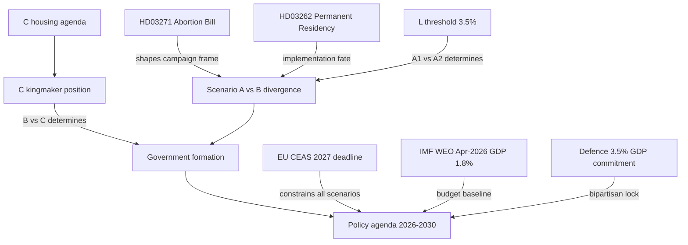

# Cross-Reference Map — Next Mandate Document Dependencies

## Forward-Looking Document Network

## Scenario Cross-Reference Matrix

| Document | A1 | A2 | B | C |
|----------|----|----|---|---|
| HD03271 (abortion) | Shelved/watered | Passed | Withdrawn | Shelved |
| HD03262 (perm residency) | Full implement | Full + expand | Reversed | EU-aligned |
| HD03265 (detention) | Implement | Expand | Partial reverse | EU-aligned |
| 3.5% defence | Maintained | Maintained | Maintained | Maintained |
| EU CEAS | Contested | Contested | Aligned | Aligned |
| Climate targets | Under-deliver | Under-deliver | Accelerate | Moderate |

## Key Sibling Citations (cross-anchor)
- **current/coalition-mathematics.md**: Establishes baseline seat calculations that next/ scenarios inherit
- **current/election-2026-analysis.md**: L/MP threshold analysis directly drives A1/A2/B probability assessment
- **current/scenario-analysis.md**: Pass-through probability weights for next/ scenarios
- **current/forward-indicators.md**: FI-A1/B1/G1/D1 indicators are forward-looking into next/ mandate territory
