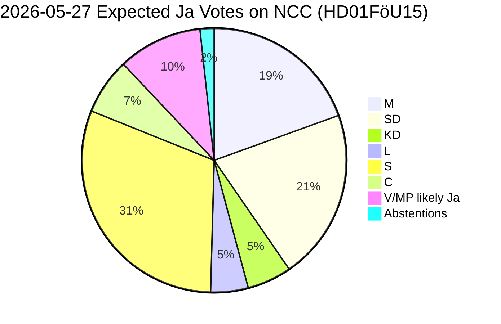

# Coalition Mathematics — Evening Analysis 2026-05-27

**Date**: 2026-05-27 | **Workflow**: news-evening-analysis | **Pass**: 1

## Current Government Arithmetic

**Government**: Tidökoalitionen — PM Ulf Kristersson (M)
**Governing parties**: M (68) + KD (19) + L (16) = 103 seats (minority government)
**Support party**: SD (73 seats) — Tidöavtalet (Tidö Agreement)
**Active working majority**: 103 + 73 = **176 seats** (threshold: 175 for simple majority in 349-seat chamber)
**Majority margin**: 3 seats above simple majority (176 vs 173 opposition)

## Opposition Arithmetic

| party | seats | bloc |
|-------|------:|------|
| S | 107 | Opposition |
| V | 24 | Opposition |
| MP | 18 | Opposition |
| C | 24 | Neither (bloc-free as of Tidö deal 2022) |

**Formal opposition (S+V+MP)**: 149 seats
**If C joins opposition**: 149 + 24 = **173 seats** (still 3 short of majority)

Note: One seat may vary due to by-elections and party changes (Jamal El-Haj formerly S, now independent — voted with majority on AU10 vote).

## Expected Vote Outcomes for Today's Betänkanden

### HD01FöU15 (NCC Cybersecurity) — Expected: Broad cross-party majority
| party | expected | seats | note |
|-------|----------|------:|------|
| M | Ja | 68 | Government — core policy |
| SD | Ja | 73 | Support — security aligned |
| KD | Ja | 19 | Government |
| L | Ja | 16 | Government — EU compliance emphasis |
| S | Ja | 107 | Opposition but security convergent |
| C | Ja | 24 | Pro-EU/NATO |
| V | Avstår/Ja | 24 | Security but some surveillance concerns |
| MP | Ja/Avstår | 18 | Accepts NIS2 compliance |
| **Estimated Ja** | | **329–349** | Near unanimous |

### HD01JuU38 (Recidivism/Crime) — Expected: Majority with reservations
| party | expected | seats | note |
|-------|----------|------:|------|
| M | Ja | 68 | Core policy |
| SD | Ja | 73 | Strong support |
| KD | Ja | 19 | |
| L | Ja | 16 | |
| S | Conditional Ja | 107 | S has moved on crime; may seek juvenile amendment |
| C | Ja | 24 | Crime reduction emphasis |
| V | Nej/Reserv | 24 | Rehabilitation vs punishment |
| MP | Nej/Abstår | 18 | Rehabilitation |
| **Estimated Ja** | | **307–330** | Large majority |
| **If S splits**: | | varies | Juvenile provisions: closer vote |

### HD01UU18 (Arms Export) — Expected: Large majority with V/MP reservations
| party | expected | seats | note |
|-------|----------|------:|------|
| M+KD+L+SD | Ja | 176 | Full government bloc |
| S | Ja | 107 | Arms export competitiveness + Ukraine |
| C | Ja | 24 | Export facilitation |
| V | Nej + reserv | 24 | Human rights conditionality |
| MP | Nej + reserv | 18 | Human rights |
| **Estimated Ja** | | **307** | Large majority |

### HD01SfU34 (Migration Detention) — Expected: Contested
| party | expected | seats | note |
|-------|----------|------:|------|
| M+KD+L | Ja (minimum) | 103 | Minimum remediation |
| SD | Ja (narrow) | 73 | Reluctant; no expansion of rights |
| S | Partial Ja / Reserv | 107 | Wants fuller remediation |
| C | Ja/Conditional | 24 | Pragmatic |
| V | Reserv | 24 | Full remediation demand |
| MP | Reserv | 18 | Full remediation |
| **Estimated outcome** | | 176–200 Ja | Multiple reservations |

## Tidöavtalet Cohesion Check

The Tidö agreement holds on all six betänkanden:
- FöU15: All four parties aligned (100%)
- JuU38: All four parties aligned (100%)
- UU18: All four parties aligned (100%)
- SfU34: SD may seek to minimise remediation — tension possible but below threshold for Tidö fracture

**Coalition stability assessment**: STABLE for this vote package. Tidöavtalet has 108 days to election. No coherence crisis anticipated from today's legislation.

