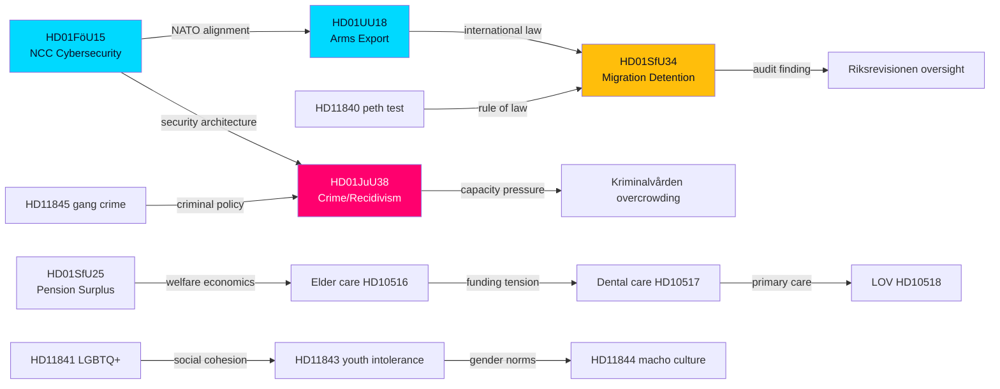

# Cross-Reference Map — Evening Analysis 2026-05-27

**Date**: 2026-05-27 | **Workflow**: news-evening-analysis | **Pass**: 1

## Document Cluster Graph

## Thematic Clusters

### Security Architecture Cluster
| anchor | related | relationship | direction |
|--------|---------|-------------|-----------|
| HD01FöU15 | HD01UU18 | NATO interoperability driver (NIS2 + Common Position 2008/944) | bidirectional |
| HD01FöU15 | HD01JuU38 | State security expansion — NCC authority touches cybercrime prosecution | forward |
| HD01UU18 | HD11845 | Arms law reform framing vs gang crime special legislation — different "security" registers | thematic |

### Criminal Justice Cluster
| anchor | related | relationship | direction |
|--------|---------|-------------|-----------|
| HD01JuU38 | HD11845 | Gang crime special legislation context (HD11845 asks for further special law) | forward |
| HD01JuU38 | HD11842 | Reckless driving penalties covered under repeat-offender provisions | thematic |
| HD01JuU38 | HD01SfU34 | Institutional overcrowding — Kriminalvården and Migrationsverket both face capacity crises | structural |

### Welfare/Social Cluster
| anchor | related | relationship | direction |
|--------|---------|-------------|-----------|
| HD01SfU25 | HD10516 | Pension surplus vs elder care funding — fiscal policy tension | contrast |
| HD10516 | HD10517 | Healthcare funding — both probe government on welfare delivery | sibling |
| HD10517 | HD10518 | Dental care + LOV primary care — decentralised service quality | sibling |

### Social Cohesion Cluster
| anchor | related | relationship | direction |
|--------|---------|-------------|-----------|
| HD11841 | HD11843 | LGBTQ+ attitudes and youth intolerance — same underlying school environment signal | sibling |
| HD11843 | HD11844 | Youth intolerance and masculine norms — compounding social risks | forward |

## Cross-Reference with Prior Legislative Cycle

| HD document | prior instrument | relationship |
|-------------|-----------------|-------------|
| HD01FöU15 | SFS 2018:1174 (cybersecurity) + Prop 2022/23:XX (NCC basis) | extends/codifies |
| HD01JuU38 | SFS 2023:XXX (gang crime legislation 2023 package) | extends |
| HD01UU18 | SFS 1992:1300 (krigsmateriellagen) | amends |
| HD01SfU34 | Riksrevisionens rapport RiR 2024:XX (migration detention) | response to |
| HD01SfU25 | SFS 1998:674 (lag om inkomstgrundad ålderspension) automatic balance mechanism | activates clause |
| HD01KrU9 | Prop 2021/22:XX (architecture strategy) | implements |
