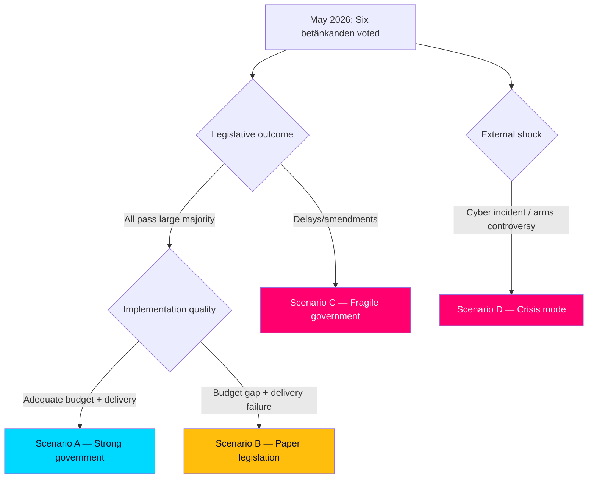

# Scenario Analysis — Evening Analysis 2026-05-27

**Date**: 2026-05-27 | **Workflow**: news-evening-analysis | **Pass**: 1

## Scenario Framework

Four scenarios across two axes: **Legislative Throughput** (fast/slow) × **Security Outcome** (effective/ineffective). Horizon T+90d to T+365d.

---

## Scenario A: Full Legislative Package + Effective Implementation
**Probability**: 35% (POSSIBLE-LIKELY)
**Conditions**: All six betänkanden pass with large majority; NCC receives adequate 2027 budget; recidivism legislation reduces violent reoffending rate; arms law passes ECHR human rights scrutiny; migration detention conditions remediated within 12 months.

**Narrative**: The Tidö government enters the 2026 election campaign as a security-capable governing coalition. NCC is cited by NATO as a model coordination body. Crime statistics show a decline in violent recidivism. Elder care receives additional budget in VP27. Sweden is positioned as a rule-of-law anchor state within NATO's eastern flank.

**Electoral implication**: Tidö coalition leads by 5–7 points in security/governance metrics. Election outcome: likely Tidö renewal.

**Indicators**: NCC operational report Q4 2026; BRÅ violent crime statistics January 2027; ECHR admissibility decisions H2 2026.

---

## Scenario B: Package Passes but Implementation Fails
**Probability**: 40% (POSSIBLE — base case)
**Conditions**: Betänkanden pass but NCC budget is inadequate; prison overcrowding worsens; migration detention conditions improve superficially; arms law faces criticism over first export decisions.

**Narrative**: Sweden has the legislation on paper but the administrative state cannot deliver. NCC operates with sub-optimal staffing. Crime continues to be a dominant media issue despite tougher sentencing (lag versus enforcement gap). Opposition campaign: "This government passes laws it cannot implement."

**Electoral implication**: Security/governance message weakened. Government must defend implementation failures. Election: tighter race, possible Tidö narrow win or hung parliament.

---

## Scenario C: Legislative Delay and Opposition Gains
**Probability**: 15% (UNLIKELY)
**Conditions**: JuU38 or SfU34 face procedural challenges; ECHR issues interim measure on migration detention halting deportations; S, V, MP, C form temporary majority on detention amendment.

**Narrative**: Opposition coordination forces government concessions on migration detention and potentially on JuU38 juvenile provisions. Government unable to deliver clean majority votes. NATO summit messaging disrupted.

**Electoral implication**: Demonstrates government fragility. SD frustrated by detention concessions. Coalition cohesion weakened.

---

## Scenario D: Security Failure — Cyber Incident or Arms Controversy
**Probability**: 10% (UNLIKELY but HIGH IMPACT)
**Conditions**: Major cyber incident against Swedish critical infrastructure before NCC becomes operational; or first arms export under new law triggers controversy (transfer to controversial partner).

**Narrative**: NCC legislation's timing is exposed as insufficient — a major incident (e.g., Volvo, SMHI, Vattenfall infrastructure attack) demonstrates the gap between statutory creation and operational capability. Government faces emergency Riksdag scrutiny. OR: First export decision under new arms law involves a controversial partner, triggering international media cycle.

**Electoral implication**: Opposition (S, V, MP) demands parliamentary inquiry. Government forced into defensive posture. Risk of cabinet reshuffles.

---

## Scenario Decision Tree

