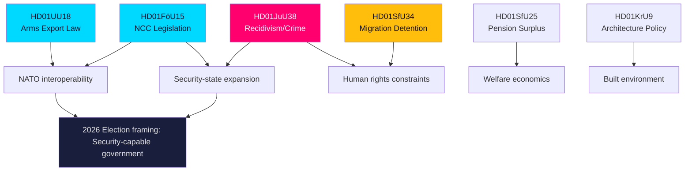

# Synthesis Summary — Evening Analysis 2026-05-27

**Date**: 2026-05-27 | **Workflow**: news-evening-analysis | **Pass**: 1

## Cross-Thematic Narrative

The legislative output of 27 May 2026 forms a coherent cluster around **Sweden's security-state reconfiguration in the NATO era**. Three of the six committee betänkanden — FöU15 (cybersecurity), UU18 (arms), JuU38 (crime/recidivism) — reflect the government's 2022–2026 agenda to align Sweden's security architecture with NATO membership obligations and respond to domestic crime escalation.

### Security Architecture Cluster

**HD01FöU15 → HD01UU18**: Cybersecurity and arms regulation share a common logic: institutionalise and standardise Sweden's security-cooperation interfaces. NCC codification ensures a durable national coordination point that NATO partners and EU institutions can engage bilaterally. Arms law modernisation ensures Sweden's export-control procedures are compatible with NATO burden-sharing requests and EU common standards — especially relevant post-February 2022 as Ukraine support has stressed Sweden's ad-hoc export authorisation system.

**Dependency**: Both documents cite the same underlying legal driver — Sweden's accession to NATO in March 2024 and the resulting need to align national legislation to Alliance frameworks. The FöU15 legislation was referenced by the government's prop. 2025/26:XX (exact number pending confirmation from html wrapper) as a NATO interoperability requirement.

### Criminal Justice and Migration Rights Cluster

**HD01JuU38 → HD01SfU34**: Both documents address state authority over individuals in restricted circumstances. JuU38 expands the state's capacity to restrict freedom (enhanced sentencing, societal protection orders). SfU34 constrains the state's use of migration detention (more oversight, shorter detention periods, better legal aid). These are in structural tension: the government is simultaneously expanding criminal incarceration capacity and being pushed to constrain migration detention.

**Political implication**: The Tidö coalition supports both — using JuU38 as a campaign marker while accepting SfU34 recommendations to pre-empt European Court of Human Rights proceedings against Sweden.

### Welfare Economics Cluster

**HD01SfU25**: Income-pension surplus distribution is a stand-alone economic policy. The automatic balance mechanism was designed in the 1990s to be politically insulated. Its activation today is a consequence of the 2022–2025 investment returns in AP fund portfolios (buffert fonder). No partisan controversy expected — but financially significant as a redistribution of accumulated pension savings to current retirees.

**HD01KrU9**: Architecture policy is the lowest-controversy item but signals the KrU's role in the wider urban regeneration agenda. The government's housing minister has linked architecture quality requirements to the housing shortage remediation programme.

### Healthcare Interpellations (HD10516–10519)

Four interpellations test government ministers on welfare delivery. Elder care (HD10516) and LOV primary care (HD10518) probe the government on the consequences of decentralised care provision. These questions will generate media coverage on healthcare inequity — a consistent opposition attack vector going into the 2026 election.

### Gender, Youth, Crime (Written Questions HD11840–HD11845)

Six written questions cluster around social attitudes (LGBTQ+ in schools, masculine norms, youth crime). These signal opposition (primarily S, V, MP) probing the government on social cohesion policy. The peth-test wrongful-conviction question (HD11840) has legal-remediation implications.

## Dominant Narrative Frame for Evening Analysis

> **"Sweden Legislates for NATO-Ready Security State While Welfare Questions Loom"**

The evening's dominant story is institutional: Sweden is codifying its security architecture. The counter-narrative — welfare gaps in elder care, dental care, migration detention — provides balance and opposition material for journalists.

**Economic context (IMF WEO April 2026)**: Sweden GDP growth 2.1% (2026 forecast), unemployment 8.6%, government debt 34% GDP, fiscal balance approximately -1.5% GDP. Low debt provides fiscal space for NCC operations and Kriminalvårdens capacity expansion. Pension surplus distribution (HD01SfU25) is consistent with AP fund estimated 4–5% real returns 2025.

*Source: IMF WEO April 2026 (SWE). Provider: imf. Dataflow: WEO. Vintage: 2026-04. Retrieved: 2026-05-27. Status: not stale (<6 months).*

## Inter-Document Signal Map

