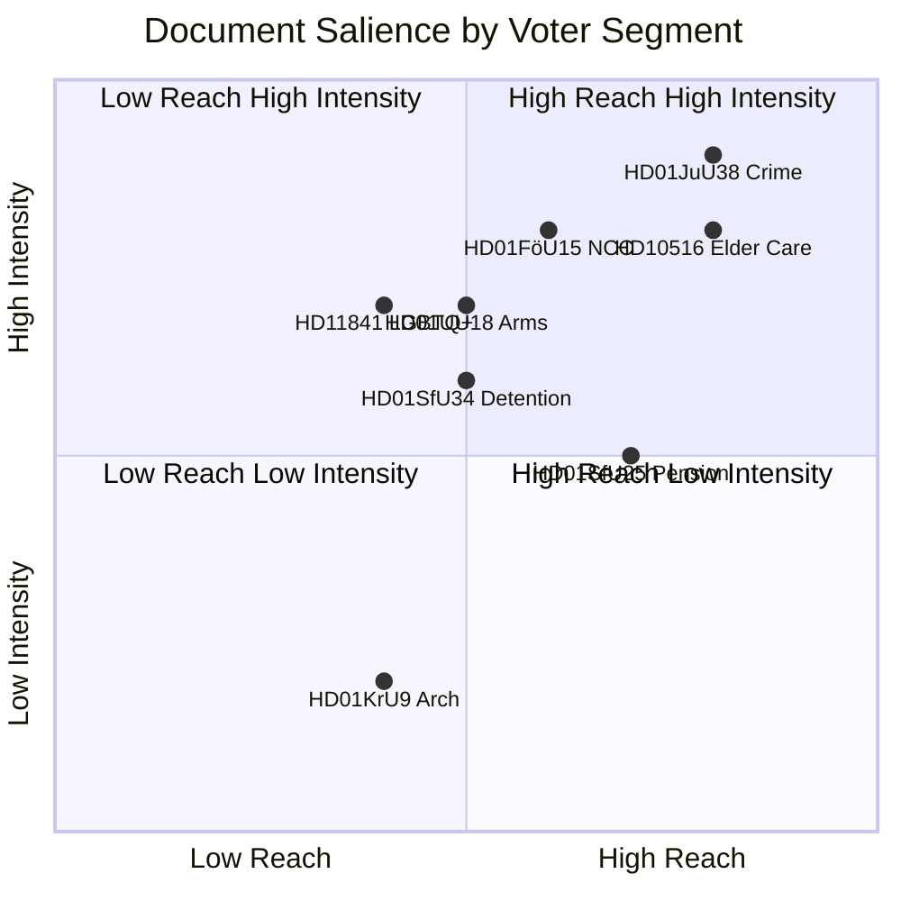

# Voter Segmentation — Evening Analysis 2026-05-27

**Date**: 2026-05-27 | **Workflow**: news-evening-analysis | **Pass**: 1

## Segmentation Model

Eight voter segments identified based on dominant policy salience and party alignment:

## Segment 1: Security-First Voters (≈18% of electorate)
**Profile**: Primary issue: national security, defence, crime. Predominantly M and SD. Disproportionately male, 35–65, higher income, urban/suburban.
**Resonance with today's documents**: HIGH — NCC, arms law, recidivism package directly addresses core concerns.
**Electoral movement**: Strongly Tidö. Legislation reinforces preference.

## Segment 2: Law-and-Order Working Class (≈14%)
**Profile**: Crime, safety, immigration as top issues. SD core voter. Mixed income, suburban/small city.
**Resonance**: HIGH — JuU38 recidivism + HD11845 gang crime question directly responsive.
**Electoral movement**: Stable SD. May swing SD→M if M is perceived as more capable.

## Segment 3: Welfare State Defenders (≈22%)
**Profile**: Healthcare, elder care, schools as top issues. S and V core. Predominantly female, 45+, municipal employment sector.
**Resonance**: NEGATIVE re: Tidö — interpellations on elder care (HD10516) and dental care (HD10517) signal government inadequacy.
**Electoral movement**: Stable S+V. Mobilised by welfare deterioration narrative.

## Segment 4: Pension-Focused Retirees (≈12%)
**Profile**: Pension security, healthcare, local services. Mixed S/M. Age 65+.
**Resonance**: POSITIVE for HD01SfU25 (pension surplus distribution). Elder care interpellation (HD10516) raises concern.
**Electoral movement**: Split — pension surplus calms economic anxiety; elder care concerns moderate.

## Segment 5: Economic Moderates (≈16%)
**Profile**: Business, economic growth, stable government. M core. Urban professionals.
**Resonance**: Positive for arms export modernisation (trade facilitation), NCC (business cybersecurity). Neutral on crime/welfare.
**Electoral movement**: Stable M. Slight boost from competent security legislation.

## Segment 6: Green/Liberal Youth (≈10%)
**Profile**: Climate, LGBTQ+ rights, migration rights. MP and L (LGBTQ+). Under 35.
**Resonance**: HD11841 (LGBTQ+ schools) — government non-response mobilises. Arms export concerns (UU18). Migration detention (SfU34) inadequacy.
**Electoral movement**: MP gaining, L stable. Negative mobilisation against Tidö.

## Segment 7: Pro-EU Liberal Centre (≈8%)
**Profile**: EU integration, rule of law, market economy. C and L. Mixed age.
**Resonance**: NCC as EU compliance positive. Arms law EU alignment positive. Migration detention inadequacy concerns.
**Electoral movement**: C at risk — post-Tidö deal C has lost voters. Some re-migration to L.

## Segment 8: Non-Voters and Disengaged (≈varies)
**Profile**: Low political trust, no consistent bloc. Volatile.
**Resonance**: Crime and welfare issues can mobilise — JuU38 and HD10516 may activate disengaged security-anxious voters.
**Electoral movement**: Unpredictable. If mobilised, tend toward SD or abstention.

## Salience Matrix for Today's Documents

