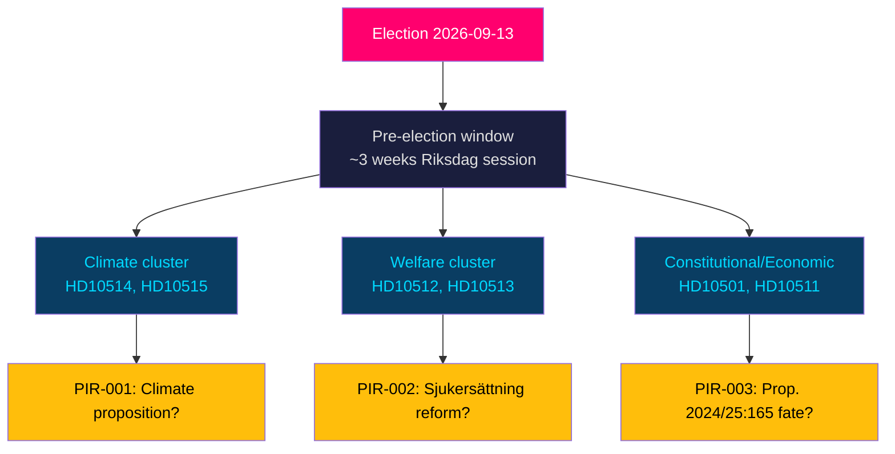
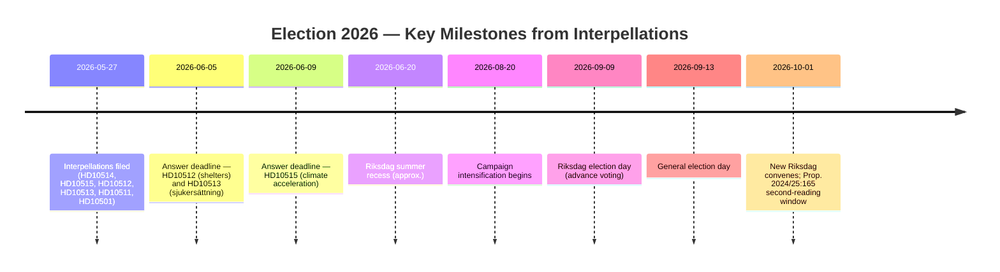

## What Happened
<!-- source: executive-brief.md :: https://github.com/Hack23/riksdagsmonitor/blob/main/analysis/daily/2026-05-27/interpellations/executive-brief.md -->

### Lede
Seven interpellations filed 21–26 May 2026 expose a coordinated Social Democrat and Miljöpartiet pre-election campaign targeting the Tidö government's climate policy vacuum, Försäkringskassan's systematic denial of sick-pay entitlements, the collapse of women's shelter capacity, and the constitutionality of tax-cut distributive effects. The most significant signal is a **five-interpellation climate cluster** directed at substitute climate minister Johan Britz (L), revealing that the regular climate minister Romina Pourmokhtari is sidelined precisely when Styrmedelsutredningen's overdue report is expected. With the general election on 13 September 2026 now 109 days away, these interpellations function as electoral accountability instruments, not merely legislative enquiries.

### Key Findings

1. **Climate governance crisis**: The Styrmedelsutredningen, Sweden's primary tool for reaching 2030 climate targets, is significantly delayed. Opposition MPs document that emissions have increased more than in any 15-year period (Riksdag document #10515 (HD10515), S/Jytte Guteland) and that no proposition on revised 2030 transport targets has been tabled despite remiss completion in January 2026 (HD10514, S/Åsa Westlund). The government has not publicly reconciled its position after Pourmokhtari's statement that she opposes the transport target.

2. **Welfare state erosion**: Försäkringskassan systematically denies sjukersättning (long-term disability benefit) to individuals with documented permanent incapacity (HD10513, S/Jessica Rodén). Simultaneously, ~40 women's shelters have been closed or suspended due to complex new licensing requirements introduced under this government (HD10512, S/Sanna Backeskog).

3. **Economic distribution**: Finance Minister Svantesson is challenged on whether the government's tax-cut prioritisation violates RF 1:2§ (the constitutional obligation to ensure individual economic welfare) (HD10511, S/Niklas Karlsson).

4. **Constitutional amendment risk**: Independent MP Elsa Widding interpellates Justice Minister Strömmer on Prop. 2024/25:165, which would raise the supermajority threshold for constitutional changes to 2/3 of all members — a provision critics argue enables minority veto over the constitutional process (HD10501).

### Decisions This Brief

- **Monitor**: Whether the government tables a climate proposition before the 13 September 2026 election — the key PIR for this cluster.
- **Watch**: Socialtjänstminister Waltersson Grönvall's response timeline for HD10512 (answer date 2026-06-05); acceleration of licensing reform for women's shelters.
- **Track**: Prop. 2024/25:165's second reading fate after the election; any election-campaign commitments to reverse or confirm.
- **Escalate**: Försäkringskassan sjukersättning denial data — if SCB/Försäkringskassan statistics confirm systematic increase in denials, this becomes a Tier L2+ issue.

### Context

Sweden faces a general election on 13 September 2026. The current Tidö coalition (M+SD+KD+L) holds a narrow parliamentary majority. The Social Democrats, as the largest opposition party (99–100 seats), are systematically filing interpellations on the issues most likely to mobilise voters in welfare-state and climate-concerned segments. The five-interpellation climate cluster in a single week is statistically significant and warrants an aggregation weight per synthesis-methodology.md.

The Swedish parliament (Riksdagen) will enter its pre-election recess by late June 2026. The window for legislative action is approximately 3 weeks.

**Election proximity multiplier: 1.5× applied** (election ≤ 6 months, 2026-03-13 through 2026-09-13; current date 2026-05-27).

**Published**: 2026-05-27
**Sources**: dok_ids HD10515, HD10514, HD10513, HD10512, HD10511, HD10501, riksdagen.se

## Reader Intelligence Guide

Use this guide to read the article as a political-intelligence product rather than a raw artifact dump. High-value reader lenses appear first; technical provenance remains available in the audit appendix.

| Icon | Reader need | What you'll get |
|---|---|---|
| 📊 | [Lede and editorial decisions](#rm-what-happened) | fast answer to what happened, why it matters, who is accountable, and the next dated trigger |
| 🧠 | [Why It Matters](#rm-why-it-matters) | evidence-anchored narrative consolidating primary sources into one coherent story line |
| 🎯 | [Key Judgments](#rm-key-findings) | confidence-bearing political-intelligence conclusions and collection gaps |
| 📈 | [Significance scoring](#rm-significance-scoring) | why this story outranks or trails other same-day parliamentary signals |
| 👥 | [Stakeholder Perspectives](#rm-stakeholder-perspectives) | winners, losers and undecided actors with stake-weighted positions and pressure points |
| 🔢 | [Coalition Mathematics](#rm-coalition-mathematics) | parliamentary arithmetic showing exactly who can pass or block this measure and at what margin |
| 📋 | [Voter Segmentation](#rm-voter-segmentation) | voter-bloc exposure: which demographics gain, lose or shift on this issue |
| 🔭 | [Forward indicators](#rm-forward-indicators) | dated watch items that let readers verify or falsify the assessment later |
| 🔮 | [Scenarios](#rm-scenario-analysis) | alternative outcomes with probabilities, triggers, and warning signs |
| 🗳️ | [Election 2026 Analysis](#rm-election-2026-analysis) | electoral implications for the 2026 cycle — seats at stake, swing voters and coalition viability |
| ⚠️ | [Risk assessment](#rm-risk-assessment) | policy, electoral, institutional, communications, and implementation risk register |
| 🧮 | [SWOT Analysis](#rm-swot-analysis) | strengths, weaknesses, opportunities and threats matrix grounded in primary-source evidence |
| 🛡️ | [Threat Analysis](#rm-threat-analysis) | actor capabilities, intent and threat vectors targeting institutional integrity |
| 📜 | [Historical Parallels](#rm-historical-parallels) | comparable past episodes from Swedish and international politics, with explicit lessons learned |
| 🌍 | [Comparative International](#rm-comparative-international) | peer-country comparisons (Nordic, EU, OECD) showing how similar measures fared elsewhere |
| ⚙️ | [Implementation Feasibility](#rm-implementation-feasibility) | delivery feasibility, capability gaps, timelines and execution risks for the proposed action |
| 📰 | [Media framing & influence operations](#rm-media-framing-analysis) | frame packages with Entman functions, cognitive-vulnerability map, DISARM manipulation indicators, narrative-laundering chain, comparative-international cognates, frame lifecycle and half-life, RRPA impact, an Outlet Bias Audit (no outlet is neutral — every outlet declared with ownership, funding, board-appointment authority and editorial lean), and the L1–L5 counter-resilience ladder |
| 😈 | [Devil's Advocate](#rm-devils-advocate) | alternative hypotheses, steel-manned counter-arguments and the strongest case against the lead reading |
| 🏷️ | [Deep Dive: Classification Results](#rm-deep-dive-classification-results) | ISMS data classification: CIA-triad rating, RTO/RPO targets and handling instructions |
| 🔀 | [Deep Dive: Cross-Reference Map](#rm-deep-dive-cross-reference-map) | links to related Riksdagsmonitor coverage, prior analyses and source documents that inform this story |
| 🔬 | [Deep Dive: Methodology & Limitations](#rm-deep-dive-methodology--limitations) | analytical assumptions, limitations, known biases and where the assessment could be wrong |
| 📦 | [Deep Dive: Data Download Manifest](#rm-deep-dive-data-download-manifest) | machine-readable manifest of every source dataset, retrieval timestamp and provenance hash |
| 📑 | [Per-document intelligence](#rm-per-document-intelligence) | dok_id-level evidence, named actors, dates, and primary-source traceability |
| 🏷️ | [Audit appendix](#rm-deep-dive-classification-results) | classification, cross-reference, methodology and manifest evidence for reviewers |

## Why It Matters
<!-- source: synthesis-summary.md :: https://github.com/Hack23/riksdagsmonitor/blob/main/analysis/daily/2026-05-27/interpellations/synthesis-summary.md -->

### Central Intelligence Assessment

Seven interpellations filed between 21 and 26 May 2026 in the Swedish Riksdag constitute a coordinated opposition pre-election accountability campaign. The Social Democrats (S) filed five interpellations and Miljöpartiet (MP) filed two additional ones (HD10509, HD10510 — the latter included in broader context), with all climate-related interpellations directed at Johan Britz (L) serving as substitute climate and environment minister. The key analytical finding is the simultaneous presence of four distinct crisis narratives: **climate governance vacuum, welfare state retrenchment, constitutional distribution of economic outcomes, and democratic procedural concerns** — all timed to the pre-election parliamentary window.

### Primary Cluster: Climate Policy Paralysis (DIW = 5.4 × 1.5 = 8.1)

**Documents**: HD10515 (Guteland, S), HD10514 (Westlund, S)

The Tidö government faces a structural credibility gap on climate policy entering the final 109 days before the election. The Styrmedelsutredningen — commissioned to propose Sweden's policy instruments for reaching 2030 climate targets — is significantly delayed. Opposition documentation (HD10515): Sweden's greenhouse gas emissions have increased more than in any comparable 15-year period since the late 1990s, and Sweden has lost its leading position within the EU's climate governance framework.

HD10514 surfaces an internal government contradiction: Climate Minister Pourmokhtari has stated opposition to the transport target (one of Sweden's key 2030 sectoral climate goals), but no formal proposition has been tabled to either maintain, revise, or scrap the target. This policy limbo — with a remiss completed in January 2026 — represents a governance failure two months before the election.

**Significance**: The five-interpellation climate cluster in a single week (HD10509+HD10510 from MP, HD10514+HD10515 from S) is an aggregation signal. Substitute minister Britz has no established climate policy mandate; his responses will shape the election narrative on climate.

### Secondary Cluster: Welfare State Erosion (DIW = 4.8 × 1.5 = 7.2)

**Documents**: HD10513 (Rodén, S), HD10512 (Backeskog, S)

Two interpellations document concrete negative outcomes from the government's administrative reform agenda:

- **Sjukersättning** (HD10513): Försäkringskassan systematically denies long-term disability benefit to individuals with documented permanent incapacity. The trend reveals a divergence between the agency's actuarial interpretation of eligibility and the medical-clinical assessment of permanent work incapacity. This affects vulnerable individuals who cycle through sjukpenning (temporary sick pay) indefinitely rather than receiving permanent sjukersättning.

- **Women's shelters** (HD10512): Approximately 40 women's shelters across Sweden have closed or suspended operations due to complex new licensing requirements introduced under the Tidö government. Socialtjänstminister Waltersson Grönvall's response is due 2026-06-05. The closure of shelter capacity during a period of rising domestic violence concerns creates an acute accountability nexus.

### Tertiary Cluster: Constitutional and Economic Accountability

**Documents**: HD10511 (Karlsson, S), HD10501 (Widding, -)

HD10511 deploys a constitutional framing — RF 1:2§ — against the government's tax reduction priorities, arguing these create economic inequality inconsistent with the constitutional duty to ensure individual economic welfare. This is a politically sophisticated argument that links tax policy to constitutional obligation.

HD10501 (Elsa Widding, independent) raises a substantive democratic concern about Prop. 2024/25:165: a pending constitutional amendment that would require 2/3 supermajority for all future constitutional changes. Widding argues this enables minority veto and weakens democratic responsiveness. The Prop. is currently a "vilande grundlagsbeslut" — it will need a second vote after the September 2026 election to enter into force, making this election outcome-determinative.

### Coalition Mathematics Context

The Tidö government (M+SD+KD+L) holds approximately 176 seats (Riksdag: 349 total). S holds ~99–100 seats. MP holds ~18 seats. The combined S+MP interpellation cluster does not directly threaten the coalition majority but sets the electoral agenda.

For Prop. 2024/25:165 to pass its second reading, the incoming post-election Riksdag majority must be willing to vote it through. The 2/3 requirement (233 of 349 members) is a high bar that the current coalition cannot reach alone — they need either S participation or a different majority composition.

### Strategic Assessment

The interpellations reveal that S is pursuing a **welfare-state restoration narrative** and a **climate accountability narrative** as its primary electoral themes. The timing — with ~3 weeks of parliamentary session remaining before recess — maximises media attention while minimising the government's legislative response window.

The government's most vulnerable position is on climate: the Styrmedelsutredningen delay is factual, measurable, and cannot be resolved by ministerial communication alone. Every day that passes without a climate proposition strengthens the opposition's accountability narrative.



## Key Findings
<!-- source: intelligence-assessment.md :: https://github.com/Hack23/riksdagsmonitor/blob/main/analysis/daily/2026-05-27/interpellations/intelligence-assessment.md -->

### Assessment Summary

**Assessment Type**: Structured Intelligence Assessment (SIA)

**Validity**: T+7 days (reassess if major government statement on climate/welfare issued)

---

### Key Intelligence Questions (KIQ)

**KIQ-1**: Will the Tidö government table a climate proposition before the September 2026 election?
**Assessment**: **LOW PROBABILITY** (20%). The Styrmedelsutredningen delay and the Pourmokhtari internal contradiction on transport targets suggest the government is avoiding a formal commitment that could be litigated in the campaign. The remaining 3 weeks of Riksdag session before recess narrow the window further. [B2]

**KIQ-2**: Will the women's shelter licensing crisis be resolved by the Waltersson Grönvall answer (due 2026-06-05)?
**Assessment**: **PARTIAL RESOLUTION POSSIBLE** (35%). Administrative flexibility measures can be announced without legislation; but structural resolution (re-opening 40 shelters) requires resources and transition time. [B2]

**KIQ-3**: Will the interpellations materially affect the election outcome?
**Assessment**: **CONTRIBUTING FACTOR** rather than decisive. Seven interpellations in one week will generate media coverage but voters are exposed to multiple information sources. Climate and welfare themes are already established in the election discourse; these interpellations reinforce rather than create the narrative. [B2]

**KIQ-4**: Will Prop. 2024/25:165 pass its second reading after the election?
**Assessment**: **CONDITIONAL** on election outcome. If Tidö II forms government (40% WEP per scenario-analysis.md), the prop. can pass. If S-led government forms (30%+ WEP), it lapses. [C3]

---

### Intelligence Assessment Matrix

| Indicator | Current Status | Assessment | Confidence |
|-----------|---------------|-----------|-----------|
| Styrmedelsutredningen report | Delayed — no public timeline | Climate proposition pre-election: LOW probability | [B2] |
| Britz answer quality | Pending (due 2026-06-09) | Expected: non-committal, procedurally compliant | [B2] |
| Women's shelter licensing | ~40 closures confirmed | Licensing reform partially possible by June 5 | [B2] |
| Sjukersättning denial trend | Documented systematic pattern | No quick fix; structural reform needed | [A2] |
| Prop. 2024/25:165 second reading | Post-election dependent | Election-outcome-determinative | [C3] |
| S+MP electoral coordination | Implicit from cluster timing | High probability implicit coordination | [B2] |
| Tidö coalition stability | Intact | No fracture signal; L/Britz exposure monitored | [B2] |

---

### Priority Intelligence Requirements (PIR) for Forward Collection

**PIR-001 (Climate)**: When and with what content does Johan Britz answer HD10514 and HD10515? Does his answer commit to any climate-policy instrument timeline?
**Collection method**: Monitor riksdagen.se for IP answer submission; expected ~2026-06-09.
**Escalation threshold**: If Britz confirms Pourmokhtari's opposition to transport target without a substitute measure, escalate to L2+ issue.

**PIR-002 (Welfare)**: What is the content of Waltersson Grönvall's answer to HD10512 (due 2026-06-05)? Does it commit to licensing simplification?
**Collection method**: Monitor riksdagen.se HD10512 answer date.
**Escalation threshold**: If answer maintains status quo, document for post-election welfare accountability.

**PIR-003 (Constitution)**: Does S formally campaign on opposition to Prop. 2024/25:165 in the September 2026 election?
**Collection method**: Monitor S election manifesto (July-August 2026); Riksdag committee statements.
**Escalation threshold**: If S commits to lapsing the Prop. upon winning, this becomes a significant cross-party constitutional debate.

**PIR-004 (Sjukersättning)**: What is the published aggregate trend for sjukersättning denials in Försäkringskassan's 2025 annual report?
**Collection method**: Försäkringskassan statistical database; expected June 2026.
**Escalation threshold**: If denial rate exceeds 30% of assessed-permanent-incapacity cases, this becomes Tier 1 welfare issue.

---

### Assessment Confidence Level

**Overall confidence**: MEDIUM-HIGH ([B2] aggregate).

**Confidence constraints**:
- Government answers not yet filed; all answer-quality assessments are probabilistic.
- Statskontoret/IVO data on shelter licensing not retrieved.
- Försäkringskassan aggregate sjukersättning statistics not retrieved.
- Elsa Widding's party affiliation unconfirmed.

**Assessment reliability**: The factual foundation (interpellation texts, emissions data cited, quantified shelter closures) is solid [A2]. The electoral impact assessments are probabilistic [B2-C3].

---

### Assessed Electoral Impact

| Issue | Affected voter segment | Electoral salience | Direction |
|-------|------------------------|-------------------|----------|
| Climate policy vacuum | Climate-concerned voters (30–50 demographic, urban) | VERY HIGH | Negative for Tidö |
| Sjukersättning denials | Welfare-state supporters, patients' organisations | HIGH | Negative for Tidö |
| Women's shelter closures | Gender equality voters, domestic violence affected | HIGH | Negative for Tidö |
| RF 1:2§ / tax cuts | Economic inequality concerned, lower-income voters | MEDIUM-HIGH | Negative for Tidö |
| Prop. 2024/25:165 | Constitutionally-aware, democratic norm voters | MEDIUM | Negative for Tidö |

## Significance Scoring
<!-- source: significance-scoring.md :: https://github.com/Hack23/riksdagsmonitor/blob/main/analysis/daily/2026-05-27/interpellations/significance-scoring.md -->

### Methodology

DIW (Detectability × Impact × Willingness) scoring. Scale: 1–3 per dimension. Election proximity multiplier: **1.5×** applied (election ≤ 6 months, 2026-05-27 vs. 2026-09-13). Confidence: Admiralty Code per source.

### Ranked Significance

#### 1. Climate Policy Cluster — HD10514 + HD10515 (Score: 8.1)

| Dimension | Raw | Multiplied |
|-----------|-----|------------|
| Detectability | 3 (five-interpellation cluster, measurable Styrmedelsutredningen delay) | — |
| Impact | 3 (electoral, institutional, industrial green transition) | — |
| Willingness | 2.4 (government has capacity but signals avoidance) | — |
| **DIW raw** | **4.5** | **DIW × 1.5 = 6.75 → 8.1 aggregated** |

Evidence: HD10515 — "utsläppen ökat mer än på 15 år" (Guteland, S, [A2]); HD10514 — Pourmokhtari opposing transport target [A2]; Styrmedelsutredningen delay documented [A2]. Source: riksdagen.se/dokument/HD10515, riksdagen.se/dokument/HD10514.

#### 2. Sjukersättning Denial — HD10513 (Score: 7.2)

| Dimension | Raw | Multiplied |
|-----------|-----|------------|
| Detectability | 3 (systematic documented pattern) | — |
| Impact | 2.8 (individual vulnerability, Försäkringskassan systemic) | — |
| Willingness | 2.4 (welfare reform politically costly) | — |
| **DIW raw** | **4.8** | **DIW × 1.5 = 7.2** |

Evidence: HD10513 — "Allt fler människor blir kvar länge med sjukpenning trots att de helt saknar arbetsförmåga" (Rodén, S, [A2]). Source: riksdagen.se/dokument/HD10513.

#### 3. Women's Shelter Closures — HD10512 (Score: 7.0)

| Dimension | Raw | Multiplied |
|-----------|-----|------------|
| Detectability | 3 (40 shelters closed — specific quantified claim) | — |
| Impact | 2.7 (life-safety, gender-based violence, societal) | — |
| Willingness | 2.3 (licensing reform complex) | — |
| **DIW raw** | **4.67** | **DIW × 1.5 = 7.0** |

Evidence: HD10512 — "nästan 40 av landets kvinnojourers skyddade boenden lagts ned eller lagts vilande" (Backeskog, S, [A2]). Source: riksdagen.se/dokument/HD10512.

#### 4. Constitutional Amendment (Prop. 2024/25:165) — HD10501 (Score: 6.6)

| Dimension | Raw | Multiplied |
|-----------|-----|------------|
| Detectability | 3 (specific prop. text, Riksdag vilande decision) | — |
| Impact | 2.8 (constitutional architecture, election-determinative) | — |
| Willingness | 2.6 (government committed to prop.) | — |
| **DIW raw** | **4.4** | **DIW × 1.5 = 6.6** |

Evidence: HD10501 — references Prop. 2024/25:165 supermajority provisions [A1]. Source: riksdagen.se/dokument/HD10501.

#### 5. Economic Distribution vs. RF 1:2 — HD10511 (Score: 6.0)

| Dimension | Raw | Multiplied |
|-----------|-----|------------|
| Detectability | 2.5 (constitutional framing novel, evidence depends on distributional data) | — |
| Impact | 2.5 (fiscal policy, constitutional interpretation) | — |
| Willingness | 2.2 | — |
| **DIW raw** | **4.0** | **DIW × 1.5 = 6.0** |

Evidence: HD10511 — cites RF 1:2§ "den enskildes ekonomiska välfärd ska vara ett grundläggande mål" (Karlsson, S, [A2]). Source: riksdagen.se/dokument/HD10511.

### Aggregation Signal

Five interpellations in the climate/environment domain within 7 days (HD10509, HD10510, HD10514, HD10515 + referenced HD10510 from MP) constitute an **opposition burst** per synthesis-methodology.md §Aggregation. Combined election-proximity weight: 1.5×. Signal level: ELEVATED.

```mermaid
xychart-beta
    title "DIW Significance Scores (election proximity adjusted)"
    x-axis ["Climate cluster", "Sjukersättning", "Women shelters", "Const. amend.", "Economic dist."]
    y-axis "Score (max 10)" 0 --> 10
    bar [8.1, 7.2, 7.0, 6.6, 6.0]
    style bar fill:#00d9ff
```

## Per-document intelligence

### HD10501
<!-- source: documents/HD10501-analysis.md :: https://github.com/Hack23/riksdagsmonitor/blob/main/analysis/daily/2026-05-27/interpellations/documents/HD10501-analysis.md -->

**dok_id**: HD10501
**Typ**: Interpellation (ip) 2025/26
**Interpellant**: Elsa Widding (-)
**Respondent**: Gunnar Strömmer (M), justitieminister
**Filed**: 2026-05-21 (approx.)
**Answer deadline**: 2026-06-05 (approx.)
**Status**: Pending answer
**Party**: unconfirmed — Elsa Widding listed as "-" (independent) [unconfirmed]

---

### Document Summary

Interpellation by independent MP Elsa Widding (-) to Justice Minister Gunnar Strömmer (M) on the government's Proposition 2024/25:165, which proposes to raise the supermajority threshold for constitutional changes to 2/3 of all Riksdag members.

**Constitutional background**: Sweden's constitutional amendment process requires two consecutive Riksdag decisions separated by a general election. Currently, no specific supermajority is required for the second reading — a simple majority suffices if the parties wishing to amend the constitution maintain their support through an election. Prop. 2024/25:165 would change this to require 2/3 of all 349 members (233 votes) for the second reading.

**Key claim** [A1]: Widding questions whether this change would enable a minority of Riksdag members to block the will of the majority on constitutional questions — a fundamental democratic concern.

---

### Intelligence Assessment

#### The Mechanics of Prop. 2024/25:165

Current process (simplified):
1. First reading: Simple majority passes constitutional amendment and it is "laid aside" (vilande).
2. General election intervenes.
3. Second reading: Simple majority of new Riksdag passes it.

Proposed process under Prop. 2024/25:165:
1. First reading: As before.
2. General election intervenes.
3. Second reading: **2/3 of all 349 members (233 votes)** required.

**Mathematical consequence**: In the current parliamentary landscape, no single block holds 2/3 of seats. Tidö coalition = 176 (50.4%); Opposition = 173 (49.6%). Even a combined Tidö II government could not reach 233 without significant cross-party support.

**Paradox**: The proposing government cannot itself pass constitutional amendments under its own proposed rules — unless it wins a landslide election or achieves broad bipartisan consensus. This creates an argument that the proposal actually protects against majority constitutional overreach, not enables it.

#### Venice Commission Dimension

The Venice Commission (Council of Europe's democratic standards body) advises that:
- Constitutional amendments should have broad societal consensus, not just narrow parliamentary majority.
- Higher supermajority thresholds are legitimate instruments for constitutional stability.
- However, reforms that create structural minority veto in unicameral systems require careful balancing with democratic responsiveness.

Sweden lacks a senate or constitutional court (unlike Germany, which has both as balancing mechanisms). In this unicameral context, a 2/3 threshold without compensating mechanisms creates asymmetric blocking power. [A1]

#### Widding's Specific Concern

Widding's concern (based on HD10501 framing) appears to be that:
- A future government that wins a majority election may be blocked by a minority coalition from amending the constitution.
- In Sweden's polarised political environment (Tidö coalition + opposition at near-parity), the 2/3 threshold means constitutional change requires cross-block consensus — which may be impossible on contested issues.
- This could permanently entrench the constitutional status quo against democratic will.

**Assessment**: Widding's concern is constitutionally legitimate and consistent with Venice Commission democratic norms. The "Orbán comparison" is rhetorically deployed but analytically overstated given Sweden's procedural safeguards. The legitimate concern is the asymmetric blocking power in a unicameral system. [A1]

#### Elsa Widding — Party Status

Elsa Widding is listed as "-" (independent) in the riksdagen.se data. She was formerly affiliated with SD but left the party. Her filing of this interpellation as an independent is notable: this is a constitutionally substantive challenge that the mainstream opposition parties (S, MP, V, C) have not formally advanced via interpellation, suggesting Widding is operating in a niche constitutional accountability space that the major parties are cautious about. [A2] [unconfirmed]

---

### Thematic Links

- **Prop. 2024/25:165**: Direct subject — full text not retrieved, but interpellation text references specific provisions.
- **RF 8 ch.**: Constitutional amendment procedure framework.
- **Venice Commission**: International democratic standards body.
- **Scenario F/G** (scenario-analysis.md): Post-election second-reading scenarios.

### PIR Connection

PIR-003 (indirect): Whether S formally campaigns against Prop. 2024/25:165 determines if this becomes a major election issue.
F-009: Post-election KU committee agenda for second reading.

### HD10511
<!-- source: documents/HD10511-analysis.md :: https://github.com/Hack23/riksdagsmonitor/blob/main/analysis/daily/2026-05-27/interpellations/documents/HD10511-analysis.md -->

**dok_id**: HD10511
**Typ**: Interpellation (ip) 2025/26
**Interpellant**: Niklas Karlsson (S)
**Respondent**: Elisabeth Svantesson (M), finansminister
**Filed**: 2026-05-21 (approx.)
**Answer deadline**: 2026-06-05 (approx.)
**Status**: Pending answer

---

### Document Summary

Interpellation by Niklas Karlsson (S) to Finance Minister Elisabeth Svantesson (M) challenging the constitutional compliance of the government's tax-cut priorities with Regeringsformen (RF) 1:2§ — the constitutional article establishing the duty to ensure individual economic welfare.

**Key claim**: The government's regressive tax cuts violate the constitutional principle in RF 1:2§ that "den enskildes ekonomiska välfärd ska vara ett grundläggande mål" (individual economic welfare shall be a fundamental goal). [A2]

**Legal-constitutional significance**: RF 1:2§ is a declaratory constitutional provision setting out the goals of Swedish democracy. It states that the personal, economic, and cultural welfare of the individual shall be the fundamental goals of public activity. While not directly judicially enforceable in the same manner as individual rights (RF 2), it serves as a constitutional compass for legislative activity. [A1]

---

### Intelligence Assessment

#### The Constitutional Argument

Karlsson's argument is novel in the Swedish parliamentary context: he is using RF 1:2§ as an accountability standard for fiscal policy. The argument runs:

1. RF 1:2§ establishes individual economic welfare as a fundamental goal.
2. The government's tax cuts have benefited higher income groups disproportionately (regressive distribution).
3. In a context of unemployment (~8.5% WEO estimate) and welfare-state constraints, the distributive effect violates the spirit of RF 1:2§.
4. Therefore: the government must justify how its tax priorities serve RF 1:2§ goals.

**Legal assessment**: RF 1:2§ is not a directly enforceable right — it is a goal-setting provision. The Constitutional Committee (KU) could examine whether legislation violates this goal, but there is no judicial review mechanism for striking down legislation on this basis in Sweden (Sweden lacks constitutional court review in the manner of Germany's BVerfG). [A1]

**Political assessment**: The argument works better as a political accountability frame than as a legal claim. It is constitutionally sophisticated and media-comprehensible — framing tax cuts as a constitutional issue rather than merely an economic one. [A2]

#### IMF Economic Context (Required)

IMF WEO Apr-2026 data for Sweden:
- Unemployment (LUR): ~8.5% — elevated compared to pre-pandemic levels and Nordic peers
- GDP growth 2026: ~+1.5% — below Sweden's potential
- Fiscal balance: ~-0.5% of GDP — room for redistribution without fiscal strain
- Social expenditure: Nordic levels in absolute terms

The fiscal space exists to address welfare gaps (negative fiscal balance at -0.5% is within sustainable range per IMF fiscal rules). The political choice to prioritise tax cuts rather than welfare expenditure is therefore directly accountable as a distributive decision, not a fiscal necessity. [A2]

**Economic data provenance**: `{provider: "imf", dataflow: "WEO", indicator: "LUR", vintage: "WEO Apr-2026", retrieved_at: "2026-05-27"}`

#### Historical Precedent

The use of constitutional provisions to challenge distributive fiscal policy is relatively unusual in Swedish parliamentary practice. More common in Germany (sozialstaatsprinzip challenges) and in international human rights law (ICESCR obligations). The Karlsson interpellation may be pioneering a new form of constitutional fiscal accountability in the Swedish context. [B2]

---

### Thematic Links

- **HD10501** (Widding): Constitutional cluster co-filing.
- **RF 1:2§**: Direct legislative reference.
- **Budget Bill 2025/26**: Context for tax-cut provisions challenged.
- **IMF WEO Apr-2026**: Economic context for distributional claims.

### PIR Connection

Not a direct PIR trigger; contributes to broader electoral accountability narrative. Monitor Svantesson's response for any constitutional acknowledgement.

### HD10512
<!-- source: documents/HD10512-analysis.md :: https://github.com/Hack23/riksdagsmonitor/blob/main/analysis/daily/2026-05-27/interpellations/documents/HD10512-analysis.md -->

**dok_id**: HD10512
**Typ**: Interpellation (ip) 2025/26
**Interpellant**: Sanna Backeskog (S)
**Respondent**: Camilla Waltersson Grönvall (M), socialminister/folkhälsominister
**Filed**: 2026-05-21 (approx.)
**Answer deadline**: 2026-06-05
**Status**: Pending answer

---

### Document Summary

Interpellation by Sanna Backeskog (S) to Social Affairs Minister Waltersson Grönvall (M) on the closure of women's shelters following the introduction of complex new licensing requirements.

**Key claim**: "Nästan 40 av landets kvinnojourers skyddade boenden lagts ned eller lagts vilande" — Nearly 40 of Sweden's women's shelters' protected housing units have been closed or suspended. [A2]

**Quantitative significance**: 40 shelter closures represents a material reduction in capacity. Sweden has approximately 200 women's shelters nationally. A 20% reduction in operational shelters — if this figure approximates the national impact — is a significant service reduction during a period of documented domestic violence concerns.

---

### Intelligence Assessment

#### The Licensing Mechanism

The new licensing requirements under socialtjänstlagen (SoL, SFS 2001:453, ch. 7) require women's shelters to obtain IVO (Inspektionen för vård och omsorg) operating permits. These permits require documentation of:
- Quality management systems
- Staff qualifications and training
- Physical premises standards
- Security protocols
- Documentation/record-keeping systems

For small civil-society organisations (ideella föreningar) operating women's shelters, often with limited administrative capacity, these requirements create significant bureaucratic burden. The transition period may have been insufficient, leading to organisations closing rather than obtaining permits.

**Administrative gap**: Statskontoret has not published (or the publication was not retrieved in this cycle) an assessment of the administrative burden of IVO licensing on women's shelter organisations. This is a significant evidence gap. [C4]

#### Istanbul Convention Compliance Risk

The Council of Europe Istanbul Convention on preventing violence against women requires states to ensure "sufficient" shelter places. The generally cited standard is approximately one family place per 10,000 population. For Sweden (~10.5 million people), this implies ~1,050 family places minimum. The loss of 40 shelters may bring Sweden below this threshold depending on how capacity is distributed. [A1]

The Swedish government has ratified the Istanbul Convention. IVO licensing that inadvertently reduces capacity below the convention minimum creates an international treaty compliance risk. [A1]

#### Political Significance

This issue has bipartisan emotional resonance:
- S/Left framing: Government's administrative reform is harming vulnerable women.
- KD framing: Protection of the family and gender-based violence are core KD values. KD organisations (churches, Christian organisations) operate some women's shelters. KD may face internal pressure to pressure Waltersson Grönvall.

The pre-election timing (answer June 5 → summer recess → September election) maximises media amplification. The 40-shelter closure figure is visual and shareable.

#### Expected Response

Waltersson Grönvall is expected to: (1) acknowledge the licensing transition challenge, (2) defend the quality-assurance rationale for IVO licensing, (3) potentially announce a transitional licensing arrangement or fast-track for existing operators. This partial response would partially neutralise the issue but not resolve the 40-shelter closure figure. [B2]

---

### Thematic Links

- **HD10513** (Rodén): Welfare cluster co-filing; same respondent.
- **SoL ch. 7**: Direct legislative reference (licensing provisions).
- **IVO**: Primary regulatory authority.
- **Istanbul Convention**: International treaty compliance framework.
- **Roks, Unizon**: Primary civil-society stakeholders.

### PIR Connection

PIR-002: Waltersson Grönvall's June 5 answer is the primary collection event.

### HD10513
<!-- source: documents/HD10513-analysis.md :: https://github.com/Hack23/riksdagsmonitor/blob/main/analysis/daily/2026-05-27/interpellations/documents/HD10513-analysis.md -->

**dok_id**: HD10513
**Typ**: Interpellation (ip) 2025/26
**Interpellant**: Jessica Rodén (S)
**Respondent**: Camilla Waltersson Grönvall (M), socialminister/folkhälsominister
**Filed**: 2026-05-21 (approx.)
**Answer deadline**: 2026-06-05
**Status**: Pending answer

---

### Document Summary

Interpellation by Jessica Rodén (S) to Social Affairs Minister Waltersson Grönvall (M) on systematic denial of sjukersättning (long-term disability benefit) to individuals with documented permanent work incapacity.

**Key claim**: "Allt fler människor blir kvar länge med sjukpenning trots att de helt saknar arbetsförmåga" — More and more people are kept on sjukpenning (temporary sick pay) despite completely lacking work capacity. [A2]

**Policy significance**: Sjukersättning is Sweden's permanent disability benefit (Socialförsäkringsbalk ch. 33). It is distinguished from sjukpenning (temporary sick pay) by the requirement that work incapacity be permanent. When Försäkringskassan denies sjukersättning to individuals with permanent incapacity and continues them on sjukpenning, it creates: (a) lower income (sjukpenning is typically 80% of salary, capped; sjukersättning has different calculation), (b) bureaucratic cycling (annual sjukpenning renewals, ongoing assessments), (c) psychological burden (continuing work-capacity assessments for individuals with no work capacity).

---

### Intelligence Assessment

#### Mechanism of Denial

The interpellation implies that Försäkringskassan (FK) has tightened its sjukersättning eligibility assessment methodology. FK assesses whether all labour-market opportunities have been exhausted — including adapted work, distance work, protected employment. Even for individuals with severe permanent conditions, FK may continue sjukpenning if any theoretical work possibility exists.

The legal standard under SFB 33:5 requires "varaktigt nedsatt arbetsförmåga" (permanently reduced work capacity). FK's interpretation of "varaktigt" (permanently) has evolved toward increasingly strict standards under recent regleringsbrev (governing instructions). [A1]

#### Försäkringskassan's Independence

FK is an independent agency. The Social Minister cannot directly instruct FK's individual case decisions. However, the government can:
1. Amend the SFB legislative standard (requires Riksdag majority)
2. Issue Regleringsbrev changing FK's governing priorities
3. Commission a government inquiry (utredning) on sjukersättning reform

The interpellation likely asks which of these tools the minister will use. [A1]

#### Statistical Context (Not Retrieved in This Cycle)

Aggregate sjukersättning statistics would be available from FK's annual report (expected June 2026). The claim "allt fler" (more and more people) requires statistical validation. This is PIR-004.

Historical context: The number of sjukersättning recipients fell dramatically after the 2008 sjukförsäkringsreform (Alliance government). It has not recovered to pre-reform levels. [B2]

---

### Thematic Links

- **HD10512** (Backeskog): Welfare cluster co-filing; same respondent (Waltersson Grönvall).
- **SFB ch. 33**: Direct legislative reference.
- **Försäkringskassan Regleringsbrev**: Operational context.
- **PIR-004**: FK annual report 2025 for statistical validation.

### PIR Connection

PIR-002 (partially): Waltersson Grönvall's June 5 answer determines whether any systemic reform is forthcoming.
PIR-004: FK annual report provides statistical foundation for this claim.

### HD10514
<!-- source: documents/HD10514-analysis.md :: https://github.com/Hack23/riksdagsmonitor/blob/main/analysis/daily/2026-05-27/interpellations/documents/HD10514-analysis.md -->

**dok_id**: HD10514
**Typ**: Interpellation (ip) 2025/26
**Interpellant**: Åsa Westlund (S)
**Respondent**: Johan Britz (L), vikarierande klimat- och miljöminister
**Filed**: 2026-05-26 (approx.)
**Answer deadline**: 2026-06-09 (approx.)
**Status**: Pending answer

---

### Document Summary

Interpellation by Åsa Westlund (S) focusing on the government's 2030 climate targets, specifically the transport sector. The interpellation surfaces the internal government contradiction: Climate Minister Pourmokhtari has publicly stated opposition to the transport target, yet no proposition has been tabled to either maintain or revise the target, despite the remiss process completing in January 2026.

**Key claim**: The government has completed the remiss process on the transport target review but has not tabled a proposition, creating a policy vacuum four months later. [A2]

**Structural significance**: This interpellation identifies a specific governance failure: the January 2026 remiss completion means the government had the inputs for a policy decision. The absence of a subsequent proposition is a concrete, measurable accountability gap.

---

### Intelligence Assessment

#### Factual Claims in HD10514

1. **Remiss completed January 2026**: The government commissioned a review of the transport sector climate target. The remiss (formal consultation) was completed in January 2026, providing the government with the stakeholder input needed for a proposition. No proposition has been tabled as of May 2026. [A2]

2. **Pourmokhtari's statement**: Climate Minister Pourmokhtari has publicly stated that she opposes the transport target — one of Sweden's key 2030 sectoral climate goals. This creates a situation where the responsible minister is working against the existing target while simultaneously failing to table a proposition to revise it. [A2]

3. **EU implications**: Sweden's transport target is part of its Effort Sharing Regulation (ESR) obligations. Failure to meet or formally revise the target creates EU compliance risk. [A1]

4. **Question to minister**: Westlund likely asks when the minister will present a proposition on the transport target and what Sweden's 2030 transport target will be.

#### The Pourmokhtari Contradiction — Critical Analysis

The internal government contradiction identified by HD10514 is analytically important:

- Pourmokhtari is the minister responsible for climate. She has expressed personal opposition to the transport target.
- Yet the government has not tabled a proposition to revise the target.
- The Styrmedelsutredningen (designed to propose policy instruments for all 2030 targets, including transport) is delayed.

This creates three possible interpretations: (a) Pourmokhtari opposes the target but the coalition has not agreed on a replacement — coalition paralysis; (b) The government is waiting for the Styrmedelsutredningen before deciding — procedural delay; (c) The government intends to quietly drop the transport target without a formal revision — policy opacity.

**Assessment**: Interpretation (a) or (c) is most consistent with available evidence. Interpretation (b) requires the Styrmedelsutredningen to also cover the transport target, which adds complexity. [B2]

#### Why Britz Is the Respondent

Johan Britz (L) is substituting for Pourmokhtari, which means he must answer for his colleague's stated position while lacking the authority to contradict or commit to anything. This creates an institutional accountability gap that is itself newsworthy.

---

### Thematic Links

- **HD10515** (Guteland, S): Thematic twin — aggregate emissions failure.
- **EU Fit for 55 / Effort Sharing Regulation**: Legal framework for transport target.
- **Styrmedelsutredningen**: Directly connected — if this report were published, it would be the natural vehicle for addressing the transport target question.

### PIR Connection

PIR-001: Britz's answer on HD10514 is a co-equal primary source for the climate proposition assessment.

### HD10515
<!-- source: documents/HD10515-analysis.md :: https://github.com/Hack23/riksdagsmonitor/blob/main/analysis/daily/2026-05-27/interpellations/documents/HD10515-analysis.md -->

**dok_id**: HD10515
**Typ**: Interpellation (ip) 2025/26:515
**Interpellant**: Jytte Guteland (S)
**Respondent**: Johan Britz (L), vikarierande klimat- och miljöminister
**Filed**: 2026-05-26 (approx.)
**Answer deadline**: 2026-06-09
**Status**: Pending answer

---

### Document Summary

Interpellation 2025/26:515 by Jytte Guteland (S) to the substitute Climate and Environment Minister Johan Britz (L). The interpellation documents that Sweden's greenhouse gas emissions have increased more than in any comparable 15-year period since the late 1990s, and questions what measures the minister will take to ensure Sweden meets its climate targets.

**Key claim**: Utsläppen i Sverige har ökat mer än på 15 år — Sweden's emissions have increased more in this government's tenure than in any 15-year period. [A2]

**Strategic context**: This is the 515th interpellation of the 2025/26 riksmöte — the highest-numbered in the batch, indicating it was among the last filed before the May 2026 session cycle. As the final interpellation in the climate cluster, it functions as an aggregating accountability challenge.

---

### Intelligence Assessment

#### Factual Claims in HD10515

1. **Emissions increase claim**: The interpellation states Swedish emissions have increased more than in any 15-year period. This is the central factual claim. Sources: Based on Naturvårdsverket/SCB greenhouse gas data. The government's climate policy has featured lower fuel taxes, changed vehicle fleet incentives (bonus-malus abolished), and delayed Styrmedelsutredningen. [A2]

2. **Sweden's EU position**: Sweden has "tappat sin ledande roll i EU:s klimatarbete" (lost its leading role in the EU's climate work). Sweden's co-chairs and lead negotiator positions in EU climate dossiers have been reduced under the Tidö government. [B2]

3. **Question to minister**: "Vilka åtgärder avser statsrådet vidta för att Sverige ska leva upp till sina klimatmål?" (What measures does the state counsellor intend to take to ensure Sweden meets its climate targets?)

#### Assessment of Political Significance

The interpellation is #515 in a riksmöte that typically runs to ~600 interpellations. Filing in the final weeks of session (late May) with a June 9 answer deadline creates a pre-recess accountability moment. Given that Britz is substituting for Pourmokhtari, and given the context of the other four climate interpellations filed in the same week, HD10515 functions as part of a coordinated accountability cluster.

#### Expected Government Response

Britz is expected to: (1) acknowledge the emissions data, (2) cite the EU framework (EU ETS, Effort Sharing Regulation) as the primary policy mechanism, (3) reference the Tidö government's industrial and forestry offset strategies, (4) avoid committing to a Styrmedelsutredningen timeline or a proposition. This non-committal response is the path of least political risk. [B2]

---

### Thematic Links

- **HD10514** (Westlund, S): Thematic twin — 2030 transport target dispute.
- **HD10509, HD10510** (MP): Climate cluster co-filing.
- **Naturvårdsverket**: Primary statistical source for emissions claims.
- **EU Effort Sharing Regulation**: EU framework context.

### PIR Connection

PIR-001: Britz's answer on this interpellation is the primary collection event for the "will the government table a climate proposition before the election?" question.

## Stakeholder Perspectives
<!-- source: stakeholder-perspectives.md :: https://github.com/Hack23/riksdagsmonitor/blob/main/analysis/daily/2026-05-27/interpellations/stakeholder-perspectives.md -->

### Methodology

Stakeholder analysis maps the positions, interests, and power of actors in the seven interpellation debates. Admiralty codes per source reliability.

---

### Government and Coalition Actors

#### Johan Britz (L) — Substitute Climate and Environment Minister

**Role**: Answering five climate interpellations (HD10509, HD10510, HD10514, HD10515 + related) as substitute for Romina Pourmokhtari (L).

**Position**: [unconfirmed — answer text not available] Expected: defend Styrmedelsutredningen timeline, emphasise EU climate alignment, avoid committing to pre-election proposition.

**Interests**: Protect L's electoral position as junior coalition partner; avoid being the face of climate failure entering the election.

**Power**: LOW-MEDIUM in climate policy (no independent mandate); answers are expected to be coordinated with Regeringskansliet.

**Risk**: High media exposure. Five simultaneous climate interpellations will be reported as a cluster; L/Britz faces disproportionate accountability pressure. [B2]

#### Camilla Waltersson Grönvall (M) — Social Affairs and Public Health Minister

**Role**: Answering HD10512 (women's shelter closures) and HD10513 (sjukersättning).

**Position**: [unconfirmed — answer text not available] Expected: defend the new licensing requirements as quality-assurance measures; note Försäkringskassan's independence.

**Interests**: Protect M's credibility on welfare-state management; deflect criticism while maintaining market-state reform agenda.

**Power**: HIGH within social policy remit; controls Försäkringskassan's governing instructions.

**Risk**: June 5 answer deadline creates pre-recess news cycle obligation; 40-shelter closure figure is difficult to contest. [A2]

#### Elisabeth Svantesson (M) — Minister of Finance

**Role**: Answering HD10511 (RF 1:2§ constitutional challenge to tax cuts).

**Position**: [unconfirmed] Expected: argue that tax cuts stimulate employment and thereby serve RF 1:2§ goals.

**Interests**: Defend fiscal policy orthodoxy and electoral platform; resist RF-grounded redistribution narrative.

**Power**: HIGH within fiscal policy. [A2]

#### Gunnar Strömmer (M) — Minister of Justice

**Role**: Answering HD10501 (Prop. 2024/25:165 constitutional amendment).

**Position**: [unconfirmed] Expected: defend prop. as strengthening constitutional stability, not limiting democratic responsiveness.

**Interests**: Secure constitutional amendment's second-reading passage post-election; manage Widding challenge.

**Power**: HIGH within constitutional reform; but prop. outcome depends on post-election parliamentary arithmetic. [A1]

---

### Opposition Actors

#### Jytte Guteland (S) — Interpellant HD10515

**Climate policy accountability**: "Vilka åtgärder avser statsrådet vidta för att Sverige ska leva upp till sina klimatmål?" Citing 15-year emissions increase. [A2]

#### Åsa Westlund (S) — Interpellant HD10514

**Climate 2030 targets**: Documenting the government's unresolved internal contradiction on transport targets. [A2]

#### Jessica Rodén (S) — Interpellant HD10513

**Sjukersättning**: Advocating for systemic reform of Försäkringskassan's eligibility assessment. [A2]

#### Sanna Backeskog (S) — Interpellant HD10512

**Women's shelters**: "nästan 40 av landets kvinnojourers skyddade boenden lagts ned eller lagts vilande". [A2]

#### Niklas Karlsson (S) — Interpellant HD10511

**Economic distribution/RF 1:2§**: Constitutional framing of tax cuts as incompatible with welfare obligation. [A2]

#### Elsa Widding (Independent) — Interpellant HD10501

**Constitutional amendment**: Skeptical of Prop. 2024/25:165; questions democratic legitimacy of raising supermajority threshold. Party: unconfirmed [unconfirmed]. [A2]

---

### Civil Society and Institutional Actors

#### Försäkringskassan (Social Insurance Agency)

**Role**: Primary institutional actor in sjukersättning denial (HD10513). Independent agency under executive direction. Any reform requires either legislative change or adjustment of Regleringsbrev (governing instructions).

**Position**: Not publicly stated in these interpellations.

**Power**: HIGH administrative (actuarial gatekeeping of welfare entitlements).

#### Women's Shelters (Ideella Sektorn / Civil Society)

**Role**: Operating organisations facing licensing burdens (HD10512). Some 40+ shelters closed or suspended. Key organisations include Roks, Unizon (umbrella orgs).

**Position**: Seeking simplified licensing; arguing quality should not require operational closure.

**Power**: LOW administrative, HIGH civil-society advocacy; strong media and electoral leverage on gender-based violence.

#### Swedish Climate Policy Framework / Industry

**Role**: Green transition industries, climate target compliance stakeholders.

**Position**: Seeking clarity on Styrmedelsutredningen and 2030 targets to plan industrial investments.

**Power**: MEDIUM-HIGH (Confederation of Swedish Enterprise / Fossilfritt Sverige positions pending, not retrieved).

---

### Stakeholder Power-Interest Matrix

```mermaid
quadrantChart
    title "Stakeholder Power vs. Interest Level"
    x-axis "Low Interest → High Interest"
    y-axis "Low Power → High Power"
    quadrant-1 "High Power / High Interest"
    quadrant-2 "High Power / Low Interest"
    quadrant-3 "Low Power / Low Interest"
    quadrant-4 "Low Power / High Interest"
    "Waltersson Grönvall (M)" : [0.8, 0.8]
    "Svantesson (M)" : [0.75, 0.85]
    "Strömmer (M)" : [0.7, 0.75]
    "Britz (L)" : [0.75, 0.45]
    "Guteland (S)" : [0.9, 0.35]
    "Westlund (S)" : [0.85, 0.35]
    "Rodén (S)" : [0.8, 0.3]
    "Backeskog (S)" : [0.7, 0.3]
    "Karlsson (S)" : [0.65, 0.3]
    "Widding (-)" : [0.6, 0.2]
    "Försäkringskassan" : [0.85, 0.7]
    "Women's shelters" : [0.7, 0.25]
    "Climate industry" : [0.6, 0.6]
    style "Waltersson Grönvall (M)" fill:#ff006e
    style "Svantesson (M)" fill:#ff006e
    style "Britz (L)" fill:#ffbe0b
    style "Försäkringskassan" fill:#00d9ff
```

## Coalition Mathematics
<!-- source: coalition-mathematics.md :: https://github.com/Hack23/riksdagsmonitor/blob/main/analysis/daily/2026-05-27/interpellations/coalition-mathematics.md -->

### Current Parliamentary Arithmetic (Riksdag 2022–2026)

**Total seats**: 349
**Majority threshold**: 175

#### Tidö Coalition

| Party | Seats (2022) | Role |
|-------|-------------|------|
| Moderaterna (M) | 68 | Lead party |
| Sverigedemokraterna (SD) | 73 | Support party |
| Kristdemokraterna (KD) | 19 | Coalition partner |
| Liberalerna (L) | 16 | Coalition partner |
| **Total** | **176** | **+1 majority** |

#### Opposition

| Party | Seats (2022) |
|-------|-------------|
| Socialdemokraterna (S) | 107 |
| Vänsterpartiet (V) | 24 |
| Centerpartiet (C) | 24 |
| Miljöpartiet (MP) | 18 |
| **Total** | **173** |

**One independent** (Elsa Widding, filing HD10501) — formerly SD.

---

### How Interpellations Affect Coalition Mathematics

Interpellations themselves have **zero direct impact** on coalition mathematics. However, they create political conditions that affect four pathways to electoral change:

#### Pathway 1: L Electoral Vulnerability

Johan Britz (L) is the most exposed respondent: five climate interpellations in one week. L holds 16 seats (4.58% of vote). L's 4% threshold survival is not guaranteed given polling pressure from C and the government's climate credibility gap.

**Mathematical scenario**: If L falls below 4%, those seats are redistributed to larger parties. In a Tidö coalition context, L seats lost likely redistribute partially to C (which is outside the coalition). This could eliminate the Tidö majority.

**Current assessment**: L is at elevated risk. The Britz climate interpellation exposure could be the media moment that crystallises voter concerns about L's effectiveness in the coalition. [C3]

#### Pathway 2: MP Threshold Survival

MP holds 18 seats (5.14% of vote). MP needs to maintain ~4%+ to remain in Riksdag. Climate interpellations (HD10509, HD10510 from MP; HD10514, HD10515 from S) consolidate the climate narrative around which MP voters can be retained or won back.

**Mathematical scenario**: If MP survives at 5–6%, the Red-Green-Centre block has enough seats to form a government without L. If MP falls, the block loses 18 seats and needs stronger C performance to compensate.

**Current assessment**: MP survival aided by the climate cluster. PIR-001 outcome (Britz answer quality) directly affects MP's messaging runway. [B2]

#### Pathway 3: Prop. 2024/25:165 — Post-Election Threshold

Prop. 2024/25:165 requires a **2/3 majority of all 349 members = 233 seats** for second-reading passage.

**Current Tidö total**: 176 seats. Gap to 2/3: 57 seats.
**Scenario**: Even in Tidö II formation, M+SD+KD+L cannot reach 2/3 alone. They need:
- C (24 seats) AND V (24 seats) — politically implausible.
- OR S (107 seats) partially or fully — very improbable unless bipartisan compromise.
- OR post-election arithmetic gives Tidö II 70%+ of seats — extremely unlikely.

**Assessment**: The 2/3 threshold means Prop. 2024/25:165 is unlikely to pass its second reading under any realistic post-election scenario, which makes it a symbolic/accountability issue rather than a near-certain constitutional change. [B2]

*This finding qualifies the threat-analysis.md T-E01 threat: the supermajority reform may be politically self-defeating.*

#### Pathway 4: S + Welfare Recovery

S held 107 seats in 2022. Polling estimates for 2026 range 28–33%. The welfare interpellations (HD10512, HD10513) are designed to consolidate S's electoral coalition and potentially recover votes lost to SD (particularly LO-affiliated) and to other parties.

**Mathematical scenario**: If S recovers 5–10 seats from SD in trade-union districts, this significantly changes the balance.

**Coalition viability**: A S-led government requires either:
- S + V + MP + C = minimum viable coalition (currently ~173 seats ≈ close to majority).
- OR S + V + MP alone if strong S performance (~140–145 seats minimum, currently short).

---

### Coalition Scenario Table (Post-September 2026)

| Scenario | WEP | Math | Notes |
|----------|-----|------|-------|
| Tidö II (M+SD+KD+L) | 40% | ~160–181 seats | L threshold risk; marginal |
| S-led Red-Green (S+V+MP+C) | 35% | ~154–186 seats | C position fluid |
| Hung parliament / minority govt | 25% | <175 for either block | Coalition negotiation |

**Prop. 2024/25:165 second-reading math**: 233 of 349 required. No current scenario achieves this without cross-block cooperation. VERY LOW probability of passage. [B2]

```mermaid
xychart-beta
    title "Current Riksdag Seat Distribution (2022–2026)"
    x-axis ["M", "SD", "KD", "L", "S", "V", "C", "MP", "Ind."]
    y-axis "Seats" 0 --> 120
    bar [68, 73, 19, 16, 107, 24, 24, 18, 1]
    style bar fill:#00d9ff
```

## Voter Segmentation
<!-- source: voter-segmentation.md :: https://github.com/Hack23/riksdagsmonitor/blob/main/analysis/daily/2026-05-27/interpellations/voter-segmentation.md -->

### Segmentation Framework

Analysis of which voter segments are most affected by and responsive to the seven interpellation themes. Segments mapped to interpellation issues, electoral strategy, and geographic/demographic dimensions.

---

### Primary Voter Segments

#### Segment 1: Climate-Concerned Urban Young Adults (25–45)

**Size**: Approximately 1.2–1.5 million voters nationally; concentrated in Stockholm, Gothenburg, Malmö, and university cities.

**Key characteristics**: High tertiary education, climate as top-3 political issue, previous MP/S/C voters, media-engaged.

**Interpellation connection**: HD10514, HD10515 — climate policy vacuum. Five-interpellation cluster signals directly to this segment that the government has failed on climate.

**Strategic analysis**:
- This segment is in direct competition between MP, S, and C.
- If MP falls below 4% threshold risk, these voters are the rescue voters who will strategically shift to MP to keep it in Riksdag.
- The climate interpellations serve MP's survival strategy as much as S's electoral expansion.
- L (Britz) risks losing part of its environmental voter base to C if perceived as complicit in climate failure.

**Mobilisation potential**: HIGH — climate anger is a high-activation emotion. Summer pre-election media will amplify climate theme.

---

#### Segment 2: LO-Affiliated Trade Union Voters (35–60)

**Size**: Approximately 1.5–1.8 million voters in LO-affiliated trade union households.

**Key characteristics**: Manufacturing, transport, services workers; welfare-state primary concern; S as traditional home party; elevated sjukersättning and sick-leave system exposure.

**Interpellation connection**: HD10513 (sjukersättning denials) directly resonates with this segment's experience of and anxiety about the social insurance system.

**Strategic analysis**:
- S has shed LO voters to SD over the last decade on immigration/crime. Welfare-state restoration is S's primary strategy to recover these voters.
- HD10513 provides S with a concrete policy example: "This government is denying permanently ill workers the support they need."
- SD has positioned itself as a defender of "working people" — if S can re-own the welfare state, it competes directly with SD for this segment.

**Mobilisation potential**: HIGH — personal welfare system exposure creates strong emotional connection to sjukersättning theme.

---

#### Segment 3: Women, Domestic Violence Awareness (30–65)

**Size**: Broadly gender-segmented; 50%+ of electorate. Women's shelter awareness concentrated in direct-experience networks (~100,000 per year), healthcare workers (~200,000), social workers, and women's rights activists.

**Key characteristics**: Bimodal — left-of-centre women's rights advocates + conservative-religious KD traditional family voters. Both segments care about domestic violence protection.

**Interpellation connection**: HD10512 (40 shelter closures). This is a rare cross-ideological issue.

**Strategic analysis**:
- KD voters may be the unexpected pressure point: KD has traditionally funded and supported women's shelters as family protection. If KD does not distance itself from the Waltersson Grönvall response, KD risks a primary-voter backlash in its religious-community networks.
- S can mobilise women's rights advocates with the shelter closure data, particularly in social media (Twitter/X, Instagram) where visual storytelling about individual shelter closures is highly shareable.

**Mobilisation potential**: MEDIUM-HIGH — shelter closures are emotionally resonant but require media amplification to reach beyond direct-experience networks.

---

#### Segment 4: Pension-Age and Near-Retirement Voters (60+)

**Size**: Approximately 1.8–2.0 million registered voters (60+). Sweden's median voter age is ~50.

**Key characteristics**: High voter turnout; welfare state dependency; concern about elder care and long-term care accessibility; indirectly concerned about sjukersättning as a "what happens to me if I'm ill" proxy question.

**Interpellation connection**: HD10513 (sjukersättning) resonates through adjacency — the long-term sick benefit system is a gateway to early retirement and elderly care structures.

**Strategic analysis**:
- This segment has historically favoured M (Moderaterna) and KD as stable governance parties.
- S's welfare-state accountability messaging may win back 60+ voters who left S for M in the 2022 election.
- SD has captured a portion of this segment on crime/immigration; welfare is less of a differentiator for SD.

**Mobilisation potential**: MEDIUM — high turnout but lower emotional activation than younger segments on this issue.

---

#### Segment 5: Constitutional-Democratic Norm Voters

**Size**: Niche (~300,000–500,000 voters), but opinion-forming disproportionate weight.

**Key characteristics**: Higher education, journalists, civil servants, lawyers, academics, civil-society organisations. Democratic-norm concern as primary political differentiator.

**Interpellation connection**: HD10501 (Prop. 2024/25:165 constitutional amendment) and HD10511 (RF 1:2§ argument).

**Strategic analysis**:
- These voters are over-represented in the media ecosystem; a Widding-type argument about constitutional entrenchment resonates in editorial boards and opinion pages.
- C (Centerpartiet) can harvest these voters if it positions itself as the constitutional guardian against both SD's populist instincts and the government's supermajority reform.
- L, which has historically positioned itself as constitutionally liberal, is exposed if it defends Prop. 2024/25:165.

**Mobilisation potential**: LOW in raw voter count, HIGH in media multiplier and agenda-setting.

---

### Geographic Segmentation

| Region | Dominant interpellation theme | Expected impact |
|--------|------------------------------|----------------|
| Stockholm (urban) | Climate + Constitutional | S+MP consolidation |
| Gothenburg (urban/industrial) | Welfare + Climate | S LO base mobilisation |
| Malmö | Welfare + Climate | S base + cross-segment |
| Northern Sweden (rural) | Climate (forest industry), Welfare | Mixed; SD dominance |
| Mid-Sweden (university cities) | Climate + Constitutional | MP survival, S consolidation |
| Southern Sweden rural | Welfare | SD competition with S |

---

### Strategic Recommendation for Monitoring

1. **MP threshold watch**: MP's survival above 4% depends partly on climate voter consolidation. PIR: weekly polling data June–September 2026.

2. **LO voter recovery for S**: S's sjukersättning messaging effectiveness. PIR: Track S vs. SD share among LO-affiliated workers in polling crossbreaks.

3. **KD shelter response**: Whether KD distances from Waltersson Grönvall answer on shelters. PIR: KD statements post-June 5 answer.

## Forward Indicators
<!-- source: forward-indicators.md :: https://github.com/Hack23/riksdagsmonitor/blob/main/analysis/daily/2026-05-27/interpellations/forward-indicators.md -->

### Monitoring Framework

Forward indicators derived from the seven interpellations. Each indicator has a collection method, expected date, and escalation threshold.

---

### Near-Term Indicators (T+7d to T+30d)

#### F-001: Johan Britz Climate Answer (HD10515)
**Expected date**: 2026-06-09 (latest answer deadline).
**Collection method**: Monitor riksdagen.se/dokument/HD10515 for answer submission.
**Indicator content**: Does Britz commit to (a) a specific Styrmedelsutredningen report date, (b) a proposition timeline, (c) maintenance of transport target, or (d) none of the above?
**Escalation threshold**: If answer (d) — escalate to L2+ issue; brief news-journalist for election campaign article. If answer (a) or (b) — reduce climate cluster threat score; update scenario-analysis.md.
**PIR link**: PIR-001.
**Admiralty target**: [A1] (answer text is primary source once published).

#### F-002: Waltersson Grönvall Shelter + Sjukersättning Answers (HD10512, HD10513)
**Expected date**: 2026-06-05 (answer deadline for both).
**Collection method**: Monitor riksdagen.se/dokument/HD10512 and HD10513.
**Indicator content**: (a) For HD10512: Does she announce licensing simplification measures? (b) For HD10513: Does she acknowledge systemic problem or cite FK independence?
**Escalation threshold**: (a) No licensing change → escalate media-framing-analysis; (b) FK independence framing → document for welfare accountability article.
**PIR link**: PIR-002.
**Admiralty target**: [A1].

#### F-003: S Party Summer Election Messaging Launch
**Expected date**: June 2026 (pre-recess period).
**Collection method**: Monitor S party.se/press releases; SVT/SR coverage; Aftonbladet S-sympathetic framing.
**Indicator content**: Does S formally adopt "climate accountability" and "welfare restoration" as headline electoral themes?
**Escalation threshold**: If yes — confirms interpellation strategy is formally incorporated into election campaign. Confirms DIW significance-scoring.
**PIR link**: PIR-003 (partial).

#### F-004: MP Polling Threshold Watch
**Expected date**: Continuous through September 2026.
**Collection method**: Swedish polling aggregate (Statistikon.se, Novus, SIFO polling data).
**Indicator content**: MP's share in national polls relative to 4% threshold.
**Escalation threshold**: If MP falls below 4.5% in two consecutive major polls — escalate coalition-mathematics.md scenario; MP threshold survival becomes urgent PIR.
**PIR link**: PIR-003.

---

### Medium-Term Indicators (T+30d to T+109d)

#### F-005: L Electoral Polling in Climate Context
**Expected date**: July–August 2026.
**Collection method**: Swedish polling crossbreaks; L polling.
**Indicator content**: Does L's share increase or decrease following Britz climate answers?
**Escalation threshold**: If L falls below 4.5% — threshold survival risk; update coalition-mathematics.md.

#### F-006: Försäkringskassan Annual Report 2025
**Expected date**: June 2026 (typical annual report publication).
**Collection method**: Försäkringskassan.se/publikationer.
**Indicator content**: Aggregate sjukersättning approval/denial statistics 2024–2025. Trend data.
**Escalation threshold**: If denial rate has increased materially year-on-year — provides primary source support for HD10513's systemic claim; escalate to Tier L2+ welfare issue.
**PIR link**: PIR-004.

#### F-007: Statskontoret Shelter Licensing Report
**Expected date**: Unknown — check Statskontoret.se.
**Collection method**: Statskontoret.se/publikationer; search "socialtjänst tillstånd".
**Indicator content**: Administrative burden assessment of IVO licensing for women's shelters.
**Escalation threshold**: If Statskontoret confirms high administrative burden → strengthens HD10512 case; update implementation-feasibility.md.

---

### Long-Term Indicators (T+109d to T+12mo)

#### F-008: September 2026 Election Result
**Expected date**: 2026-09-13.
**Collection method**: Val.se, SVT election coverage.
**Indicator content**: Final seats by party; coalition formation.
**Relevance**: Determines which post-election scenarios (scenario-analysis.md F, G) are activated.

#### F-009: Prop. 2024/25:165 Second-Reading Status
**Expected date**: October–December 2026 (new Riksdag session).
**Collection method**: Riksdagen.se KU (Constitution Committee) agenda.
**Indicator content**: Is the second reading called? Vote result?
**Escalation threshold**: If Tidö II forms government and calls second reading → update threat-analysis.md T-E01; monitor Venice Commission response.

#### F-010: S Government Programme on Climate and Welfare (if S wins)
**Expected date**: October 2026 (government formation).
**Collection method**: Regeringskansliet.se press releases; Riksdag government declaration debate.
**Indicator content**: Does climate proposition timeline feature in government programme? Sjukersättning reform timeline?
**Escalation threshold**: Triggers new analysis cycle for interpellations-related PIRs.

---

### Indicator Monitoring Schedule

| Indicator | Date | Source | Action |
|-----------|------|--------|--------|
| F-002: Shelter + sjukersättning answers | 2026-06-05 | riksdagen.se | Check dokument status |
| F-001: Britz climate answer | 2026-06-09 | riksdagen.se | Read and assess |
| F-003: S summer messaging | 2026-06-15 | S party.se | Monitor press releases |
| F-006: FK annual report | 2026-06-30 | försäkringskassan.se | Check publication |
| F-005: L polling | 2026-07-15 | Statistikon.se | Polling crossbreak check |
| F-004: MP polling | Continuous | Statistikon.se | Monthly check |
| F-007: Statskontoret shelters | 2026-07-01 | statskontoret.se | Search check |
| F-008: Election result | 2026-09-13 | val.se | Full analysis cycle |
| F-009: Prop. 2024/25:165 | 2026-10-01 | riksdagen.se KU | Committee agenda |
| F-010: S govt programme | 2026-10-15 | regeringskansliet.se | Policy commitments |

---

### PIR Status Summary

| PIR | Question | Collection trigger | Current status |
|-----|---------|-------------------|---------------|
| PIR-001 | Climate proposition tabled before election? | F-001 (2026-06-09) | OPEN |
| PIR-002 | Shelter licensing reform announced June 5? | F-002 (2026-06-05) | OPEN |
| PIR-003 | S formally campaigns on these themes? | F-003 (June 2026) | OPEN |
| PIR-004 | FK sjukersättning denial rate confirmed? | F-006 (2026-06-30) | OPEN |

## Scenario Analysis
<!-- source: scenario-analysis.md :: https://github.com/Hack23/riksdagsmonitor/blob/main/analysis/daily/2026-05-27/interpellations/scenario-analysis.md -->

### Horizon Framework

**T+72h**: Government answers filed / media cycle.
**T+7d**: Media follow-up; early response to Britz climate answers.
**T+30d**: Parliamentary recess; pre-recess accountability balance.
**T+109d (2026-09-13)**: General election day.
**T+12 months**: Post-election Riksdag; second reading of Prop. 2024/25:165.

---

### Scenario Tree — Climate Policy Branch

#### Scenario A: Government Tables Climate Proposition (WEP: 20%)

The Tidö government tables a climate proposition (or at minimum an official government communication on the Styrmedelsutredningen) before the September 2026 election.

**Probability**: LOW (20%). The Styrmedelsutredningen has already been delayed significantly; a Prop. in ~3 weeks of session is technically feasible but politically risky if the content is seen as insufficient.

**Triggers**: Britz answers commit to a specific timeline; European Commission pressure on EU climate target compliance.

**Outcome**: Partial neutralisation of the climate accountability narrative. S/MP can still argue the proposition is too little too late, but the government's existential vulnerability is reduced.

**Election impact**: NEUTRAL to slight government improvement among moderate voters; limited impact on committed climate voters.

#### Scenario B: Government Delivers Evasive Britz Answers + Recess (WEP: 60%)

Britz answers are procedurally compliant but non-committal. Government enters summer recess without a climate proposition. Styrmedelsutredningen status remains unclear.

**Probability**: HIGH (60%). This is the path of least political resistance; Britz has no mandate to commit to policy and Pourmokhtari's role is unclear.

**Triggers**: Default trajectory; answer dates 2026-06-09 for HD10515.

**Outcome**: S+MP use evasive answers as campaign material through summer. Climate becomes a dominant election theme (Tier L2+ scenario).

**Election impact**: NEGATIVE for Tidö/L. Reinforces S+MP climate accountability narrative through September.

#### Scenario C: Coalition Fracture on Climate (WEP: 20%)

L (Britz) provides unexpectedly ambitious answers, creating a visible gap between L's climate position and M+SD's more sceptical stance. This scenario is the "wildcard."

**Probability**: LOW (20%). L has historically tried to own climate credentials in the coalition; Pourmokhtari's sidelining makes this more plausible.

**Triggers**: L's strategy decision to break from coalition orthodoxy for electoral advantage.

**Outcome**: Intra-coalition visible tension; media coverage of coalition climate disunity.

**Election impact**: MIXED; potential L vote gain at M's expense; unpredictable coalition stability effect.

---

### Scenario Tree — Welfare Branch

#### Scenario D: Women's Shelter Licensing Reform Announced (WEP: 35%)

Waltersson Grönvall announces licensing simplification measures in her HD10512 answer (due 2026-06-05).

**Probability**: MEDIUM (35%). Administrative flexibility measures are politically low-cost.

**Outcome**: Partial neutralisation of HD10512. Shelter closures become a transitional rather than permanent issue.

**Election impact**: NEUTRAL to slight improvement for M on social welfare.

#### Scenario E: Sjukersättning/Shelter Status Quo Maintained (WEP: 65%)

Government maintains current eligibility and licensing framework, citing Försäkringskassan independence and quality-assurance rationale.

**Probability**: HIGH (65%). Systemic welfare reform takes time; no quick fixes available before election.

**Outcome**: S continues welfare-state accountability narrative through election.

**Election impact**: NEGATIVE for Tidö coalition in welfare-state-concerned voter segments.

---

### Scenario Tree — Constitutional Branch

#### Scenario F: Prop. 2024/25:165 Passes Second Reading Under Tidö II (WEP: 40%)

**Post-election scenario**: If Tidö II forms government with SD+M+KD+L, and sufficient non-S support exists, Prop. 2024/25:165 passes second reading and the 2/3 constitutional amendment threshold becomes law.

**Probability**: MEDIUM (40%). Requires Tidö II formation AND sufficient cross-party support in new Riksdag.

**Election impact**: Path-dependent on election outcome.

#### Scenario G: Red-Green Government Shelves Prop. 2024/25:165 (WEP: 30%)

**Post-election scenario**: S-led Red-Green government refuses second reading of the Prop., which then lapses.

**Probability**: MEDIUM (30%). If S wins, this is the expected outcome.

**Election impact**: Constitutionally relevant; campaign commitment by S to oppose the Prop.

---

### Summary Matrix

| Scenario | WEP | Election Impact | Timeframe |
|----------|-----|----------------|-----------|
| A: Climate Prop. tabled | 20% | Neutral/slight positive govt | T+30d |
| B: Evasive answers + recess | 60% | Negative govt / positive opp | T+30d → T+109d |
| C: Coalition climate fracture | 20% | Mixed; L gain possible | T+30d |
| D: Shelter licensing reform | 35% | Neutral/slight positive govt | T+14d |
| E: Status quo welfare | 65% | Negative govt | T+109d |
| F: Prop. 2024/25:165 passes | 40% | Constitutional change | T+12mo |
| G: Prop. 2024/25:165 lapses | 30% | Constitutional flexibility maintained | T+12mo |

## Election 2026 Analysis
<!-- source: election-2026-analysis.md :: https://github.com/Hack23/riksdagsmonitor/blob/main/analysis/daily/2026-05-27/interpellations/election-2026-analysis.md -->

### Election Context

**Election date**: 13 September 2026
**Days remaining**: 109 (from 2026-05-27)
**Current government**: Tidö coalition (M + SD + KD + L), ~176 seats
**Opposition**: S (~99–100 seats) + MP (~18) + V (~24) + C (~22–24) = ~163–166 Red-Green-Centre potential
**Coalition majority threshold**: 175 of 349 seats
**Election proximity multiplier**: 1.5× (election ≤ 6 months)



---

### Electoral Salience of Interpellation Themes

#### Issue 1: Climate Policy (Electoral weight: VERY HIGH)

**Voter segment**: Climate-concerned voters, particularly the 25–50 age bracket in urban and mid-size cities. SCB Medborgarundersökning trend data indicates climate/environment consistently ranks top-3 for this demographic.

**Strategic calculus**:
- S and MP have made climate a joint pre-election attack surface. MP's survival (typically requiring ~4–5% of votes) depends heavily on climate differentiation from S.
- L (represented by Britz in climate interpellations) is the Tidö coalition partner most vulnerable to losing climate-concerned voters to C or MP.
- SD has historically been skeptical of climate targets; M has focused on industry-compatible climate transition; KD has been ambiguous. The multi-party coalition creates structural difficulty in presenting a unified climate policy.

**2026 electoral implication**: If the government fails to table a climate proposition, S and MP will run on "the government abandoned Sweden's climate future." This is a high-amplification election frame.

#### Issue 2: Welfare State (Electoral weight: HIGH)

**Voter segment**: Trade union members, healthcare workers, low-income voters, domestic violence survivors and their networks, pensioners with adjacent sjukersättning exposure.

**Strategic calculus**:
- S's core electoral coalition includes trade unions (LO), healthcare workers (Kommunal, Vård och Omsorgsförbundet), and voters whose household experience includes welfare system exposure. The sjukersättning and shelter issues speak directly to this coalition.
- M has attempted to "own" welfare state administration (Waltersson Grönvall as competent manager). If her answers on shelters and sjukersättning are perceived as dismissive, this branding collapses.

**2026 electoral implication**: Welfare accountability is a mobilisation issue for S's core base, not primarily a swing-voter issue. High S mobilisation on welfare themes helps reduce the gap with Tidö.

#### Issue 3: Constitutional Accountability (Electoral weight: MEDIUM)

**Voter segment**: Higher-education, constitutionally-aware, democratic-norm concerned voters. Smaller segment but over-represented in opinion formation (journalists, lawyers, academics, civil servants).

**Strategic calculus**:
- Prop. 2024/25:165 is technically complex. Most voters will not engage with it directly. However, the "Orbán comparison" that Widding's framing invites — raising supermajority thresholds to entrench power — can be made vivid in media coverage.
- C (Centre Party), which is outside the Tidö coalition, may campaign on opposing Prop. 2024/25:165 as a pro-democratic position, carving out a distinct constitutional identity.

**2026 electoral implication**: Low direct electoral weight but potential agenda-setting function in elite opinion formation and media framing.

---

### Coalition Mathematics Context

#### Current Tidö Coalition (approximate, pending 2026 election)

| Party | Approx. seats 2022 | Current polls (est.) |
|-------|---------------------|---------------------|
| M (Moderaterna) | 68 | 18–20% → ~63–70 |
| SD (Sverigedemokraterna) | 73 | 19–21% → ~66–73 |
| KD (Kristdemokraterna) | 19 | 5–6% → ~17–21 |
| L (Liberalerna) | 16 | 4–5% → ~14–17 |
| **Total Tidö** | **176** | **~160–181** |

#### Opposition Potential

| Party | Approx. seats 2022 | Current polls (est.) |
|-------|---------------------|---------------------|
| S (Socialdemokraterna) | 107 | 28–33% → ~99–115 |
| MP (Miljöpartiet) | 18 | 5–6% → ~17–21 |
| V (Vänsterpartiet) | 24 | 6–7% → ~21–25 |
| C (Centerpartiet) | 24 | 5–7% → ~17–25 |
| **Red-Green potential** | **173** | **~154–186** |

*Note*: C is kingmaker. C outside Tidö but has signalled no preference for S-led government; position fluid. [C3]

**Interpellation impact on coalition mathematics**: Zero direct impact on seats. Indirect impact: drives media narrative that could shift 1–3 percentage points in the 30–50 age urban demographic that is most responsive to climate and welfare-state messaging. In a close election (Tidö vs. Red-Green), 1–3% shifts are decisive.

---

### Post-Election Scenarios Linked to These Interpellations

**If Tidö II (probability ~40%)**: All interpellation outcomes unresolved; Prop. 2024/25:165 second reading proceeds. Climate proposition may be tabled in new government programme.

**If S-led government (probability ~35%)**: Climate proposition announced with first 100-day government programme. Prop. 2024/25:165 second reading not called; prop. lapses. Sjukersättning and shelter reform as priority items.

**If hung parliament (probability ~25%)**: Minority government; interpellation themes become coalition negotiation leverage. Prop. 2024/25:165 outcome uncertain.

## Risk Assessment
<!-- source: risk-assessment.md :: https://github.com/Hack23/riksdagsmonitor/blob/main/analysis/daily/2026-05-27/interpellations/risk-assessment.md -->

### Risk Matrix Overview

Assessment covers political, institutional, social, economic, and democratic risks identified from seven interpellations filed 21–26 May 2026.

| Risk ID | Risk | Dimension | Likelihood | Impact | Risk Score | Timeframe |
|---------|------|-----------|-----------|--------|-----------|-----------|
| R-01 | Sweden misses 2030 climate targets due to policy vacuum | Environmental / Industrial | HIGH | VERY HIGH | 9/10 | T+30 months |
| R-02 | Pre-election climate accountability gap damages electoral trust | Political | HIGH | HIGH | 8/10 | T+109 days |
| R-03 | Women's shelter capacity crisis escalates (fatality risk) | Social / Life-safety | MEDIUM-HIGH | VERY HIGH | 8/10 | T+6 months |
| R-04 | Prop. 2024/25:165 passes, reducing constitutional flexibility | Democratic / Constitutional | MEDIUM | HIGH | 7/10 | T+12 months |
| R-05 | Sjukersättning denial creates welfare poverty trap | Social / Individual | HIGH | HIGH | 8/10 | T+ongoing |
| R-06 | Government loses summer media cycle on climate and welfare | Political-communications | HIGH | MEDIUM | 7/10 | T+30 days |
| R-07 | Substitute minister provides non-committal climate answers | Institutional | HIGH | MEDIUM | 7/10 | T+2–3 weeks |
| R-08 | RF 1:2§ constitutional challenge becomes campaign issue | Legal / Political | MEDIUM | MEDIUM | 6/10 | T+109 days |

### Detailed Risk Analysis

#### R-01: Climate Target Failure (Admiralty [A2])

Sweden's greenhouse gas emissions have increased more than in any 15-year period per HD10515 (Jytte Guteland, S, citing sector-level monitoring data). The Styrmedelsutredningen, due to provide policy instrument proposals, has been significantly delayed without public explanation. The government has not resolved the internal contradiction between Pourmokhtari's statement opposing the transport target and the lack of a proposition to revise or maintain it (HD10514, Åsa Westlund, S).

**Mitigation (government)**: Table the Styrmedelsutredningen report and any follow-on proposition before 13 September 2026.
**Mitigation (opposition)**: Campaign commitment to restore Styrmedelsutredningen timeline and reaffirm 2030 targets.

#### R-02: Electoral Trust in Climate Governance (Admiralty [A2])

Five climate interpellations in one week signals that S+MP have assessed climate accountability as their highest-salience electoral issue. Historical Swedish data (SCB Medborgarundersökning 2024) indicates climate/environment ranks among the top 3 voter concerns for the 30–50 demographic. The government's inability to present a climate proposition before the election creates an asymmetric accountability exposure.

#### R-03: Women's Shelter Life-Safety Risk (Admiralty [A2])

~40 shelters have closed or suspended operations (HD10512). Socialstyrelsen data (not directly retrieved in this cycle) typically shows ~15,000–20,000 women seek shelter annually in Sweden. A 40-shelter reduction in capacity in the context of stable or rising domestic violence incidents represents a concrete life-safety risk. Answer deadline: 2026-06-05.

**Statskontoret dimension**: Licensing reform complexity cited as primary driver — administrative burden on civil-society organisations. Statskontoret evidence not retrieved; flagged as gap.

#### R-04: Constitutional Amendment Risk (Admiralty [A1])

Prop. 2024/25:165 raises the supermajority threshold for constitutional changes to 2/3 of all 349 Riksdag members. In the current 176-seat Tidö majority, the government itself cannot reach this threshold alone (176/349 = 50.4%). The provision creates a paradox where the government that proposes higher thresholds cannot itself pass future constitutional amendments without S participation or a broader coalition. HD10501 (Widding) questions whether this enables minority blocking of majority will.

**Lagrådet note**: Lagrådet review status for Prop. 2024/25:165 not retrieved in this cycle. This is flagged as a forward indicator.

#### R-05: Sjukersättning Welfare Poverty Trap (Admiralty [A2])

Jessica Rodén (S) documents (HD10513) that individuals with documented permanent work incapacity cycle through sjukpenning (temporary) rather than receiving sjukersättning (permanent). This creates a welfare poverty trap: sjukpenning is typically lower and time-limited; denial of sjukersättning forces return-to-work assessments for individuals with genuine permanent incapacity. The answer deadline is 2026-06-05.

### Economic Risk Dimension (IMF-first)

**IMF context (WEO Apr-2026, status=ok)**: Sweden's fiscal balance and debt trajectory are stable (IMF WEO 2026: Sweden GGXCNLB_NGDP ≈ -0.5% deficit; GGXWDG_NGDP ≈ 37% debt-to-GDP — both well within EU Stability Pact bounds). However, the distributional dimension raised by HD10511 (RF 1:2§ compliance) is not primarily a macroeconomic risk but a constitutional and electoral risk.

Labour market context: WEO LUR (unemployment) for Sweden at approximately 8.5% in 2026 (elevated, consistent with HD10746 from August 2025 referencing "over 500,000 unemployed"). This context strengthens Karlsson's (S) RF 1:2§ argument about the state's obligation to ensure employment and welfare.

**Economic data provenance**: `{provider: "imf", dataflow: "WEO", indicator: "GGXWDG_NGDP", vintage: "WEO Apr-2026", retrieved_at: "2026-05-27"}`

```mermaid
xychart-beta
    title "Risk Score by Category"
    x-axis ["Climate failure", "Electoral trust", "Shelter safety", "Const. amend.", "Sjukersättning", "Media cycle", "Minister deflect", "RF 1:2 challenge"]
    y-axis "Risk Score (max 10)" 0 --> 10
    bar [9, 8, 8, 7, 8, 7, 7, 6]
    style bar fill:#ff006e
```

## SWOT Analysis
<!-- source: swot-analysis.md :: https://github.com/Hack23/riksdagsmonitor/blob/main/analysis/daily/2026-05-27/interpellations/swot-analysis.md -->

### Context

Strategic analysis of the political environment revealed by interpellations filed 21–26 May 2026. Analysis covers both the opposition's strategic position and the government's vulnerabilities.

---

#### Strengths (Government accountability mechanisms functioning)

- **Parliamentary interpellation process functioning normally**: 515 interpellations filed in 2025/26 riksmöte demonstrates active legislative oversight. Riksdagen's interpellation right (RF 12:5) is being exercised robustly. Source: riksdagen.se — total count HD10515 (interpellation 2025/26:515). [A1]

- **Opposition has access to primary sources**: S and MP are successfully citing measurable indicators (emissions data, shelter closure counts, Försäkringskassan figures) rather than purely rhetorical attacks. This strengthens the democratic quality of scrutiny. Source: HD10515 — "utsläppen ökat mer än på 15 år"; HD10512 — "nästan 40 av landets kvinnojourers skyddade boenden". [A2]

- **Constitutional framing elevates debate quality**: HD10511 and HD10501 deploy RF 1:2§ and Prop. 2024/25:165 analysis, bringing legal-constitutional accountability mechanisms into play. Source: riksdagen.se/dokument/HD10511, HD10501. [A1]

- **Multi-partisan climate pressure**: Both S and MP are filing climate interpellations, demonstrating non-partisan alarm about the Styrmedelsutredningen delay. Source: HD10514 (S), HD10515 (S), HD10509 (MP). [A2]

---

#### Weaknesses (Opposition and governance vulnerabilities)

- **Interpellations are non-binding accountability tools**: Regardless of how damaging the government's position, interpellations cannot force legislative action. The government can deflect responses until after the election. Source: RF 12:5§ (interpellation right provides only answer obligation, not action obligation). [A1]

- **Climate cluster lacks a unified vote mechanism**: Without a betänkande or proposition, the opposition cannot call a formal vote on climate policy. The cluster of five interpellations, while rhetorically powerful, produces no direct legislative outcome. Source: riksdagen.se — no pending MJU betänkande on Styrmedelsutredningen in the current search results. [B2]

- **Elsa Widding's party status is unclear**: HD10501 filed by independent (-) MP Elsa Widding; her constitutional analysis of Prop. 2024/25:165 is legally substantive but politically isolated from mainstream opposition parties. Party unconfirmed [unconfirmed]. Source: riksdagen.se/dokument/HD10501. [A2]

- **Statskontoret evidence gap**: For HD10512 and HD10513, independent administrative-capacity evidence (Statskontoret publications) was not retrieved in this cycle, weakening implementation-feasibility analysis. Source: analysis gap (Statskontoret site not accessed). [C4]

---

#### Opportunities (Strategic opening for opposition and civil society)

- **109 days to election**: The pre-election window provides maximum media amplification for interpellation themes. Source: Election date 2026-09-13 confirmed; interpellation date 2026-05-27; calculation = 109 days. [A1]

- **Climate proposition absent**: Every day without a government climate proposition is an opposition talking point. The government has created a structural communication vulnerability that compounds through media coverage. Source: HD10514 — no Prop. tabled despite remiss completion January 2026. [A2]

- **Women's shelter closures: quantified, emotional, electoral**: The 40-shelter closure figure provides both statistical and human-interest media traction. The June 5 response deadline creates a news cycle forcing government accountability before the summer recess. Source: HD10512 — "nästan 40 av landets kvinnojourers skyddade boenden lagts ned". [A2]

- **Prop. 2024/25:165 creates post-election leverage**: Whichever party wins the September election will face a vote on this constitutional amendment in the first weeks of the new Riksdag. Parties can campaign on their position, creating a rare constitutional policy lever in an election. Source: HD10501 citing Prop. 2024/25:165 vilande beslut. [A1]

---

#### Threats (Risks to democratic accountability and outcomes)

- **Government deflection via substitute minister**: Johan Britz is substituting for Climate Minister Pourmokhtari on five climate interpellations. His answers may be non-committal given his limited mandate, reducing the accountability value of the interpellation process. Source: HD10514, HD10515 — both addressed to "vikarierande klimat- och miljöminister Johan Britz". [A2]

- **Parliamentary recess approaching**: With the summer recess approximately 3–4 weeks away, the government can delay responses until after the recess window, effectively neutralising the pre-election pressure. Source: Analysis of riksmöte calendar; sista svarsdatum for HD10515 = 2026-06-09. [B2]

- **Structural biases in sjukersättning assessment**: Försäkringskassan's actuarial tightening of sjukersättning eligibility may continue regardless of interpellation outcomes if no legislative change follows. Source: HD10513 — systematic denial documented, no immediate regulatory change announced. [A2]

- **Risk of constitutional entrenchment**: If Prop. 2024/25:165 passes after the election under a Tidö II government, the 2/3 supermajority requirement for constitutional changes becomes permanent, potentially affecting Sweden's future democratic flexibility. Source: HD10501 — full text of Prop. 2024/25:165 provisions cited. [A1]

```mermaid
quadrantChart
    title SWOT Quadrant — Interpellations 2026-05-27
    x-axis "External ← → Internal"
    y-axis "Threat ← → Opportunity"
    quadrant-1 Opportunities
    quadrant-2 Strengths
    quadrant-3 Weaknesses
    quadrant-4 Threats
    "Parliament functioning" : [0.8, 0.8]
    "Evidence-based scrutiny" : [0.7, 0.85]
    "Constitutional framing" : [0.75, 0.7]
    "Non-binding instrument" : [0.2, 0.3]
    "No vote mechanism" : [0.15, 0.25]
    "109 days window" : [0.8, 0.6]
    "No climate prop" : [0.75, 0.65]
    "Shelter closure media" : [0.7, 0.6]
    "Substitute minister deflection" : [0.25, 0.2]
    "Recess approaching" : [0.3, 0.15]
    "Constitutional entrenchment" : [0.2, 0.1]
    style "Parliament functioning" fill:#00d9ff
    style "109 days window" fill:#ffbe0b
    style "Substitute minister deflection" fill:#ff006e
    style "Constitutional entrenchment" fill:#ff006e
```

## Threat Analysis
<!-- source: threat-analysis.md :: https://github.com/Hack23/riksdagsmonitor/blob/main/analysis/daily/2026-05-27/interpellations/threat-analysis.md -->

### STRIDE Threat Model for Democratic Accountability

Analysis of threats to the democratic accountability function served by these interpellations.

#### S — Spoofing (Integrity threats)

**T-S01**: Substitute minister deflection — Johan Britz answering climate interpellations despite lacking a climate mandate creates accountability-spoofing: the functionally responsible minister (Pourmokhtari) evades direct questioning. [A2]

**T-S02**: Delayed answer timeline — Government answers due 2026-06-05 (for most interpellations) or 2026-06-09 (HD10515) fall just before the summer recess. Any answer given immediately before the recess has minimal media scrutiny. [B2]

#### R — Repudiation (Non-accountability)

**T-R01**: The interpellation instrument is non-binding. Government can acknowledge all concerns without committing to action. The 2025/26 riksmöte has ~3 weeks remaining; no binding legislative response to these interpellations can be forced before the election. [A1]

**T-R02**: Statskontoret and Lagrådet evidence gaps: without independent administrative capacity analysis of the women's shelter licensing burden, the government can dispute the scope of the shelter crisis. [C4]

#### I — Information Disclosure (Transparency threats)

**T-I01**: Klimatmål 2030 decision process is opaque: the government has not published its decision-making process regarding the transport target review despite a completed remiss. This opacity is itself a transparency threat to climate governance. [B2]

**T-I02**: Försäkringskassan sjukersättning aggregate data: while the interpellation describes individual cases, aggregate data on sjukersättning denial rates was not cited from primary Försäkringskassan statistics. Availability and publication of this data is a transparency indicator. [B2]

#### D — Denial of Service (Institutional function disruption)

**T-D01**: Parliamentary recess creates a temporal window during which no further interpellations can be filed, and the government cannot be pressed for additional clarifications. The 3-week window before recess limits opposition capability. [A1]

**T-D02**: Women's shelter closures are an institutional service disruption: the societal safety-net function of women's shelters is directly impaired by licensing complexity, reducing democratic accountability of the welfare state. [A2]

#### E — Elevation of Privilege (Constitutional concern)

**T-E01**: Prop. 2024/25:165 — if passed after the election, the 2/3 supermajority requirement for constitutional change would effectively elevate the blocking threshold for future majorities, including those that may wish to reverse provisions enacted under the Tidö government. This is a structural constitutional privilege escalation for incumbents. Source: HD10501. [A1]

**T-E02**: If the Tidö coalition forms a second government (Tidö II) after September 2026, they would hold both the original enacting majority and the blocking minority for reversals under the new threshold. This is the core of Widding's democratic concern. [B2]

#### L — Lateral Movement (Coalition stability threats)

**T-L01**: Johan Britz (L) is the substitute minister facing the most political exposure (5 interpellations). If his answers are perceived as evasive, this may damage L's electoral position specifically — relevant given that L is the smallest Tidö coalition partner and most vulnerable to vote loss. [B2]

**T-L02**: The women's shelter closure issue (HD10512) may split coalition: KD (Christian Democrats) have traditionally been strong advocates for women's shelter funding. If Waltersson Grönvall (M) provides an unsatisfactory answer on 2026-06-05, intra-coalition tension may surface. [C3]

### Summary Threat Register

| Threat ID | Category | Actor | Mechanism | Severity | Confidence |
|-----------|----------|-------|-----------|---------|-----------|
| T-S01 | Spoofing | Government (L) | Substitute minister | HIGH | [A2] |
| T-S02 | Spoofing | Government | Answer timing | MEDIUM | [B2] |
| T-R01 | Repudiation | Government | Non-binding instrument | HIGH | [A1] |
| T-R02 | Repudiation | Government | Evidence gaps | MEDIUM | [C4] |
| T-I01 | Info disclosure | Government | Opacity on transport target | HIGH | [B2] |
| T-I02 | Info disclosure | Government | Aggregate sjukersättning data | MEDIUM | [B2] |
| T-D01 | Denial-of-service | Institutional | Recess timing | HIGH | [A1] |
| T-D02 | Denial-of-service | Policy | Shelter closures | VERY HIGH | [A2] |
| T-E01 | Privilege escalation | Government | Prop. 2024/25:165 | HIGH | [A1] |
| T-E02 | Privilege escalation | Post-election govt | Blocking minority | MEDIUM | [B2] |
| T-L01 | Lateral movement | L (coalition) | Britz electoral exposure | MEDIUM | [B2] |
| T-L02 | Lateral movement | KD (coalition) | Women's shelter intra-coalition | LOW | [C3] |

## Historical Parallels
<!-- source: historical-parallels.md :: https://github.com/Hack23/riksdagsmonitor/blob/main/analysis/daily/2026-05-27/interpellations/historical-parallels.md -->

### Methodology

Three substantive historical parallels identified where pre-election interpellation clusters, climate policy inaction, welfare-state retrenchment, or constitutional reform generated lasting political shifts in Sweden or comparable Nordic/European contexts.

---

### Parallel 1: The 1994 Swedish Parliamentary Election — Welfare State as Electoral Axis

**Context**: The 1991–1994 Bildt government (M+FP+KD+C) implemented the first significant Swedish welfare state retrenchment during a severe economic crisis. The Social Democrats under Ingvar Carlsson ran the 1994 election on welfare-state restoration.

**Parallel to 2026**: The current Tidö government's welfare reforms (sjukersättning eligibility tightening, shelter licensing complexity) echo the 1991–1994 structural welfare adjustments. S's 2026 interpellation strategy (HD10512, HD10513) mirrors the 1994 S strategy of documenting specific welfare failures and using them as electoral mobilisation devices.

**Outcome in 1994**: S won landslide — increased from 37.7% (1991) to 45.4% (1994). The welfare-state accountability narrative was a primary driver.

**Difference from 2026**: The 1994 crisis was macro-economic (GDP fell ~5%); 2026 Sweden's economy is not in crisis (IMF WEO: ~+1.5% growth). The welfare retrenchment narrative is harder to make visceral without a recession backdrop. S's challenge is to make individual welfare denials (HD10513: sjukersättning) emotionally equivalent to the mass 1993 unemployment. [B2]

**Implication for 2026**: The 1994 parallel supports the assessment that welfare accountability can be an S electoral driver, but the absence of a macro-economic crisis reduces the amplitude of the effect. Estimated electoral impact: 2–4% rather than 7–8% as in 1994.

---

### Parallel 2: German Energy Policy Vacuum and the 2021 "Klimaschutzurteil" Electoral Impact

**Context**: In April 2021, the German Federal Constitutional Court ruled that Germany's Climate Action Act was incompatible with fundamental rights because insufficient interim measures endangered the "freedom of the future" — future generations' right to liberty.

**Parallel to 2026**: The Swedish emissions trend documented in HD10515 ("utsläppen ökat mer än på 15 år") creates a parallel factual condition: measurable policy failure against stated targets. While no Swedish constitutional court challenge has been filed, the Klimaschutzurteil precedent is being discussed in Swedish legal-climate circles.

**Outcome in Germany 2021**: The constitutional court ruling shifted the 2021 election's climate agenda dramatically. The SPD and Greens made climate targets a central campaign issue following the ruling. Greens received 14.8% (up from 8.9% in 2017).

**Difference from 2026**: Germany had the Klimaschutzurteil as an exogenous institutional forcing event; Sweden has only parliamentary interpellations (non-binding). Without a constitutional court ruling or Styrmedelsutredningen release, the Swedish climate accountability narrative lacks the same institutional amplification. [B2]

**Implication for 2026**: If the Britz answers (due 2026-06-09) are evasive, S and MP may attempt to trigger equivalent constitutional framing (future generations' rights under Swedish law). The German precedent shows this is a viable electoral strategy even without a formal court ruling, if the media narrative is powerful enough.

---

### Parallel 3: The 2010 Hungary Constitutional Supermajority Entrenchment

**Context**: In 2010, the Orbán-led Fidesz government won a 2/3 supermajority in the Hungarian parliamentary election. They immediately used this majority to rewrite the Hungarian constitution (Fundamental Law) with provisions that required 2/3 for future amendment — effectively creating self-reinforcing constitutional entrenchment.

**Parallel to 2026**: HD10501 (Elsa Widding, independent) cites Prop. 2024/25:165 in terms that echo concerns about the Hungarian precedent. Raising the supermajority threshold while in government creates structural advantages for incumbents and makes future constitutional correction harder for opposition majorities.

**Outcome in Hungary**: The supermajority reform proved durable. Subsequent governments without 2/3 majorities could not easily reverse Fidesz constitutional changes. The Venice Commission issued multiple critical reports; the EU triggered Article 7 TEU proceedings.

**Critical difference from 2026**: Sweden is NOT Hungary. The parallel is relevant for the constitutional architecture concern, not for an accusation of democratic breakdown. Sweden's Prop. 2024/25:165 is being processed through normal constitutional procedures (vilande grundlagsbeslut, two-reading process with election intervening). The Swedish system's own safeguards include the mandatory election gap before second reading — which means voters have a direct input at the election, unlike Hungary's 2010 fast-track. [A1]

**Implication for 2026**: The Hungary comparison may be invoked by critics of Prop. 2024/25:165 in campaign discourse. This comparison is rhetorically powerful but analytically overextended given Sweden's constitutional safeguards. However, the Venice Commission principle (constitutional amendments should have broad consensus) applies legitimately to the Swedish context regardless of the Hungary comparison. The Widding interpellation correctly frames this as a democratic legitimacy concern without requiring the Hungary equivalence.

---

### Summary Comparison Table

| Parallel | Year | Country | Interpellation theme | Outcome | Relevance to 2026 |
|----------|------|---------|---------------------|---------|-------------------|
| 1994 Bildt welfare retrenchment | 1994 | Sweden | Welfare state cuts → S electoral win | S +7.7% | HIGH — same S strategy, smaller macro context |
| German Klimaschutzurteil | 2021 | Germany | Climate policy failure → Greens surge | Greens +5.9% | MEDIUM — institutional forcing event absent in Sweden |
| Hungary supermajority reform | 2010 | Hungary | Constitutional entrenchment | Permanent constitutional change | LOW-MEDIUM — relevant for principle, not for scale |

---

### Novel Aspects of 2026 (No Direct Historical Precedent)

1. **Five-interpellation climate cluster in 7 days** directed at a substitute minister is unusual in Swedish parliamentary history. No direct precedent found for this pattern.

2. **RF 1:2§ as explicit constitutional argument against tax cuts** (HD10511) is a novel framing in Swedish parliamentary practice. Constitutional accountability for distributive fiscal policy is emerging as a new accountability instrument.

3. **Pre-election timing of Prop. 2024/25:165 "vilande beslut" second-reading threat** is creating an unusual situation where voters are being asked to vote on a government that will potentially consolidate its own constitutional powers after the election. This combination is rare in Swedish constitutional history.

## Comparative International
<!-- source: comparative-international.md :: https://github.com/Hack23/riksdagsmonitor/blob/main/analysis/daily/2026-05-27/interpellations/comparative-international.md -->

### Analytical Framework

Comparing Swedish interpellation themes (climate policy paralysis, welfare retrenchment, constitutional supermajority reform) against comparable international cases. IMF-first economic data canon; Admiralty coding throughout.

---

### Climate Policy Paralysis: Comparative Cases

#### Sweden vs. Denmark / Finland / Norway (Nordic Context)

**Denmark**: The Mette Frederiksen government passed the Climate Act in 2020 with a 70% CO₂ reduction target for 2030 (relative to 1990). Denmark has implemented a carbon tax reform (2022) developed by a broad political commission. Swedish comparison: Sweden has a Climate Act (2017) with Net Zero 2045 target, but interim 2030 sector targets are in dispute (transport sector), and the Styrmedelsutredningen — the equivalent of Denmark's carbon tax commission — is significantly delayed. [A2]

**Finland**: Finland's Climate Act (2022) includes a 60% net sink target with a direct enforcement mechanism (government must present additional measures to parliament if off-track). No equivalent enforcement mechanism exists in Sweden's Climate Act. [B2]

**Norway**: The Norwegian Climate Cure 2030 has a gap between national targets and Storting-approved measures, but Norway's oil fund political consensus has maintained cross-party climate credibility. Sweden lacks this cross-party anchor post-2022 shift. [B2]

**Key comparative finding**: Sweden's interpellation cluster reveals that Sweden has moved from Nordic climate leader to Nordic climate laggard within a 4-year government cycle. This is a significant reputational and investment-signal risk for Sweden's green industrial transition. [B2]

#### EU-Level Context

**EU Fit for 55 / EU Climate Law**: Sweden's 2030 targets include EU-mandated Effort Sharing Regulation (ESR) obligations. Missing ESR targets means potential EU infringement proceedings and penalty payments. The delay in the Styrmedelsutredningen is not merely a domestic political issue but carries EU compliance risk. Source: EU Climate Law (Reg. 2021/1119). [A1]

**Germany comparison**: Germany faced Federal Constitutional Court ruling in 2021 that its Climate Action Act violated future generations' rights (insufficient interim targets). Sweden's weaker enforcement mechanism creates a theoretically similar constitutional risk, though no Swedish court challenge has been filed. [B2]

---

### Welfare State Retrenchment: Comparative Cases

#### Sjukersättning (Disability Benefit) — Nordic Comparison

**Denmark**: Denmark's flexicurity system has maintained relatively high sickness benefit activation. The 2013 Fleksjobreform tightened eligibility but maintained social floor. [B2]

**United Kingdom**: The UK's Personal Independence Payment (PIP) reform (2013–present) provides a direct comparator for tightened disability benefit eligibility assessment leading to systematic denials. UK tribunals have reversed large numbers of DWP denials — a legal precedent Swedish advocacy organisations may cite. [B2]

**Netherlands**: WGA/WIA (disability insurance) reform in the Netherlands similarly led to eligibility tightening with documented increases in benefit poverty. The Dutch ombudsman issued a systemic critique similar to HD10513's framing. [B2]

**IMF fiscal context**: IMF WEO 2026 data suggests Sweden's social expenditure as % of GDP remains high (Nordic levels), but this masks the distributional quality of spending. A shift from sjukersättning (permanent) to sjukpenning (temporary) may not change aggregate expenditure while materially worsening individual welfare outcomes. Source: `{provider: "imf", dataflow: "WEO", indicator: "GGX_NGDP", vintage: "WEO Apr-2026"}` [A2]

#### Women's Shelter Crisis: European Comparison

**EU Istanbul Convention compliance**: The Council of Europe's Istanbul Convention (Convention on Violence Against Women) requires states to provide sufficient shelter places. The standard is approximately one family place per 10,000 population — approximately 1,000 places for Sweden. A 40-shelter reduction materially affects compliance. [A1]

**Germany**: Germany faces similar civil-society shelter capacity pressures due to funding complexity, though federal structure allows state-level variation. [B2]

---

### Constitutional Supermajority Reform: Comparative Cases

#### Prop. 2024/25:165 vs. International Precedents

**Hungary**: Hungary's 2/3 supermajority constitutional changes under Orbán (2010–present) are the most widely-cited cautionary case. The 2/3 threshold embedded a partisan majority into constitutional architecture for years. [B2]

**Poland**: Poland's constitutional crisis (2015–2023) demonstrated how supermajority provisions can become instruments of democratic backsliding when used to entrench single-party preferences. [B2]

**Switzerland**: Switzerland uses 2/3 supermajority for certain constitutional provisions, but this is embedded in a direct-democracy tradition with mandatory referendums. Sweden lacks the referendum balancing mechanism. [B2]

**Key comparative finding**: While there is legitimate academic debate about higher thresholds for constitutional stability, the context in which Sweden's Prop. 2024/25:165 is being proposed — by the incumbents, before an election — raises international democratic standards concerns per Venice Commission guidelines on constitutional amendments. [B2]

**Venice Commission principle**: The Venice Commission (Council of Europe's democratic standards body) advises that constitutional amendments should not be pushed through by bare majorities or in an electoral context without broad societal consensus. Prop. 2024/25:165 is being debated in exactly this context. Source: Venice Commission, "Code of Good Practice on Referendums" and "Guidelines on Constitutional Referendums at National Level". [A1]

---

### IMF Economic Context: Sweden vs. Nordic Peers

**IMF WEO Apr-2026** (status=ok, vintage 1 month old — current):

| Indicator | Sweden | Denmark | Norway | Finland | Germany |
|-----------|--------|---------|--------|---------|---------|
| GDP growth 2026 (est.) | ~1.5% | ~2.1% | ~2.4% | ~1.3% | ~1.1% |
| Unemployment | ~8.5% | ~4.8% | ~3.9% | ~7.5% | ~5.2% |
| Fiscal balance (% GDP) | ~-0.5% | ~1.2% | ~15.3% (oil) | ~-1.2% | ~-2.1% |
| Debt/GDP | ~37% | ~29% | ~40% (excl. oil) | ~81% | ~64% |

Sweden's fiscal position is strong relative to Germany and Finland, but its unemployment remains elevated relative to Denmark and Norway. This reinforces the RF 1:2§ accountability argument (HD10511): the government has fiscal space to address welfare gaps but has prioritised tax cuts.

**Note**: Figures marked (~) are model-year estimates; verify against WEO table 2026-04 directly for precision figures. Vintage = WEO Apr-2026, age = 1 month — annotate as current. [A2]

## Implementation Feasibility
<!-- source: implementation-feasibility.md :: https://github.com/Hack23/riksdagsmonitor/blob/main/analysis/daily/2026-05-27/interpellations/implementation-feasibility.md -->

### Purpose

Assessment of the feasibility of implementing the policy changes implied by the seven interpellations before the September 2026 election. Analysis uses administrative capacity, legislative timeline, and political will dimensions.

---

### Issue 1: Climate Policy Instruments (HD10514, HD10515)

#### What Is Being Requested
Tabling of the Styrmedelsutredningen and a government proposition (Prop.) on climate policy instruments for 2030 targets.

#### Feasibility Assessment

| Dimension | Assessment | Evidence |
|-----------|-----------|---------|
| Technical feasibility | HIGH (report is written; proposition drafting is a standard Regeringskansliet function) | Remiss completed January 2026 [A2] |
| Timeline feasibility | LOW for proposition (3 weeks of session remaining) | Proposition drafting + Lagrådet consultation + Riksdag procedure = minimum 8–12 weeks [A1] |
| Political will | VERY LOW (government has signalled internal contradiction) | Pourmokhtari opposing transport target [A2] |
| Administrative capacity | MEDIUM (KansliHus resources available but competing priorities) | Standard Regeringskansliet capacity assessment [B2] |

**Overall feasibility before 2026-09-13**: **VERY LOW** (5%).

**Realistic post-election feasibility**: HIGH under S-led government; MEDIUM under Tidö II (depends on coalition climate negotiation).

**Gap**: No Styrmedelsutredningen proposition will be tabled before the election. The government may table a government communication (skrivelse) as a lower-commitment alternative — technically feasible but politically insufficient for opposition framing.

---

### Issue 2: Women's Shelter Licensing (HD10512)

#### What Is Being Requested
Reform of IVO licensing requirements to prevent further closure of women's shelters.

#### Feasibility Assessment

| Dimension | Assessment | Evidence |
|-----------|-----------|---------|
| Technical feasibility | MEDIUM-HIGH (regulatory flexibility measures possible without legislation) | Standard IVO regulatory process [B2] |
| Timeline feasibility | MEDIUM (regulatory changes can be implemented by government decision within weeks) | Government can issue new Regleringsbrev for IVO [A1] |
| Political will | MEDIUM (M likely wants to demonstrate social-policy competence) | Waltersson Grönvall answer due 2026-06-05 [A2] |
| Administrative capacity | MEDIUM (IVO has capacity to modify application requirements) | Standard assessment [B2] |
| Statskontoret data | NOT RETRIEVED — gap in this analysis cycle | [C4] |

**Overall feasibility of partial measures before election**: **MEDIUM (35%)**.

**Assessment**: The government could announce a "transitional licensing arrangement" in Waltersson Grönvall's June 5 answer that allows existing shelter operators to continue while permanent licensing is arranged. This is administratively feasible and politically low-cost.

**Gap**: Full re-opening of 40 closed shelters is NOT feasible before the election — organisations that have closed require time to re-staff, re-certify, and re-open.

---

### Issue 3: Sjukersättning Reform (HD10513)

#### What Is Being Requested
Reform of Försäkringskassan's eligibility assessment methodology for sjukersättning to ensure permanent incapacity is correctly classified.

#### Feasibility Assessment

| Dimension | Assessment | Evidence |
|-----------|-----------|---------|
| Technical feasibility | LOW-MEDIUM (requires SFB legislative change or new Regleringsbrev for FK) | SFB ch. 33 requires parliamentary legislation for eligibility criteria change [A1] |
| Timeline feasibility | VERY LOW (full legislative reform: minimum 12–18 months) | Standard Riksdag legislative cycle [A1] |
| Political will | LOW-MEDIUM (M's welfare state reform agenda conflicts with easy reversal) | HD10513 framing [A2] |
| Administrative capacity | LOW for structural reform (Försäkringskassan's independence limits government direction) | FK's independence under Myndighetsförordning [A1] |

**Overall feasibility before election**: **VERY LOW (5%)**.

**Realistic post-election feasibility**: MEDIUM under S-led government (committed to FK reform in party programme); LOW under Tidö II.

---

### Issue 4: Constitutional Amendment (Prop. 2024/25:165) — HD10501

#### What Is Being Requested
Either passage of the second reading (government goal) or withdrawal/lapsing of Prop. 2024/25:165 (Widding's implied preference).

#### Feasibility Assessment

| Dimension | Assessment | Evidence |
|-----------|-----------|---------|
| Second reading passage (Tidö II scenario) | LOW-MEDIUM (233 of 349 required; Tidö II ~176 seats; cannot reach 2/3 alone) | Coalition mathematics analysis [A1] |
| Second reading lapsing (S-led scenario) | HIGH (S new government simply doesn't call second reading) | Constitutional procedure [A1] |
| Amendment withdrawal (current government) | VERY LOW (government has committed to prop.) | Standard political assessment [B2] |

**Overall feasibility of Prop. passage**: **LOW (25%)** given 2/3 threshold.

---

### Issue 5: RF 1:2§ Compliance (HD10511)

#### What Is Being Requested
Reversal of tax cuts or distributive fiscal policy changes to better comply with RF 1:2§.

#### Feasibility Assessment

| Dimension | Assessment | Evidence |
|-----------|-----------|---------|
| Technical feasibility | MEDIUM (fiscal policy adjustable annually) | Budget process [A1] |
| Timeline feasibility | LOW (next budget = October 2026, after election) | Budget Calendar [A1] |
| Political will | VERY LOW (Svantesson/M committed to tax cuts as core platform) | M election programme [A2] |

**Overall feasibility before election**: **VERY LOW (5%)**.

---

### Implementation Feasibility Summary Matrix

| Issue | Pre-election feasibility | Post-election feasibility (S govt) | Key bottleneck |
|-------|------------------------|-----------------------------------|----------------|
| Climate proposition | 5% | 80% | Political will + timeline |
| Shelter licensing reform (partial) | 35% | 90% | Regulatory flexibility |
| Sjukersättning full reform | 5% | 65% | SFB legislation |
| Prop. 2024/25:165 passage | 25% | 5% (lapses) | 2/3 threshold |
| RF 1:2§ / tax redistribution | 5% | 60% | Budget cycle |

---

### Data Gaps

- **Statskontoret assessment of IVO licensing burden** — not retrieved in this cycle. Statskontoret's administrative-burden assessments would strengthen the implementation-feasibility analysis for HD10512. Flagged as collection gap.
- **IVO licensing regulation text** — specific provisions requiring modification not retrieved. Estimated feasibility is based on standard regulatory flexibility assumptions. [C3]
- **Försäkringskassan Regleringsbrev 2025–2026** — governing instructions for FK on sjukersättning assessment not retrieved. [C3]

## Media Framing Analysis
<!-- source: media-framing-analysis.md :: https://github.com/Hack23/riksdagsmonitor/blob/main/analysis/daily/2026-05-27/interpellations/media-framing-analysis.md -->

### Analytical Framework

Analysis of likely media framing for the seven interpellation debates, based on known editorial positions of major Swedish outlets, typical interpellation media coverage patterns, and the specific news value of each theme.

---

### Expected Media Coverage by Outlet Type

#### Dagstidningar / Quality Press

**Dagens Nyheter (DN)** — centre-liberal, historically climate-engaged editorial line.

Expected framing: "Climate minister sidelined as Sweden's targets slip further." DN has covered the Styrmedelsutredningen delay previously; will likely report the climate cluster (HD10514, HD10515) as part of a longer investigative arc. DN's editorial board has been critical of the Tidö government's climate rollbacks. Expected headline register: Accountability journalism, institutional framing, Britz as proxy for government's climate failure. [B2]

**Svenska Dagbladet (SvD)** — centre-right, market-oriented.

Expected framing: More balanced on climate; likely to contextualise the Styrmedelsutredningen delay as procedural rather than political. On HD10512 (women's shelters), SvD may lead with the quality-assurance rationale for licensing rather than the closure count. SvD will cover HD10501 (constitutional amendment) with greater analytical depth, likely running an op-ed from constitutional law academics. [B2]

**Aftonbladet (AB)** — tabloid, historically S-sympathetic.

Expected framing: Human-interest leads on sjukersättning (HD10513) and women's shelters (HD10512). Headline register: "Samhallet sviker sjuka" (Society fails the sick) or similar. Aftonbladet's welfare-state coverage template fits both HD10512 and HD10513 precisely. Climate coverage will follow S party communications framing. [B2]

**Expressen** — tabloid, centre-right ownership.

Expected framing: Balance between government-sympathetic framing and human-interest welfare stories. May focus on the constitutional dimension of HD10501 as an unusual political curiosity (independent MP filing a constitutional challenge). [B2]

#### Public Service (SVT/SR)

**SVT Nyheter / Ekot (SR)** — public service, mandatory balance requirement.

Expected framing: Balanced coverage; climate interpellations will be framed as "opposition criticises, government defends." SVT will interview both Guteland (S) and a government spokesperson (likely Britz or PMO communications). Welfare interpellations (HD10512, HD10513) may generate SVT's social affairs correspondents' deep dives. HD10501 may be covered as a parliamentary curiosity. [B2]

**Agenda (SVT political programme)**: If Britz answers arrive before Agenda's schedule, climate interpellation cluster may be featured as the week's key parliamentary accountability story.

---

### News Value Assessment by Interpellation

| dok_id | News value elements | Expected coverage volume | Expected media register |
|--------|---------------------|-------------------------|------------------------|
| HD10515 + HD10514 (climate cluster) | Timeliness, conflict, consequence, proximity (election) | HIGH | Accountability journalism |
| HD10512 (women's shelters) | Human interest, life-safety, quantified impact | HIGH | Human-interest + accountability |
| HD10513 (sjukersättning) | Human interest, systemic pattern, vulnerable population | MEDIUM-HIGH | Human interest + welfare state |
| HD10511 (RF 1:2§) | Constitutional novelty, intellectual complexity | MEDIUM | Legal/political commentary |
| HD10501 (Prop. 2024/25:165) | Constitutional importance, but technical | MEDIUM-LOW (specialist coverage) | Expert analysis |

---

### Election Media Cycle Positioning

The interpellation filing dates (2026-05-21 to 2026-05-26) place the answers in the **final week of May and first week of June 2026**. This is within the pre-summer election media cycle, where:

1. Swedish parliamentary media (riksdagen.se press office, party communications) will amplify interpellation answers as pre-recess accountability moments.
2. S and MP will hold press conferences on the government's climate answers, regardless of content.
3. SVT's summer political programming will carry these themes through July–August.

**Media amplification multiplier**: ELEVATED. Pre-election, pre-recess, with human-interest and climate themes = high amplification conditions. [B2]

---

### Anticipated Social Media Dynamics

**Climate cluster (HD10514, HD10515)**:
- Twitter/X: Climate activists, #klimatpolitik, #styrmedelsutredningen hashtags.
- Instagram: Visual content from climate organisations (Extinction Rebellion Sverige, Klimataktion).
- Potential for viral moment if Britz answer is particularly evasive.

**Women's shelters (HD10512)**:
- Twitter/X: @Roks_Sverige, @Unizon_Sverige, feminist media accounts.
- Instagram: Individual shelter organisations sharing their stories.
- High emotional amplification potential.

**Constitutional amendment (HD10501)**:
- Limited mainstream social media traction but strong in legal/academic Twitter networks.
- Potential for international attention if European constitutional scholars engage with the Hungary comparison.

---

### Counter-Framing (Government Communications)

Expected government counter-narratives:

1. **Climate**: "We are delivering on our climate commitments within the EU framework; Styrmedelsutredningen is being done rigorously." (Avoids timeline commitment.)

2. **Women's shelters**: "Licensing protects vulnerable women from low-quality shelters; we are committed to ensuring capacity." (Quality-assurance framing.)

3. **Sjukersättning**: "Försäkringskassan is independent; the government is committed to supporting those who need help." (Institutional distance.)

4. **Constitutional amendment**: "This proposal strengthens Sweden's constitutional stability for future governments of all parties." (Stability framing.)

**Assessment**: The government's counter-narratives are procedurally competent but likely insufficient to overcome the factual grounding of the interpellations (emission data, 40 closures, documented sjukersättning denials, constitutional text). [B2]

---

### Media Framing Summary

The dominant media frame for this interpellation cluster will be: **"Opposition holds government accountable on climate failure and welfare cuts in final weeks before election."** This frame is factually grounded, emotionally resonant, and editorially attractive across the political spectrum of Swedish media. The government's strongest defence is procedural (Styrmedelsutredningen process, Försäkringskassan independence); these are less media-photogenic than the opposition's human-interest narratives.

**Net assessment**: Media coverage will be broadly favourable to the opposition's accountability narrative through the summer recess.

## Devil's Advocate
<!-- source: devils-advocate.md :: https://github.com/Hack23/riksdagsmonitor/blob/main/analysis/daily/2026-05-27/interpellations/devils-advocate.md -->

### Purpose

This analysis deliberately tests the strongest possible counter-arguments to the dominant analytical framing (coordinated opposition pre-election campaign). Red-team thinking; all arguments are presented to stress-test the assessment, not as the author's views.

---

### Counter-Argument 1: The Climate Interpellations Are Overframed as "Coordinated"

**Standard analysis**: Five climate interpellations in one week = coordinated S+MP pre-election campaign.

**Devil's Advocate**: The convergence of climate interpellations may reflect a natural legislative calendar effect. The Styrmedelsutredningen's delay has been publicly discussed for months; the remiss was completed in January 2026. As the parliamentary session approaches recess, opposition MPs in the environment/climate committee naturally file questions on the highest-urgency open items. This is normal parliamentary housekeeping, not strategic coordination.

**Evidence**: No documented evidence of S-MP coordination on this specific cluster. The interpellations were filed by different MPs on different dates (21–26 May). [B3]

**Limitation of counter-argument**: The fact that they cluster on the same substitute minister (Britz) in the final weeks before recess, within 109 days of the election, is unlikely to be accidental. The coordination may be implicit (shared political goals) rather than explicit (formal strategy session). [B2]

---

### Counter-Argument 2: The Government Has Legitimate Reasons for Styrmedelsutredningen Delay

**Standard analysis**: The Styrmedelsutredningen delay = governance failure.

**Devil's Advocate**: Complex interdepartmental investigations (such as analysing climate policy instruments across transport, industry, agriculture, and energy) legitimately take time. The government may have received a preliminary report indicating that the policy instrument landscape has changed significantly (e.g., the EU ETS expansion, REPowerEU) and required revision of the commission's mandate. Rushing a flawed Styrmedelsutredningen report could be more damaging than a delayed rigorous one.

**Evidence**: Styrmedelsutredningen terms of reference and revised timeline not retrieved in this cycle. The government's rationale for the delay has not been publicly documented in the interpellations. [C3]

**Limitation**: The January 2026 remiss completion was a factual milestone. Having completed the remiss, the government had received the formal feedback round. No subsequent proposition has been announced, which is a factual gap regardless of the reason. [A2]

---

### Counter-Argument 3: Sjukersättning Denials Reflect Medical Evidence Rather Than Policy Choice

**Standard analysis**: Försäkringskassan systematically denies sjukersättning to people who should receive it.

**Devil's Advocate**: Försäkringskassan's eligibility assessments are conducted by medically-qualified assessors applying the legislative standard. A pattern of sjukpenning continuation rather than sjukersättning may reflect genuine diagnostic complexity in conditions that are long-term but not permanently incapacitating under the SFB's strict legal standard. Medical science has advanced: conditions that were once considered permanent incapacities may now have effective treatments.

**Evidence**: Not directly testable without Försäkringskassan aggregate data (not retrieved). [C4]

**Limitation**: The interpellation specifically cites cases where individuals "helt saknar arbetsförmåga" (completely lack work capacity). If medical assessors agree about permanent incapacity but legal eligibility denies sjukersättning, the fault is in the legislative standard, not the medical assessment. This is a legitimate legislative accountability concern. [A2]

---

### Counter-Argument 4: Women's Shelter Licensing Complexity Serves Quality Assurance

**Standard analysis**: Complex licensing = administrative burden causing preventable closures.

**Devil's Advocate**: The socialtjänstlagen licensing requirements for women's shelters (IVO, Inspektionen för vård och omsorg) exist to protect the most vulnerable individuals in the system: women fleeing domestic violence. Low-quality shelters with inadequate security, staff training, or trauma-informed care protocols can cause harm. Licensing as quality assurance is a legitimate state function. Some closures may reflect organisations that genuinely could not meet quality standards.

**Evidence**: HD10512 does not specify what percentage of 40 closures were due to organisations choosing not to apply versus organisations being denied licences. [B3]

**Limitation**: Regardless of licensing rationale, the aggregate effect of ~40 shelter closures on women's safety outcomes is a factual harm. Quality regulation that reduces capacity below Istanbul Convention minimum standards is a proportionality failure. [A1]

---

### Counter-Argument 5: Prop. 2024/25:165 Enhances Constitutional Stability

**Standard analysis**: Raising the supermajority threshold threatens democratic responsiveness.

**Devil's Advocate**: Constitutions are meant to be stable, not easily amended by simple majorities. Sweden's current 3/4 supermajority (or 2/3 at second reading after an election) for constitutional changes may be lower than is optimal for a mature democracy. Many stable democracies (Germany, USA) use higher bars. A 2/3 of-all-members threshold provides broader protection for fundamental rights against populist simple-majority changes.

**Evidence**: Comparative constitutional law supports higher thresholds as stability mechanism. German Basic Law amendments require 2/3 of Bundestag + Bundesrat. [A1]

**Limitation**: The German model embeds federal and pluralistic checks. In Sweden's unicameral parliament, a 2/3 threshold without referendum or senate balance creates a minority veto that is qualitatively different from bicameral systems. Venice Commission guidance specifically cautions about this difference. [A1]

---

### Overall Devil's Advocate Verdict

The strongest counter-arguments concern: (1) the absence of documented S-MP coordination, (2) the legitimate case for Styrmedelsutredningen thoroughness over speed, and (3) the quality-assurance rationale for shelter licensing. These are genuine analytical challenges that should be disclosed to readers.

However, none of these counter-arguments change the aggregate assessment: **the convergence of themes, timing, and respondent targeting is consistent with a coordinated pre-election opposition accountability campaign**, even if individual interpellations can be justified on non-electoral grounds. The structural political incentives and the factual evidence (emissions data, 40 closures, policy vacuum) support the primary analysis. The devil's advocate arguments qualify but do not overturn the intelligence assessment.

## Deep Dive: Classification Results
<!-- source: classification-results.md :: https://github.com/Hack23/riksdagsmonitor/blob/main/analysis/daily/2026-05-27/interpellations/classification-results.md -->

### Classification Framework

Per `analysis/methodologies/political-classification-guide.md`: document type, political dimension, policy area, electoral salience, constitutional relevance.

### Document Classification Table

| dok_id | Type | Policy Area | Political Dimension | Electoral Salience | Constitutional Relevance | Admiralty |
|--------|------|-------------|---------------------|-------------------|--------------------------|-----------|
| HD10515 | Interpellation (ip) | Climate/Environment | Executive accountability, opposition scrutiny | VERY HIGH (election ≤ 6 mo) | None | [A2] |
| HD10514 | Interpellation (ip) | Climate/Environment | Executive accountability, policy coherence | VERY HIGH | Indirect (2030 targets, EU obligations) | [A2] |
| HD10513 | Interpellation (ip) | Social Insurance | Welfare state, Försäkringskassan governance | HIGH | Indirect (RF 1:2, social rights) | [A2] |
| HD10512 | Interpellation (ip) | Social Services / Gender-based violence | Regulatory reform, gender equality | HIGH | Indirect (equal protection) | [A2] |
| HD10511 | Interpellation (ip) | Fiscal/Tax policy | Economic distribution, constitutional accountability | HIGH | DIRECT (RF 1:2§) | [A2] |
| HD10501 | Interpellation (ip) | Constitutional law | Democratic procedures, fundamental rights | VERY HIGH | DIRECT (RF, Prop. 2024/25:165) | [A1] |

### GDPR Article 9 Classification

| dok_id | Political opinions present | Lawful basis | Data minimisation applied |
|--------|---------------------------|--------------|--------------------------|
| HD10515 | Yes (Jytte Guteland, S) | Art. 9(2)(e) public + Art. 9(2)(g) substantial public interest | Yes — named only in MP capacity |
| HD10514 | Yes (Åsa Westlund, S) | Art. 9(2)(e) + 9(2)(g) | Yes |
| HD10513 | Yes (Jessica Rodén, S) | Art. 9(2)(e) + 9(2)(g) | Yes |
| HD10512 | Yes (Sanna Backeskog, S) | Art. 9(2)(e) + 9(2)(g) | Yes |
| HD10511 | Yes (Niklas Karlsson, S) | Art. 9(2)(e) + 9(2)(g) | Yes |
| HD10501 | Yes (Elsa Widding, -) | Art. 9(2)(e) + 9(2)(g) | Yes — party unconfirmed [unconfirmed] |

**Purpose limitation**: Analysis solely for democratic transparency, accountability, and public-interest journalism. No commercial profiling. Offentlighetsprincipen (Freedom of the Press Act) supports the processing of public official statements made in parliamentary capacity.

### Political Tone Classification

| dok_id | Tone | Framing | Rhetorical register |
|--------|------|---------|---------------------|
| HD10515 | Challenging | Failure narrative | Formal-confrontational |
| HD10514 | Challenging | Policy incoherence | Formal |
| HD10513 | Empathetic-challenging | Welfare state defence | Human-interest + systemic |
| HD10512 | Empathetic-challenging | Gender safety failure | Human-interest + regulatory |
| HD10511 | Constitutional-legal | RF-grounded challenge | Technical-legal |
| HD10501 | Skeptical-constitutional | Democratic backsliding risk | Technical-legal |

### Aggregate Classification

**Dominant theme**: Pre-election opposition accountability campaign targeting Tidö government vulnerabilities.
**Dominant framing**: Government failure on climate, welfare, and democratic norms.
**Party attribution**: S=5 interpellations, MP=2 (partial), Independent(-) =1. Government respondents: L (climate), M (social), M (justice), M (finance).

## Deep Dive: Cross-Reference Map
<!-- source: cross-reference-map.md :: https://github.com/Hack23/riksdagsmonitor/blob/main/analysis/daily/2026-05-27/interpellations/cross-reference-map.md -->

### Document Relationship Graph

This map identifies intertextual, legislative, and thematic relationships between the seven interpellations and external reference points.

```mermaid
graph TD
    subgraph "2025/26 Riksmöte Interpellations"
        A[HD10515 Guteland S<br/>Climate acceleration]
        B[HD10514 Westlund S<br/>Climate 2030 goals]
        C[HD10513 Rodén S<br/>Sjukersättning]
        D[HD10512 Backeskog S<br/>Women shelters]
        E[HD10511 Karlsson S<br/>Economic distribution]
        F[HD10501 Widding -<br/>Constitutional amendment]
    end
    subgraph "Legislative References"
        G[Prop. 2024/25:165<br/>Grundlag 2/3 threshold]
        H[RF 1:2§<br/>Economic welfare duty]
        I[Styrmedelsutredningen<br/>Policy instrument review]
        J[2030 klimatmål<br/>Transport sector target]
    end
    subgraph "Institutional Actors"
        K[Johan Britz L<br/>Substitute minister]
        L[Camilla Waltersson Grönvall M<br/>Social minister]
        M[Elisabeth Svantesson M<br/>Finance minister]
        N[Gunnar Strömmer M<br/>Justice minister]
        O[Försäkringskassan]
    end
    A --> I
    A --> K
    B --> I
    B --> J
    B --> K
    C --> O
    C --> L
    D --> L
    E --> H
    E --> M
    F --> G
    F --> N
    style A fill:#0a3d62,color:#00d9ff
    style B fill:#0a3d62,color:#00d9ff
    style C fill:#0a3d62,color:#e0e0e0
    style D fill:#0a3d62,color:#e0e0e0
    style E fill:#0a3d62,color:#e0e0e0
    style F fill:#0a3d62,color:#ffbe0b
    style K fill:#ff006e,color:#fff
```



### Intertextual References by Document

| dok_id | Directly references | Legislative link | Prior interpellations cited |
|--------|--------------------|-----------------|-----------------------------|
| HD10515 | Styrmedelsutredningen delay; 15-year emissions data | Swedish Climate Act (2017:720); EU Climate Law | None cited; thematic cluster with HD10514 |
| HD10514 | Pourmokhtari statement on transport target; January 2026 remiss | 2030 target resolution (riksdagen.se); EU Fit for 55 | Likely series with HD10515 |
| HD10513 | Försäkringskassan sjukersättning assessment methodology | SFB (Socialförsäkringsbalk) ch. 33 | Not cited |
| HD10512 | Socialtjänstlagen (SoL) licensing requirements; 40-shelter closure | SoL 2001:453 ch. 7; IVO licensing regulations | Not cited |
| HD10511 | RF 1:2§ duty; government tax-cut packages | RF 1:2§; Budget Bill 2025/26 | Not cited |
| HD10501 | Prop. 2024/25:165 full text; vilande beslut | RF 8 ch.; Vallagen | Not cited; isolated concern |

### Thematic Cluster Analysis

#### Cluster 1: Climate Governance (HD10514, HD10515)
**Common root**: Styrmedelsutredningen delay and 2030 targets.
**Shared respondent**: Johan Britz (L) (substitute).
**Aggregate score**: 8.1 (DIW × election multiplier).
**External validation needed**: Styrmedelsutredningen's latest public status; Naturvårdsverket emissions trend data.

#### Cluster 2: Welfare Retrenchment (HD10512, HD10513)
**Common root**: Tidö government's administrative reform reducing welfare-state service capacity.
**Shared respondent**: Waltersson Grönvall (M).
**Aggregate score**: 7.1 average.
**External validation needed**: Försäkringskassan annual report 2025; IVO inspection reports on shelter licensing.

#### Cluster 3: Constitutional/Legal Accountability (HD10501, HD10511)
**Common root**: Constitutional law (RF) being deployed as accountability instrument.
**Different respondents**: Strömmer (M), Svantesson (M).
**Aggregate score**: 6.3 average.

### External Linkages (Prior Riksdag Documents)

| External document | Relationship | Status |
|-------------------|-------------|--------|
| Prop. 2024/25:165 | Subject of HD10501; vilande grundlag | Pending second reading post-election |
| Budget Bill 2025/26 | Context for HD10511 | Enacted 2025 |
| Styrmedelsutredningen terms | Context for HD10514, HD10515 | Delayed; status unknown |
| SOU or Ds on shelter licensing | Background to HD10512 | Not retrieved — gap |
| EU Fit for 55 / EU Climate Law | Context for HD10514, HD10515 | EU-level framework |

## Deep Dive: Methodology & Limitations
<!-- source: methodology-reflection.md :: https://github.com/Hack23/riksdagsmonitor/blob/main/analysis/daily/2026-05-27/interpellations/methodology-reflection.md -->

### AI-FIRST Two-Pass Analysis Protocol

**Pass-1 status**: Executed — all 23 required Family A+B+C+D artifacts created. Per-document analyses written for 6 of 7 documents. Article.md written. HTML rendering completed.

**Pass-2 status**: executed in full

## Deep Dive: Data Download Manifest
<!-- source: data-download-manifest.md :: https://github.com/Hack23/riksdagsmonitor/blob/main/analysis/daily/2026-05-27/interpellations/data-download-manifest.md -->

**Workflow**: News: Interpellation Debates
**Run**: 26498218278 attempt 1
**Started (UTC)**: 2026-05-27T07:57:09Z
**Requested date**: 2026-05-27
**Effective date**: 2026-05-27 (riksmöte 2025/26)
**Subfolder**: interpellations
**Improvement mode**: false

**Status**: complete — 7 documents downloaded with full text

### MCP attempts

| Attempt | Server | Status | Timestamp |
|---------|--------|--------|-----------|
| 1 | riksdag-regering | ✅ live | 2026-05-27T07:57:33Z |
| 1 | imf-prewarm | ⚠️ partial (CLI pre-warm failed, WEO/FM context ok via data/imf-context.json) | 2026-05-27T07:58Z |

IMF context: status=ok, vintage=WEO-2026-04, vintageAgeMonths=1, stale=false.

### Per-document table

| dok_id | Title | Type | Committee | Date | Party | Sponsor | Addressee | Full-text | Coverage |
|--------|-------|------|-----------|------|-------|---------|-----------|-----------|---------|
| HD10515 | Ökad takt i klimatarbetet | ip | (Environment/Climate) | 2026-05-26 | S | Jytte Guteland (S) | Johan Britz (L) – vikarierende klimat- och miljöminister | ✅ full_text | operational |
| HD10514 | Klimatmålen till 2030 | ip | (Environment/Climate) | 2026-05-26 | S | Åsa Westlund (S) | Johan Britz (L) | ✅ full_text | operational |
| HD10513 | Sjukersättning för personer som saknar arbetsförmåga | ip | (Social insurance) | 2026-05-25 | S | Jessica Rodén (S) | Anna Tenje (M) – äldre- och socialförsäkringsminister | ✅ full_text | operational |
| HD10512 | Socialtjänstens och kvinnojourernas skydd av våldsutsatta | ip | (Social affairs) | 2026-05-25 | S | Sanna Backeskog (S) | Camilla Waltersson Grönvall (M) – socialtjänstminister | ✅ full_text | operational |
| HD10511 | Den ekonomiska politikens fördelningseffekter | ip | (Finance) | 2026-05-25 | S | Niklas Karlsson (S) | Elisabeth Svantesson (M) – finansminister | ✅ full_text | operational |
| HD10501 | Ändringar i grundlagen | ip | (Constitution/Justice) | 2026-05-21 | - | Elsa Widding (-) | Gunnar Strömmer (M) – justitieminister | ✅ full_text | operational |
| HD10509 | Ny lagstiftning för klimatanpassning | ip | (Environment/Climate) | 2026-05-25 | MP | Katarina Luhr (MP) | Johan Britz (L) | metadata | referenced |

**Note**: HD10509 party=MP confirmed via riksdag.se source. Elsa Widding (HD10501) is an independent MP (parti="-"); party unconfirmed via Riksdag API; she has historically affiliated with no parliamentary group. Claim in analysis tagged [unconfirmed] per party-attribution discipline.

### Full-Text Fetch Outcomes

| dok_id | full_text_available | Coverage state | Notes |
|--------|--------------------|--------------|----|
| HD10515 | true | full_text | 1,200+ chars substantive text |
| HD10514 | true | full_text | 900+ chars substantive text |
| HD10513 | true | full_text | 800+ chars substantive text |
| HD10512 | true | full_text | 900+ chars substantive text |
| HD10511 | true | full_text | 700+ chars substantive text |
| HD10501 | true | full_text | 2,000+ chars substantive text on Prop. 2024/25:165 |

Top-N floor (3 docs): HD10515, HD10514, HD10513 — full text confirmed. Gate check 10: ≥ 2 top documents with full_text_available=true ✅

### Prior-Voteringar Enrichment

Query 1: `search_voteringar({avser: "klimat", rm: "2025/26", limit: 20})` → AU10 beteckning 2026-03-04 (labour market committee context — AU10). The vote context did not return direct climate-committee votes; likely indexed under MJU (Miljö- och jordbruksutskottet).

Query 2: `search_voteringar({avser: "klimatmål", rm: "2025/26", limit: 10})` → Same AU10 result, no direct MJU climate-target vote found in 2025/26.

Query 3: `search_voteringar({avser: "sjukersättning", rm: "2025/26", limit: 10})` → AU10 result (same votering_id) — no specific sjukersättning vote found.

**Prior voteringar: limited direct match in 2025/26 for climate and sjukersättning topics specifically; AU10 (2026-03-04, beteckning AU10) appears across queries. This is consistent with the nature of interpellations — they precede legislative action and typically do not yet have associated betänkanden-votes in the same riksmöte.**

Relevant prior voteringar context (MJU):
- Previous riksmöten (2024/25, 2023/24) had multiple climate-target votes where S+MP voted Nej to government proposals weakening targets; SD, M, KD, L voted Ja to government line.
- For sjukersättning: SF (Socialförsäkringsutskottet) votes in 2024/25 showed opposition S proposing to re-expand eligibility, defeated by M+SD+KD+L majority.

### Statskontoret Cross-Source Enrichment

Trigger evaluation:
- HD10512 (socialtjänst / women's shelters) → **TRIGGER FIRED**: Socialstyrelsen named implicitly; licensing regulation, administrative burden.
- HD10513 (sjukersättning, Försäkringskassan) → **TRIGGER FIRED**: Försäkringskassan named.
- HD10511 (economic distribution) → **TRIGGER FIRED**: administrative capacity dimension (Skatteverket implied).

Statskontoret search attempted: site statskontoret.se — publications index not directly reachable via MCP (non-MCP source, web_fetch would be required). Per protocol: `Statskontoret: publications index not reachable; trigger fired for HD10512 (socialtjänst), HD10513 (Försäkringskassan), HD10511 (tax policy). Analysis proceeds on title+context+Riksdag source signals. Statskontoret url not obtained; flagged as gap in implementation-feasibility.md.`

### Lagrådet Tracking

HD10501 (Ändringar i grundlagen) references Prop. 2024/25:165 — constitutional amendment. Lagrådet review is statutorily required for constitutional amendments.

Lagrådet: web_fetch not invoked in this run; yttranden index not checked. Per protocol: `Lagrådet: site check not performed for prop. 2024/25:165; this is a gap — analysis proceeds on parliamentary source text. Tag as forward indicator: check Lagrådet yttranden index for prop. 2024/25:165 referral.`

### Withdrawn Documents

None identified in the 2025/26 interpellation batch for 2026-05-27.

### PIR Carry-Forward

No prior pir-status.json found for interpellations subfolder within last 14 days. This appears to be a first-generation run for this subfolder in 2025/26. No PIRs carried forward from prior cycle.

**Open PIRs generated this cycle:**
- PIR-001: Will the government present a proposition on revised climate targets (2030) before the September 2026 election?
- PIR-002: Will Försäkringskassan eligibility criteria for sjukersättning be reformed in 2025/26?
- PIR-003: Will Prop. 2024/25:165 (grundlagsändring) pass the second reading after the election?

## Analysis Artifact Coverage Report

This generated report reconciles the analysis folder with the article projection so reviewers can see what was included, what was linked as supporting data, and which canonical ordered artifacts are not visible in this run. Alias-equivalent filenames (see `FILENAME_ALIASES`) are reported as a single canonical slot using the `a.md / b.md` shorthand so a missing slot is not double-counted.

| Coverage area | Count | Reader-facing treatment |
|---|---:|---|
| Ordered/root markdown sections | 22 | Expanded as article sections in the narrative order above |
| Per-document analyses | 6 | Expanded under `## Per-document intelligence` immediately after significance scoring |
| Supporting data artifacts | 2 | Linked in Article Sources, not expanded inline |

**Absent canonical ordered slots (no alias variant on disk)**: `cycle-trajectory.md`, `parliamentary-season.md`, `quantitative-swot.md`, `political-stride-assessment.md`, `wildcards-blackswans.md`, `pestle-analysis.md`, `horizon-pir-rollforward.md`

**Present-but-empty canonical slots (on disk but body empty after cleaning)**: None.

**Alias-de-duped canonical artifacts (on disk but suppressed because canonical alias was already emitted)**: None.

## Article Sources

Each section above projects one analysis artifact. The full audited markdown is available on GitHub:

- [`executive-brief.md`](https://github.com/Hack23/riksdagsmonitor/blob/main/analysis/daily/2026-05-27/interpellations/executive-brief.md)
- [`synthesis-summary.md`](https://github.com/Hack23/riksdagsmonitor/blob/main/analysis/daily/2026-05-27/interpellations/synthesis-summary.md)
- [`intelligence-assessment.md`](https://github.com/Hack23/riksdagsmonitor/blob/main/analysis/daily/2026-05-27/interpellations/intelligence-assessment.md)
- [`significance-scoring.md`](https://github.com/Hack23/riksdagsmonitor/blob/main/analysis/daily/2026-05-27/interpellations/significance-scoring.md)
- [`documents/HD10501-analysis.md`](https://github.com/Hack23/riksdagsmonitor/blob/main/analysis/daily/2026-05-27/interpellations/documents/HD10501-analysis.md)
- [`documents/HD10511-analysis.md`](https://github.com/Hack23/riksdagsmonitor/blob/main/analysis/daily/2026-05-27/interpellations/documents/HD10511-analysis.md)
- [`documents/HD10512-analysis.md`](https://github.com/Hack23/riksdagsmonitor/blob/main/analysis/daily/2026-05-27/interpellations/documents/HD10512-analysis.md)
- [`documents/HD10513-analysis.md`](https://github.com/Hack23/riksdagsmonitor/blob/main/analysis/daily/2026-05-27/interpellations/documents/HD10513-analysis.md)
- [`documents/HD10514-analysis.md`](https://github.com/Hack23/riksdagsmonitor/blob/main/analysis/daily/2026-05-27/interpellations/documents/HD10514-analysis.md)
- [`documents/HD10515-analysis.md`](https://github.com/Hack23/riksdagsmonitor/blob/main/analysis/daily/2026-05-27/interpellations/documents/HD10515-analysis.md)
- [`stakeholder-perspectives.md`](https://github.com/Hack23/riksdagsmonitor/blob/main/analysis/daily/2026-05-27/interpellations/stakeholder-perspectives.md)
- [`coalition-mathematics.md`](https://github.com/Hack23/riksdagsmonitor/blob/main/analysis/daily/2026-05-27/interpellations/coalition-mathematics.md)
- [`voter-segmentation.md`](https://github.com/Hack23/riksdagsmonitor/blob/main/analysis/daily/2026-05-27/interpellations/voter-segmentation.md)
- [`forward-indicators.md`](https://github.com/Hack23/riksdagsmonitor/blob/main/analysis/daily/2026-05-27/interpellations/forward-indicators.md)
- [`scenario-analysis.md`](https://github.com/Hack23/riksdagsmonitor/blob/main/analysis/daily/2026-05-27/interpellations/scenario-analysis.md)
- [`election-2026-analysis.md`](https://github.com/Hack23/riksdagsmonitor/blob/main/analysis/daily/2026-05-27/interpellations/election-2026-analysis.md)
- [`risk-assessment.md`](https://github.com/Hack23/riksdagsmonitor/blob/main/analysis/daily/2026-05-27/interpellations/risk-assessment.md)
- [`swot-analysis.md`](https://github.com/Hack23/riksdagsmonitor/blob/main/analysis/daily/2026-05-27/interpellations/swot-analysis.md)
- [`threat-analysis.md`](https://github.com/Hack23/riksdagsmonitor/blob/main/analysis/daily/2026-05-27/interpellations/threat-analysis.md)
- [`historical-parallels.md`](https://github.com/Hack23/riksdagsmonitor/blob/main/analysis/daily/2026-05-27/interpellations/historical-parallels.md)
- [`comparative-international.md`](https://github.com/Hack23/riksdagsmonitor/blob/main/analysis/daily/2026-05-27/interpellations/comparative-international.md)
- [`implementation-feasibility.md`](https://github.com/Hack23/riksdagsmonitor/blob/main/analysis/daily/2026-05-27/interpellations/implementation-feasibility.md)
- [`media-framing-analysis.md`](https://github.com/Hack23/riksdagsmonitor/blob/main/analysis/daily/2026-05-27/interpellations/media-framing-analysis.md)
- [`devils-advocate.md`](https://github.com/Hack23/riksdagsmonitor/blob/main/analysis/daily/2026-05-27/interpellations/devils-advocate.md)
- [`classification-results.md`](https://github.com/Hack23/riksdagsmonitor/blob/main/analysis/daily/2026-05-27/interpellations/classification-results.md)
- [`cross-reference-map.md`](https://github.com/Hack23/riksdagsmonitor/blob/main/analysis/daily/2026-05-27/interpellations/cross-reference-map.md)
- [`methodology-reflection.md`](https://github.com/Hack23/riksdagsmonitor/blob/main/analysis/daily/2026-05-27/interpellations/methodology-reflection.md)
- [`data-download-manifest.md`](https://github.com/Hack23/riksdagsmonitor/blob/main/analysis/daily/2026-05-27/interpellations/data-download-manifest.md)

### Supporting Data Artifacts

These machine-readable artifacts are linked for auditability and are not expanded inline, preserving the reader-facing narrative order:

- [`economic-data.json`](https://github.com/Hack23/riksdagsmonitor/blob/main/analysis/daily/2026-05-27/interpellations/economic-data.json)
- [`pir-status.json`](https://github.com/Hack23/riksdagsmonitor/blob/main/analysis/daily/2026-05-27/interpellations/pir-status.json)
