# Cross-Reference Map — Interpellation Debates 2026-05-27

## Document Relationship Graph

This map identifies intertextual, legislative, and thematic relationships between the seven interpellations and external reference points.

```mermaid
graph TD
    subgraph "2025/26 Riksmöte Interpellations"
        A[HD10515 Guteland S<br/>Climate acceleration]
        B[HD10514 Westlund S<br/>Climate 2030 goals]
        C[HD10513 Rodén S<br/>Sjukersättning]
        D[HD10512 Backeskog S<br/>Women shelters]
        E[HD10511 Karlsson S<br/>Economic distribution]
        F[HD10501 Widding -<br/>Constitutional amendment]
    end
    subgraph "Legislative References"
        G[Prop. 2024/25:165<br/>Grundlag 2/3 threshold]
        H[RF 1:2§<br/>Economic welfare duty]
        I[Styrmedelsutredningen<br/>Policy instrument review]
        J[2030 klimatmål<br/>Transport sector target]
    end
    subgraph "Institutional Actors"
        K[Johan Britz L<br/>Substitute minister]
        L[Camilla Waltersson Grönvall M<br/>Social minister]
        M[Elisabeth Svantesson M<br/>Finance minister]
        N[Gunnar Strömmer M<br/>Justice minister]
        O[Försäkringskassan]
    end
    A --> I
    A --> K
    B --> I
    B --> J
    B --> K
    C --> O
    C --> L
    D --> L
    E --> H
    E --> M
    F --> G
    F --> N
    style A fill:#0a3d62,color:#00d9ff
    style B fill:#0a3d62,color:#00d9ff
    style C fill:#0a3d62,color:#e0e0e0
    style D fill:#0a3d62,color:#e0e0e0
    style E fill:#0a3d62,color:#e0e0e0
    style F fill:#0a3d62,color:#ffbe0b
    style K fill:#ff006e,color:#fff
```

## Intertextual References by Document

| dok_id | Directly references | Legislative link | Prior interpellations cited |
|--------|--------------------|-----------------|-----------------------------|
| HD10515 | Styrmedelsutredningen delay; 15-year emissions data | Swedish Climate Act (2017:720); EU Climate Law | None cited; thematic cluster with HD10514 |
| HD10514 | Pourmokhtari statement on transport target; January 2026 remiss | 2030 target resolution (riksdagen.se); EU Fit for 55 | Likely series with HD10515 |
| HD10513 | Försäkringskassan sjukersättning assessment methodology | SFB (Socialförsäkringsbalk) ch. 33 | Not cited |
| HD10512 | Socialtjänstlagen (SoL) licensing requirements; 40-shelter closure | SoL 2001:453 ch. 7; IVO licensing regulations | Not cited |
| HD10511 | RF 1:2§ duty; government tax-cut packages | RF 1:2§; Budget Bill 2025/26 | Not cited |
| HD10501 | Prop. 2024/25:165 full text; vilande beslut | RF 8 ch.; Vallagen | Not cited; isolated concern |

## Thematic Cluster Analysis

### Cluster 1: Climate Governance (HD10514, HD10515)
**Common root**: Styrmedelsutredningen delay and 2030 targets.
**Shared respondent**: Johan Britz (L) (substitute).
**Aggregate score**: 8.1 (DIW × election multiplier).
**External validation needed**: Styrmedelsutredningen's latest public status; Naturvårdsverket emissions trend data.

### Cluster 2: Welfare Retrenchment (HD10512, HD10513)
**Common root**: Tidö government's administrative reform reducing welfare-state service capacity.
**Shared respondent**: Waltersson Grönvall (M).
**Aggregate score**: 7.1 average.
**External validation needed**: Försäkringskassan annual report 2025; IVO inspection reports on shelter licensing.

### Cluster 3: Constitutional/Legal Accountability (HD10501, HD10511)
**Common root**: Constitutional law (RF) being deployed as accountability instrument.
**Different respondents**: Strömmer (M), Svantesson (M).
**Aggregate score**: 6.3 average.

## External Linkages (Prior Riksdag Documents)

| External document | Relationship | Status |
|-------------------|-------------|--------|
| Prop. 2024/25:165 | Subject of HD10501; vilande grundlag | Pending second reading post-election |
| Budget Bill 2025/26 | Context for HD10511 | Enacted 2025 |
| Styrmedelsutredningen terms | Context for HD10514, HD10515 | Delayed; status unknown |
| SOU or Ds on shelter licensing | Background to HD10512 | Not retrieved — gap |
| EU Fit for 55 / EU Climate Law | Context for HD10514, HD10515 | EU-level framework |
