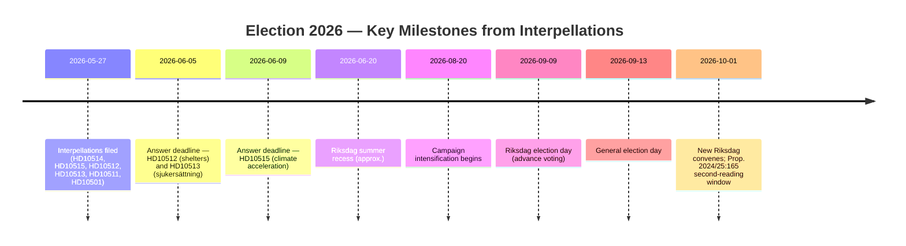

# Election 2026 Analysis — Interpellation Debates 2026-05-27

## Election Context

**Election date**: 13 September 2026
**Days remaining**: 109 (from 2026-05-27)
**Current government**: Tidö coalition (M + SD + KD + L), ~176 seats
**Opposition**: S (~99–100 seats) + MP (~18) + V (~24) + C (~22–24) = ~163–166 Red-Green-Centre potential
**Coalition majority threshold**: 175 of 349 seats
**Election proximity multiplier**: 1.5× (election ≤ 6 months)

---

## Electoral Salience of Interpellation Themes

### Issue 1: Climate Policy (Electoral weight: VERY HIGH)

**Voter segment**: Climate-concerned voters, particularly the 25–50 age bracket in urban and mid-size cities. SCB Medborgarundersökning trend data indicates climate/environment consistently ranks top-3 for this demographic.

**Strategic calculus**:
- S and MP have made climate a joint pre-election attack surface. MP's survival (typically requiring ~4–5% of votes) depends heavily on climate differentiation from S.
- L (represented by Britz in climate interpellations) is the Tidö coalition partner most vulnerable to losing climate-concerned voters to C or MP.
- SD has historically been skeptical of climate targets; M has focused on industry-compatible climate transition; KD has been ambiguous. The multi-party coalition creates structural difficulty in presenting a unified climate policy.

**2026 electoral implication**: If the government fails to table a climate proposition, S and MP will run on "the government abandoned Sweden's climate future." This is a high-amplification election frame.

### Issue 2: Welfare State (Electoral weight: HIGH)

**Voter segment**: Trade union members, healthcare workers, low-income voters, domestic violence survivors and their networks, pensioners with adjacent sjukersättning exposure.

**Strategic calculus**:
- S's core electoral coalition includes trade unions (LO), healthcare workers (Kommunal, Vård och Omsorgsförbundet), and voters whose household experience includes welfare system exposure. The sjukersättning and shelter issues speak directly to this coalition.
- M has attempted to "own" welfare state administration (Waltersson Grönvall as competent manager). If her answers on shelters and sjukersättning are perceived as dismissive, this branding collapses.

**2026 electoral implication**: Welfare accountability is a mobilisation issue for S's core base, not primarily a swing-voter issue. High S mobilisation on welfare themes helps reduce the gap with Tidö.

### Issue 3: Constitutional Accountability (Electoral weight: MEDIUM)

**Voter segment**: Higher-education, constitutionally-aware, democratic-norm concerned voters. Smaller segment but over-represented in opinion formation (journalists, lawyers, academics, civil servants).

**Strategic calculus**:
- Prop. 2024/25:165 is technically complex. Most voters will not engage with it directly. However, the "Orbán comparison" that Widding's framing invites — raising supermajority thresholds to entrench power — can be made vivid in media coverage.
- C (Centre Party), which is outside the Tidö coalition, may campaign on opposing Prop. 2024/25:165 as a pro-democratic position, carving out a distinct constitutional identity.

**2026 electoral implication**: Low direct electoral weight but potential agenda-setting function in elite opinion formation and media framing.

---

## Coalition Mathematics Context

### Current Tidö Coalition (approximate, pending 2026 election)

| Party | Approx. seats 2022 | Current polls (est.) |
|-------|---------------------|---------------------|
| M (Moderaterna) | 68 | 18–20% → ~63–70 |
| SD (Sverigedemokraterna) | 73 | 19–21% → ~66–73 |
| KD (Kristdemokraterna) | 19 | 5–6% → ~17–21 |
| L (Liberalerna) | 16 | 4–5% → ~14–17 |
| **Total Tidö** | **176** | **~160–181** |

### Opposition Potential

| Party | Approx. seats 2022 | Current polls (est.) |
|-------|---------------------|---------------------|
| S (Socialdemokraterna) | 107 | 28–33% → ~99–115 |
| MP (Miljöpartiet) | 18 | 5–6% → ~17–21 |
| V (Vänsterpartiet) | 24 | 6–7% → ~21–25 |
| C (Centerpartiet) | 24 | 5–7% → ~17–25 |
| **Red-Green potential** | **173** | **~154–186** |

*Note*: C is kingmaker. C outside Tidö but has signalled no preference for S-led government; position fluid. [C3]

**Interpellation impact on coalition mathematics**: Zero direct impact on seats. Indirect impact: drives media narrative that could shift 1–3 percentage points in the 30–50 age urban demographic that is most responsive to climate and welfare-state messaging. In a close election (Tidö vs. Red-Green), 1–3% shifts are decisive.

---

## Post-Election Scenarios Linked to These Interpellations

**If Tidö II (probability ~40%)**: All interpellation outcomes unresolved; Prop. 2024/25:165 second reading proceeds. Climate proposition may be tabled in new government programme.

**If S-led government (probability ~35%)**: Climate proposition announced with first 100-day government programme. Prop. 2024/25:165 second reading not called; prop. lapses. Sjukersättning and shelter reform as priority items.

**If hung parliament (probability ~25%)**: Minority government; interpellation themes become coalition negotiation leverage. Prop. 2024/25:165 outcome uncertain.
