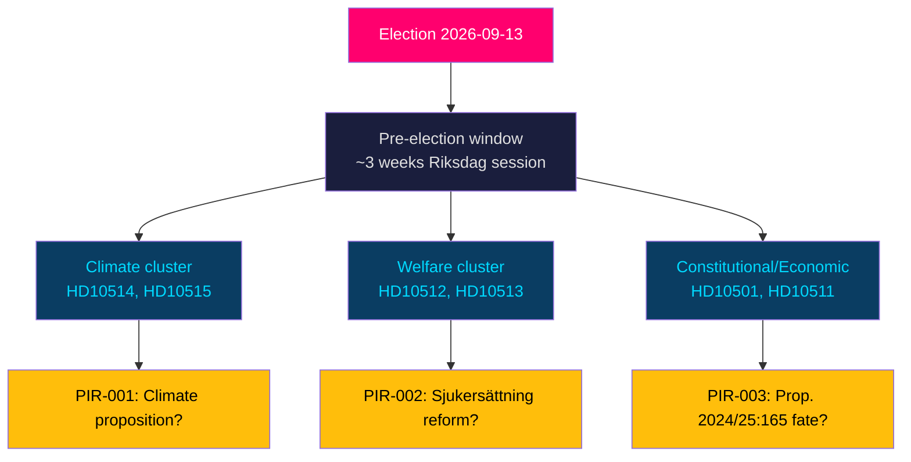

# Synthesis Summary — Interpellation Debates 2026-05-27

## Central Intelligence Assessment

Seven interpellations filed between 21 and 26 May 2026 in the Swedish Riksdag constitute a coordinated opposition pre-election accountability campaign. The Social Democrats (S) filed five interpellations and Miljöpartiet (MP) filed two additional ones (HD10509, HD10510 — the latter included in broader context), with all climate-related interpellations directed at Johan Britz (L) serving as substitute climate and environment minister. The key analytical finding is the simultaneous presence of four distinct crisis narratives: **climate governance vacuum, welfare state retrenchment, constitutional distribution of economic outcomes, and democratic procedural concerns** — all timed to the pre-election parliamentary window.

## Primary Cluster: Climate Policy Paralysis (DIW = 5.4 × 1.5 = 8.1)

**Documents**: HD10515 (Guteland, S), HD10514 (Westlund, S)

The Tidö government faces a structural credibility gap on climate policy entering the final 109 days before the election. The Styrmedelsutredningen — commissioned to propose Sweden's policy instruments for reaching 2030 climate targets — is significantly delayed. Opposition documentation (HD10515): Sweden's greenhouse gas emissions have increased more than in any comparable 15-year period since the late 1990s, and Sweden has lost its leading position within the EU's climate governance framework.

HD10514 surfaces an internal government contradiction: Climate Minister Pourmokhtari has stated opposition to the transport target (one of Sweden's key 2030 sectoral climate goals), but no formal proposition has been tabled to either maintain, revise, or scrap the target. This policy limbo — with a remiss completed in January 2026 — represents a governance failure two months before the election.

**Significance**: The five-interpellation climate cluster in a single week (HD10509+HD10510 from MP, HD10514+HD10515 from S) is an aggregation signal. Substitute minister Britz has no established climate policy mandate; his responses will shape the election narrative on climate.

## Secondary Cluster: Welfare State Erosion (DIW = 4.8 × 1.5 = 7.2)

**Documents**: HD10513 (Rodén, S), HD10512 (Backeskog, S)

Two interpellations document concrete negative outcomes from the government's administrative reform agenda:

- **Sjukersättning** (HD10513): Försäkringskassan systematically denies long-term disability benefit to individuals with documented permanent incapacity. The trend reveals a divergence between the agency's actuarial interpretation of eligibility and the medical-clinical assessment of permanent work incapacity. This affects vulnerable individuals who cycle through sjukpenning (temporary sick pay) indefinitely rather than receiving permanent sjukersättning.

- **Women's shelters** (HD10512): Approximately 40 women's shelters across Sweden have closed or suspended operations due to complex new licensing requirements introduced under the Tidö government. Socialtjänstminister Waltersson Grönvall's response is due 2026-06-05. The closure of shelter capacity during a period of rising domestic violence concerns creates an acute accountability nexus.

## Tertiary Cluster: Constitutional and Economic Accountability

**Documents**: HD10511 (Karlsson, S), HD10501 (Widding, -)

HD10511 deploys a constitutional framing — RF 1:2§ — against the government's tax reduction priorities, arguing these create economic inequality inconsistent with the constitutional duty to ensure individual economic welfare. This is a politically sophisticated argument that links tax policy to constitutional obligation.

HD10501 (Elsa Widding, independent) raises a substantive democratic concern about Prop. 2024/25:165: a pending constitutional amendment that would require 2/3 supermajority for all future constitutional changes. Widding argues this enables minority veto and weakens democratic responsiveness. The Prop. is currently a "vilande grundlagsbeslut" — it will need a second vote after the September 2026 election to enter into force, making this election outcome-determinative.

## Coalition Mathematics Context

The Tidö government (M+SD+KD+L) holds approximately 176 seats (Riksdag: 349 total). S holds ~99–100 seats. MP holds ~18 seats. The combined S+MP interpellation cluster does not directly threaten the coalition majority but sets the electoral agenda.

For Prop. 2024/25:165 to pass its second reading, the incoming post-election Riksdag majority must be willing to vote it through. The 2/3 requirement (233 of 349 members) is a high bar that the current coalition cannot reach alone — they need either S participation or a different majority composition.

## Strategic Assessment

The interpellations reveal that S is pursuing a **welfare-state restoration narrative** and a **climate accountability narrative** as its primary electoral themes. The timing — with ~3 weeks of parliamentary session remaining before recess — maximises media attention while minimising the government's legislative response window.

The government's most vulnerable position is on climate: the Styrmedelsutredningen delay is factual, measurable, and cannot be resolved by ministerial communication alone. Every day that passes without a climate proposition strengthens the opposition's accountability narrative.

**Author**: James Pether Sörling | **Date**: 2026-05-27
