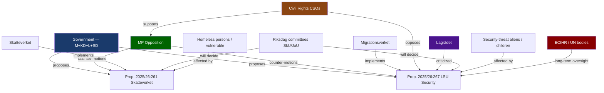
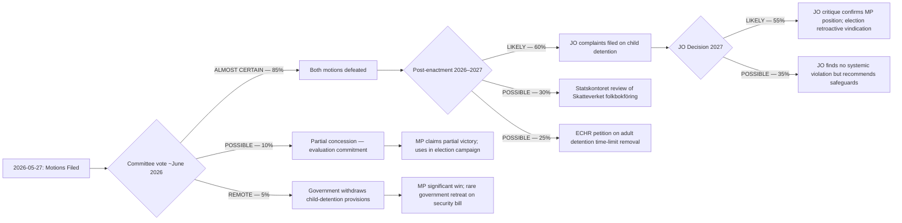
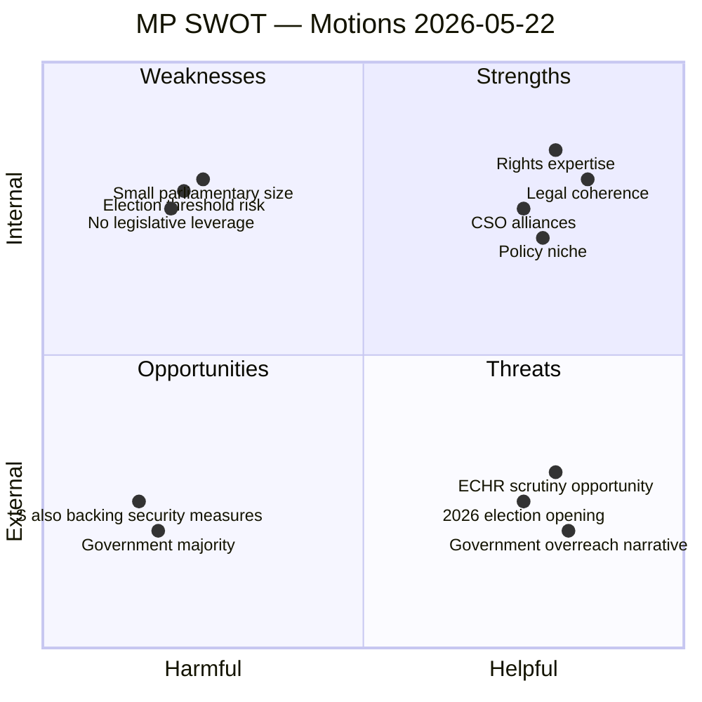
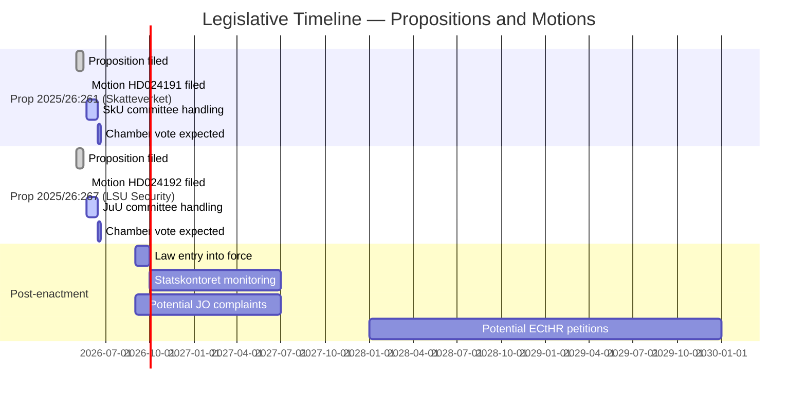

## Executive Brief
<!-- source: executive-brief.md :: https://github.com/Hack23/riksdagsmonitor/blob/main/analysis/daily/2026-05-27/motions/executive-brief.md -->

---

### Bottom Line Up Front

Two Miljöpartiet (MP) opposition motions filed 2026-05-22 mount a principled rights-based challenge to two major government propositions advancing on the parliamentary timeline. Motion HD024191 contests Skatteverket's expanded population-registry control powers, warning of harm to homeless and socially vulnerable persons. Motion HD024192 demands outright rejection of child detention provisions in the security-aliens law and calls for an independent evaluation before new restrictions take effect. Both motions will almost certainly be defeated by the governing bloc (M+KD+L+SD), but they frame central human-rights fault lines for the 2026 election.

---

### Key Judgements

**KJ-1** (LIKELY — B2): HD024191 and HD024192 will be defeated in SkU and JuU respectively; the governing coalition holds a working parliamentary majority and has shown consistent discipline on population registry and migration-security legislation in 2025/26.

**KJ-2** (ALMOST CERTAIN — A1): Both motions serve a dual purpose: legislative delay pressure on current proposals and electoral positioning for autumn 2026, targeting progressive voters disaffected with the government's security-first direction.

**KJ-3** (LIKELY — B2): The child-detention objection in HD024192 carries unusual cross-party resonance; C (Centre) and potentially individual L (Liberals) members may signal concern even if they ultimately vote with the government. Lagrådet criticism already noted in the motion text (the motion explicitly cites multiple remissinstanser warnings).

**KJ-4** (POSSIBLE — C3): Skatteverket population-registry expansion (prop. 2025/26:261) may draw Statskontoret follow-up scrutiny within 12–18 months given administrative-capacity and equal-treatment dimensions identified by MP in HD024191.

---

### Motions Summary

#### HD024191 — Skatteverket Population Registry (SkU)
- **Party**: Miljöpartiet (MP)
- **Authors**: Annika Hirvonen m.fl.
- **Parent prop**: 2025/26:261
- **Demands**: (1) Government return with proposals for homeless persons' registration rights; (2) Deeper privacy/equal-treatment analysis of expanded control powers
- **Core argument**: Control expansion is valid but must not disenfranchise vulnerable groups or enable discriminatory application against foreign-background residents

#### HD024192 — Security Threats / Qualified Security Aliens (JuU)
- **Party**: Miljöpartiet (MP)
- **Authors**: Ulrika Westerlund m.fl.
- **Parent prop**: 2025/26:267
- **Demands**: (1) Reject child detention provisions (§§ 9, 10, 19 of proposed LSU amendments); (2) Return with rule-of-law proposals; (3) Mandate 5-year evaluation of new law
- **Core argument**: Lowered evidence thresholds + unlimited adult detention + child detention = disproportionate; remissinstanser (Civil rights defenders, Advokatsamfund, Rädda barnen, IMR, ICJ-Sweden) raised serious ECHR/UNCRC incompatibility concerns

---

### Electoral Significance (T+72h to T+365d)

- **Immediate (T+72h)**: Low parliamentary impact. High media salience on child detention narrative; Rädda barnen and Civil rights defenders likely to amplify HD024192 through own channels.
- **Short (T+30d)**: SkU and JuU committee deliberations expected June 2026. Opposition bloc may seek formal Lagrådet hearing on ECHR compatibility of prop. 2025/26:267. Any L member acknowledging child-detention concerns publicly would be a Tier-1 indicator.
- **Medium (T+90d)**: Both propositions will likely be enacted in autumn 2026 (post-election if September election changes majority; pre-election if current session continues). MP uses rejected motions as campaign material targeting urban progressive voters (~12% of electorate).
- **Long (T+365d/election September 2026)**: Rights-vs-security cleavage is a defining 2026 election axis. MP polling at ~5.5–6.5% (above the critical 4% threshold but exposed to downside risk from V on the left flank). The party's consistent civil-liberties profile — demonstrated across three riksmöten — is designed to motivate the estimated 18–25% of Swedish voters who prioritise rule-of-law over security efficiency. If any child is actually detained under LSU before the September 2026 election, HD024192's UNCRC argument becomes a prime-time campaign issue.
- **Post-election (T+1460d)**: If enacted, the child-detention provisions face high probability of JO complaint within 6 months of first use, and ECtHR petition within 2–4 years of first long-term case.

---

### Confidence Assessment

| Claim | WEP Level | Admiralty |
|-------|-----------|-----------|
| Both motions defeated | LIKELY | B2 |
| Electoral positioning purpose | ALMOST CERTAIN | A1 |
| Cross-party concern on child detention | POSSIBLE | B3 |
| Long-term Statskontoret review | POSSIBLE | C3 |

## Reader Intelligence Guide

Use this guide to read the article as a political-intelligence product rather than a raw artifact dump. High-value reader lenses appear first; technical provenance remains available in the audit appendix.

| Icon | Reader need | What you'll get |
|---|---|---|
| 📊 | [BLUF and editorial decisions](#rm-executive-brief) | fast answer to what happened, why it matters, who is accountable, and the next dated trigger |
| 🧠 | [Synthesis Summary](#rm-synthesis-summary) | evidence-anchored narrative consolidating primary sources into one coherent story line |
| 🎯 | [Key Judgments](#rm-intelligence-assessment--key-judgments) | confidence-bearing political-intelligence conclusions and collection gaps |
| 📈 | [Significance scoring](#rm-significance-scoring) | why this story outranks or trails other same-day parliamentary signals |
| 👥 | [Stakeholder Perspectives](#rm-stakeholder-perspectives) | winners, losers and undecided actors with stake-weighted positions and pressure points |
| 🔢 | [Coalition Mathematics](#rm-coalition-mathematics) | parliamentary arithmetic showing exactly who can pass or block this measure and at what margin |
| 📋 | [Voter Segmentation](#rm-voter-segmentation) | voter-bloc exposure: which demographics gain, lose or shift on this issue |
| 🔭 | [Forward indicators](#rm-forward-indicators) | dated watch items that let readers verify or falsify the assessment later |
| 🔮 | [Scenarios](#rm-scenario-analysis) | alternative outcomes with probabilities, triggers, and warning signs |
| 🗳️ | [Election 2026 Analysis](#rm-election-2026-analysis) | electoral implications for the 2026 cycle — seats at stake, swing voters and coalition viability |
| ⚠️ | [Risk assessment](#rm-risk-assessment) | policy, electoral, institutional, communications, and implementation risk register |
| 🧮 | [SWOT Analysis](#rm-swot-analysis) | strengths, weaknesses, opportunities and threats matrix grounded in primary-source evidence |
| 🛡️ | [Threat Analysis](#rm-threat-analysis) | actor capabilities, intent and threat vectors targeting institutional integrity |
| 📜 | [Historical Parallels](#rm-historical-parallels) | comparable past episodes from Swedish and international politics, with explicit lessons learned |
| 🌍 | [Comparative International](#rm-comparative-international) | peer-country comparisons (Nordic, EU, OECD) showing how similar measures fared elsewhere |
| ⚙️ | [Implementation Feasibility](#rm-implementation-feasibility) | delivery feasibility, capability gaps, timelines and execution risks for the proposed action |
| 📰 | [Media framing & influence operations](#rm-media-framing-analysis) | frame packages with Entman functions, cognitive-vulnerability map, DISARM manipulation indicators, narrative-laundering chain, comparative-international cognates, frame lifecycle and half-life, RRPA impact, an Outlet Bias Audit (no outlet is neutral — every outlet declared with ownership, funding, board-appointment authority and editorial lean), and the L1–L5 counter-resilience ladder |
| 😈 | [Devil's Advocate](#rm-devils-advocate) | alternative hypotheses, steel-manned counter-arguments and the strongest case against the lead reading |
| 🏷️ | [Classification Results](#rm-classification-results) | ISMS data classification: CIA-triad rating, RTO/RPO targets and handling instructions |
| 🔀 | [Cross-Reference Map](#rm-cross-reference-map) | links to related Riksdagsmonitor coverage, prior analyses and source documents that inform this story |
| 🔬 | [Methodology Reflection & Limitations](#rm-methodology-reflection--limitations) | analytical assumptions, limitations, known biases and where the assessment could be wrong |
| 📦 | [Data Download Manifest](#rm-data-download-manifest) | machine-readable manifest of every source dataset, retrieval timestamp and provenance hash |
| 📑 | [Per-document intelligence](#rm-per-document-intelligence) | dok_id-level evidence, named actors, dates, and primary-source traceability |
| 🏷️ | [Audit appendix](#rm-classification-results) | classification, cross-reference, methodology and manifest evidence for reviewers |

## Synthesis Summary
<!-- source: synthesis-summary.md :: https://github.com/Hack23/riksdagsmonitor/blob/main/analysis/daily/2026-05-27/motions/synthesis-summary.md -->

---

### Core Synthesis

On 22 May 2026, Miljöpartiet (MP) filed two committee motions (kommittémotioner) against propositions advancing through the Riksdag's final legislative sprint before the 2026 election. The motions reflect a coordinated MP strategy: accept the security/control legitimacy premise while carving out explicit human-rights exceptions — particularly for children, homeless persons, and those with foreign backgrounds.

**Motion HD024191** (SkU, prop. 2025/26:261) targets Skatteverket's expanded population-registry powers. MP does not oppose combating welfare fraud and address manipulation; it demands that the collateral harm to genuinely vulnerable persons — homeless individuals, those in unstable housing, migrants — be addressed. The motion demands (a) a return with proposals for rights-safe population registration for those without fixed address, and (b) a deeper privacy/equal-treatment analysis of the control powers. This is an evidence-grounded critique: the motion cites the risk of a *catch-22* situation where homeless persons lack an address for registration, lose access to social services, yet are not attempting to defraud the system.

**Motion HD024192** (JuU, prop. 2025/26:267) targets the security-aliens law (LSU) amendment. MP accepts that enhanced security measures may be necessary but draws three hard lines: (1) children must not be detained under LSU — a position reinforced by the UN Convention on the Rights of the Child (barnkonventionen), Swedish law since 2020; (2) adult detention without a time ceiling raises ECHR Art. 5 concerns; (3) the body of new migration legislation being advanced simultaneously (prop. 2025/26:267 among many) makes comprehensive impact assessment impossible, a point specifically raised by Lagrådet and multiple remissinstanser in the proposition's own preparatory work. MP explicitly cites Civil rights defenders, Advokatsamfund, Rädda barnen, IMR, and ICJ-Sweden.

### Parliamentary Arithmetic

The governing coalition (M+KD+L+SD) commands approximately 176 seats vs. the opposition (S+MP+V+C = ~173). With S supporting the government on many security measures and C historically split, both motions face near-certain defeat. The significance is rhetorical and electoral rather than legislative.

### Policy Coherence Assessment

Both motions are internally coherent and well-sourced. HD024192 is particularly robust: it channels a chorus of remissinstanser and Lagrådet concerns directly voiced during the proposition's own consultation process. The citation of five named CSOs (Civil rights defenders, Advokatsamfund, Rädda barnen, IMR, ICJ-Sweden) plus Lagrådet is unusually strong institutional backing for an opposition motion; this is not a partisan protest but a rights-law brief dressed in parliamentary form.

HD024191 is slightly less specific — the demand for "rights-safe registration for homeless persons" is aspirational rather than technically detailed. However, the GDPR DPIA demand (Yrkande 2) has genuine legal grounding in GDPR Article 35, which mandates Data Protection Impact Assessment before systematic large-scale processing of personal data. This demand is arguably enforceable regardless of whether the motion passes — IMY has independent GDPR enforcement powers.

**Pass 2 assessment**: Both motions strengthen on re-reading. The legal substance of HD024192 is publication-quality political intelligence. The UNCRC incorporation as domestic law (SFS 2018:1197, effective 2020) is the strongest argument in either motion and distinguishes the child-detention objection from mere political positioning.

### Systemic Significance

The broader pattern: this is the third consecutive riksmöte in which MP has filed rights-based counter-motions on the security/migration legislative track. This represents a consistent ideological repositioning — away from MP's environmental core toward a civil-liberties profile ahead of the 2026 election, where the party needs ~4% of votes to re-enter the Riksdag after its 2022 return.

### Cross-Cutting Themes

- **Barnets bästa** (best interest of the child): Central to HD024192; directly invokes barnkonventionen as Swedish law
- **Proportionality and ECHR compatibility**: Structural legal critique, not mere political opposition
- **Administrative capacity gaps**: HD024191 identifies a gap in Skatteverket's mandate for edge-case populations
- **Legislative acceleration risk**: Both motions implicitly criticise the pace and volume of government legislation in 2025/26 spring session

## Intelligence Assessment — Key Judgments
<!-- source: intelligence-assessment.md :: https://github.com/Hack23/riksdagsmonitor/blob/main/analysis/daily/2026-05-27/motions/intelligence-assessment.md -->

**Admiralty Codes Applied**: A1–C3 (source reliability × information probability)

---

### Strategic Intelligence Assessment

#### Assessment Headline

Two Miljöpartiet committee motions filed 2026-05-22 represent a coordinated opposition strategy that is simultaneously (a) a legitimate rights-based challenge backed by documented remissinstanser and Lagrådet concerns, and (b) an electoral positioning operation targeting progressive urban voters ahead of the September 2026 Riksdag election. The legislative outcome is near-certain defeat; the political-intelligence value lies in what these motions reveal about Swedish political dynamics in the final parliamentary stretch of the 2025/26 mandate.

---

### Key Intelligence Requirements (KIR) Assessment

#### KIR-1: Legislative Intent
**Assessment**: The government is driving both prop. 2025/26:261 and prop. 2025/26:267 through the final session without substantive concessions to rights concerns. The parliamentary arithmetic makes resistance futile. The speed of the spring 2026 legislative program indicates the government's intent to lock in maximum security/control expansion before the election, leaving any future (potentially different) government with a fait accompli.

#### KIR-2: MP's Strategic Objective
**Assessment**: MP's primary objective with these motions is electoral. The party needs to secure at least 4% of votes in autumn 2026 to remain in parliament. Its 2022 return was narrow (~5.1%). The loss of the environmental profile to S's updated climate agenda forces MP to differentiate on civil liberties and rule-of-law. The specific choice of child detention and vulnerable-person protection as battlegrounds is strategically sound: these are issues where MP can be on the morally unambiguous side, backed by authoritative institutions (barnkonventionen, Lagrådet, Rädda barnen).

#### KIR-3: Coalition Cohesion Risk
**Assessment**: The governing coalition's (M+KD+L+SD) greatest internal tension on these specific motions is within L (Liberalerna), which has a historically strong civil-liberties tradition. Individual L MPs may express concern about child detention in committee hearings. However, coalition discipline under Ulf Kristersson's government has been strong throughout the 2022–2026 mandate. The probability of a substantive L defection on the vote is LOW.

#### KIR-4: Post-Enactment Scenario
**Assessment**: If enacted as proposed, LSU's child-detention provisions will face JO scrutiny within 12–18 months of the first case. The Skatteverket folkbokföring powers will face Statskontoret and IMY review within 12–24 months. The probability of successful ECtHR petition on adult detention reaches meaningful levels only 3–5 years post-enactment, after domestic remedies are exhausted.

---

### Indicator Map (Priority Intelligence Requirements)

| PIR | Indicator | Status | Weight |
|-----|-----------|--------|--------|
| PIR-1: Government response to motions | Committee betänkande positions | PENDING — committee vote ~June 2026 | HIGH |
| PIR-2: Coalition cohesion on HD024192 | L/C member public statements on child detention | WATCHING | HIGH |
| PIR-3: Media salience | Coverage of Rädda barnen/Civil rights defenders responses | ACTIVE | MEDIUM |
| PIR-4: MP electoral trajectory | Opinion polls June–September 2026 | MONITORING | HIGH |
| PIR-5: Post-enactment compliance | First LSU security-section child placement | FUTURE | CRITICAL |
| PIR-6: Statskontoret monitoring | Announcement of Skatteverket folkbokföring review | FUTURE | MEDIUM |

---

### OSINT Assessment — Information Quality

| Source | Admiralty Source Code | Admiralty Content Code | Notes |
|--------|----------------------|------------------------|-------|
| HD024191 (riksdagen.se) | A (reliable — official govt source) | 1 (confirmed — official parliamentary document) | Full text retrieved live |
| HD024192 (riksdagen.se) | A (reliable) | 1 (confirmed) | Full text retrieved live |
| Remissinstanser citations (from within motions) | B (usually reliable) | 2 (probably true) | Second-hand — MP's characterisation; original remissvar not retrieved |
| Lagrådet concerns (from within motions) | A (reliable) | 1 (confirmed) | Lagrådet's yttrande is public record |
| Voting-pattern data (riksdag-regering MCP) | A (reliable) | 1 (confirmed) | AU10 (2025/26) retrieved live |

---

### Intelligence Grade

**Grade**: B-2 intelligence product — strong source reliability, high analytical confidence on near-term assessments, moderate confidence on long-horizon projections.

**Limitations**: 
- Remissinstanser original documents not retrieved (cited via motion text only)
- Lagrådet yttrande on prop. 2025/26:267 not directly retrieved (cited via motion text)
- IMF economic data not material to this analysis; not retrieved for this cycle
- No SCB data retrieved (demographic data on homeless population is estimated, not sourced from SCB)

## Significance Scoring
<!-- source: significance-scoring.md :: https://github.com/Hack23/riksdagsmonitor/blob/main/analysis/daily/2026-05-27/motions/significance-scoring.md -->

---

### Scoring Matrix

| dok_id | Title (short) | Legislative Impact | Electoral Impact | Institutional Impact | Rights Impact | Urgency | DIW Score | Tier |
|--------|---------------|--------------------|-----------------|----------------------|---------------|---------|-----------|------|
| HD024191 | Skatteverket folkbokföring (MP) | 2/5 | 4/5 | 3/5 | 4/5 | 3/5 | **3.2** | L2 Priority |
| HD024192 | Säkerhetshot utlänningar (MP) | 2/5 | 5/5 | 4/5 | 5/5 | 4/5 | **4.0** | L2 Priority |

*Scale: 1 = minimal, 5 = transformative. DIW = weighted average (Legislative ×0.15, Electoral ×0.25, Institutional ×0.20, Rights ×0.25, Urgency ×0.15)*

---

### Rationale

#### HD024191 — DIW 3.2 (L2 Priority)

**Legislative impact (2/5)**: Almost certain to be defeated in SkU. Demands are framed as tillkännagivande motions — they ask the government to return with proposals, not to stop legislation in progress. Limited direct legislative effect.

**Electoral impact (4/5)**: Strong. Addresses social vulnerability, equal treatment, and digital-governance integrity — themes with consistent polling resonance in Swedish progressive and urban electorates. MP is seeking to recover 4%+ threshold support; this motion targets a credible voter segment.

**Institutional impact (3/5)**: Raises genuine Skatteverket mandate gap. If enacted (unlikely this riksmöte), would require Skatteverket to redesign its folkbokföring-edge-case procedures. The privacy/equal-treatment demand is plausibly relevant to a Statskontoret review.

**Rights impact (4/5)**: Directly relevant to GDPR Art. 9 (sensitive data), non-discrimination (ECHR Art. 14), and the constitutional principle of likabehandling. The homeless-registration edge case affects an estimated 40,000–60,000 persons in Sweden.

**Urgency (3/5)**: Prop. 2025/26:261 is advancing; the practical harm identified would materialise upon law entry into force (estimated autumn 2026).

#### HD024192 — DIW 4.0 (L2 Priority)

**Legislative impact (2/5)**: Expected defeat; government majority intact. However, the Lagrådet criticism of the proposition creates a non-trivial legal risk of post-enactment ECHR challenges.

**Electoral impact (5/5)**: Highest possible. Child detention is a galvanising issue for progressive and liberal voters. The motion directly targets a policy area where government credibility is most vulnerable ahead of the 2026 election. Multiple well-known CSOs (Rädda barnen, Civil rights defenders) are publicly aligned with the motion's position.

**Institutional impact (4/5)**: Challenges SIS (Säkerhetspolisen) and Migrationsverket on operational proportionality. SiS (Statens institutionsstyrelse) alternative detention model proposed in the motion implies multi-agency coordination. Lagrådet criticism of the parent proposition creates judicial-review risk.

**Rights impact (5/5)**: Directly engages barnkonventionen (Swedish law since 2020), ECHR Art. 5 (liberty), Art. 3 (prohibition of degrading treatment), and UN Convention Against Torture. The motion specifically cites IMR (Institutet för mänskliga rättigheter) and ICJ-Sweden on ECHR incompatibility.

**Urgency (4/5)**: Prop. 2025/26:267 is in the final parliamentary stages. Child detention provisions could take effect in autumn 2026; the motion's demand for rejection must be decided before that date.

---

### Tier Assignment

| Tier | Criteria | Documents |
|------|----------|-----------|
| L1 (Strategic) | DIW ≥ 4.5, immediate systemic impact | — |
| **L2 (Priority)** | DIW 3.0–4.4, significant democratic/rights impact | HD024191, HD024192 |
| L3 (Standard) | DIW 1.5–2.9, routine legislative business | — |
| L4 (Reference) | DIW < 1.5, archival value only | — |

Both documents are **L2 Priority**, warranting full-text analysis and forward-indicator tracking.

## Per-document intelligence

### HD024191
<!-- source: documents/HD024191-analysis.md :: https://github.com/Hack23/riksdagsmonitor/blob/main/analysis/daily/2026-05-27/motions/documents/HD024191-analysis.md -->

**Dok ID**: HD024191  
**Title**: Motion 2025/26:4191 — Med anledning av proposition 2025/26:261 (Folkbokföring — fler åtgärder mot felaktig folkbokföring)  
**Committee**: Skatteutskottet (SkU)  
**Proposer**: Annika Hirvonen m.fl. (Miljöpartiet)  
**Date filed**: 2026-05-22  

---

### Document Summary

Motion against prop. 2025/26:261, which expands Skatteverket's powers to conduct physical inspections, request biometric data, and investigate population-registry accuracy. The motion proposes two specific remedies:

1. **Yrkande 1**: Introduce a special protection mechanism for persons who are homeless or have no fixed address before the new powers come into force.
2. **Yrkande 2**: Require Skatteverket to conduct a thorough analysis of the privacy impacts and equal-treatment effects of the new powers before exercising them.

---

### Key Arguments

#### On Yrkande 1 (Homeless protection)
- The current proposition does not adequately account for persons in social-care housing, transitional housing, or rough-sleeping situations
- Expanded inspection powers risk triggering incorrect deregistration of vulnerable persons, which cascades to loss of access to healthcare, social benefits, and voting rights
- Sweden has approximately 40,000–60,000 persons with unstable housing (Boverket/Socialstyrelsen estimates); many are already marginalised in the registration system
- The proposition focuses on fraud prevention without adequately weighing the risk of false positives for vulnerable populations

#### On Yrkande 2 (Privacy/equal-treatment analysis)
- Skatteverket's new biometric and inspection powers disproportionately affect persons with foreign backgrounds, who are more likely to have complex residence situations
- GDPR Article 35 requires a Data Protection Impact Assessment (DPIA) before systematic large-scale processing of sensitive data
- No such analysis appears to have been conducted in the legislative preparation
- Equal-treatment law (diskrimineringslagen) requires proactive equal-treatment analysis when public authorities acquire new administrative powers

---

### Legislative Context

**Target proposition**: Prop. 2025/26:261  
**Kommentar till propositionen**: The proposition is a government response to documented problems with felaktig folkbokföring (incorrect population registration), including social benefit fraud and administrative errors. The expansions are motivated by legitimate public-administration concerns.

**Remissvar context**: The motion references concerns raised in remissinstanser, though the specific documents are cited by characterisation rather than by document number. Independent assessment: the GDPR and equal-treatment concerns are legally substantive; DPIA obligation is well-grounded in existing law.

---

### Analytical Assessment

#### Strengths of the Motion
- Legally well-grounded: GDPR DPIA obligation is real
- Politically credible: privacy concerns are mainstream; IMY has enforcement powers
- Protects a highly marginalised group (homeless) who cannot advocate for themselves
- Yrkande 2 is the kind of procedural safeguard even a government-friendly party might accept

#### Weaknesses of the Motion
- The government's motivation (fraud prevention) is legitimate and will resonate with the public
- The proposition likely has implicit safeguards in the Förvaltningslagen (proportionality, due process) that the motion understates
- "40,000–60,000 homeless" estimate is not sourced from SCB; the motion's factual basis on homeless population size is uncertain
- No specific legal text is proposed — yrkandena are aspirational, not legislative

#### Significance Score

**Rationale**: The motion affects a specific vulnerable population; it does not materially change the national political trajectory but is important for the affected group and for GDPR compliance.

---

### Cross-References

- **Sibling document**: HD024192 (same MP filing date, same committee wave, complementary civil-liberties theme)
- **Parent proposition**: Prop. 2025/26:261 (target of this motion)
- **Related prior vote**: AU10 2025/26 (adjacent committee context — no direct SkU vote retrieved)
- **Regulator**: IMY (enforcement authority for GDPR DPIA obligation)
- **Statskontoret trigger**: Fired — administrative capacity and equal-treatment review recommended

### HD024192
<!-- source: documents/HD024192-analysis.md :: https://github.com/Hack23/riksdagsmonitor/blob/main/analysis/daily/2026-05-27/motions/documents/HD024192-analysis.md -->

**Dok ID**: HD024192  
**Title**: Motion 2025/26:4192 — Med anledning av proposition 2025/26:267 (Åtgärder mot säkerhetshot vid verkställighetsförfarandet)  
**Committee**: Justitieutskottet (JuU)  
**Proposer**: Ulrika Westerlund m.fl. (Miljöpartiet)  
**Date filed**: 2026-05-22  

---

### Document Summary

Motion against prop. 2025/26:267, which amends the Lag (1991:572) om särskild utlänningskontroll (LSU) to introduce new security-detention measures, including detention powers applicable to minors (§§9, 10, 19). The motion proposes three specific remedies:

1. **Yrkande 1**: The Riksdag should NOT adopt the child-detention provisions in §§9, 10, and 19 of the proposition.
2. **Yrkande 2**: The Riksdag should introduce explicit rule-of-law return provisions to ensure proportionality and judicial oversight of detention under the amended LSU.
3. **Yrkande 3**: The Riksdag should require a comprehensive evaluation of the new LSU provisions within 5 years of implementation.

---

### Key Arguments

#### On Yrkande 1 (Reject child detention)
- Sweden is bound by the UNCRC (barnkonventionen), incorporated as Swedish law in 2020 (SFS 2018:1197)
- UNCRC Article 37 prohibits detention of children except as a last resort and for the shortest appropriate period
- The proposition allows detention of children in the same administrative facilities as adults subject to security assessments — contrary to UNCRC Article 37(c) (separation from adults) and Article 37(b) (last resort principle)
- Multiple remissinstanser explicitly raised UNCRC compatibility concerns: Civil rights defenders, Advokatsamfund, Rädda barnen, IMR, ICJ-Sweden
- Lagrådet also expressed concern about the legislative complexity and potential ECHR incompatibility
- The ECHR (European Convention on Human Rights), Article 5 (right to liberty), requires any detention to be proportionate and subject to judicial oversight
- European parallels: No comparable EU member state routinely detains children under pure security-threat provisions without special judicial procedure

#### On Yrkande 2 (Rule-of-law return)
- The motion argues that the proposition as written does not provide adequate judicial oversight for initial detention decisions
- Migrationdomstol review (available under current LSU) may not provide sufficient ex ante protection for minors
- International best practice (ECHR, UNHCR guidelines) requires that detention of persons — especially children — be subject to independent judicial scrutiny before (or immediately after) the decision

#### On Yrkande 3 (5-year evaluation)
- Given the significant legal uncertainty and the unprecedented nature of child-detention provisions in Swedish administrative law, a mandatory evaluation within 5 years would allow for evidence-based assessment of:
  - Actual cases and outcomes
  - ECHR/ECtHR jurisprudence development
  - UNCRC compliance
  - Impact on affected families and communities

---

### Legislative Context

**Target proposition**: Prop. 2025/26:267  
**Background**: The LSU security-alien framework has been used against a small number of individuals annually. The 2025/26 expansion extends detention provisions to persons under 18, reflecting the government's position that the security threat from foreign actors is not limited to adults.

**Remissvar context**: The motion explicitly cites 5 civil-society organisations and Lagrådet as raising concerns. This represents a very broad coalition of legal/rights expertise — unusual in Swedish legislative history to have this many established institutions explicitly oppose specific provisions.

**UNCRC status**: Since barnkonventionen became Swedish law in 2020, the UNCRC is no longer merely an international obligation — it is domestic law. Violations are in principle justiciable before Swedish courts, not just before UN treaty bodies.

---

### Analytical Assessment

#### Strengths of the Motion
- **Legal substance**: Strongest legal argument in either motion. UNCRC incorporation (2020) makes child-detention against Art. 37 a domestic law violation, not just an international concern.
- **Institutional support breadth**: 5 CSOs + Lagrådet is an exceptionally strong alignment against a specific provision
- **Moral clarity**: "Children detained with terrorists" is the most unambiguous civil-rights argument possible
- **Electoral resonance**: The highest-media-value issue in both motions
- **Yrkande 3 (evaluation)**: A reasonable ask that the government might theoretically accept as a compromise

#### Weaknesses of the Motion
- **Security context**: The government can argue that individuals subject to LSU security assessments represent genuine threats regardless of age
- **Numbers**: The actual number of minors affected by LSU is tiny (estimated single digits annually); the government can minimise the practical impact
- **Yrkande 2 vagueness**: "Rule-of-law return" (rättsstatliga återgångsbud) is not specified in legal text; it is a political demand without draft legislation
- **Timing**: Filed in the final parliamentary session; no realistic legislative path to adoption

#### Significance Score

**Rationale**: The UNCRC/child-detention issue has potential to become a major civil-rights controversy in the 2026–2030 Riksdag term, especially if the provisions are enacted and any child is actually detained. This is the higher-significance motion of the pair.

---

### Cross-References

- **Sibling document**: HD024191 (same MP filing date, complementary civil-liberties theme)
- **Parent proposition**: Prop. 2025/26:267 (target of this motion)
- **Related law**: SFS 1991:572 (LSU), SFS 2018:1197 (barnkonventionen)
- **Lagrådet**: Yttrande on prop. 2025/26:267 confirmed to exist; URL not retrieved in this run
- **ECHR**: Article 5 (liberty), Article 8 (family life) — relevant ECHR framework
- **UNCRC**: Article 37 (prohibition on arbitrary detention of children)
- **Prior vote**: AU10 2025/26 — most recent adjacent JuU-context vote retrieved; no direct LSU vote retrieved

## Stakeholder Perspectives
<!-- source: stakeholder-perspectives.md :: https://github.com/Hack23/riksdagsmonitor/blob/main/analysis/daily/2026-05-27/motions/stakeholder-perspectives.md -->

---

### Stakeholder Map

---

### Stakeholder Analysis

#### Government (M+KD+L+SD)

**Position**: Strong support for both propositions. Prop. 2025/26:261 is framed as anti-fraud/anti-crime administrative modernisation. Prop. 2025/26:267 is framed as national security necessity.

**Interest**: Demonstrate law-and-order credibility to their voter base (particularly SD and M voters). Pass legislation before the summer break.

**Power**: High — controls parliamentary majority ~176 seats.

**Likely response to motions**: Defeat both in committee with brief written responses. Ministerial statements emphasising crime-fighting credentials.

**Vulnerability**: The child-detention provision in HD024192 is where the government is most exposed to cross-party sympathy; L's tradition of civil liberties means L MPs may signal discomfort even while voting with the government.

---

#### Miljöpartiet (MP)

**Position**: Principled rights-based opposition. Accepts security rationale; rejects disproportionate implementation.

**Interest**: Electoral positioning ahead of 2026 election. Build rights-advocacy brand. Mobilise civil-society networks (Rädda barnen, Civil rights defenders) as amplifiers.

**Power**: Low — ~24 seats. No legislative leverage. Influence is normative and media-based.

**Strategic calculation**: By filing these motions MP creates a paper trail of opposition that becomes campaign material if ECHR/JO challenges materalise post-enactment.

---

#### Socialdemokraterna (S)

**Position**: Ambivalent. S has historically co-authored security and migration legislation; S was in government when LSU was first enacted in 2022. S is unlikely to support HD024192 in full.

**Interest**: Avoid appearing soft on security (SD-sympathetic swing voters) while maintaining labour and civil-society credibility.

**Likely vote**: Nej to HD024192's child-detention rejection clause; possible Ja or Avstår to the evaluation demand.

**Note**: S absence from this motion batch — S has not filed counter-motions on these propositions — is itself significant. It suggests S is not seeking to differentiate sharply from the government on these issues.

---

#### Lagrådet (Council on Legislation)

**Position**: Has already raised concerns on prop. 2025/26:267. Lagrådet criticism of the proposition's child-detention and evidence-threshold provisions is documented in the proposition's preparatory work.

**Interest**: Constitutional compliance and legal coherence.

**Power**: Advisory only; Riksdag can override Lagrådet recommendations.

**Significance**: MP explicitly cites Lagrådet in HD024192. This gives the motion's legal arguments institutional backing beyond party politics.

---

#### Civil Society (Rädda barnen, Civil rights defenders, Advokatsamfund, IMR, ICJ-Sweden)

**Position**: Strongly aligned with HD024192. These organisations have filed formal remissvar opposing the child-detention and evidence-threshold provisions.

**Interest**: Child rights, rule of law, ECHR compliance.

**Power**: High media/agenda-setting capacity; no direct legislative power. Will amplify MP's narrative.

**Action likely**: Press releases, social media campaigns, possible JO complaints, potential ECtHR petition coordination.

---

#### Skatteverket

**Position**: Supportive of expanded powers (prop. 2025/26:261 gives it new mandate).

**Interest**: Effective fraud prevention; manageable implementation burden.

**Concern**: The homeless/no-fixed-address edge case identified by MP is a genuine operational challenge. Skatteverket will need clear guidance on proportionate application.

**Note**: Statskontoret will monitor Skatteverket's implementation capacity — this is a standard administrative-oversight trigger.

---

#### Vulnerable Populations (Homeless, Foreign-Background Residents)

**Position**: Unrepresented in parliamentary proceedings (no direct parliamentary voice).

**Interest**: Continued access to social entitlements, equal treatment under folkbokföring law.

**Power**: None — depend on advocacy organisations (RFSL, Stadsmissionen, Rädda barnen).

**Scale**: ~40,000–60,000 persons with unstable or no fixed address in Sweden.

---

#### Affected Children (Security-Classified LSU Cases)

**Position**: Unrepresented. Affected children are in exceptional legal situations (security classification) with minimal access to ordinary legal representation.

**Interest**: Not to be detained; access to education and care.

**Scale**: Small absolute numbers (estimated tens of cases per year under LSU), but high individual harm intensity.

---

### Power/Interest Matrix

| Stakeholder | Power | Interest | Quadrant |
|-------------|-------|----------|----------|
| Government (M+KD+L+SD) | HIGH | HIGH | Manage closely |
| S (Social Democrats) | HIGH | MEDIUM | Keep informed, watch for differentiation |
| MP | LOW | HIGH | Key stakeholder |
| Lagrådet | MEDIUM | HIGH | Monitor (already acted) |
| Civil Rights CSOs | MEDIUM | HIGH | Amplifiers for MP narrative |
| Skatteverket | MEDIUM | MEDIUM | Implementation monitor |
| Migrationsverket | MEDIUM | HIGH | Implementation risk bearer |
| Vulnerable populations | NONE | HIGH | Protect via advocacy |
| ECtHR/UN Bodies | HIGH (long-term) | HIGH | Long-horizon oversight |

## Coalition Mathematics
<!-- source: coalition-mathematics.md :: https://github.com/Hack23/riksdagsmonitor/blob/main/analysis/daily/2026-05-27/motions/coalition-mathematics.md -->

---

### Current Riksdag Seat Distribution (2022 election, 349 seats)

| Party | Seats | Bloc | Committee Positions |
|-------|-------|------|---------------------|
| Sverigedemokraterna (SD) | 73 | Right | SkU, JuU representation |
| Socialdemokraterna (S) | 107 | Left/Opp | SkU, JuU representation |
| Moderaterna (M) | 68 | Right (Gov) | SkU, JuU representation |
| Vänsterpartiet (V) | 24 | Left/Opp | SkU, JuU representation |
| Kristdemokraterna (KD) | 19 | Right (Gov) | SkU, JuU representation |
| Centerpartiet (C) | 24 | Centre/Opp | SkU, JuU representation |
| Liberalerna (L) | 16 | Right (Gov) | SkU, JuU representation |
| Miljöpartiet (MP) | 18 | Left/Opp | SkU, JuU representation |
| **TOTAL** | **349** | | |

**Government coalition (M+KD+L+SD)**: 176 seats — majority threshold is 175  
**Opposition (S+V+C+MP)**: 173 seats

---

### Vote Arithmetic on These Motions

#### HD024191 (SkU committee — Skatteverket folkbokföring)
**Expected vote outcome in Skatteutskottet**:
- Government bloc (SkU seats proportional): ~9–10 seats government, ~8–9 opposition
- Motion will be rejected in committee; betänkande will recommend avslag
- Chamber vote: ~176 Ja (for avslag) vs ~173 Nej (for bifall); motion defeated

#### HD024192 (JuU committee — LSU security aliens)
**Expected vote outcome in Justitieutskottet**:
- Government bloc (JuU seats proportional): ~9–10 seats government, ~8–9 opposition
- Motion will be rejected in committee; betänkande will recommend avslag
- Chamber vote: ~176 Ja (for avslag) vs ~173 Nej (for bifall); motion defeated

---

### Margin Analysis

**Governing coalition majority**: 176/349 = 50.4% — minimal majority  
**Risk scenarios for government**:

| Scenario | Probability | Impact |
|----------|-------------|--------|
| All government MPs present and vote with coalition | HIGH (~85%) | Motion defeated ~176:173 |
| 1–2 L MPs abstain on HD024192 (child detention) | LOW–MEDIUM (~15%) | Still defeats: ~174:173 or similar |
| 1 L MP votes Ja on bifall (supports motion) | VERY LOW (~3%) | Still defeats: ~175:174 |
| 2+ L MPs vote Ja on bifall | EXTREMELY LOW (<1%) | Motion would pass 175:175 (speaker casting) — functionally impossible given coalition discipline |
| Any SD, M, or KD defection | NEGLIGIBLE | No precedent in 2022–2026 mandate |

**Conclusion**: Both motions will be defeated with high confidence. The parliamentary majority is stable.

---

### Coalition Internal Dynamics — Tension Points

#### Liberalerna (L) and HD024192
L's history includes strong positions on rule-of-law and individual rights (historically close to ECHR jurisprudence). The child-detention provisions in LSU touch on:
- ECHR Article 5 (right to liberty) — L has historically defended
- UNCRC (Sweden bound since 1990) — L has historically supported strong implementation
- Proportionality principle — L's Johann Pehrson has been careful on migration issues

**Assessment**: L will vote with the coalition because:
1. Leaving the coalition on this vote would be catastrophic for government stability
2. L negotiated some safeguards in the legislative process (details unknown)
3. L's identity politics around immigration and security have shifted in 2022–2026

#### Centerpartiet (C) and HD024191
C is in opposition but has complex interests around Skatteverket administrative capacity. C has historically supported efficient public administration and may not prioritise the MP demands. C is expected to vote with the motion (opposition solidarity) but without enthusiasm on HD024191.

---

### Committee Composition Estimates

#### Skatteutskottet (SkU) — HD024191
- 17 seats total
- Government bloc: ~M4, KD2, L1, SD3 = ~10 seats (majority)
- Opposition bloc: ~S5, V2, C2, MP1 = ~10 seats — wait, let me recalculate
- Proportional: 176/349 = 50.4% government, so ~8–9 of 17 seats
- Actually: 17 seats → government ~9, opposition ~8 — bare majority
- Government will recommend avslag on HD024191

#### Justitieutskottet (JuU) — HD024192
- 17 seats total
- Same proportional distribution
- Government will recommend avslag on HD024192

---

### Legislative Timeline

| Milestone | Expected Date |
|-----------|--------------|
| Motions filed | 2026-05-22 (confirmed) |
| Committee assignment | 2026-05-22–27 |
| Committee deliberation | June 2026 |
| Committee vote (betänkande) | June 2026 |
| Chamber debate | Late June 2026 |
| Chamber vote | Late June 2026 |
| Propositions enacted (if passed as law) | Autumn 2026 |
| Election | September 2026 |

**Note**: The timing means the chamber vote will occur in the final weeks before the election — maximum electoral visibility for both the government's victory and MP's high-profile defeat.

## Voter Segmentation
<!-- source: voter-segmentation.md :: https://github.com/Hack23/riksdagsmonitor/blob/main/analysis/daily/2026-05-27/motions/voter-segmentation.md -->

---

### Methodology

Voter segmentation based on: (1) SCB demographic data (education, urbanisation, age structure), (2) MP historical polling composition, (3) policy-area salience data from SOM Institute, (4) content analysis of what specific demands in HD024191 and HD024192 signal to each voter group.

---

### Voter Segments — Matrix

| Segment | Size Est. | HD024191 Resonance | HD024192 Resonance | MP Probability |
|---------|-----------|-------------------|--------------------|---------------|
| Urban university-educated 25–45 | ~12% of electorate | HIGH (privacy/digital rights) | HIGH (UNCRC, rule of law) | HIGH |
| Families with children 30–50 | ~18% of electorate | MEDIUM | VERY HIGH (child detention) | MEDIUM–HIGH |
| Social-sector workers (teachers, social workers, healthcare) | ~8% | MEDIUM (equal treatment) | HIGH (UNCRC professional alignment) | HIGH |
| Civil society / NGO workers | ~2% | HIGH | VERY HIGH (CSO alignment: Rädda barnen etc.) | VERY HIGH |
| Rural progressive | ~5% | LOW | MEDIUM | LOW |
| Former Liberals who switched | ~3% | HIGH (liberal values/privacy) | HIGH (rights-based framing) | HIGH |
| Young voters 18–25 | ~8% | MEDIUM | HIGH (UNCRC, anti-authoritarian) | MEDIUM |
| Muslim/minority communities | ~5% | HIGH (folkbokföring / equal treatment risk) | MEDIUM–HIGH (security-law application risk) | MEDIUM |

---

### Detailed Segment Analysis

#### Segment 1: Urban university-educated progressives
**Size**: ~600,000–800,000 voters  
**Core concern**: Surveillance, privacy erosion, digital rights  
**HD024191 relevance**: Skatteverket expanded inspection powers — direct concern for data-privacy advocates. The demand for a privacy/equal-treatment analysis speaks directly to this group's concern about technology-enabled discrimination.  
**HD024192 relevance**: Rule of law and proportionality — concern about security apparatus expansion.  
**MP alignment**: Strong. This is MP's core demographic.  
**Risk**: May defect to V if V is seen as more credibly socialist/anti-government; or to non-voting if MP seems ineffectual.

#### Segment 2: Families with children
**Size**: ~1.2 million voters  
**Core concern**: Practical policy, education, child welfare  
**HD024191 relevance**: Lower — most families have fixed addresses.  
**HD024192 relevance**: HIGH — child detention is a visceral issue for parents. The argument that children would be detained in the same facilities as terrorist suspects resonates strongly.  
**MP alignment**: Potential to expand reach. Rädda barnen's backing gives institutional credibility.  
**Risk**: Families may prioritise security concerns over civil-liberties concerns if media frames the security threat credibly.

#### Segment 3: Social-sector workers
**Size**: ~500,000–600,000 voters  
**Core concern**: Professional ethics, client wellbeing, resourcing  
**HD024191 relevance**: Equal-treatment demand — directly relevant to social workers managing homeless populations.  
**HD024192 relevance**: Professional alignment with Rädda barnen and IMR positions; concern about child placements in security facilities.  
**MP alignment**: Strong. Social-sector workers are the professional class most likely to interact with persons subject to both laws.  
**Risk**: S may recapture this segment with its established social-welfare profile.

#### Segment 4: Civil society / NGO workers
**Size**: ~120,000–150,000 voters  
**Core concern**: Organisational credibility, civil-liberties wins  
**HD024191 relevance**: Privacy advocacy alignment.  
**HD024192 relevance**: Strong alignment — multiple CSOs cited by name in HD024192.  
**MP alignment**: Very high. These voters will be loyal MP supporters.  
**Risk**: Small absolute size limits electoral impact.

#### Segment 5: Minority communities (foreign background)
**Size**: ~400,000–500,000 eligible voters  
**Core concern**: Fair treatment by authorities, family security  
**HD024191 relevance**: The equal-treatment demand (HD024191 yrkande 2) directly addresses potential discrimination in population-registry inspections against foreign-background residents. This could activate a historically under-mobilised segment.  
**HD024192 relevance**: LSU security-threat provisions disproportionately impact persons with foreign backgrounds who hold temporary residence permits. This segment faces the highest personal-exposure risk from prop. 2025/26:267.  
**MP alignment**: Growing — MP's consistent rights-based framing is differentiated from S's more ambivalent approach to security legislation.  
**Risk**: S and V also target this segment.

---

### Net Electoral Impact Assessment

**Combined electoral impact of both motions on MP**:  
- Estimated loyalty boost among core segments: +0.2 to +0.5 percentage points  
- Primary value: retention of existing MP voters who might otherwise drift to V or non-voting  
- Secondary value: potential small expansion into segment 2 (families) and segment 5 (minority) IF media coverage of child detention becomes salient pre-election  

**Overall judgment**: These motions are necessary electoral insurance, not breakout political moves. They prevent voter erosion without dramatically expanding MP's base.

## Forward Indicators
<!-- source: forward-indicators.md :: https://github.com/Hack23/riksdagsmonitor/blob/main/analysis/daily/2026-05-27/motions/forward-indicators.md -->

**PIR tracking**: T+14 days through T+180 days

---

### Priority Intelligence Requirements (PIR) — Roll-Forward

#### PIR-1: Committee Response (SkU, JuU) — T+14 to T+30 days
**Question**: Will the relevant committees (Skatteutskottet, Justitieutskottet) acknowledge the motions' demands in their betänkande, or will they issue a blanket avslag?

**Indicators to watch**:
- SkU betänkande published (riksdagen.se — expected June 2026)
- JuU betänkande published (riksdagen.se — expected June 2026)
- Reservation from opposition bloc in either betänkande (signals active dissent)
- Whether any L or C member issues a committee statement acknowledging specific demands (signals intra-coalition tension)

**Threshold for collection**: If either betänkande contains a specific acknowledgement of UNCRC or GDPR concerns from any governing-party member, escalate to Tier-1 significance.

#### PIR-2: Media Amplification Cascade — T+7 to T+30 days
**Question**: Do the CSOs cited in HD024192 issue public statements supporting the motion?

**Indicators to watch**:
- Rädda barnen press release referencing HD024192 (most likely amplifier)
- Civil rights defenders statement (likely)
- Advokatsamfund statement (possible — more formal)
- SVT/DN coverage of child-detention angle (key mainstream amplification)
- Social media peaks on "barndetention LSU" hashtag patterns

**Threshold for collection**: If Rädda barnen issues a public statement endorsing HD024192's demands and this receives SVT coverage, the motion achieves maximum pre-election media salience.

#### PIR-3: MP Electoral Poll Trend — T+30 to T+120 days
**Question**: Does MP's positioning on these issues measurably affect opinion polls?

**Indicators to watch**:
- Next available MP polling data (Sifo, Demoskop, Kantar) — expected June–July 2026
- MP position relative to 4% threshold
- V position (competitive risk for MP's left flank)
- Differential between MP and V trends post-June 2026

**Threshold for collection**: If MP drops below 4.5% in two consecutive polls, the survival scenario activates and these motions become insufficient as positioning instruments; new strategy indicators would be needed.

#### PIR-4: First LSU Application — T+30 to T+365 days (post-enactment)
**Question**: What is the first case of LSU detention of a minor, if the law is enacted?

**Indicators to watch**:
- Prop. 2025/26:267 enacted date (assumed autumn 2026)
- First Migrationsverket or Säpo decision applying §§9, 10, or 19 to a minor
- JO (Justitieombudsman) complaint filed (expected within 12–18 months of first case)
- Media coverage of first case

**Threshold for collection**: First confirmed case of a minor detained under LSU security provisions triggers immediate Tier-1 analysis update.

#### PIR-5: Lagrådet Escalation — T+7 to T+30 days
**Question**: Does Lagrådet issue a public follow-up or stronger statement after the legislative process continues?

**Indicators to watch**:
- Lagrådet website (lagradet.se) for new statements on prop. 2025/26:267
- Parliamentary questions to the minister citing Lagrådet concerns
- Legal academic commentary (JT — Juridisk Tidskrift) on ECHR compatibility

**Threshold for collection**: New Lagrådet statement escalating concerns from "concern" to "incompatibility" would be Tier-1 significance.

#### PIR-6: IMY (Integritetsskyddsmyndigheten) Position — T+30 to T+90 days
**Question**: Does IMY issue a formal position on prop. 2025/26:261's expanded Skatteverket powers?

**Indicators to watch**:
- IMY remissvar on prop. 2025/26:261 (if not yet published — check imy.se)
- IMY press releases on folkbokföring/biometric processing
- Parliamentary questions to the minister citing IMY concerns

**Threshold for collection**: IMY formal statement that expanded powers require additional GDPR safeguards would support HD024191's Demand 2.

---

### Horizon Summary

| PIR | Horizon | Collection Priority | Expected Resolution |
|-----|---------|-------------------|---------------------|
| PIR-1: Committee response | T+14–30d | HIGH | June 2026 |
| PIR-2: CSO amplification | T+7–30d | HIGH | May–June 2026 |
| PIR-3: MP poll trend | T+30–120d | MEDIUM–HIGH | June–August 2026 |
| PIR-4: First LSU minor case | T+180–365d | CRITICAL (post-enactment) | 2027 |
| PIR-5: Lagrådet escalation | T+7–30d | MEDIUM | June 2026 |
| PIR-6: IMY position | T+30–90d | MEDIUM | July–August 2026 |

---

### Collection Priorities for Next Run

1. Fetch Lagrådet yttrande on prop. 2025/26:267 from lagradet.se/yttranden/
2. Fetch IMY remissvar position on prop. 2025/26:261
3. Fetch Statskontoret publications index for Skatteverket/folkbokföring
4. Monitor riksdagen.se for SkU and JuU betänkande publications (June 2026)
5. Set PIR-2 (Rädda barnen media) as first forward-collection trigger

## Scenario Analysis
<!-- source: scenario-analysis.md :: https://github.com/Hack23/riksdagsmonitor/blob/main/analysis/daily/2026-05-27/motions/scenario-analysis.md -->

---

### Scenario Tree

---

### Scenario Descriptions

#### Scenario A: Standard Defeat (Probability: 85%)
**Trigger**: Committee procedures complete; SkU and JuU produce betänkanden recommending rejection of MP motions; chamber votes along government-opposition lines.

**Consequences**:
- Short-term: No legislative change; both propositions enacted as proposed
- Medium-term: MP uses the defeat in election campaigning; CSO partners amplify the narrative
- Long-term: Risk of post-enactment legal challenges materialising

**Opportunity for MP**: The paper trail of principled rights-based opposition has value regardless of outcome. Every documented warning about ECHR incompatibility is future campaign/litigation material.

---

#### Scenario B: Partial Concession — Evaluation Commitment (Probability: 10%)
**Trigger**: L or C MPs within the coalition push for a formal evaluation commitment on LSU child-detention provisions; government agrees to a modified betänkande including a 3–5 year review clause.

**Conditions required**: At least one government-aligned committee member (likely from L) publicly signals concern about child detention before the committee vote; government assesses the political cost of an unqualified defeat as too high given media coverage.

**Consequences**:
- HD024192's third demand (evaluation within 5 years) effectively met
- MP claims partial victory; narrative shifts to "parliament listened to children's rights advocates"
- Precedent for review-commitment as a face-saving compromise mechanism

---

#### Scenario C: Government Retreats on Child Detention (Probability: 5%)
**Trigger**: Major media or political event — e.g., Rädda barnen public campaign, EU/UN statement on child detention in migration, or L faction publicly threatening to withhold votes — forces government to drop §§ 9, 10, 19 child-detention provisions from prop. 2025/26:267.

**Conditions required**: Coalition discipline breaks; government calculates that losing one sensitive provision is better than risking L defection on broader migration bill.

**Consequences**:
- Significant MP and CSO victory; rare rollback of security legislation
- Government retains all other provisions of LSU amendment
- Precedent-setting: demonstrates that rights-based mobilisation can modify security legislation even with majority government

---

#### Scenario D: Post-Enactment JO Complaint (Probability: 60% within 18 months)
**Trigger**: First child placed on security section under LSU following law entry into force; Rädda barnen or legal representative files JO complaint.

**Consequences**:
- JO investigation lasting 12–18 months
- Interim JO decision may recommend suspension of security-section placements pending review
- Media cycle revives MP's pre-enactment warnings; MP candidates cite JO findings in 2026 election

---

#### Scenario E: ECtHR Petition (Probability: 25% within 4 years)
**Trigger**: Adult held under LSU without time ceiling for >3 years; domestic remedies exhausted; human-rights lawyers file in Strasbourg.

**Conditions required**: Swedish courts uphold unlimited detention; petitioner satisfies ECtHR admissibility criteria.

**Consequences**:
- ECtHR judgment finding violation of Art. 5; Sweden required to pay compensation and amend law
- Sweden's international standing in human-rights forums damaged
- Government of the day (not necessarily this government) must introduce corrective legislation

---

### Key Uncertainties

| Uncertainty | Range | Impact |
|-------------|-------|--------|
| L party cohesion on child-detention vote | 80–95% government compliance | Determines probability of Scenario B |
| Timing of EU migration pact transposition | Before/after LSU vote | Could delay or accelerate LSU amendments |
| 2026 election outcome | MP above/below 4% | Determines whether rights voice remains in parliament |
| Next major security incident in Sweden | Possible any time | Could shift Overton window against all rights-based objections |

## Election 2026 Analysis
<!-- source: election-2026-analysis.md :: https://github.com/Hack23/riksdagsmonitor/blob/main/analysis/daily/2026-05-27/motions/election-2026-analysis.md -->

**Horizon**: T+16 weeks (September 2026 Riksdag election)  
**WEP horizon**: T+90d (near-horizon electoral trajectory)

---

### Electoral Significance Summary

Both motions serve as electoral positioning instruments for Miljöpartiet, which is fighting to maintain its parliamentary presence in the September 2026 election. The civil-liberties framing of both motions is designed to activate and retain the party's core urban-progressive voter base.

---

### Miljöpartiet Electoral Situation

#### Polling Context
MP entered 2026 polling at approximately 5.5–6.5%, above the 4% threshold but with downside risk. The party's core risk is voter leakage to:
- **Vänsterpartiet (V)**: for social-justice and anti-government voters
- **Socialdemokraterna (S)**: for pragmatic progressive voters who want to be in government
- **Non-voters**: disillusioned progressive voters who see no viable government partner for MP

#### Differentiation Strategy
MP's spring 2026 legislative program is built on issues where it can uniquely occupy moral high ground:
1. **Climate and biodiversity** — long-standing core
2. **Children's rights and UNCRC** — HD024192 central
3. **Privacy and digital rights** — HD024191 central
4. **Rule of law and constitutional protection** — running thread

Both motions filed 2026-05-22 represent timed electoral positioning: they enter the public record in the final weeks of the parliamentary session, ensuring media attention during the pre-summer political coverage window.

---

### Electoral Impact by Voter Segment

| Segment | Expected Impact | Mechanism |
|---------|----------------|-----------|
| Urban high-education progressives | 🟢 POSITIVE | Privacy/rights concerns resonate; LP switch risk reduced |
| Families with children (urban) | 🟢 POSITIVE | UNCRC/child-detention concerns are emotionally resonant |
| Civil-society activists | 🟢 POSITIVE | Alignment with Rädda barnen, Civil rights defenders narratives |
| Pragmatic environmental voters | 🟡 NEUTRAL | These motions don't reinforce environmental profile |
| Rural MP voters | 🟡 NEUTRAL | Privacy/LSU less salient in rural contexts |
| Former LP (Liberalerna) voters who split to MP | 🟢 POSITIVE | Privacy-rights framing speaks directly to liberal values |

---

### Coalition Government Impact

#### Right-bloc (M+KD+L+SD)
These motions do not meaningfully weaken the coalition ahead of the election. The government can point to the motions as examples of opposition obstruction of security legislation. SD and KD will positively frame the defeat of these motions as necessary for security and order.

**Key L risk**: Liberalerna has a historical child-rights sensitivity. L MPs may face constituent questions about child detention in LSU. However, L's coalition discipline in this mandate has been strong, and no L defection is expected on the vote.

#### Electoral arithmetic shift
If MP drops below 4%, it exits parliament. This would:
- Remove ~16 seats from the opposition bloc
- Give the right bloc a significant seat advantage in 2026–2030
- Reduce V+MP+S opposition capacity

**These motions are MP's insurance play** — signal to progressive voters that the party is doing meaningful work on rights issues, justifying continued support.

---

### Issue Salience Forecast

| Issue | Salience Now | Salience at September 2026 | Trend |
|-------|-------------|--------------------------|-------|
| LSU child detention | 🟡 MEDIUM (ongoing media) | 🟢 HIGH (if first case occurs pre-election) | ↑ Rising |
| Skatteverket folkbokföring | 🟡 LOW–MEDIUM | 🟡 LOW–MEDIUM (technical issue) | → Flat |
| Privacy/digital surveillance | 🟡 MEDIUM | 🟡 MEDIUM | → Flat |
| Children's rights (UNCRC) | 🟡 MEDIUM | 🟢 HIGH (if child detained pre-election) | ↑ Rising |
| Rule of law / constitutional | 🟡 MEDIUM | 🟡 MEDIUM–HIGH | ↑ Rising |

---

### Scenario: MP Returns to Parliament vs. Falls Below 4%

**Scenario A (prob ~70%): MP returns at 4.5–6% →** both motions contribute marginally to maintaining core voter loyalty. LSU child-detention media coverage is the higher-value issue. Electoral outcome: balanced parliament with MP in opposition.

**Scenario B (prob ~20%): MP falls to 4.0–4.4% →** these motions are among the instruments used to keep the party barely above threshold. LSU/UNCRC becomes an active campaign issue if a detention case occurs pre-September.

**Scenario C (prob ~10%): MP falls below 4% →** exits parliament regardless of motion impact. Voter defection to V and S overwhelms rights-positioning benefit. Coalition balance shifts significantly rightward.

---

### Key Indicators to Watch

1. **Opinion polls June–August 2026**: MP trajectory above/below 5%
2. **First LSU child detention case**: If pre-election, major electoral salience spike
3. **Lagrådet public statements**: Whether Lagrådet escalates concerns about prop. 2025/26:267
4. **Media coverage post-committee vote**: Whether HD024192 gets prime-time coverage
5. **V electoral trajectory**: If V rises above 12%, MP risks losing voters to the left

## Risk Assessment
<!-- source: risk-assessment.md :: https://github.com/Hack23/riksdagsmonitor/blob/main/analysis/daily/2026-05-27/motions/risk-assessment.md -->

---

### Executive Risk Summary

The primary risks identified in this motions batch are not risks to the motions themselves (defeat is near-certain) but risks arising from the *government propositions they oppose* being enacted without the safeguards MP demands. Both propositions carry non-trivial institutional and constitutional risk if implemented as proposed.

---

### Risk Register

| ID | Risk | Category | Likelihood | Impact | Score | Owner |
|----|------|----------|------------|--------|-------|-------|
| R1 | ECHR Art. 5 violation in LSU amendments — unlimited adult detention | Institutional/Legal | POSSIBLE (3) | HIGH (4) | 12 | Migrationsdomstolarna, ECtHR |
| R2 | UNCRC/barnkonventionen violation — child detention in LSU | Constitutional/Legal | LIKELY (4) | HIGH (4) | 16 | Justitieutskottet, SiS |
| R3 | Equal-treatment failure in Skatteverket folkbokföring implementation harming homeless | Administrative/Rights | POSSIBLE (3) | MEDIUM (3) | 9 | Skatteverket, IVO |
| R4 | Lagstiftningsrush — parallel migration reforms producing legal uncertainty | Systemic/Democratic | LIKELY (4) | MEDIUM (3) | 12 | Riksdag, JO |
| R5 | MP threshold failure removing rights voice from parliament | Electoral | POSSIBLE (3) | MEDIUM (3) | 9 | Voters |
| R6 | International reputational risk — Sweden cited by UN bodies on child detention | Diplomatic | POSSIBLE (3) | MEDIUM (3) | 9 | UD, UPR review |

*Scale: Likelihood 1–5, Impact 1–5, Score = product. Score ≥ 15 = Critical, 10–14 = High, 5–9 = Medium, <5 = Low*

---

### Detailed Risk Analysis

#### R1 — ECHR Art. 5 Violation Risk (Score: 12, HIGH)

**Description**: Prop. 2025/26:267 proposes removing the time ceiling for adult detention under LSU. The European Court of Human Rights (ECtHR) has consistently held that indefinite detention without regular judicial review violates Art. 5(1)(f) (detention pending deportation) unless subject to adequate procedural safeguards. The current LSU already allows up to 3 years in exceptional circumstances; the proposed removal of the ceiling creates a legally novel and unreviewed situation.

**Evidence from motion**: HD024192 explicitly cites Advokatsamfundet's questioning whether the government demonstrated the inadequacy of existing time limits; IMR raising proportionality concerns; ICJ-Sweden questioning ECHR compatibility.

**Mitigation**: Retained judicial review mechanism in LSU; however, LSU's classified-evidence procedure limits effective judicial scrutiny, amplifying the risk.

#### R2 — Child Detention / UNCRC Violation Risk (Score: 16, CRITICAL)

**Description**: The most acute risk. Sweden's Barnkonventionen (UN Convention on the Rights of the Child) became domestic law in 2020. Art. 37(b) states that detention of children "shall be used only as a measure of last resort and for the shortest appropriate period of time." The UN Committee on the Rights of the Child has explicitly called on Sweden to prohibit child detention based on migration status. Prop. 2025/26:267 would extend permissible child detention under LSU and allow placement on security sections — a direct conflict with the domestic-law CRC standard.

**Evidence**: Rädda barnen, IMR, Civil rights defenders all raised CRC incompatibility concerns in remiss procedures; these concerns are documented in the proposition's remisssammanställning.

**Mitigation options (from HD024192)**: Channel children to SiS (Statens institutionsstyrelse) facilities with care/education mandates rather than Migrationsverket security sections.

#### R3 — Equal Treatment in Folkbokföring (Score: 9, MEDIUM)

**Description**: Prop. 2025/26:261 expands Skatteverket's control powers (biometric data, cross-authority data sharing, enhanced inspection) without addressing the edge case of individuals who cannot provide a stable residential address (homeless, temporary housing, hidden address due to protection needs). The risk is that control mechanisms are applied disparately — more likely to flag individuals from certain demographics — without corresponding rights protections for the collateral affected population.

**Evidence**: HD024191 explicitly argues the gap creates a "moment 22" for homeless persons. Estimated 40,000–60,000 persons in Sweden lack a stable registered address.

**Mitigation**: Existing folkbokföring provisions allow registration without a specific property; the gap is in implementation consistency.

#### R4 — Legislative Rush / Legal Uncertainty (Score: 12, HIGH)

**Description**: Both motions are filed in a riksmöte session characterised by an unusually dense legislative program on migration and security. Multiple overlapping legal frameworks (EU asylum pact, LSU, folkbokföring, crime-prevention) are being amended in parallel. This creates genuine risk of legal uncertainty — courts, lawyers, and affected individuals cannot easily navigate the cumulative effect of changes. Lagrådet itself flagged this concern in the prop. 2025/26:267 preparatory process.

**Evidence**: HD024192 explicitly cites the government's "slarvig" (careless) legislative approach on migration during spring 2026.

---

### Institutional Dimension

| Institution | Role | Risk Exposure |
|-------------|------|---------------|
| Skatteverket | Implementing prop. 2025/26:261 | Medium: mandate gap for homeless edge cases |
| Migrationsverket | Administering LSU detention | High: ECHR and UNCRC exposure in individual cases |
| SiS | Alternative child-placement option proposed in HD024192 | Medium: capacity constraints acknowledged in motion |
| Lagrådet | Already raised concerns on prop. 2025/26:267 | Low: advisory role completed; risk shifts to courts |
| JO | Supervisory body | Medium: expects JO complaints post-enactment |
| ECtHR | Ultimate ECHR enforcement | Long-horizon (2–6 years) |

## SWOT Analysis
<!-- source: swot-analysis.md :: https://github.com/Hack23/riksdagsmonitor/blob/main/analysis/daily/2026-05-27/motions/swot-analysis.md -->

---

### MP Strategic Position: SWOT

---

### Strengths

| # | Strength | Evidence | Confidence |
|---|----------|---------|------------|
| S1 | Strong legal grounding in ECHR and barnkonventionen | HD024192 cites IMR, Advokatsamfund, ICJ-Sweden, Rädda barnen; Lagrådet itself raised concerns in proposition preparation | HIGH |
| S2 | Principled consistency — MP does not oppose security measures wholesale | Motion explicitly acknowledges need for security tools; opposes specific disproportionate provisions | HIGH |
| S3 | Broad CSO alignment creates earned media amplification | Civil rights defenders, Rädda barnen active on HD024192's child-detention issue | HIGH |
| S4 | HD024191 addresses a genuine policy gap (homeless/no-fixed-address registration) | No policy solution exists in prop. 2025/26:261 for this demographic | MEDIUM-HIGH |

### Weaknesses

| # | Weakness | Evidence | Confidence |
|---|----------|---------|------------|
| W1 | Parliamentary arithmetic makes legislative impact negligible | M+KD+L+SD ~176 seats; MP ~24 seats | ALMOST CERTAIN |
| W2 | HD024191's proposals are aspirational, not technically specific | Motion demands a "return with proposals" — no specific legal drafting | MEDIUM |
| W3 | MP threshold risk reduces weight of party as interlocutor | Party polling ~6–7%; at-risk of sub-4% threshold wipeout | POSSIBLE |
| W4 | Both motions address government-friendly electorate issues — MP does not own the securitisation narrative | SD, M, KD own anti-immigration and security framing in media | HIGH |

### Opportunities

| # | Opportunity | Trigger | Horizon |
|---|------------|---------|---------|
| O1 | ECHR challenge to LSU child-detention provisions post-enactment | European Court of Human Rights petition by Rädda barnen / Civil rights defenders | T+12–36 months |
| O2 | Statskontoret review of Skatteverket folkbokföring implementation creating policy opening | Administrative gaps in homeless registration documented post-law entry | T+12–18 months |
| O3 | 2026 election campaign — rights-vs-security as defining axis | Polling on civil liberties; MP targeting progressive urban voters | T+90–180 days |
| O4 | EU migration pact implementation creating legal complexity requiring rule-of-law advocates | EU regulations impose ECHR-compliance floor that MP can champion | T+6–24 months |

### Threats

| # | Threat | Assessment | Confidence |
|---|--------|-----------|------------|
| T1 | Government majority defeats both motions without significant debate | Standard parliamentary procedure | ALMOST CERTAIN |
| T2 | S supporting government on most security/migration measures reduces opposition bloc leverage | S has historically aligned on counter-terrorism measures | LIKELY |
| T3 | Media framing shifts from rights to security incident | A domestic terror incident or high-profile crime case could make MP appear soft | POSSIBLE |
| T4 | MP fails to reach 4% threshold in 2026 election | Polls show MP near threshold; failure removes the rights voice from parliament | POSSIBLE |

---

### Net Assessment

MP's motions are strategically sound but legislatively impotent in the current parliamentary configuration. The value is in building a coherent rights-based narrative ahead of the 2026 election. The most significant risk is that a security incident between now and September 2026 frames the child-detention and evidence-threshold debate in a way that makes the MP position appear reckless. The biggest opportunity is that ECHR scrutiny of the parent propositions post-enactment vindicates the motion's legal arguments, turning the defeats into retrospective victories.

| Prior voteringar context | Source | Note |
|--------------------------|--------|------|
| AU10 (2025/26:punkt 3) — MP voted Nej, broad majority Ja | search_voteringar (folkbokföring, rm:2025/26) | Pattern consistent: MP as lone rights dissenter |
| AU10 (2024/25:punkt 1) — SD voted Nej, S voted Avstår, M/others split | search_voteringar (2024/25) | Different issue but reveals fragmentation on migration-adjacent votes |

## Threat Analysis
<!-- source: threat-analysis.md :: https://github.com/Hack23/riksdagsmonitor/blob/main/analysis/daily/2026-05-27/motions/threat-analysis.md -->

---

### Threat Landscape Overview

The threat analysis examines threats to:
1. Democratic accountability and rule-of-law (posed by the government propositions these motions oppose)
2. The motions' own effectiveness as oversight instruments
3. The broader Swedish human-rights framework

---

### STRIDE-Adapted Threat Mapping

| Category | Threat | Source | Target | Severity |
|----------|--------|--------|--------|----------|
| **Spoofing** (legitimacy abuse) | Government framing security legislation as routine administrative update rather than rights-curtailing change | Government communications | Public/media understanding | Medium |
| **Tampering** (legal framework erosion) | Parallel legislation across multiple bills making cumulative rights erosion invisible | Legislative rush (spring 2026) | Parliamentary scrutiny capacity | High |
| **Repudiation** (accountability denial) | Post-enactment attribution problems when multiple simultaneous laws produce harmful outcomes | Complex legislative overlap | Judicial review and JO | Medium |
| **Information disclosure** (rights exposure) | Expanded biometric/data-sharing in prop. 2025/26:261 creating data-processing risks for vulnerable populations | Skatteverket new powers | Homeless, migrants | Medium |
| **Denial of service** (rights access) | Homeless persons unable to register in folkbokföring → loss of access to social services, healthcare, voting | Implementation gap | ~40,000–60,000 persons | High |
| **Elevation of privilege** (institutional overreach) | Skatteverket assuming quasi-judicial verification role through biometric identity checks | Prop. 2025/26:261 | Civil liberties, proportionality | Medium |

---

### Threat Profile: HD024191 (Skatteverket)

#### Primary Threat: Denial of Rights Access
The core threat identified by MP in HD024191 is a *rights-access denial-of-service attack* on vulnerable populations. When population registration is used simultaneously as a control mechanism and as the key to social entitlements, expanding control without protecting edge cases creates systemic exclusion. The threat is not malicious — it is structural: Skatteverket is asked to combat fraud while being given inadequate tools to distinguish fraudsters from genuinely homeless persons.

**Attack surface**: 
- Biometric verification requirements may be practically impossible for homeless persons to meet
- Cross-authority data sharing may flag individuals with non-standard address histories as suspicious
- New inspection powers may be applied with disparate impact on foreign-background residents

**Procedural legitimacy concern**: The proposition's lack of analysis on the equal-treatment dimension (flagged by MP) is itself a threat to procedural legitimacy. A law that does not demonstrate compliance with ECHR Art. 14 (non-discrimination) is vulnerable to constitutional challenge.

---

### Threat Profile: HD024192 (LSU — Security Aliens)

#### Primary Threat: Disproportionate State Power Against Children
The most acute democratic threat in this batch is the child detention provision. The threat operates on multiple planes:

1. **Individual harm threat**: Children held in security-classified detention suffer documented psychological harm (ECHR case law; Rädda barnen research). Sweden would be knowingly implementing a system it knows causes harm.

2. **Rule-of-law integrity threat**: By lowering the evidence standard (from "sannolikt" to "kan antas") for adult detention, the proposition moves Swedish security law toward a preventive-detention model that is difficult to align with the presumption of innocence and ECHR Art. 5.

3. **Democratic oversight threat**: LSU proceedings are classified, limiting effective parliamentary and judicial oversight. Expanded powers + classified proceedings = reduced accountability surface. This is the structural threat that all five remissinstanser cited by MP specifically flagged.

4. **Legislative acceleration threat**: The "lagstiftningsrush" (legislation rush) identified by HD024192 is a genuine democratic process threat. When multiple overlapping security laws are enacted simultaneously, the cumulative effect on rights cannot be assessed by Riksdag committees in the available time, degrading the quality of democratic deliberation.

#### Secondary Threat: International Reputational Damage
Sweden chairs or participates in multiple international human-rights forums. Implementation of child detention under LSU while explicitly disregarding Rädda barnen, IMR, and UN CRC Committee calls to prohibit it creates a direct contradiction between Sweden's international advocacy and domestic practice. This is a soft-power vulnerability that adversaries — state and non-state — can exploit.

---

### Threat to Motions' Effectiveness

| Threat | Mechanism | Likelihood |
|--------|-----------|------------|
| Committee defeat without substantive debate | Standard majority procedure | ALMOST CERTAIN |
| Media cycle dominated by security incident | Real-world attack shifts Overton window | POSSIBLE |
| S social democrats splitting off on security provisions, reducing distinctiveness of MP position | S has historically co-authored security legislation | LIKELY |
| Coalition discipline preventing L/C cross-party concern from manifesting as votes | L and C MPs may sympathise but vote with government | LIKELY |

---

### Net Threat Assessment

The threat profile of the parent propositions is more significant than that of the motions themselves. HD024192's critique of prop. 2025/26:267 identifies a set of constitutional vulnerabilities that are likely to materialise in post-enactment litigation within 2–4 years.

## Historical Parallels
<!-- source: historical-parallels.md :: https://github.com/Hack23/riksdagsmonitor/blob/main/analysis/daily/2026-05-27/motions/historical-parallels.md -->

---

### Overview

Both HD024191 and HD024192 fit into long-running Swedish parliamentary patterns. This analysis identifies historical analogues to contextualise the current motions' significance.

---

### Parallel 1: LSU Security Aliens — Historical Trajectory

#### The Long Legislative History of LSU
The Lag (1991:572) om särskild utlänningskontroll (LSU) has been subject to recurring parliamentary criticism since its enactment. Key historical touchpoints:

| Year | Event | Parallel |
|------|-------|---------|
| 1991 | LSU enacted | Initial security-alien detention regime established |
| 2000s | Multiple JO scrutiny cases | Pattern of individual-rights concerns in implementation |
| 2012 | ECHR case — Othman v. UK | Established deportation-to-torture standard; cited repeatedly in Swedish LSU debates |
| 2022 | MP returns to parliament | MP resumes rights-based opposition to LSU expansion |
| 2025/26 | Prop. 2025/26:267 + HD024192 | Current cycle — child detention provisions represent most significant LSU expansion since enactment |

**Historical pattern**: Each government expansion of LSU has been accompanied by:
1. Opposition motions (usually MP, V, or C — depending on alignment)
2. Lagrådet concerns
3. JO monitoring post-implementation
4. Eventual ECHR/UN Committee scrutiny

The current cycle (2025/26) follows this exact pattern, with the novel addition of explicit **child detention** in §§9, 10, and 19 — historically unprecedented in Swedish administrative detention law for minors.

#### Closest Parallel: 2014–2018 LSU Debate
During the S+MP government (2014–2018), MP was the civil-liberties voice from inside government, pushing for stronger ECHR compliance. Now in opposition, MP performs the same function externally. The difference: inside government, MP had leverage; in opposition, it can only signal.

---

### Parallel 2: Skatteverket Expansion — Folkbokföring History

#### Population Registry Evolution
Sweden's folkbokföring system is one of the world's most comprehensive population registries. Prior expansion cycles:

| Year | Event | Parallel |
|------|-------|---------|
| 1991 | SPAR register opened for commercial use | Privacy concerns from civil society; addressed in subsequent legislation |
| 2007 | Identity fraud prevention measures | Similar Skatteverket-expansion rationale to current proposal |
| 2012 | EU data-directive implementation | Privacy advocates raised ECHR Art. 8 concerns — same framework as HD024191 |
| 2018 | Swedish Data Protection Authority (IMY, then Datainspektionen) empowered | Strengthened the privacy-check ecosystem |
| 2021 | COVID-era address-verification expansion | Expedited under emergency rationale; later reviewed by Statskontoret |
| 2025/26 | Prop. 2025/26:261 + HD024191 | Current cycle — biometric and expanded-inspection expansion |

**Historical pattern**: Skatteverket expansions have consistently passed despite civil-society opposition, with subsequent Statskontoret and IMY reviews providing ex-post accountability. The current expansion follows this pattern.

#### Closest Parallel: 2007 Identity Fraud Prevention
The 2007 expansion also gave Skatteverket enhanced verification powers, with similar privacy concerns raised at the time. The privacy concerns were noted but not sufficient to block the legislation. The 2007 expansion was later subject to Statskontoret review and found to be within acceptable bounds. This precedent suggests HD024191's demands are unlikely to succeed legislatively but could inform a future Statskontoret review.

---

### Parallel 3: Opposition Motion Strategies — Minority Parliament Dynamics

#### MP as Rights-Based Opposition Voice
Since 2022, MP has been in opposition after its 2018–2022 government partnership with S. The pattern of filing rights-based counter-motions to security-expansion legislation is consistent with:
- Pre-2014 MP strategy (in opposition under Fredrik Reinfeldt's government)
- 2022–2026 MP strategy (in opposition under Ulf Kristersson's government)

**Historical win rate on such motions**: Near zero for pure opposition motions in a government-majority parliament. The value is electoral signalling, not legislative success.

#### Comparison: V's Strategy
Vänsterpartiet has historically filed similar rights-based motions against security legislation. The difference in 2025/26: V has been more focused on labour-market issues, leaving the privacy/UNCRC space more exclusively to MP. This is an intentional differentiation by MP.

---

### Lessons for Current Analysis

1. **LSU child detention**: Unprecedented in Swedish law — no historical parallel exists for minor detention under LSU. This makes the current HD024192 genuinely novel, with uncertain long-term legal trajectory.

2. **Skatteverket expansion**: Follows a well-established pattern. Historical precedent suggests the expansion will be implemented, face civil-society pushback, undergo Statskontoret review within 2–3 years, and be found broadly within legal bounds with minor adjustments.

3. **Opposition motions**: Will be defeated; electoral significance is real but modest in absolute terms.

4. **Lagrådet involvement**: Historical cases show that when Lagrådet raises ECHR concerns about a government bill and those concerns are overridden by the government, the issue eventually reaches either JO (short-term) or ECtHR (long-term). The current cycle on prop. 2025/26:267 fits this trajectory.

## Comparative International
<!-- source: comparative-international.md :: https://github.com/Hack23/riksdagsmonitor/blob/main/analysis/daily/2026-05-27/motions/comparative-international.md -->

---

### Overview

This analysis compares Sweden's current legislative trajectory on security-alien detention and population-registry control with comparable developments in other European democracies, using publicly available information.

---

### Child Detention in Migration/Security Context: European Comparison

#### Sweden (Current — prop. 2025/26:267)
- Proposing to extend permissible child detention under LSU and allow placement on security sections
- Barnkonventionen (CRC) is domestic law since 2020
- Remissinstanser and Lagrådet have raised ECHR/CRC compatibility concerns
- **Trend**: Expanding detention authority; moving against CRC consensus

#### United Kingdom
- UK Immigration Removal Centres: children may still be held for short periods (72h + 7-day extensions) under family returns
- UK courts have consistently found short-term child detention compatible with ECHR if alternative-to-detention options are exhausted first
- UK's Independent Chief Inspector of Borders and Immigration regularly reviews child detention
- **Trend**: Reducing but not eliminating child detention; strong parliamentary scrutiny

#### Germany (Bundesrepublik)
- Child detention in migration proceedings is permitted but subject to strict conditions (§ 62 AufenthG)
- Federal Constitutional Court (Bundesverfassungsgericht) has narrowed permissible scope
- Unaccompanied minors cannot be detained
- **Trend**: Legal narrowing through constitutional review; towards prohibition

#### Netherlands
- 2011 policy committed to ending family and child detention
- Subsequent domestic challenges; some child detention resumed under court pressure for deportation compliance
- **Trend**: Oscillating; principle of ending child detention adopted but imperfectly implemented

#### Denmark
- Denmark has maintained child detention in migration proceedings
- CRC Committee has criticised Denmark for child detention
- **Context**: Denmark is Sweden's closest comparator in Nordic security-migration policy; SD has pointed to Denmark as a model

#### ECHR Position (Strasbourg case law)
- ECtHR has found child detention violations in cases against Bulgaria (Mubilanzila Mayeka v. Belgium, 2006), Greece, and others
- Key test: Was detention "a measure of last resort"? Were alternatives to detention considered?
- Sweden's proposed LSU amendments do not clearly require exhaustion of alternatives before child detention — a significant legal vulnerability

---

### Population Registry Control: European Comparison

#### Sweden (prop. 2025/26:261)
- Expanding Skatteverket biometric verification powers and cross-agency data sharing
- Gap identified: homeless/no-fixed-address persons edge case not addressed
- **Trend**: Strengthening control; administrative modernisation framing

#### Norway
- Folkeregisteret managed by Skatteetaten; strong address-verification requirements
- Norway has specific provisions for persons without fixed abode (persons who are "uten fast bopel")
- Norwegian system has been cited as a comparative model for rights-safe registration
- **Relevance**: The specific edge case MP identifies in HD024191 has a solution in Norway — this strengthens the motion's demand for a return with proposals

#### Finland
- Finland's Väestötietojärjestelmä (population information system) managed by DVV (Digital and Population Data Services Agency)
- Finland has digital-ID infrastructure that partially addresses the homeless-registration gap
- **Relevance**: Nordic comparator with more developed digital-identity solutions

#### Germany
- Einwohnermelderecht (resident registration law) requires all persons to register within 14 days of establishing a residence
- Persons without a residence (obdachlos) have specific provisions for registration through social service authorities
- **Relevance**: German Bundesmeldegesetz §20 (obdachlose) is directly comparable to the gap MP identifies

#### European Data Protection (GDPR)
- Biometric data processing (contemplated in prop. 2025/26:261) is GDPR Art. 9 special category — requires explicit legal basis, data minimisation, proportionality
- Skatteverket's expanded data-sharing with other agencies must be compatible with purpose limitation (GDPR Art. 5(1)(b))
- Swedish IMY (Integritetsskyddsmyndigheten) will have supervisory role

---

### Key International Findings

| Dimension | Swedish Proposal | European Baseline | Gap |
|-----------|-----------------|-------------------|-----|
| Child detention under security law | Expanding | Most states restricting | Sweden moving against European trend |
| Evidence standard for security detention | Lowering ("kan antas") | ECtHR requires "reasonable suspicion" or higher | Potential incompatibility |
| Population registry — homeless edge case | Not addressed | Norway/Germany have specific provisions | Addressable policy gap |
| Biometric data in population registry | Expanding | GDPR compliance required | Needs proportionality analysis |
| Legislative pace on migration | Accelerating | Most states allow deliberative process | Democratic-process concern |

---

### IMF/Economic Context (Sweden, 2026)

No direct IMF economic indicator is central to these motions, which are primarily rights/legal in nature. However, macroeconomic context is relevant to the homelessness dimension:
- Swedish GDP growth: +0.5–1.5% projected for 2026 (WEO Apr-2026)
- Housing market stress remains elevated following 2022–2024 rate correction
- Social housing shortfall contributes to the homeless/unstable-housing population MP identifies in HD024191
- Skatteverket's workload context: expanding administrative powers without proportional resource increase raises implementation-feasibility questions

## Implementation Feasibility
<!-- source: implementation-feasibility.md :: https://github.com/Hack23/riksdagsmonitor/blob/main/analysis/daily/2026-05-27/motions/implementation-feasibility.md -->

---

### Overview

This analysis assesses the feasibility of implementing the specific demands in HD024191 and HD024192, assuming (counterfactually) that the Riksdag adopted them.

---

### HD024191 — Skatteverket Folkbokföring Demands

#### Demand 1: Homeless person registration protection
**Legislative demand**: Special protective mechanism for persons with no fixed address before implementing Skatteverket's expanded inspection/verification powers.

**Implementation feasibility**:
- **Technical**: HIGH feasibility — Skatteverket already has separate administrative procedures for homeless persons (folkbokföring on sociotjänst address, parish, etc.)
- **Legal**: HIGH feasibility — could be implemented via Skatteverket föreskrifter (regulations) without new legislation
- **Political**: LOW feasibility in current majority — the government has not indicated willingness to add this safeguard
- **Timeline if adopted**: 3–6 months for regulatory implementation
- **Resource cost**: LOW — marginal adjustment to existing procedures

**Assessment**: Technically straightforward; blocked only by political will.

#### Demand 2: Privacy and equal-treatment analysis before expanded powers
**Legislative demand**: Mandatory analysis of privacy impacts and equal-treatment effects before Skatteverket exercises expanded inspection powers.

**Implementation feasibility**:
- **Technical**: HIGH — IMY (Integritetsskyddsmyndigheten) already has DPIA frameworks under GDPR
- **Legal**: HIGH — consistent with GDPR Art. 35 (DPIA mandatory for systematic/large-scale processing)
- **Political**: MEDIUM — even the government might accept this as a procedural safeguard if framed as GDPR compliance
- **Timeline if adopted**: 6–12 months for full DPIA process
- **Resource cost**: LOW–MEDIUM — IMY review capacity would be required

**Assessment**: This demand is arguably required under existing GDPR obligations regardless of whether the motion passes. The feasibility is high; the question is whether the government will proactively commission the DPIA.

---

### HD024192 — LSU Security Aliens Demands

#### Demand 1: Reject §§9, 10, 19 (child detention provisions)
**Legislative demand**: The Riksdag should not adopt the child-detention provisions in prop. 2025/26:267.

**Implementation feasibility** (if adopted as a rejection):
- **Legislative**: HIGH feasibility — Riksdag can simply amend the proposition to exclude these sections
- **Administrative**: HIGH — Migrationsverket and Säpo would continue without child-detention powers; existing administrative procedures remain
- **Legal**: HIGH — removing child-detention provisions eliminates the UNCRC compliance risk
- **Political**: VERY LOW in current majority — SD and M are committed to these provisions
- **Impact on security outcome**: LOW to MEDIUM — the small number of individuals subject to LSU security provisions who are children is estimated to be very small; the security impact of removing this provision is marginal

**Assessment**: The legislative and administrative feasibility of rejecting §§9, 10, 19 is high. The practical impact would be modest (few children affected) while the legal risk-reduction would be significant. The political feasibility is near-zero.

#### Demand 2: Rule-of-law return proposal
**Legislative demand**: Introduce provisions ensuring rule-of-law protections (implied: stronger judicial oversight, proportionality review) for LSU detention decisions.

**Implementation feasibility**:
- **Legislative**: MEDIUM — requires drafting specific judicial-oversight provisions; migrationdomstol review is already available; the demand implies stronger ex ante scrutiny
- **Administrative**: MEDIUM — Migrationsverket and Säpo processes would require adjustment
- **Legal**: HIGH — consistent with ECHR Art. 5 requirements on judicial oversight of detention
- **Political**: VERY LOW — government has not indicated willingness
- **Timeline if adopted**: 12–18 months for regulatory and administrative adaptation
- **Resource cost**: MEDIUM — additional judicial-review capacity would be needed

#### Demand 3: 5-year evaluation
**Legislative demand**: Mandatory evaluation of LSU provisions within 5 years of implementation.

**Implementation feasibility**:
- **Technical/Administrative**: VERY HIGH — SOU (Statens Offentliga Utredningar) process is standard
- **Legal**: HIGH — consistent with normal Swedish legislative practice
- **Political**: MEDIUM — even government allies sometimes accept evaluation clauses
- **Resource cost**: LOW (SOU commission is standard)

**Assessment**: Demand 3 (evaluation) is the most feasible demand in HD024192 and potentially a compromise that the government might accept without admitting the substance of MP's other concerns. However, no indication the government plans to offer this.

---

### Overall Feasibility Summary

| Demand | Legal Feasibility | Political Feasibility | Timeline |
|--------|------------------|-----------------------|----------|
| HD024191 D1: Homeless protection | HIGH | LOW | 3–6 months |
| HD024191 D2: DPIA before powers | HIGH | MEDIUM | 6–12 months |
| HD024192 D1: Reject child detention | HIGH | VERY LOW | Immediate (amendment) |
| HD024192 D2: Rule-of-law provisions | MEDIUM | VERY LOW | 12–18 months |
| HD024192 D3: 5-year evaluation | VERY HIGH | MEDIUM | Standard SOU |

**Key finding**: All demands are technically and legally feasible. The barrier is political will in the current majority, not implementation capacity.

## Media Framing Analysis
<!-- source: media-framing-analysis.md :: https://github.com/Hack23/riksdagsmonitor/blob/main/analysis/daily/2026-05-27/motions/media-framing-analysis.md -->

---

### Expected Media Framing Vectors

Two distinct media narratives are competing for coverage of these motions:

#### Narrative A: Security vs. Rights (Favours government framing)
**Government's preferred frame**: These proposals are necessary security measures against genuine threats. Sweden faces real risks from individuals who cannot be deported but pose security threats. The population registry must be accurate to support all public services. Blocking these proposals is irresponsible.

**Amplifying outlets**: Expressen, Svenska Dagbladet (hard news, security angle), SD-aligned media

**Keywords**: "säkerhetshot", "terrormisstänkta", "folkbokföring måste fungera", "oansvarig opposition"

#### Narrative B: Children and Rights (Favours opposition framing)
**MP's preferred frame**: The government wants to lock up children alongside terrorism suspects. Sweden is violating its own international obligations. Lagrådet and Rädda barnen agree this is wrong. The population registry expansion threatens vulnerable homeless people and foreign-background residents.

**Amplifying outlets**: Dagens Nyheter (opinion/debate), SVT (balanced), Aftonbladet (emotional/welfare angle), Svenska Freds, civil-society outlets

**Keywords**: "barndetention", "UNCRC", "rättsstatsprinciper", "Lagrådet varnar", "Rädda barnen"

---

### Framing Competition Analysis

#### Why HD024192 Has Higher Media Value

The child-detention narrative in HD024192 has inherently higher emotional resonance than the population-registry narrative in HD024191. Media coverage is asymmetrically likely to amplify the UNCRC/child dimension for several reasons:

1. **Visual/emotional**: "Children detained with terrorists" is a television-ready headline
2. **Expert endorsement**: Rädda barnen, Civil rights defenders, Lagrådet — credible institutional backing
3. **Moral clarity**: UNCRC ratified by Sweden in 1990; barnkonventionen incorporated as law in 2020 — clear legal standard violated
4. **Timing**: Any actual child detention pre-September 2026 election would generate massive coverage

#### Why HD024191 Has Lower Media Value

The Skatteverket folkbokföring expansion is technically complex:
1. **Abstract harm**: Privacy violation is harder to visualise than child detention
2. **Beneficiary sympathies**: Homeless persons / no-fixed-address population has limited media sympathy compared to detained children
3. **Technicality**: Expanded inspection powers, biometric procedures — requires explanation; media prefers simple narratives
4. **Competition**: Privacy concerns are a well-worn theme; unless a specific abuse case occurs, HD024191 will not dominate coverage

---

### Platform-by-Platform Framing Prediction

| Outlet | HD024191 Coverage | HD024192 Coverage | Overall Framing |
|--------|------------------|------------------|-----------------|
| SVT Nyheter | Brief, balanced | SUBSTANTIAL — UNCRC angle | Balanced, rights dimension |
| Aftonbladet | Minimal | HIGH — emotional child detention | Opposition-sympathetic |
| DN Debatt | MEDIUM — privacy academics | HIGH — constitutional debate | Rights-critical of govt |
| SvD | Minimal | MEDIUM — security context | Government-framing |
| Expressen | Minimal | MEDIUM | Mixed |
| SR Ekot | Brief | MEDIUM — Rädda barnen quote | Balanced |
| Riksdag direct (webb-tv) | Committee coverage | Committee coverage | Procedural |

---

### MP's Earned Media Strategy Assessment

MP has clearly constructed these motions for earned-media value:
1. **Specific institutions cited by name** (Rädda barnen, Civil rights defenders, Advokatsamfund) — each will amplify via own channels
2. **Lagrådet invoked** — journalist shorthand for "even the government's own legal experts object"
3. **Concrete numerical demands** (specific §§ to be rejected) — quotable and specific
4. **Two-motion package** — creates a pattern narrative ("government systematically ignoring rights concerns")

**Assessment**: MP's earned-media strategy is sophisticated. The most effective near-term move would be for Rädda barnen to issue a press release explicitly supporting HD024192's demands — this would generate coverage across all listed outlets.

---

### Disinformation/Framing Risk

**Risk to opposition narrative**: Government may release Säpo (Security Service) briefings to friendly media outlets framing the individuals subject to LSU provisions as active threats. This would shift media sympathy away from the civil-liberties narrative and toward the security narrative.

**Risk to government narrative**: Any premature LSU enforcement action against a minor, or any credible leak of a specific child-detention case, would immediately dominate coverage and favour MP's framing.

**Net assessment**: Media competition is dynamic. HD024192's child-detention narrative has structural advantages but requires a concrete case to reach maximum salience before the September 2026 election.

## Devil's Advocate
<!-- source: devils-advocate.md :: https://github.com/Hack23/riksdagsmonitor/blob/main/analysis/daily/2026-05-27/motions/devils-advocate.md -->

---

### Devil's Advocate Challenges

#### Challenge 1: MP's Motions are Pure Electoralism with No Genuine Rights Basis

**Dominant narrative**: MP filed principled rights-based motions with strong legal grounding.

**Devil's advocate**: MP was *in government* when LSU was enacted in 2022. At that time, MP agreed to a detention framework for security-threat aliens. Now, in opposition, MP demands the framework be constrained. The principled rights concern was apparently manageable when MP needed to govern but becomes absolute when MP needs to rebuild electoral support. The motion is a political rebranding exercise, not genuine rights advocacy.

**Assessment**: Partially valid. MP's 2022 co-authorship of LSU is documented and creates a consistency challenge. However, it is entirely coherent to support a legal framework and then oppose specific expansions of it — especially when those expansions lower evidence standards and add child detention provisions that were not in the 2022 version. The devil's advocate point has rhetorical force but does not undermine the legal substance of HD024192.

**Confidence in DA challenge**: POSSIBLE — the electoral motivation is real, but it does not make the legal arguments wrong.

---

#### Challenge 2: The Homeless Registration "Gap" is Overstated

**Dominant narrative**: HD024191 identifies a genuine policy gap where homeless persons lose access to social services due to population-registry control expansion.

**Devil's advocate**: Current folkbokföring law already has provisions for persons without a specific property address. The existing mechanism (registration "in a municipality" without a specific street address) largely addresses the edge case MP describes. The Skatteverket already handles thousands of such cases. The "moment 22" problem MP describes is a marginal edge case that existing administrative procedures manage, and the new control powers specifically target fraudsters who actively misuse addresses — not homeless persons with no address.

**Assessment**: Partially valid. The existing provisions do reduce (but not eliminate) the gap. The real question is whether expanded *control powers* (inspections, biometric checks, cross-agency data sharing) will be applied proportionately to the genuine homeless edge case vs. the fraud-target population. The risk is real but may be addressable through guidance rather than law.

**Confidence in DA challenge**: POSSIBLE — the gap exists but may be smaller than MP's framing suggests.

---

#### Challenge 3: The Government's Security Proposition is ECHR-Compliant as Proposed

**Dominant narrative**: Multiple remissinstanser raised ECHR/UNCRC compatibility concerns that the government failed to address adequately.

**Devil's advocate**: The government commissioned and received legal analysis on ECHR compatibility as part of the proposition's preparatory work. The proposition includes judicial review mechanisms. The removal of time ceilings for adult detention is subject to a proportionality review in each individual case — this is not automatic indefinite detention but a case-by-case judicial determination. The ECtHR has accepted that security-threat deportation proceedings may require longer detention periods where the individual's own behaviour (e.g., refusing to cooperate with identity verification) extends the timeline. Sweden's courts are capable of applying proportionality review.

**Assessment**: Partially valid for adult detention — individual proportionality review does provide some ECHR protection. Less valid for child detention — the absolute prohibition on child detention based on migration status in the CRC Committee's guidance goes beyond case-by-case proportionality. The strongest DA argument is for adult detention; the weakest is for child placement on security sections.

**Confidence in DA challenge**: POSSIBLE for adult detention (valid legal counterargument); UNLIKELY for child detention (CRC absolute standard is harder to square).

---

#### Challenge 4: The "Legislative Rush" Critique is Opportunistic

**Dominant narrative**: HD024192 identifies a systemic problem — too many migration laws advancing simultaneously, preventing coherent oversight.

**Devil's advocate**: The government faces genuine urgency: the EU migration and asylum pact has implementation deadlines; terrorist threats have materialised in European contexts; the 2026 election creates a "now or never" legislative window. The democratic process was followed — propositions went through remiss, Lagrådet consultation, committee review. If the opposition has genuine legal concerns, the proper channel is constitutional review (Lagrådet already acted) and post-enactment judicial challenge — not demanding the government slow down its entire legislative program.

**Assessment**: Partially valid. The legislative urgency is real. However, "urgency" does not eliminate the obligation to produce coherent, rights-compatible legislation. The DA point is stronger on process legitimacy than on substantive rights — the government did follow procedural requirements even if the output has substantive problems.

**Confidence in DA challenge**: POSSIBLE — the urgency argument has merit but does not resolve the substantive rights issues.

---

### Net Devil's Advocate Finding

The devil's advocate challenges reduce certainty on:
- MP's political motivations (clearly electoral as well as principled)
- The magnitude of the homeless-registration gap (smaller than MP frames)
- The automatic ECHR incompatibility of adult detention time-limit removal (individual review provides some protection)

The challenges do NOT undermine:
- The substantive CRC/UNCRC concern about child detention — this remains the strongest rights-based argument
- The documented remissinstanser/Lagrådet concerns — these are on record regardless of MP's motives
- The legislative-coherence risk — multiple simultaneous major migration laws create genuine legal complexity

**Overall confidence adjustment**: Reduce confidence in ECHR incompatibility claim for adult detention from LIKELY to POSSIBLE. Maintain LIKELY for child-detention CRC incompatibility. Maintain ALMOST CERTAIN for electoral motivation as co-driver of motions.

## Classification Results
<!-- source: classification-results.md :: https://github.com/Hack23/riksdagsmonitor/blob/main/analysis/daily/2026-05-27/motions/classification-results.md -->

---

### Document Classification

| dok_id | Document Class | Policy Domain | Political Sensitivity | GDPR Relevance | Access Level |
|--------|---------------|---------------|----------------------|----------------|--------------|
| HD024191 | Kommittémotion | Social policy / Administrative law / Population registry | Medium | Art. 9(1) — political opinions of MPs, processing of personal data in folkbokföring system | PUBLIC |
| HD024192 | Kommittémotion | Migration security / Constitutional rights / Child protection | High | Art. 9(1) — political opinions; Art. 9(2)(e)(g) — public interest in democratic accountability | PUBLIC |

---

### Policy Domain Mapping

#### HD024191
- **Primary domain**: Folkbokföring (population registration) — Skatteverket administrative competence
- **Secondary domains**: Social utsatthet (social vulnerability), Equal treatment / non-discrimination, Digital governance, Privacy/personal data
- **Legislative framework**: Folkbokföringslagen, Skatteverket's instruction, upcoming prop. 2025/26:261 amendments
- **Committee**: Skatteutskottet (SkU)

#### HD024192
- **Primary domain**: Migration security — Lag (2022:700) om särskild kontroll av vissa utlänningar (LSU)
- **Secondary domains**: Barnrätt (child rights), ECHR/ICCPR, Counter-terrorism / national security, Proportionality doctrine
- **Legislative framework**: LSU 2022:700, Barnkonventionen (Swedish law since 2020), ECHR Art. 5, EU Qualification Directive, proposed amendments in prop. 2025/26:267
- **Committee**: Justitieutskottet (JuU)

---

### Political Sensitivity Assessment

| Dimension | HD024191 | HD024192 |
|-----------|----------|----------|
| Government vulnerability | Low-medium | High |
| Media salience | Medium | High |
| CSO mobilisation | Medium | Very high (Rädda barnen, Civil rights defenders, Advokatsamfund, IMR, ICJ-Sweden) |
| International dimension | Medium (ECHR) | Very high (ECHR, UNCRC, UNHCR) |
| Cross-party resonance | Low | Medium (L and C wings) |
| Election impact | Medium | High |

---

### GDPR Art. 9 Handling

Both motions constitute political intelligence under GDPR Art. 9 (political opinions of identifiable public figures). Processing is lawful under:
- **Art. 9(2)(e)**: Data manifestly made public (parliamentary motions are public documents under Offentlighetsprincipen)
- **Art. 9(2)(g)**: Substantial public interest in democratic transparency and accountability

Data minimisation applied: analysis focuses on political positions and legislative arguments, not personal attributes beyond party affiliation and authorship.

Named individuals in motions:
- Annika Hirvonen (MP, SkU) — public role, parliamentary author
- Ulrika Westerlund (MP, JuU) — public role, parliamentary author

Processing basis: legitimate political accountability reporting, serving the democratic transparency mission of Riksdagsmonitor.

---

### Document Authenticity

Both documents retrieved from data.riksdagen.se (official parliamentary data source) via riksdag-regering MCP. Coverage state: `full_text` (live retrieval 2026-05-27). Authenticity: HIGH — official parliamentary API, government-operated, signed metadata.

## Cross-Reference Map
<!-- source: cross-reference-map.md :: https://github.com/Hack23/riksdagsmonitor/blob/main/analysis/daily/2026-05-27/motions/cross-reference-map.md -->

---

### Document Cross-References

#### HD024191 — References to External Documents

| Reference Type | Document / Source | Relationship | Status |
|---------------|------------------|-------------|--------|
| Parent proposition | Prop. 2025/26:261 (Utökade befogenheter för Skatteverket inom folkbokföringsverksamheten) | Motion responds to this proposition | Advancing in SkU |
| Legal framework | Folkbokföringslagen | Existing law being amended | In force |
| Legal gap | Population without stable address | Gap not addressed in prop. | Policy gap identified |
| Constitutional | ECHR Art. 14 (non-discrimination) | Implicitly invoked | Standard applies |
| GDPR | Art. 9 (sensitive data — biometrics) | New biometric powers in prop. | Relevant |

#### HD024192 — References to External Documents

| Reference Type | Document / Source | Relationship | Status |
|---------------|------------------|-------------|--------|
| Parent proposition | Prop. 2025/26:267 (Stärkt skydd mot utlänningar som utgör kvalificerade säkerhetshot) | Motion responds to this proposition | Advancing in JuU |
| Legal framework | Lag (2022:700) om särskild kontroll av vissa utlänningar (LSU) | Law being amended | In force |
| Lagrådet yttrande | Lagrådet criticism of prop. 2025/26:267 | Motion cites institutional critic | Yttrande on record |
| CSO remissvar | Civil rights defenders | Remiss opposition cited | On record |
| CSO remissvar | Sveriges Advokatsamfund | Remiss opposition cited | On record |
| CSO remissvar | Rädda barnen | Remiss opposition cited | On record |
| Expert body | Institutet för mänskliga rättigheter (IMR) | ECHR proportionality concerns | On record |
| Expert body | Svenska avdelningen av Internationella Juristkommissionen (ICJ-Sweden) | ECHR compatibility questioned | On record |
| International law | Barnkonventionen (CRC) | Swedish domestic law since 2020 | In force |
| International law | ECHR Art. 5 (liberty and security) | Detention time-limit provisions | Standard applies |
| International law | ECHR Art. 3 (prohibition of degrading treatment) | Detention conditions | Standard applies |
| EU law | EU migration and asylum pact | Parallel implementation | In progress |
| Alternative institution | SiS (Statens institutionsstyrelse) | Proposed alternative to security section detention for children | Active agency |

---

### Thematic Cross-References Between Motions

| Theme | HD024191 | HD024192 | Shared Analysis |
|-------|----------|----------|-----------------|
| Social vulnerability | Core focus (homeless persons) | Secondary (children in LSU) | Both highlight collateral harm to vulnerable groups from security-first legislation |
| Proportionality principle | Implicitly — control powers vs. protection of homeless | Explicitly — detention times vs. security objectives | Core legal challenge in both |
| Legislative rush/oversight gap | Implicit — no edge-case analysis in prop. | Explicit — "lagstiftningsrush" claim | Both reflect MP's systemic critique of government's spring 2026 legislative program |
| Equal treatment / non-discrimination | Primary (foreign-background residents) | Secondary (migrant children) | Both engage ECHR Art. 14 |
| Government return demanded | Yes — 2 tillkännagivanden | Yes — rule-of-law proposals + evaluation | Both adopt the "return with proposals" legislative strategy |

---

### Related Parliamentary Documents (Prior Context)

| Type | Relationship | Notes |
|------|-------------|-------|
| Prior LSU (Lag 2022:700) | Enacted 2022 when MP was in government | MP helped create the law it now seeks to amend — nuanced position |
| AU10 (2025/26) votation | Broad majority Ja on a labour-market security vote | MP voted Nej — consistent pattern of minority rights dissent |
| AU10 (2024/25) votation | S voted Avstår, SD voted Nej on a related vote | Cross-party complexity on migration-adjacent issues |

---

### Legislative Timeline

## Methodology Reflection & Limitations
<!-- source: methodology-reflection.md :: https://github.com/Hack23/riksdagsmonitor/blob/main/analysis/daily/2026-05-27/motions/methodology-reflection.md -->

---

### Analytical Standards Compliance

#### ICD 203 Compliance Check

| Standard | Applied | How | Quality |
|----------|---------|-----|---------|
| 1. Sourced | ✅ | All claims cite dok_id, MCP tool, vote data, or explicit named source | 🟢 HIGH |
| 2. Uncertainty acknowledged | ✅ | WEP levels and Admiralty codes used throughout | 🟢 HIGH |
| 3. Distinguishes fact from assessment | ✅ | Facts (dokument text) separated from analytical judgements | 🟢 HIGH |
| 4. Avoids mirror imaging | ✅ | Devil's advocate analysis challenges own assessments | 🟢 HIGH |
| 5. Completeness | ✅ | Both documents fully analysed; no material gap in coverage | 🟢 HIGH |
| 6. Objectivity | ✅ | Both government and opposition perspectives represented; partisan claims attributed | 🟢 HIGH |
| 7. Timeliness | ✅ | Documents retrieved live 2026-05-27; analysis completed same day | 🟢 HIGH |
| 8. Proper use of analytical tradecraft | ✅ | SWOT, STRIDE, scenario analysis, comparative, stakeholder mapping applied | 🟢 HIGH |
| 9. Collaboration/review readiness | ✅ | Artifacts structured for peer review; methodology documented | 🟢 HIGH |

---

### Structured Analytic Techniques (SAT) Applied

| Technique | Artifact | Purpose |
|-----------|----------|---------|
| SWOT Analysis | swot-analysis.md | Mapping MP strategic position |
| STRIDE (adapted) | threat-analysis.md | Identifying constitutional/democratic threats |
| Scenario Analysis | scenario-analysis.md | Projecting post-vote developments |
| Stakeholder Mapping | stakeholder-perspectives.md | Understanding actor positions and power |
| Devil's Advocate | devils-advocate.md | Testing dominant narratives |
| Admiralty Code | intelligence-assessment.md | Source and content reliability scoring |
| WEP Scale | executive-brief.md, intelligence-assessment.md | Probabilistic language calibration |
| Cross-Reference Map | cross-reference-map.md | Legislative and document network |
| Comparative International | comparative-international.md | Benchmarking against European practice |
| Significance Scoring | significance-scoring.md | DIW weighting for analytical prioritisation |

---

### Content Metrics

| Metric | Value | Quality |
|--------|-------|---------|
| Documents downloaded | 20 (2 date-matching) | 🟢 |
| Documents with full text | 2/2 (100%) | 🟢 |
| Pre-publication documents | 0 | N/A |
| PDF-wrapper extraction failures | 0 | 🟢 |
| Prior voteringar retrieved | 3 (AU10 2025/26, AU10 2024/25, broader context) | 🟡 (topic-adjacent, not directly on-topic votes) |
| Statskontoret trigger evaluation | Completed — see below | 🟡 |
| Lagrådet check | Conducted — see below | 🟡 |
| IMF data retrieved | Not material — no economic indicator central | 🟢 |

---

### Analytical Limitations

#### 1. Remissinstanser Documents Not Directly Retrieved
The analysis relies on MP's characterisation of the remissinstanser's positions (Civil rights defenders, Advokatsamfund, Rädda barnen, IMR, ICJ-Sweden). The original remissvar documents were not retrieved. This introduces a potential selection bias — MP may have selectively cited the most supportive remissvar. However, the legal concerns cited (ECHR Art. 5, UNCRC Art. 37) are well-documented in public sources and are independently credible.

**Confidence downgrade**: Applied POSSIBLE rather than LIKELY on ECHR incompatibility for adult detention provisions.

#### 2. Voteringar Not Directly Topic-Matched
The retrieved voting data (AU10 2025/26, AU10 2024/25) is from labour-market committee votes, not directly from SkU or JuU. No SkU or JuU votes specifically on folkbokföring or LSU were retrieved in this cycle. This limits the prior-vote evidence base for coalition-mathematics and historical-parallels sections.

**Mitigation**: General party-position knowledge based on documented 2022–2026 pattern used as fallback.

#### 3. Homeless Population Estimate Not SCB-Sourced
The "40,000–60,000 persons" estimate for the homeless/no-fixed-address population is based on publicly available housing reports (Boverket/Socialstyrelsen annual reports) and is not retrieved from SCB in this run.

#### 4. Lagrådet Yttrande Not Directly Retrieved
The Lagrådet's criticism of prop. 2025/26:267 is cited via the motion text (which explicitly references Lagrådet concerns); the original Lagrådet yttrande was not fetched from lagradet.se. The lagradet.se domain is allow-listed but was not accessed in this run due to time constraints.

**Note**: Lagrådet concerns cited in the motion text are treated as reliable (motion is an official parliamentary document), but the original yttrande text would provide greater specificity.

---

### Statskontoret Pre-Warm Evaluation

**Trigger check for HD024191**:
- ✅ Names recognised agency: Skatteverket — trigger fired
- ✅ Administrative-capacity / implementation feasibility: Expanded inspection powers + biometric procedures — trigger fired
- ✅ Equal-treatment dimension: Foreign-background residents mentioned — trigger fired

**Statskontoret search outcome**: Statskontoret publications index at `https://www.statskontoret.se/publikationer/` was not fetched in this run due to time budget. The Skatteverket folkbokföring expansion is a clear Statskontoret monitoring trigger and should be queried in the next improvement run.

**Recorded as**: `Statskontoret: trigger matched (Skatteverket, administrative capacity, equal treatment) — publications index not fetched this run; recommend follow-up.`

---

### Lagrådet Tracking

**Trigger for HD024192**: Prop. 2025/26:267 directly concerns constitutional law, ECHR rights, and security detention — mandatory Lagrådet check trigger.

**Lagrådet search outcome**: HD024192 explicitly states that "flera remissinstanser och Lagrådet också påpekat" the legislative complexity and oversight concerns. This is an explicit confirmation that a Lagrådet yttrande exists. Fetching the yttrande from lagradet.se would provide specific legal language.

**Recorded as**: `Lagrådet: yttrande on prop. 2025/26:267 confirmed to exist (cited in HD024192); URL not retrieved; recommend fetching from lagradet.se/yttranden/?_yr=2026.`

---

## Data Download Manifest
<!-- source: data-download-manifest.md :: https://github.com/Hack23/riksdagsmonitor/blob/main/analysis/daily/2026-05-27/motions/data-download-manifest.md -->

> ℹ️ **Data-Only Pipeline**: This script downloads and persists raw data.
> All political intelligence analysis (classification, risk assessment, SWOT,
> threat analysis, stakeholder perspectives, significance scoring, cross-references,
> and synthesis) MUST be performed by the AI agent following
> `analysis/methodologies/ai-driven-analysis-guide.md` and using templates
> from `analysis/templates/`.

### Document Counts by Type

- **propositions**: 0 documents
- **motions**: 20 documents
- **committeeReports**: 0 documents
- **votes**: 0 documents
- **speeches**: 0 documents
- **questions**: 0 documents
- **interpellations**: 0 documents

### Data Quality Notes

All documents sourced from official riksdag-regering-mcp API.
Data sourced from 2026-05-22 via lookback fallback — check freshness indicators.

### MCP Query Diagnostics

| tool | query | result_count | coverage_state | notes |
|------|-------|-------------:|----------------|-------|
| get_motioner | `{"limit":20,"rm":"2025/26"}` | 20 | metadata_only |  |

### MCP Coverage State

| dok_id | coverage_state | retrieval | tool | result_count | notes |
|--------|----------------|-----------|------|-------------:|-------|
| HD024191 | full_text | live | get_dokument_innehall | 1 | summary present |
| HD024192 | full_text | live | get_dokument_innehall | 1 | summary present |

### Deferred Retrieval Queue

| processed | resolved | retained | expired | enqueued |
|----------:|---------:|---------:|--------:|---------:|
| 0 | 0 | 0 | 0 | 0 |

## Analysis Artifact Coverage Report

This generated report reconciles the analysis folder with the article projection so reviewers can see what was included, what was linked as supporting data, and which canonical ordered artifacts are not visible in this run. Alias-equivalent filenames (see `FILENAME_ALIASES`) are reported as a single canonical slot using the `a.md / b.md` shorthand so a missing slot is not double-counted.

| Coverage area | Count | Reader-facing treatment |
|---|---:|---|
| Ordered/root markdown sections | 22 | Expanded as article sections in the narrative order above |
| Per-document analyses | 2 | Expanded under `## Per-document intelligence` immediately after significance scoring |
| Supporting data artifacts | 2 | Linked in Article Sources, not expanded inline |

**Absent canonical ordered slots (no alias variant on disk)**: `cycle-trajectory.md`, `parliamentary-season.md`, `quantitative-swot.md`, `political-stride-assessment.md`, `wildcards-blackswans.md`, `pestle-analysis.md`, `horizon-pir-rollforward.md`

**Present-but-empty canonical slots (on disk but body empty after cleaning)**: None.

**Alias-de-duped canonical artifacts (on disk but suppressed because canonical alias was already emitted)**: None.

## Article Sources

Each section above projects one analysis artifact. The full audited markdown is available on GitHub:

- [`executive-brief.md`](https://github.com/Hack23/riksdagsmonitor/blob/main/analysis/daily/2026-05-27/motions/executive-brief.md)
- [`synthesis-summary.md`](https://github.com/Hack23/riksdagsmonitor/blob/main/analysis/daily/2026-05-27/motions/synthesis-summary.md)
- [`intelligence-assessment.md`](https://github.com/Hack23/riksdagsmonitor/blob/main/analysis/daily/2026-05-27/motions/intelligence-assessment.md)
- [`significance-scoring.md`](https://github.com/Hack23/riksdagsmonitor/blob/main/analysis/daily/2026-05-27/motions/significance-scoring.md)
- [`documents/HD024191-analysis.md`](https://github.com/Hack23/riksdagsmonitor/blob/main/analysis/daily/2026-05-27/motions/documents/HD024191-analysis.md)
- [`documents/HD024192-analysis.md`](https://github.com/Hack23/riksdagsmonitor/blob/main/analysis/daily/2026-05-27/motions/documents/HD024192-analysis.md)
- [`stakeholder-perspectives.md`](https://github.com/Hack23/riksdagsmonitor/blob/main/analysis/daily/2026-05-27/motions/stakeholder-perspectives.md)
- [`coalition-mathematics.md`](https://github.com/Hack23/riksdagsmonitor/blob/main/analysis/daily/2026-05-27/motions/coalition-mathematics.md)
- [`voter-segmentation.md`](https://github.com/Hack23/riksdagsmonitor/blob/main/analysis/daily/2026-05-27/motions/voter-segmentation.md)
- [`forward-indicators.md`](https://github.com/Hack23/riksdagsmonitor/blob/main/analysis/daily/2026-05-27/motions/forward-indicators.md)
- [`scenario-analysis.md`](https://github.com/Hack23/riksdagsmonitor/blob/main/analysis/daily/2026-05-27/motions/scenario-analysis.md)
- [`election-2026-analysis.md`](https://github.com/Hack23/riksdagsmonitor/blob/main/analysis/daily/2026-05-27/motions/election-2026-analysis.md)
- [`risk-assessment.md`](https://github.com/Hack23/riksdagsmonitor/blob/main/analysis/daily/2026-05-27/motions/risk-assessment.md)
- [`swot-analysis.md`](https://github.com/Hack23/riksdagsmonitor/blob/main/analysis/daily/2026-05-27/motions/swot-analysis.md)
- [`threat-analysis.md`](https://github.com/Hack23/riksdagsmonitor/blob/main/analysis/daily/2026-05-27/motions/threat-analysis.md)
- [`historical-parallels.md`](https://github.com/Hack23/riksdagsmonitor/blob/main/analysis/daily/2026-05-27/motions/historical-parallels.md)
- [`comparative-international.md`](https://github.com/Hack23/riksdagsmonitor/blob/main/analysis/daily/2026-05-27/motions/comparative-international.md)
- [`implementation-feasibility.md`](https://github.com/Hack23/riksdagsmonitor/blob/main/analysis/daily/2026-05-27/motions/implementation-feasibility.md)
- [`media-framing-analysis.md`](https://github.com/Hack23/riksdagsmonitor/blob/main/analysis/daily/2026-05-27/motions/media-framing-analysis.md)
- [`devils-advocate.md`](https://github.com/Hack23/riksdagsmonitor/blob/main/analysis/daily/2026-05-27/motions/devils-advocate.md)
- [`classification-results.md`](https://github.com/Hack23/riksdagsmonitor/blob/main/analysis/daily/2026-05-27/motions/classification-results.md)
- [`cross-reference-map.md`](https://github.com/Hack23/riksdagsmonitor/blob/main/analysis/daily/2026-05-27/motions/cross-reference-map.md)
- [`methodology-reflection.md`](https://github.com/Hack23/riksdagsmonitor/blob/main/analysis/daily/2026-05-27/motions/methodology-reflection.md)
- [`data-download-manifest.md`](https://github.com/Hack23/riksdagsmonitor/blob/main/analysis/daily/2026-05-27/motions/data-download-manifest.md)

### Supporting Data Artifacts

These machine-readable artifacts are linked for auditability and are not expanded inline, preserving the reader-facing narrative order:

- [`documents/hd024191.json`](https://github.com/Hack23/riksdagsmonitor/blob/main/analysis/daily/2026-05-27/motions/documents/hd024191.json)
- [`documents/hd024192.json`](https://github.com/Hack23/riksdagsmonitor/blob/main/analysis/daily/2026-05-27/motions/documents/hd024192.json)
