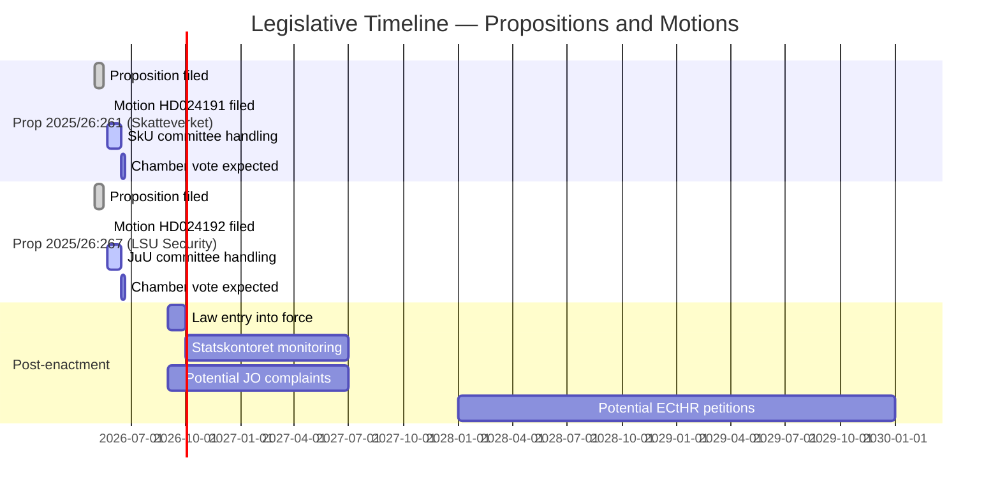

# Cross-Reference Map — Opposition Motions, 2026-05-27

**Date**: 2026-05-27  
**Author**: James Pether Sörling

---

## Document Cross-References

### HD024191 — References to External Documents

| Reference Type | Document / Source | Relationship | Status |
|---------------|------------------|-------------|--------|
| Parent proposition | Prop. 2025/26:261 (Utökade befogenheter för Skatteverket inom folkbokföringsverksamheten) | Motion responds to this proposition | Advancing in SkU |
| Legal framework | Folkbokföringslagen | Existing law being amended | In force |
| Legal gap | Population without stable address | Gap not addressed in prop. | Policy gap identified |
| Constitutional | ECHR Art. 14 (non-discrimination) | Implicitly invoked | Standard applies |
| GDPR | Art. 9 (sensitive data — biometrics) | New biometric powers in prop. | Relevant |

### HD024192 — References to External Documents

| Reference Type | Document / Source | Relationship | Status |
|---------------|------------------|-------------|--------|
| Parent proposition | Prop. 2025/26:267 (Stärkt skydd mot utlänningar som utgör kvalificerade säkerhetshot) | Motion responds to this proposition | Advancing in JuU |
| Legal framework | Lag (2022:700) om särskild kontroll av vissa utlänningar (LSU) | Law being amended | In force |
| Lagrådet yttrande | Lagrådet criticism of prop. 2025/26:267 | Motion cites institutional critic | Yttrande on record |
| CSO remissvar | Civil rights defenders | Remiss opposition cited | On record |
| CSO remissvar | Sveriges Advokatsamfund | Remiss opposition cited | On record |
| CSO remissvar | Rädda barnen | Remiss opposition cited | On record |
| Expert body | Institutet för mänskliga rättigheter (IMR) | ECHR proportionality concerns | On record |
| Expert body | Svenska avdelningen av Internationella Juristkommissionen (ICJ-Sweden) | ECHR compatibility questioned | On record |
| International law | Barnkonventionen (CRC) | Swedish domestic law since 2020 | In force |
| International law | ECHR Art. 5 (liberty and security) | Detention time-limit provisions | Standard applies |
| International law | ECHR Art. 3 (prohibition of degrading treatment) | Detention conditions | Standard applies |
| EU law | EU migration and asylum pact | Parallel implementation | In progress |
| Alternative institution | SiS (Statens institutionsstyrelse) | Proposed alternative to security section detention for children | Active agency |

---

## Thematic Cross-References Between Motions

| Theme | HD024191 | HD024192 | Shared Analysis |
|-------|----------|----------|-----------------|
| Social vulnerability | Core focus (homeless persons) | Secondary (children in LSU) | Both highlight collateral harm to vulnerable groups from security-first legislation |
| Proportionality principle | Implicitly — control powers vs. protection of homeless | Explicitly — detention times vs. security objectives | Core legal challenge in both |
| Legislative rush/oversight gap | Implicit — no edge-case analysis in prop. | Explicit — "lagstiftningsrush" claim | Both reflect MP's systemic critique of government's spring 2026 legislative program |
| Equal treatment / non-discrimination | Primary (foreign-background residents) | Secondary (migrant children) | Both engage ECHR Art. 14 |
| Government return demanded | Yes — 2 tillkännagivanden | Yes — rule-of-law proposals + evaluation | Both adopt the "return with proposals" legislative strategy |

---

## Related Parliamentary Documents (Prior Context)

| Type | Relationship | Notes |
|------|-------------|-------|
| Prior LSU (Lag 2022:700) | Enacted 2022 when MP was in government | MP helped create the law it now seeks to amend — nuanced position |
| AU10 (2025/26) votation | Broad majority Ja on a labour-market security vote | MP voted Nej — consistent pattern of minority rights dissent |
| AU10 (2024/25) votation | S voted Avstår, SD voted Nej on a related vote | Cross-party complexity on migration-adjacent issues |

---

## Legislative Timeline

