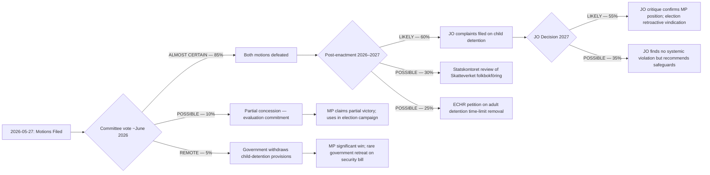

# Scenario Analysis — Opposition Motions, 2026-05-27

**Date**: 2026-05-27  
**Author**: James Pether Sörling  
**Horizon**: T+72h to T+18 months

---

## Scenario Tree

---

## Scenario Descriptions

### Scenario A: Standard Defeat (Probability: 85%)
**Trigger**: Committee procedures complete; SkU and JuU produce betänkanden recommending rejection of MP motions; chamber votes along government-opposition lines.

**Consequences**:
- Short-term: No legislative change; both propositions enacted as proposed
- Medium-term: MP uses the defeat in election campaigning; CSO partners amplify the narrative
- Long-term: Risk of post-enactment legal challenges materialising

**Opportunity for MP**: The paper trail of principled rights-based opposition has value regardless of outcome. Every documented warning about ECHR incompatibility is future campaign/litigation material.

---

### Scenario B: Partial Concession — Evaluation Commitment (Probability: 10%)
**Trigger**: L or C MPs within the coalition push for a formal evaluation commitment on LSU child-detention provisions; government agrees to a modified betänkande including a 3–5 year review clause.

**Conditions required**: At least one government-aligned committee member (likely from L) publicly signals concern about child detention before the committee vote; government assesses the political cost of an unqualified defeat as too high given media coverage.

**Consequences**:
- HD024192's third demand (evaluation within 5 years) effectively met
- MP claims partial victory; narrative shifts to "parliament listened to children's rights advocates"
- Precedent for review-commitment as a face-saving compromise mechanism

---

### Scenario C: Government Retreats on Child Detention (Probability: 5%)
**Trigger**: Major media or political event — e.g., Rädda barnen public campaign, EU/UN statement on child detention in migration, or L faction publicly threatening to withhold votes — forces government to drop §§ 9, 10, 19 child-detention provisions from prop. 2025/26:267.

**Conditions required**: Coalition discipline breaks; government calculates that losing one sensitive provision is better than risking L defection on broader migration bill.

**Consequences**:
- Significant MP and CSO victory; rare rollback of security legislation
- Government retains all other provisions of LSU amendment
- Precedent-setting: demonstrates that rights-based mobilisation can modify security legislation even with majority government

---

### Scenario D: Post-Enactment JO Complaint (Probability: 60% within 18 months)
**Trigger**: First child placed on security section under LSU following law entry into force; Rädda barnen or legal representative files JO complaint.

**Consequences**:
- JO investigation lasting 12–18 months
- Interim JO decision may recommend suspension of security-section placements pending review
- Media cycle revives MP's pre-enactment warnings; MP candidates cite JO findings in 2026 election

---

### Scenario E: ECtHR Petition (Probability: 25% within 4 years)
**Trigger**: Adult held under LSU without time ceiling for >3 years; domestic remedies exhausted; human-rights lawyers file in Strasbourg.

**Conditions required**: Swedish courts uphold unlimited detention; petitioner satisfies ECtHR admissibility criteria.

**Consequences**:
- ECtHR judgment finding violation of Art. 5; Sweden required to pay compensation and amend law
- Sweden's international standing in human-rights forums damaged
- Government of the day (not necessarily this government) must introduce corrective legislation

---

## Key Uncertainties

| Uncertainty | Range | Impact |
|-------------|-------|--------|
| L party cohesion on child-detention vote | 80–95% government compliance | Determines probability of Scenario B |
| Timing of EU migration pact transposition | Before/after LSU vote | Could delay or accelerate LSU amendments |
| 2026 election outcome | MP above/below 4% | Determines whether rights voice remains in parliament |
| Next major security incident in Sweden | Possible any time | Could shift Overton window against all rights-based objections |
