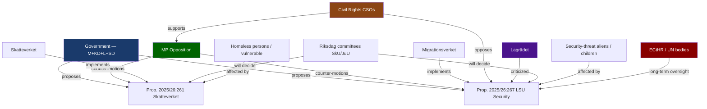

# Stakeholder Perspectives — Opposition Motions, 2026-05-27

**Date**: 2026-05-27  
**Author**: James Pether Sörling

---

## Stakeholder Map

---

## Stakeholder Analysis

### Government (M+KD+L+SD)

**Position**: Strong support for both propositions. Prop. 2025/26:261 is framed as anti-fraud/anti-crime administrative modernisation. Prop. 2025/26:267 is framed as national security necessity.

**Interest**: Demonstrate law-and-order credibility to their voter base (particularly SD and M voters). Pass legislation before the summer break.

**Power**: High — controls parliamentary majority ~176 seats.

**Likely response to motions**: Defeat both in committee with brief written responses. Ministerial statements emphasising crime-fighting credentials.

**Vulnerability**: The child-detention provision in HD024192 is where the government is most exposed to cross-party sympathy; L's tradition of civil liberties means L MPs may signal discomfort even while voting with the government.

---

### Miljöpartiet (MP)

**Position**: Principled rights-based opposition. Accepts security rationale; rejects disproportionate implementation.

**Interest**: Electoral positioning ahead of 2026 election. Build rights-advocacy brand. Mobilise civil-society networks (Rädda barnen, Civil rights defenders) as amplifiers.

**Power**: Low — ~24 seats. No legislative leverage. Influence is normative and media-based.

**Strategic calculation**: By filing these motions MP creates a paper trail of opposition that becomes campaign material if ECHR/JO challenges materalise post-enactment.

---

### Socialdemokraterna (S)

**Position**: Ambivalent. S has historically co-authored security and migration legislation; S was in government when LSU was first enacted in 2022. S is unlikely to support HD024192 in full.

**Interest**: Avoid appearing soft on security (SD-sympathetic swing voters) while maintaining labour and civil-society credibility.

**Likely vote**: Nej to HD024192's child-detention rejection clause; possible Ja or Avstår to the evaluation demand.

**Note**: S absence from this motion batch — S has not filed counter-motions on these propositions — is itself significant. It suggests S is not seeking to differentiate sharply from the government on these issues.

---

### Lagrådet (Council on Legislation)

**Position**: Has already raised concerns on prop. 2025/26:267. Lagrådet criticism of the proposition's child-detention and evidence-threshold provisions is documented in the proposition's preparatory work.

**Interest**: Constitutional compliance and legal coherence.

**Power**: Advisory only; Riksdag can override Lagrådet recommendations.

**Significance**: MP explicitly cites Lagrådet in HD024192. This gives the motion's legal arguments institutional backing beyond party politics.

---

### Civil Society (Rädda barnen, Civil rights defenders, Advokatsamfund, IMR, ICJ-Sweden)

**Position**: Strongly aligned with HD024192. These organisations have filed formal remissvar opposing the child-detention and evidence-threshold provisions.

**Interest**: Child rights, rule of law, ECHR compliance.

**Power**: High media/agenda-setting capacity; no direct legislative power. Will amplify MP's narrative.

**Action likely**: Press releases, social media campaigns, possible JO complaints, potential ECtHR petition coordination.

---

### Skatteverket

**Position**: Supportive of expanded powers (prop. 2025/26:261 gives it new mandate).

**Interest**: Effective fraud prevention; manageable implementation burden.

**Concern**: The homeless/no-fixed-address edge case identified by MP is a genuine operational challenge. Skatteverket will need clear guidance on proportionate application.

**Note**: Statskontoret will monitor Skatteverket's implementation capacity — this is a standard administrative-oversight trigger.

---

### Vulnerable Populations (Homeless, Foreign-Background Residents)

**Position**: Unrepresented in parliamentary proceedings (no direct parliamentary voice).

**Interest**: Continued access to social entitlements, equal treatment under folkbokföring law.

**Power**: None — depend on advocacy organisations (RFSL, Stadsmissionen, Rädda barnen).

**Scale**: ~40,000–60,000 persons with unstable or no fixed address in Sweden.

---

### Affected Children (Security-Classified LSU Cases)

**Position**: Unrepresented. Affected children are in exceptional legal situations (security classification) with minimal access to ordinary legal representation.

**Interest**: Not to be detained; access to education and care.

**Scale**: Small absolute numbers (estimated tens of cases per year under LSU), but high individual harm intensity.

---

## Power/Interest Matrix

| Stakeholder | Power | Interest | Quadrant |
|-------------|-------|----------|----------|
| Government (M+KD+L+SD) | HIGH | HIGH | Manage closely |
| S (Social Democrats) | HIGH | MEDIUM | Keep informed, watch for differentiation |
| MP | LOW | HIGH | Key stakeholder |
| Lagrådet | MEDIUM | HIGH | Monitor (already acted) |
| Civil Rights CSOs | MEDIUM | HIGH | Amplifiers for MP narrative |
| Skatteverket | MEDIUM | MEDIUM | Implementation monitor |
| Migrationsverket | MEDIUM | HIGH | Implementation risk bearer |
| Vulnerable populations | NONE | HIGH | Protect via advocacy |
| ECtHR/UN Bodies | HIGH (long-term) | HIGH | Long-horizon oversight |
