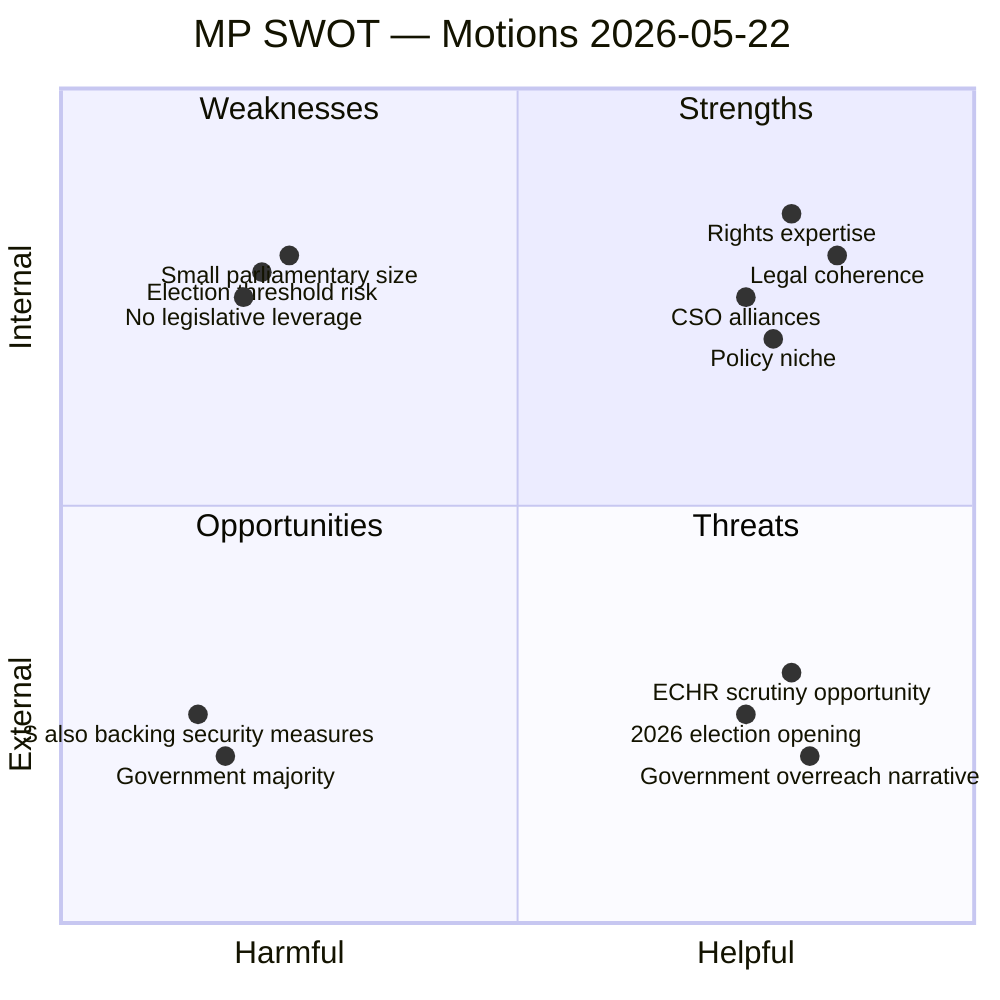

# SWOT Analysis — Opposition Motions, 2026-05-27

**Date**: 2026-05-27  
**Author**: James Pether Sörling  
**Scope**: MP opposition motions HD024191 + HD024192

---

## MP Strategic Position: SWOT

---

## Strengths

| # | Strength | Evidence | Confidence |
|---|----------|---------|------------|
| S1 | Strong legal grounding in ECHR and barnkonventionen | HD024192 cites IMR, Advokatsamfund, ICJ-Sweden, Rädda barnen; Lagrådet itself raised concerns in proposition preparation | HIGH |
| S2 | Principled consistency — MP does not oppose security measures wholesale | Motion explicitly acknowledges need for security tools; opposes specific disproportionate provisions | HIGH |
| S3 | Broad CSO alignment creates earned media amplification | Civil rights defenders, Rädda barnen active on HD024192's child-detention issue | HIGH |
| S4 | HD024191 addresses a genuine policy gap (homeless/no-fixed-address registration) | No policy solution exists in prop. 2025/26:261 for this demographic | MEDIUM-HIGH |

## Weaknesses

| # | Weakness | Evidence | Confidence |
|---|----------|---------|------------|
| W1 | Parliamentary arithmetic makes legislative impact negligible | M+KD+L+SD ~176 seats; MP ~24 seats | ALMOST CERTAIN |
| W2 | HD024191's proposals are aspirational, not technically specific | Motion demands a "return with proposals" — no specific legal drafting | MEDIUM |
| W3 | MP threshold risk reduces weight of party as interlocutor | Party polling ~6–7%; at-risk of sub-4% threshold wipeout | POSSIBLE |
| W4 | Both motions address government-friendly electorate issues — MP does not own the securitisation narrative | SD, M, KD own anti-immigration and security framing in media | HIGH |

## Opportunities

| # | Opportunity | Trigger | Horizon |
|---|------------|---------|---------|
| O1 | ECHR challenge to LSU child-detention provisions post-enactment | European Court of Human Rights petition by Rädda barnen / Civil rights defenders | T+12–36 months |
| O2 | Statskontoret review of Skatteverket folkbokföring implementation creating policy opening | Administrative gaps in homeless registration documented post-law entry | T+12–18 months |
| O3 | 2026 election campaign — rights-vs-security as defining axis | Polling on civil liberties; MP targeting progressive urban voters | T+90–180 days |
| O4 | EU migration pact implementation creating legal complexity requiring rule-of-law advocates | EU regulations impose ECHR-compliance floor that MP can champion | T+6–24 months |

## Threats

| # | Threat | Assessment | Confidence |
|---|--------|-----------|------------|
| T1 | Government majority defeats both motions without significant debate | Standard parliamentary procedure | ALMOST CERTAIN |
| T2 | S supporting government on most security/migration measures reduces opposition bloc leverage | S has historically aligned on counter-terrorism measures | LIKELY |
| T3 | Media framing shifts from rights to security incident | A domestic terror incident or high-profile crime case could make MP appear soft | POSSIBLE |
| T4 | MP fails to reach 4% threshold in 2026 election | Polls show MP near threshold; failure removes the rights voice from parliament | POSSIBLE |

---

## Net Assessment

MP's motions are strategically sound but legislatively impotent in the current parliamentary configuration. The value is in building a coherent rights-based narrative ahead of the 2026 election. The most significant risk is that a security incident between now and September 2026 frames the child-detention and evidence-threshold debate in a way that makes the MP position appear reckless. The biggest opportunity is that ECHR scrutiny of the parent propositions post-enactment vindicates the motion's legal arguments, turning the defeats into retrospective victories.

| Prior voteringar context | Source | Note |
|--------------------------|--------|------|
| AU10 (2025/26:punkt 3) — MP voted Nej, broad majority Ja | search_voteringar (folkbokföring, rm:2025/26) | Pattern consistent: MP as lone rights dissenter |
| AU10 (2024/25:punkt 1) — SD voted Nej, S voted Avstår, M/others split | search_voteringar (2024/25) | Different issue but reveals fragmentation on migration-adjacent votes |
