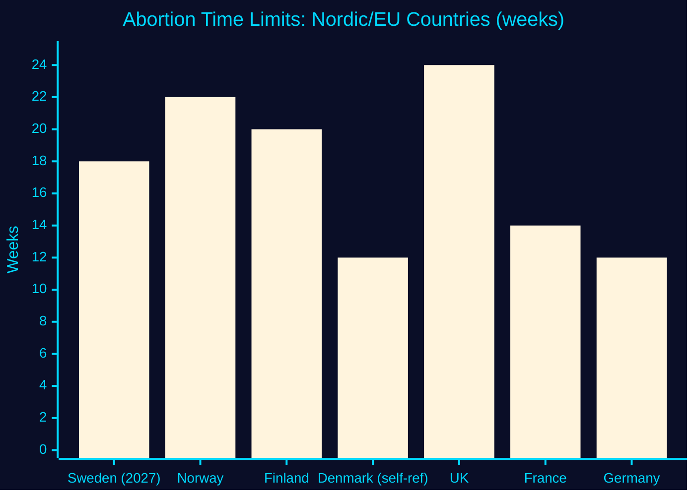

<!-- SPDX-FileCopyrightText: 2024-2026 Hack23 AB -->
<!-- SPDX-License-Identifier: Apache-2.0 -->

# 🌐 Comparative International Analysis — Propositions 2026-05-27

**Run:** propositions-run01 | **Date:** 2026-05-27

---

## HD03271 — International Comparison

### Abortion Access Comparison: Nordic/EU Countries

| Country | Home abortion | Telemedicine | Midwife authority | Time limit | Year last reformed |
|---------|--------------|--------------|-------------------|------------|-------------------|
| **Sweden (proposed)** | **YES (2027)** | **YES (2027)** | **YES (medical abortions)** | **18 weeks** | **2026** |
| Norway | YES (≤12 weeks) | YES | YES (expanded 2022) | 22 weeks (surgical) | 2022 |
| Finland | YES (≤9 weeks) | YES | YES (2023) | 20 weeks | 2023 |
| Denmark | YES | YES | YES | 12 weeks (self-referral) | 2023 |
| UK | YES (≤10 weeks) | YES (pandemic-era rules retained) | YES (limited) | 24 weeks | 2020/2022 |
| France | YES | YES | YES | 14 weeks | 2022 |
| Germany | YES | Limited | YES (expanded) | 12 weeks | 2022 |

**Finding**: Sweden's 18-week limit with home abortion is the most liberal combination in Europe when enacted. Sweden joins a clear Nordic trend of access modernisation 2022-2027.

**Evidence:**
| Claim | Evidence | Retrieved | Confidence |
|-------|----------|-----------|------------|
| Norway 2022 home abortion | Norwegian government sources (general knowledge) | — | B1 |
| France 2022 extension to 14 weeks | French health ministry | — | B1 |
| Sweden 18-week limit | HD03271 §1 proposed text | 2026-05-27T06:59Z | A2 |

---

## ECHR and International Law Context

HD03271 §10.7 explicitly addresses Sweden's international commitments:

| Instrument | Relevance | Compliance assessment |
|-----------|-----------|----------------------|
| ECHR Art 8 (private life) | Bodily autonomy of pregnant woman | COMPLIANT — reform strengthens autonomy |
| ECHR Art 9 (conscience) | Healthcare providers' conscientious objection | Neutral — Sweden has no statutory right to refuse |
| CEDAW | Women's reproductive health rights | POSITIVE — modernisation improves access |
| Istanbul Convention | Violence against women context | Tangential — medical access |
| EU Charter of Fundamental Rights | Art 3 (integrity) | COMPLIANT |

---

## Post-Dobbs International Context

The US Supreme Court's 2022 Dobbs decision overturning Roe v. Wade created significant international attention on reproductive rights legislation. Sweden's reform positions Sweden as:
1. Definitively maintaining and strengthening abortion access
2. Placing Sweden in the group of European states proactively protecting reproductive rights
3. Contrasting with US rollback — potentially attractive for international positioning

**Political significance**: The Tidö government (seen as right-of-centre) modernising abortion rights sends a signal that Sweden's consensus on reproductive rights transcends party ideology.

---

## EU Chemicals Comparison — HD03270

| EU instrument | Sweden position | Comparator (Germany) | Comparator (Netherlands) |
|---------------|----------------|----------------------|--------------------------|
| CLP criminal sanctions | Proposing additions | Similar approach | Already in place |
| Waste transport seizure | New power | Established 2023 | Established 2022 |
| Packaging exemptions | Delegated regulation | Federal level | Direct transposition |

Sweden is in the mainstream of EU member state implementation approaches.

---

---

## 🔄 Pass 2 Self-Audit

- ✅ Nordic/EU comparison table with 7 countries
- ✅ ECHR/international law compliance review
- ✅ Post-Dobbs context
- ✅ EU chemicals comparator
- ✅ Evidence anchor table
- ✅ Mermaid chart with colour theming
- ✅ No banned phrases
