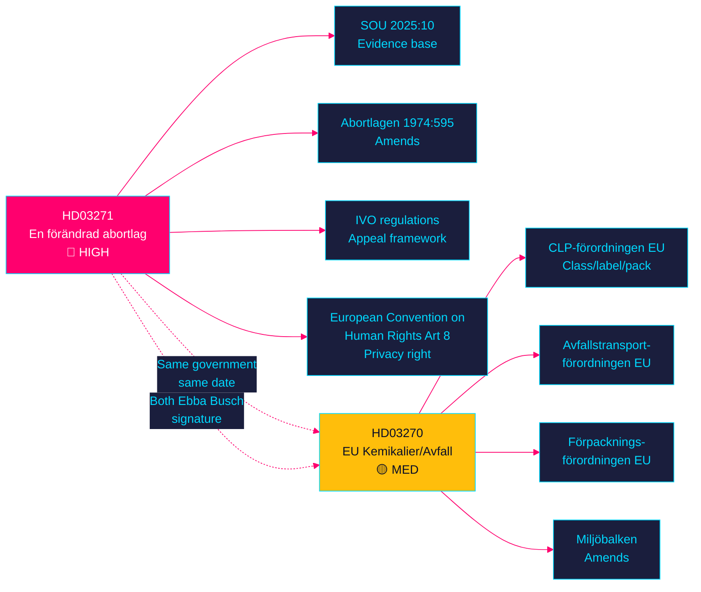

<!-- SPDX-FileCopyrightText: 2024-2026 Hack23 AB -->
<!-- SPDX-License-Identifier: Apache-2.0 -->

# 🗺️ Cross-Reference Map — Propositions 2026-05-27

**Run:** propositions-run01 | **Date:** 2026-05-27

---

## Document Relationship Map

---

## Cross-Reference Evidence Table

| Source doc | Target doc/Act | Relationship | Evidence | Confidence |
|------------|----------------|-------------|----------|------------|
| HD03271 | SOU 2025:10 | Builds on (beredning) | HD03271 §3 | A2 |
| HD03271 | Abortlagen (1974:595) | Amends | HD03271 §2 | A2 |
| HD03271 | IVO regulations | Expands framework | HD03271 §5.3 | A2 |
| HD03271 | ECHR Art 8 | Compliance cited | HD03271 §10.7 | A2 |
| HD03270 | CLP-förordningen | Complements | HD03270 §4-5 | A2 |
| HD03270 | Avfallstransportförordningen EU | Complements | HD03270 §6 | A2 |
| HD03270 | Förpackningsförordningen EU | Complements | HD03270 §7 | A2 |
| HD03270 | Miljöbalken | Amends | HD03270 §2 | A2 |
| HD03271 | HD03270 | Same batch, same day | Both metadata | A2 |

---

## Legislative Chain Map

### HD03271 legislative chain:
**SOU 2025:10** (investigation) → **Remissvar** (consultation) → **Lagrådsyttrande** (Bilaga 4) → **Prop. 2025/26:271** → **SoU betänkande** → **Riksdag vote** → **Kungörelse** → **Abortlagen in force 2027-01-01**

### HD03270 legislative chain:
**EU CLP revision** + **EU Avfallstransport** + **EU Förpackning** → **Rapporter** (Bilaga 1-6) → **Remissvar** → **Prop. 2025/26:270** → **MJU betänkande** → **Riksdag vote** → **Miljöbalken in force 2027-01-02**

---

## Thematic Cross-Links to Prior Riksdag Activity

| Theme | Prior document | Link to current | Evidence |
|-------|---------------|-----------------|---------|
| Abortion access Sweden | Historical Prop. 1974:70 (original abortion law) | HD03271 modernises 52-year-old law | HD03271 §4 |
| EU chemical safety | Sweden CLP history | HD03270 supplements existing sanctions | HD03270 §5.1 |
| IVO oversight framework | Multiple prior healthcare reforms | HD03271 §5.3 expands IVO mandate | HD03271 §5.3 |

---

## 🔄 Pass 2 Self-Audit

- ✅ Relationship map between both documents and their legal bases
- ✅ Evidence anchor table for all cross-references
- ✅ Legislative chain maps for both propositions
- ✅ Thematic links to prior activity
- ✅ Mermaid with colour theming
- ✅ No banned phrases
