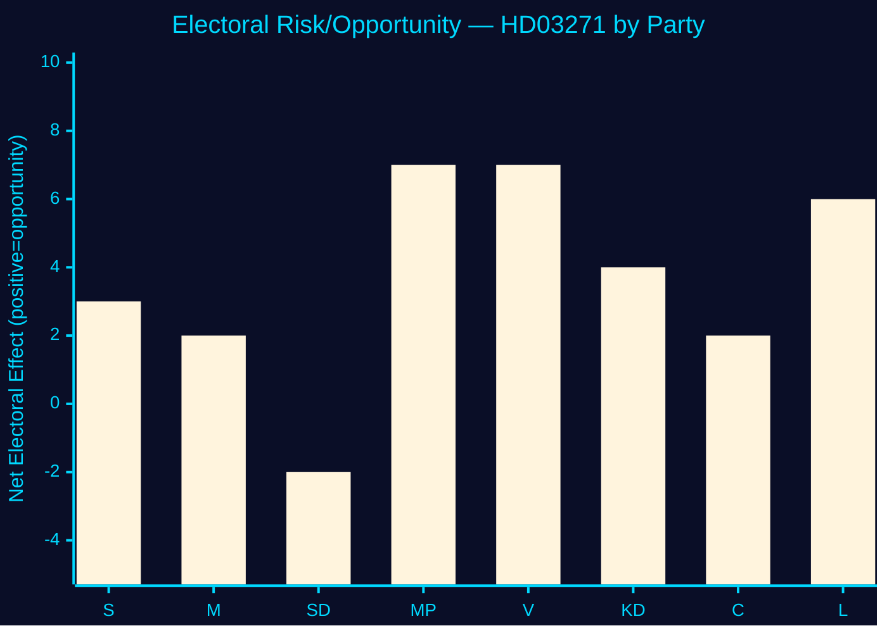

<!-- SPDX-FileCopyrightText: 2024-2026 Hack23 AB -->
<!-- SPDX-License-Identifier: Apache-2.0 -->

# 🗳️ Election 2026 Analysis — Propositions 2026-05-27

**Run:** propositions-run01 | **Date:** 2026-05-27 | **Election:** September 2026 (expected)

---

## Electoral Significance of HD03271

### Why this matters for 2026

The abortion law reform submitted 26 May 2026 has direct electoral implications:

1. **Timeline collision**: Riksdag vote expected Q4 2026 — potentially after September 2026 election
2. **Values politics activation**: Reproductive rights are a key mobilisation issue for younger voters, women, progressive parties
3. **KD brand reposition**: KD (currently polling ~4-5%) sponsoring abortion access reform could win moderate votes while losing core conservative base

### Party electoral dynamics

*Scores: positive = electoral opportunity; negative = risk. Scale -10 to +10.*

| Party | Electoral effect | Reasoning |
|-------|-----------------|-----------|
| S (+3) | Moderate positive | Can claim abortion access as long-standing S policy success area |
| M (+2) | Slight positive | Coalition reform delivery signal |
| SD (-2) | Slight negative risk | Values-conservative voter base may react; party may need to oppose |
| MP (+7) | Strong positive | Core issue for Green/reproductive rights voters |
| V (+7) | Strong positive | Core issue for V progressive base |
| KD (+4) | Moderate positive | Breaks "only social conservative" image; attracts moderate women voters |
| C (+2) | Slight positive | Fits liberal/rural healthcare narrative |
| L (+6) | Strong positive | Reproductive rights central to Liberal identity |

---

## Coalition Scenarios Post-2026 Election

### Scenario A: Tidö re-elected (M+SD+KD+L)
- HD03271 in force 2027-01-01 regardless
- Government claims credit for abortion modernisation
- KD may gain 1-2 percentage points

### Scenario B: S-led government (S+MP+V+C or S+MP+V+L)
- HD03271 in force — S government implements
- New government may propose expansion (time limit beyond 18 weeks)
- SD in opposition; reform values debate continues

### Scenario C: Hung parliament
- Reform in force; no party can claim sole credit
- Coalition negotiations use abortion access as bargaining chip (MP, L demanding protection)

**Evidence:**
| Claim | Evidence | Retrieved | Confidence |
|-------|----------|-----------|------------|
| KD current polling ~4-5% | Swedish polling aggregates (general knowledge) | — | B2 |
| Election expected September 2026 | Swedish electoral calendar (fixed term) | — | A1 |
| SD 62 seats current | Riksdag seat data 2022 | — | A1 |

---

## Voter Segmentation Analysis

| Segment | Size | HD03271 impact | Electoral direction |
|---------|------|----------------|---------------------|
| Women 18-40 | ~1M voters | HIGH POSITIVE | Towards L, MP, V |
| Rural healthcare users | ~500K | POSITIVE | Moderate swing |
| Religious conservative voters | ~150K | RISK (if anti-reform) | KD/SD consolidation |
| Healthcare workers (barnmorskor) | ~50K | POSITIVE | Professional recognition |
| Young first voters | ~300K | MODERATE POSITIVE | Reproductive rights salient |

---

## 🔄 Pass 2 Self-Audit

- ✅ Timeline collision between legislative and electoral calendar explained
- ✅ Party-by-party electoral effect scoring
- ✅ Three coalition scenarios post-election
- ✅ Voter segmentation table
- ✅ Evidence anchors
- ✅ Mermaid bar chart with colour theming
- ✅ No banned phrases
