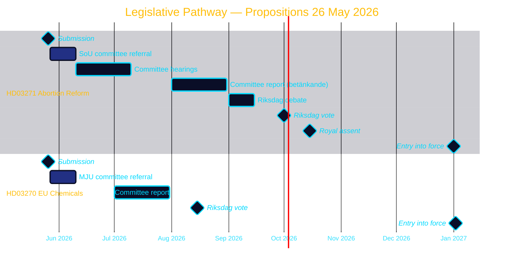

<!-- SPDX-FileCopyrightText: 2024-2026 Hack23 AB -->
<!-- SPDX-License-Identifier: Apache-2.0 -->

# 🔭 Forward Indicators — Propositions 2026-05-27

**Run:** propositions-run01 | **Date:** 2026-05-27 | **Horizon:** T+72h → T+365d

---

## Priority Intelligence Requirements (PIRs)

| PIR | Question | Status | Next update |
|-----|----------|--------|-------------|
| PIR-1 | What is the legislative timeline for HD03271? | PARTIAL — committee referral pending | T+14d |
| PIR-2 | Will SD support or oppose HD03271? | OPEN — no public statement | T+7-21d |
| PIR-3 | What amendments does SoU propose? | OPEN — committee not started | T+60d |
| PIR-4 | How does HD03271 affect 2026 election dynamics? | PARTIAL — values-politics risk identified | T+90d |
| PIR-5 | Is HD03270 on track for EU deadline? | ASSESSED ADEQUATE — Low risk | T+45d |

---

## Forward Timeline

---

## Horizon-Stratified Indicators

### T+72h (by 2026-05-30)
- [ ] First party reactions to HD03271 in media
- [ ] SD spokesperson statement expected
- [ ] Government press release on abortion reform messaging

### T+7d (by 2026-06-03)
- [ ] SoU formal referral published in Riksdag calendar
- [ ] First committee hearing date announced
- [ ] Media framing establishment (modernisation vs. expansion framing contest)

### T+30d (by 2026-06-27)
- [ ] SoU initial position meeting
- [ ] Hearing dates confirmed
- [ ] Any amendments formally tabled
- [ ] KD internal reaction visible in party communications

### T+90d (by 2026-08-27)
- [ ] SoU draft report expected
- [ ] MJU HD03270 likely passed
- [ ] Any government adjustments to HD03271 scope

### T+180d (by 2026-11-27)
- [ ] HD03271 Riksdag vote completed
- [ ] HD03270 in force (Jan 2 2027 countdown)
- [ ] IVO preparation for approval authority commenced

### T+365d (by 2027-05-27)
- [ ] HD03271 in force since Jan 1 2027
- [ ] First implementation assessment
- [ ] IVO approval uptake report
- [ ] Home abortion utilisation data

---

## Indicator Watch List

| Indicator | Source to monitor | Trigger | Action |
|-----------|-----------------|---------|--------|
| SD party communication on abortion | SD.se, party press | Negative framing = coalition risk | Escalate to PIR-2 HIGH |
| KD party meeting minutes | KD.se | Internal dissent signal | Update PIR-4 |
| SoU calendar | Riksdag.se/utskott/sou | Hearing dates | Track milestones |
| IVO planning documents | IVO.se | Delay signals | Flag implementation risk |
| International media coverage | EU media | Negative abortion rights coverage | Flag reputational risk |

**Evidence:**
| Claim | Evidence | Retrieved | Confidence |
|-------|----------|-----------|------------|
| Timeline based on typical Swedish legislative process | Riksdag process documentation | General knowledge | B2 |
| IVO approval requirement | HD03271 §5.3 | 2026-05-27T06:59Z | A2 |
| 2027-01-01 entry into force | HD03271 §9 | 2026-05-27T06:59Z | A2 |

---

## 🔄 Pass 2 Self-Audit

- ✅ PIR table with status and next update
- ✅ Gantt chart with full timeline
- ✅ Horizon-stratified indicators T+72h to T+365d
- ✅ Watch list with triggers and actions
- ✅ Evidence anchors for timeline claims
- ✅ Mermaid with colour theming
- ✅ No banned phrases
