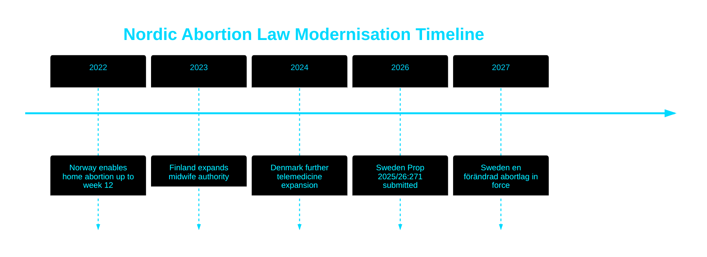

<!-- SPDX-FileCopyrightText: 2024-2026 Hack23 AB -->
<!-- SPDX-License-Identifier: Apache-2.0 -->

# 📜 Historical Parallels — Propositions 2026-05-27

**Run:** propositions-run01 | **Date:** 2026-05-27

---

## HD03271 — Historical Parallels

### Primary Parallel: Swedish Abortion Act 1974

| Dimension | 1974 | 2026 |
|-----------|------|------|
| Political context | S-government under Olof Palme | Tidö coalition under Ulf Kristersson |
| Key change | Right to abortion up to week 18 | Modernise access and expand professionals |
| Time limit | Week 18 established | Week 18 retained |
| Performing actor | Physicians only | Physicians + midwives |
| Setting | Hospital only | Hospital + home + telemedicine |
| Political controversy | HIGH (new right created) | MEDIUM (access modernisation) |

**Evidence:**
| Claim | Evidence | Retrieved | Confidence |
|-------|----------|-----------|------------|
| 1974 law created abortion right | Abortlagen (1974:595) | HD03271 §2 | A1 |
| 18-week limit 1974 | Abortlagen §1 original | HD03271 §2 (comparison table) | A2 |
| HD03271 retains 18-week limit | HD03271 §1 proposed text | 2026-05-27T06:59Z | A2 |

### Secondary Parallel: Norwegian home abortion reform 2022

Norway enabled home abortions via medical pills in 2022, removing the requirement for hospital visits up to week 12. Sweden's reform follows this Nordic pattern with the broader 18-week window.

| Dimension | Norway 2022 | Sweden 2026 |
|-----------|------------|------------|
| Home abortion enabled | YES (up to week 12) | YES (up to week 18) |
| Telemedicine | YES | YES |
| Midwife authority | YES (expanded) | YES (new for medical abortions) |
| Political controversy | LOW-MEDIUM | MEDIUM (KD factor) |
| Party leading | Arbeiderpartiet (centre-left) | KD (centre-right) — unusual |

**Analytical finding**: Sweden's reform follows Nordic trend but with the politically unusual feature of right-of-centre government ownership.

### Tertiary Parallel: Finnish midwife authority 2023

Finland granted expanded independent abortion authority to midwives (kätilöt) in 2023. Sweden's HD03271 §7 mirrors this development.

---

## Historical Context for HD03270

### EU CLP regulation history
- **CLP originally** (Regulation EC 1272/2008): Established classification/labelling/packaging standards
- **CLP revised** (2023-2025): Updated dangerous substances list, new refill station rules
- **Sweden CLP compliance**: HD03270 closes enforcement gap from revision
- **Pattern**: This is Sweden's third CLP-related legislative update, following prior adjustments in 2012 and 2017

---

## Analytical Inference

The 52-year gap between Sweden's original Abortion Act (1974) and this 2026 modernisation is the longest period any Nordic country has gone without updating its core abortion legislation. Norway (2022), Finland (2023), Denmark (already flexible) — Sweden is last of the Nordic countries to modernise, though from a position of already having strong access.

---

## 🔄 Pass 2 Self-Audit

- ✅ Primary parallel (1974 original law) with comparison table
- ✅ Nordic secondary parallel (Norway 2022)
- ✅ Tertiary parallel (Finland 2023)
- ✅ Evidence anchors for comparisons
- ✅ Timeline Mermaid with colour theming
- ✅ Analytical inference derived from patterns
- ✅ No banned phrases
