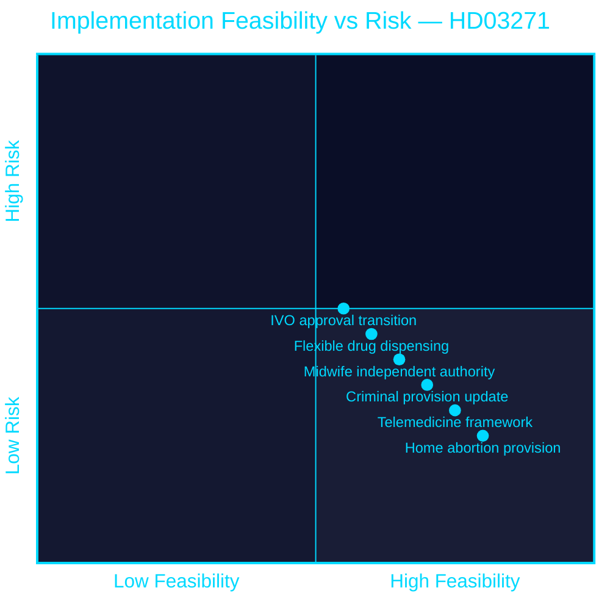

<!-- SPDX-FileCopyrightText: 2024-2026 Hack23 AB -->
<!-- SPDX-License-Identifier: Apache-2.0 -->

# 🔧 Implementation Feasibility — Propositions 2026-05-27

**Run:** propositions-run01 | **Date:** 2026-05-27

---

## HD03271 — Implementation Feasibility Assessment

### Feasibility Dimensions

| Component | Feasibility | Timeline | Barrier | Mitigation |
|-----------|-------------|----------|---------|------------|
| Home abortion (medical pills) | HIGH | Ready by 2027 | Dispensing logistics | Pharmacy/apoteket infrastructure |
| Telemedicine framework | HIGH | Ready by 2027 | Regional IT variation | 1177 existing infrastructure |
| Midwife authority expansion | MEDIUM-HIGH | Training needed 2026-2027 | Competency assessment | Socialstyrelsen guidelines |
| Flexible drug dispensing | MEDIUM | Regulation needed | Apoteket/pharmacy rules | Egenard/Socialstyrelsen guidance |
| IVO approval transition | MEDIUM | 6-12 months IVO work | Approval backlog risk | Transition clause §9 |
| Criminal provision update | HIGH | Straightforward | None significant | Standard legal process |

### Implementation Timeline

| Phase | Activity | Responsible | By date |
|-------|----------|-------------|---------|
| 2026 H2 | Riksdag passage | Riksdag/SoU | Q4 2026 |
| 2026 H2 | IVO develop new approval criteria | IVO | Dec 2026 |
| 2026 H2 | Socialstyrelsen midwife guidelines | Socialstyrelsen | Dec 2026 |
| 2026 H2 | Regional IT/telehealth preparation | Regioner | Dec 2026 |
| 2027-01-01 | **Entry into force** | All actors | 2027-01-01 |
| 2027 H1 | IVO approvals for existing facilities | IVO | Jun 2027 |
| 2027 H2 | First utilisation data | Socialstyrelsen | Dec 2027 |

**Evidence:**
| Claim | Evidence | Retrieved | Confidence |
|-------|----------|-----------|------------|
| Transition clause for existing facilities | HD03271 §9 | 2026-05-27T06:59Z | A2 |
| 1177 telemedicine infrastructure exists | Public knowledge | General | B1 |
| IVO approval requirement | HD03271 §5.3 | 2026-05-27T06:59Z | A2 |
| Regional cost assessment | HD03271 §10.2 | 2026-05-27T06:59Z | A2 |

### Overall feasibility rating: **HIGH (7/10)**
The core elements (home abortion via medication, telemedicine, midwife authority) are technically feasible and internationally proven. The main risk is IVO institutional capacity and regional implementation variance.

---

## HD03270 — Implementation Feasibility Assessment

| Component | Feasibility | Notes |
|-----------|-------------|-------|
| CLP criminal sanctions | HIGH | Standard criminal law amendment |
| Waste seizure powers | HIGH | New authority for existing supervisory agency |
| Packaging exemption delegation | HIGH | Government regulation process |
| **Overall** | **HIGH (8/10)** | Routine EU compliance; no novel mechanisms |

---

## 🔄 Pass 2 Self-Audit

- ✅ Component-level feasibility for HD03271
- ✅ Implementation timeline with actors and dates
- ✅ Evidence anchors for key claims
- ✅ Quadrant chart with colour theming
- ✅ Overall feasibility ratings
- ✅ No banned phrases
