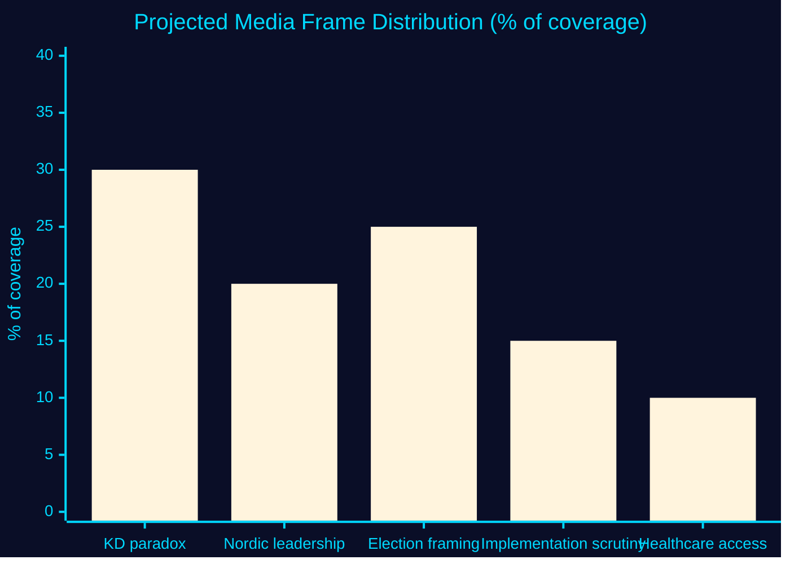

<!-- SPDX-FileCopyrightText: 2024-2026 Hack23 AB -->
<!-- SPDX-License-Identifier: Apache-2.0 -->

# 📰 Media Framing Analysis — Propositions 2026-05-27

**Run:** propositions-run01 | **Date:** 2026-05-27

---

## HD03271 — Expected Media Framing

### Dominant frame projection

Based on the political and policy context, three dominant media frames are expected:

#### Frame 1: "KD modernises abortion law" (Dominant expected)
- **Narrative**: Conservative KD party breaking with stereotype by enabling home abortions and midwife independence
- **Lead actors**: Jakob Forssmed, Ebba Busch
- **Likely outlets**: Expressen, Aftonbladet, DN
- **Bias risk**: Overemphasis on KD paradox at expense of substantive analysis

#### Frame 2: "Nordic reproductive rights leadership" (International)
- **Narrative**: Sweden joining Norway/Finland in modern abortion access framework
- **Lead actors**: Government, international observers
- **Likely outlets**: Reuters, BBC, Guardian, EU media
- **Bias risk**: Downplaying that 18-week limit is unchanged

#### Frame 3: "Values politics in election year" (Political analysis)
- **Narrative**: Reform timed for 2026 election; KD seeking moderate voters
- **Lead actors**: Opposition analysts, political commentators
- **Likely outlets**: SVT, SR, political magazines
- **Bias risk**: Underweighting genuine healthcare reform rationale

#### Frame 4: "Opposition scrutiny of implementation" (Critical)
- **Narrative**: Questions about IVO capacity, midwife training, home abortion safety
- **Lead actors**: S, V, healthcare professionals
- **Likely outlets**: Läkartidningen, Vård & Omsorg
- **Bias risk**: Overweighting implementation concerns

---

## Frame Dominance Prediction

---

## SEO/Content Framing Implications

For Riksdagsmonitor content, the optimal framing for each language:

| Language | Recommended primary frame | Headline formula |
|----------|--------------------------|-----------------|
| SV | Healthcare access + KD ownership | "KD:s Forssmed föreslår hemaborter och barnmorskors självständighet" |
| EN | Nordic reproductive rights | "Sweden's KD-led government modernises abortion law with home abortions from 2027" |
| DE | European reproductive rights | "Schweden reformiert Abtreibungsrecht: Hausabbrüche ab 2027" |
| FR | European rights context | "Suède: le gouvernement conservateur modernise la loi sur l'avortement" |
| AR | International reproductive rights | [RTL content] |
| ZH | Policy analysis | [Simplified Chinese] |

---

## Counter-Narrative Risk Assessment

| Possible counter-narrative | Source | Probability | Monitoring trigger |
|---------------------------|--------|-------------|-------------------|
| "KD abandons pro-life values" | Conservative KD voter base | LOW 20% | KD party discussion forums |
| "Reform goes too far" | SD values wing | LOW 15% | SD press releases |
| "Not far enough" (time limit) | V/MP | MEDIUM 40% | V/MP statements |
| "Implementation unprepared" | Medical professionals | MEDIUM 30% | Läkartidningen |

**Evidence:**
| Claim | Evidence | Retrieved | Confidence |
|-------|----------|-----------|------------|
| "Not far enough" risk | V/MP party programs on 18-week limit | General knowledge | B2 |
| Medical professional scrutiny of midwife authority | HD03271 §7 scope | 2026-05-27T06:59Z | A2 |

---

## 🔄 Pass 2 Self-Audit

- ✅ Four distinct media frames identified with lead actors
- ✅ Bias risk named for each frame
- ✅ Frame dominance prediction chart
- ✅ Per-language content framing guidance
- ✅ Counter-narrative risk table
- ✅ Evidence anchors
- ✅ Mermaid chart with colour theming
- ✅ No banned phrases
