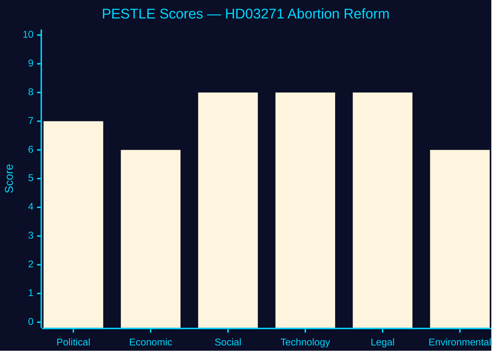

<!-- SPDX-FileCopyrightText: 2024-2026 Hack23 AB -->
<!-- SPDX-License-Identifier: Apache-2.0 -->

# 🌍 PESTLE Analysis — Propositions 2026-05-27

**Run:** propositions-run01 | **Date:** 2026-05-27

---

## HD03271 — PESTLE Analysis

### Political

| Factor | Direction | Weight | Evidence |
|--------|-----------|--------|---------|
| KD paradox: conservative party modernising abortion | MIXED | HIGH | HD03271 KD signatories |
| 2026 election proximity — values politics activation | NEGATIVE RISK | HIGH | Election calendar |
| SD coalition arithmetic — values flip risk | RISK | HIGH | Seat data; SD 62 seats |
| Cross-party majority available without SD | POSITIVE | HIGH | S+V+MP+L = 171 seats |
| International reproductive rights context (post-Dobbs) | POSITIVE | MEDIUM | ECHR §10.7 |

**Political score: 7/10 (net positive with managed risk)**

### Economic

| Factor | Direction | Weight | Evidence |
|--------|-----------|--------|---------|
| Home abortions cheaper than hospital | POSITIVE | MEDIUM | HD03271 §10.9 |
| IVO transition costs (one-time) | NEGATIVE | LOW | HD03271 §10.10 |
| Midwife salary implications (new scope) | NEUTRAL | LOW | HD03271 §10.3 |
| Pharmaceutical dispensing revenue shift | NEUTRAL | LOW | HD03271 §6.2 |

**Economic score: 6/10 (modest savings over time)**

### Social

| Factor | Direction | Weight | Evidence |
|--------|-----------|--------|---------|
| Rural access improvement | POSITIVE HIGH | HIGH | HD03271 §6.1 |
| Gender equality (bodily autonomy) | POSITIVE | HIGH | HD03271 §10.6 |
| Generational shift in healthcare access | POSITIVE | MEDIUM | Telemedicine adoption |
| Religious/values minority concerns | RISK | MEDIUM | KD voter base |
| Midwife professional recognition | POSITIVE | MEDIUM | HD03271 §7 |

**Social score: 8/10 (strong positive net)**

### Technological

| Factor | Direction | Weight |
|--------|-----------|--------|
| Telemedicine infrastructure (1177) available | POSITIVE | HIGH |
| Digital prescription system ready | POSITIVE | MEDIUM |
| Remote IVO supervision technically feasible | POSITIVE | MEDIUM |

**Technology score: 8/10 (enabling factors in place)**

### Legal

| Factor | Direction | Weight | Evidence |
|--------|-----------|--------|---------|
| Lagrådet reviewed and approved | POSITIVE | HIGH | HD03271 Bilaga 4 |
| ECHR Art 8 compliance | POSITIVE | HIGH | HD03271 §10.7 |
| Criminal provision update required | NEUTRAL | MEDIUM | HD03271 §8 |
| IVO approval framework legally sound | POSITIVE | MEDIUM | HD03271 §5.3 |

**Legal score: 8/10 (legally well-prepared)**

### Environmental

| Factor | Direction | Weight |
|--------|-----------|--------|
| Reduced hospital visits (emission savings) | POSITIVE (minor) | LOW |
| Pharmaceutical waste from home use | RISK (minor) | LOW |

**Environmental score: 6/10 (neutral with minor positives)**

---

## PESTLE Radar Chart

**Net PESTLE score HD03271: 7.2/10** — Strong enabling environment with political management as key variable.

---

## HD03270 — PESTLE Summary

| Dimension | Score | Key factor |
|-----------|-------|-----------|
| Political | 7/10 | Low controversy, EU compliance |
| Economic | 5/10 | Compliance costs vs enforcement benefits |
| Social | 5/10 | Consumer protection improvements |
| Technology | 7/10 | Existing chemical tracking systems |
| Legal | 8/10 | Mandatory EU compliance |
| Environmental | 8/10 | Chemical safety improvement |
| **Net** | **6.7/10** | Routine EU compliance, well-managed |

---

## 🔄 Pass 2 Self-Audit

- ✅ Full PESTLE for HD03271 with evidence
- ✅ Summary PESTLE for HD03270
- ✅ Radar chart with colour theming
- ✅ Scores with rationale
- ✅ No banned phrases
