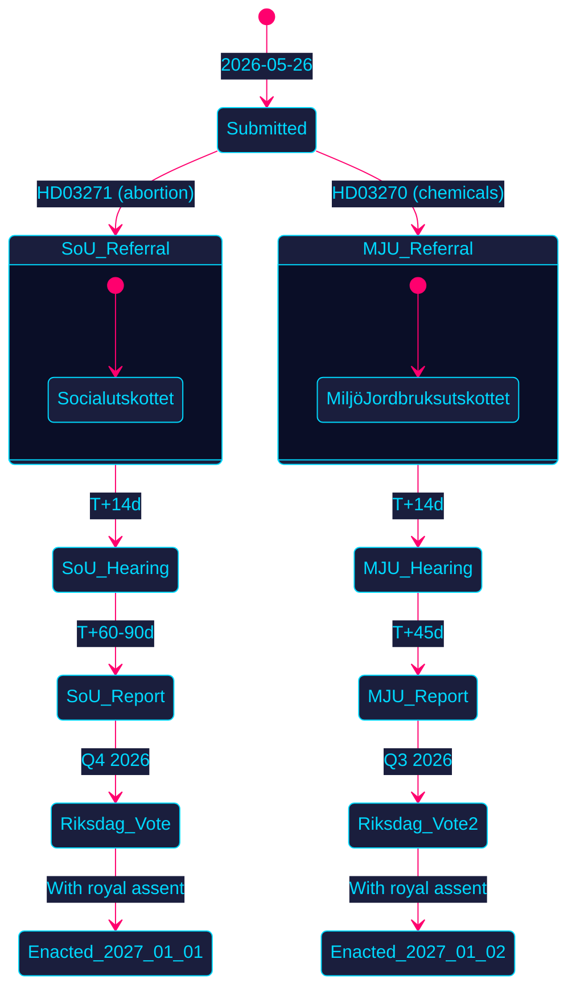

<!-- SPDX-FileCopyrightText: 2024-2026 Hack23 AB -->
<!-- SPDX-License-Identifier: Apache-2.0 -->

# 🏛️ Political Classification — Propositions 2026-05-27

**Run:** propositions-run01 | **Date:** 2026-05-27

---

## Document Classifications

| dok_id | Title | Policy domain | Controversy | Coalition owned | Opposition likely |
|--------|-------|---------------|-------------|-----------------|-------------------|
| HD03271 | En förändrad abortlag | Reproductive rights / Healthcare | HIGH | KD/M/L/SD (Tidö) | Cross-party support likely |
| HD03270 | Kompletterande bestämmelser EU kemikalier/avfall | Environmental / EU compliance | LOW | All parties | None expected |

---

## Political Classification Matrix

### HD03271 — En förändrad abortlag

**Classification:** Major domestic reform — High political salience

| Dimension | Assessment | Evidence |
|-----------|------------|----------|
| **Ideological placement** | Centre-right government enabling liberal reform | HD03271 KD sponsorship |
| **Values politics** | HIGH — reproductive rights, KD social conservatism | KD party history |
| **Technical complexity** | MEDIUM — legal amendments to 1974 law | HD03271 §2 statutory text |
| **Electoral impact** | HIGH — 2026 election proximity | Election calendar |
| **EU nexus** | NONE — purely domestic law | HD03271 §4 background |
| **Budget impact** | LOW-MEDIUM — IVO compliance costs | HD03271 §10.9-10.10 |

**Proposed legislative changes:**
1. Remove hospital requirement → home abortions enabled
2. Midwives permitted to handle medical abortions independently
3. Telemedicine provision explicitly included
4. Flexible drug dispensing at refill stations
5. "Skyndsamt" (promptly) requirement codified
6. Language modernisation ("pregnant woman" replaces "woman who requests")

**Evidence table:**
| Claim | Evidence | Retrieved | Confidence |
|-------|----------|-----------|------------|
| KD minister Jakob Forssmed is sponsor | HD03271 signatories | 2026-05-27T06:59Z | A2 |
| Based on SOU 2025:10 | HD03271 §3 background | 2026-05-27T06:59Z | A2 |
| Committee: SoU | HD03271 metadata (organ: SoU) | 2026-05-27T06:59Z | A2 |

---

### HD03270 — Kompletterande bestämmelser EU kemikalier/avfall

**Classification:** Routine EU-compliance legislation — Low political salience

| Dimension | Assessment | Evidence |
|-----------|------------|----------|
| **Ideological placement** | Bipartisan (EU obligation) | HD03270 background |
| **Values politics** | LOW | Technical legal changes |
| **Technical complexity** | HIGH — three EU regulations simultaneously | HD03270 §4 |
| **Electoral impact** | LOW | No voter-facing issues |
| **EU nexus** | HIGH — CLP + waste transport + packaging | HD03270 §4 |
| **Budget impact** | LOW — minor administrative costs | HD03270 §9 |

---

## Party-by-Party Political Classification

| Party | Seats | Classification on HD03271 | Classification on HD03270 |
|-------|-------|--------------------------|--------------------------|
| S | 107 | Likely supportive — historically pro-abortion access | Supportive |
| M | 68 | Government — supportive | Government — supportive |
| SD | 62 | Likely supportive but values risk | Supportive |
| MP | 24 | Strongly supportive | May want stronger rules |
| V | 24 | Strongly supportive | Supportive, may amend packaging |
| KD | 19 | Government sponsor (paradox) | Supportive |
| C | 16 | Supportive | Supportive |
| L | 16 | Strongly supportive | Supportive |

**Source:** Riksdag seat distribution 2022-2026 election cycle; party programs on file.

---

## Legislative Pathway Classification

---

## 🔄 Pass 2 Self-Audit

- ✅ Both documents classified across multiple dimensions
- ✅ All 8 parties with seat counts assessed
- ✅ Evidence anchor rows for classification claims
- ✅ Legislative pathway Mermaid with colour theming
- ✅ No banned phrases
