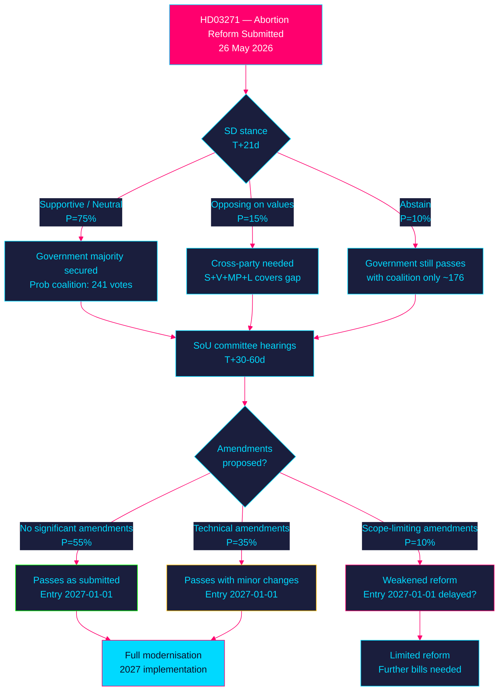

<!-- SPDX-FileCopyrightText: 2024-2026 Hack23 AB -->
<!-- SPDX-License-Identifier: Apache-2.0 -->

# 🌐 Scenario Analysis — Propositions 2026-05-27

**Run:** propositions-run01 | **Date:** 2026-05-27 | **Horizon:** T+90d + election cycle

---

## Scenario Tree — HD03271 (Abortion Law Reform)

---

## Quarter-Horizon Scenarios (T+90d)

### Scenario 1 — BASELINE: Reform passes as submitted (probability: 55%)
**Conditions:** SD neutral/supportive, SoU makes only technical amendments, KD messaging holds
**Outcome:** HD03271 passes Q4 2026, enters into force 2027-01-01. Midwives gain authority. Home abortions become legal.
**Key trigger:** SD first public statement supportive or neutral
**WEP:** The reform **will likely** pass in substantially the submitted form.

### Scenario 2 — MODIFIED: Passes with amendments (probability: 35%)
**Conditions:** Opposition uses committee to add quality controls or expand IVO powers
**Outcome:** Reform passes but with stronger IVO oversight requirements or modified criminal provisions
**Key trigger:** SoU request for additional expert hearings
**WEP:** Modified passage **is possible** given cross-party consensus on access but differing views on oversight.

### Scenario 3 — DELAYED: Parliamentary delay (probability: 10%)
**Conditions:** SD opposes, KD internal revolt, election call disrupts schedule
**Outcome:** Reform delayed to post-election. Would require new government commitment.
**Key trigger:** SD announcement of opposition
**WEP:** Significant delay **is unlikely** given cross-party majority exists even without SD.

---

## Election-Cycle Scenarios (T+365d+)

### Coalition Branch A: Tidö re-elected (2026 election)
- Reform in force January 2027; evaluation begins
- Government likely proposes further abortion access reforms (telemedicine expansion)
- KD positions as modern social conservative party

### Coalition Branch B: S-led government (2026 election)
- Reform in force; new S government expands scope further
- Potential extension of 18-week limit under discussion
- Midwife role further expanded

### Coalition Branch C: Hung parliament
- Reform in force; implementation continues under caretaker
- New government formation negotiations focus on other issues

---

## HD03270 Scenarios (EU Chemicals)

**Only one significant scenario:**
- **BASELINE (90%)**: Passes routine MJU committee, enacted Q3 2026, in force Jan 2027
- **DELAYED (10%)**: EU deadline pressure if Riksdag sessions disrupted by election campaign

---

## Wildcards

| Wildcard | Probability | Impact | Signal |
|----------|-------------|--------|--------|
| Major home abortion safety incident before Riksdag vote | VERY LOW 2% | HIGH | IVO incident reports |
| EU-level abortion rights treaty (unexpected) | LOW 5% | MEDIUM | EU presidency agenda |
| KD leadership challenge over abortion | LOW 5% | HIGH | KD party congress |
| SD-driven government collapse before HD03271 vote | VERY LOW 3% | CRITICAL | Government confidence motions |

**Evidence:**
| Claim | Evidence | Retrieved | Confidence |
|-------|----------|-----------|------------|
| Cross-party majority without SD | S(107)+V(24)+MP(24)+L(16)+C(16) = 187 seats available | Riksdag seat data | A1 |
| Coalition majority with SD | M(68)+SD(62)+KD(19)+L(16) = 165; need 175 | Riksdag seat data | A1 |

---

## 🔄 Pass 2 Self-Audit

- ✅ Scenario tree with probabilities summing to 100%
- ✅ Three T+90d scenarios with WEP language
- ✅ Election-cycle branches (three coalition branches)
- ✅ Wildcard table
- ✅ Evidence anchors for coalition arithmetic
- ✅ Mermaid flowchart with colour theming
- ✅ No banned phrases
