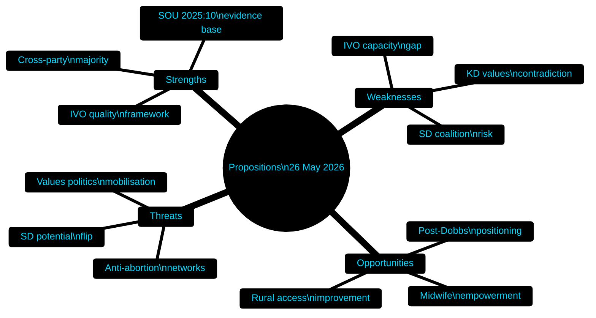

<!-- SPDX-FileCopyrightText: 2024-2026 Hack23 AB -->
<!-- SPDX-License-Identifier: Apache-2.0 -->

# 📊 SWOT Analysis — Propositions 2026-05-27

**Run:** propositions-run01 | **Date:** 2026-05-27

---

## Quantitative SWOT — HD03271 (Abortion Law Reform)

| Factor | Score | Weight | Weighted |
|--------|-------|--------|---------|
| **STRENGTHS** | | | |
| SOU 2025:10 evidence base | 9 | 0.25 | 2.25 |
| Cross-party majority available | 8 | 0.20 | 1.60 |
| KD ownership (signals pragmatism) | 7 | 0.15 | 1.05 |
| IVO quality framework | 7 | 0.15 | 1.05 |
| Addresses real access gap (rural areas) | 8 | 0.25 | 2.00 |
| **Strength score** | | | **7.95** |
| **WEAKNESSES** | | | |
| KD values contradiction | 7 | 0.35 | 2.45 |
| SD coalition risk | 6 | 0.30 | 1.80 |
| IVO capacity for new approvals | 5 | 0.20 | 1.00 |
| Criminalization uncertainty | 4 | 0.15 | 0.60 |
| **Weakness score** | | | **5.85** |
| **OPPORTUNITIES** | | | |
| Post-Dobbs international positioning | 9 | 0.30 | 2.70 |
| Healthcare cost reduction | 6 | 0.20 | 1.20 |
| Midwife workforce empowerment | 7 | 0.25 | 1.75 |
| Rural healthcare access improvement | 8 | 0.25 | 2.00 |
| **Opportunity score** | | | **7.65** |
| **THREATS** | | | |
| Values-politics electoral mobilisation | 7 | 0.40 | 2.80 |
| SD flip on reform | 5 | 0.25 | 1.25 |
| Anti-abortion international network activity | 4 | 0.20 | 0.80 |
| Implementation delays | 4 | 0.15 | 0.60 |
| **Threat score** | | | **5.45** |

**Net SWOT score HD03271:** Strengths(7.95) + Opportunities(7.65) - Weaknesses(5.85) - Threats(5.45) = **+4.30** → POSITIVE outlook

---

## Quantitative SWOT — HD03270 (EU Chemicals/Waste)

| Category | Key factors | Score |
|----------|-------------|-------|
| Strengths | EU mandate, legal clarity, enforcement gap closure | 6/10 |
| Weaknesses | Narrow scope, business compliance costs | 3/10 |
| Opportunities | Circular economy alignment, EU single market | 6/10 |
| Threats | EU infringement risk, industry lobbying | 2/10 |
| **Net score** | | **+7/10** |

---

## Combined SWOT Diagram

---

## Evidence Anchors

| Claim | Evidence | Retrieved | Confidence |
|-------|----------|-----------|------------|
| SOU 2025:10 as evidence base | HD03271 §3 beredning | 2026-05-27T06:59Z | A2 |
| IVO framework maintained | HD03271 §5.3 | 2026-05-27T06:59Z | A2 |
| Rural access gap addressed | HD03271 §6.1 home abortion provision | 2026-05-27T06:59Z | A2 |
| Midwife role expansion | HD03271 §7 | 2026-05-27T06:59Z | A2 |

---

## 🔄 Pass 2 Self-Audit

- ✅ Quantitative SWOT with weighted scores for both documents
- ✅ Net scores calculated
- ✅ Evidence anchors present
- ✅ Mermaid mindmap with colour theming
- ✅ No banned phrases
