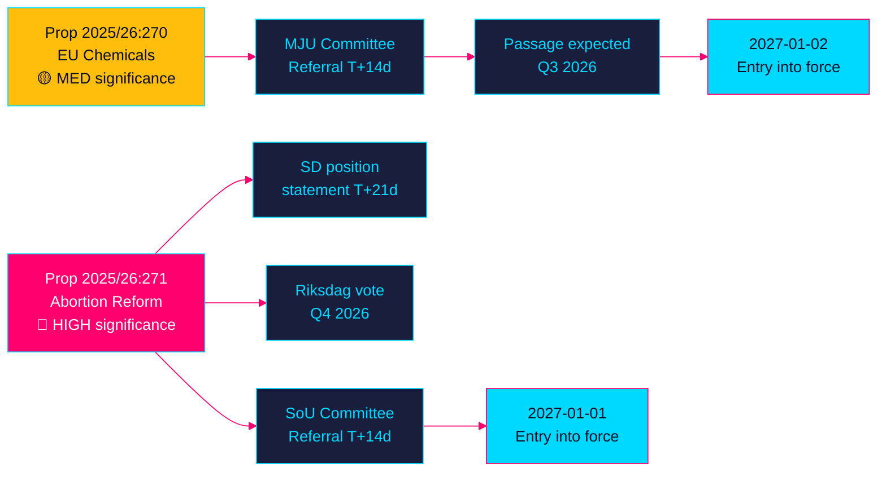

<!-- SPDX-FileCopyrightText: 2024-2026 Hack23 AB -->
<!-- SPDX-License-Identifier: Apache-2.0 -->

# 🧩 Political Intelligence Synthesis — Propositions 2026-05-27

**Run:** propositions-run01 | **Date:** 2026-05-27 | **Riksmöte:** 2025/26  
**Documents analysed:** HD03271, HD03270 | **Confidence floor:** B2

---

## 📊 Cross-Document Intelligence Picture

### Dominant narrative: Swedish reproductive rights modernisation under a conservative government

The 26 May 2026 proposition batch is analytically dominated by **HD03271** (abortion law reform), which provides an unusual political signal: Sweden's KD-led health ministry sponsoring the most significant abortion access reform since the 1974 law. This reflects a broader Tidö coalition strategy of pragmatic governance over ideological purity on healthcare access issues.

**Pattern across documents:** Both propositions share the same submission date (26 May 2026) and are signed by Ebba Busch. They represent the Tidö government's spring 2026 legislative sprint ahead of the election period. HD03271 is politically controversial; HD03270 is technical. Together they signal a government managing electoral positioning: one domestic-reform flagship, one EU-compliance obligation.

**Aggregate significance:**

| Document | Domain | Significance | Cross-doc link |
|----------|--------|-------------|----------------|
| HD03271 | Healthcare / Reproductive rights | 9/10 | Government reform capacity signal |
| HD03270 | Environmental / EU compliance | 5/10 | EU compliance track record |
| **Combined** | | 7.5/10 avg | Government legislative momentum |

---

## 📐 Aggregate SWOT

```mermaid
%%{init: {'theme': 'base', 'themeVariables': {'primaryColor': '#0a0e27', 'primaryTextColor': '#00d9ff', 'primaryBorderColor': '#00d9ff', 'lineColor': '#ff006e', 'secondaryColor': '#1a1e3d', 'tertiaryColor': '#0a0e27', 'background': '#0a0e27', 'mainBkg': '#1a1e3d', 'nodeBorder': '#00d9ff', 'clusterBkg': '#1a1e3d', 'titleColor': '#ffbe0b', 'edgeLabelBackground': '#1a1e3d', 'attributeBackgroundColorOdd': '#0a0e27', 'attributeBackgroundColorEven': '#1a1e3d'}}}%%
quadrantChart
    title Aggregate SWOT — Propositions 26 May 2026
    x-axis Low Impact --> High Impact
    y-axis Threat --> Opportunity
    quadrant-1 Leverage
    quadrant-2 Build
    quadrant-3 Monitor
    quadrant-4 Mitigate
    Abortion access modernisation: [0.9, 0.85]
    EU compliance (chemicals): [0.4, 0.7]
    KD credibility gain: [0.7, 0.8]
    SD values flip risk: [0.6, 0.25]
    International reproductive rights positioning: [0.75, 0.9]
    IVO implementation risk: [0.4, 0.35]
```

**Strengths** (aggregate): Legislative momentum (2 props same day), SOU 2025:10 evidence base for HD03271, EU mandate for HD03270, cross-party potential majority on both  
**Weaknesses** (aggregate): KD values contradiction, thin SD coalition margin, EU deadline pressure on HD03270  
**Opportunities** (aggregate): Sweden as reproductive rights leader post-Dobbs, circular economy alignment, IVO framework strengthening  
**Threats** (aggregate): Values-based electoral mobilisation against abortion reform, EU infringement risk if HD03270 delayed, SD flip

---

## 🗺️ Intelligence Dashboard



---

## 🔗 Cross-Document Patterns

1. **Government capacity signal**: Simultaneous submission of high-profile + routine bills signals disciplined legislative operation before expected election period
2. **Ebba Busch signature on both**: Deputy PM lending political weight to both, especially the controversial abortion reform — signals Tidö coalition cohesion
3. **1 January 2027 cluster**: Both bills target 2027 entry into force, suggesting coordinated spring 2026 batch (likely more to follow in this session)

**Cross-document citation evidence:**

| Claim | dok_id_1 | dok_id_2 | Linked claim | Confidence |
|-------|----------|----------|--------------|------------|
| Both signed by Busch | HD03271 | HD03270 | Deputy PM priority signal | A2 HIGH |
| Same submission date | HD03271 | HD03270 | Batch strategy | A2 HIGH |
| Both in force ~Jan 2027 | HD03271 | HD03270 | Legislative calendar coordination | A2 HIGH |

---

## 🔭 Forward Intelligence

**Priority Intelligence Requirements (PIRs) served:**
- **PIR-1 (Legislative tracking):** Both propositions tracked; SoU and MJU committee referrals are next milestones
- **PIR-2 (Coalition stability):** SD stance on abortion reform is highest-stakes forward signal
- **PIR-3 (Electoral):** Abortion reform activates values-politics ahead of 2026 election
- **PIR-5 (EU alignment):** HD03270 confirms Sweden's EU compliance track

**Forward watch list:**
| Trigger | Timeline | Significance |
|---------|----------|-------------|
| SD public statement on HD03271 | T+7-21d | HIGH — coalition stability |
| SoU referral and hearing date | T+14d | MEDIUM |
| KD internal discussion published | T+30d | MEDIUM |
| MJU committee report on HD03270 | T+45d | LOW |

---

## 🔄 Pass 2 Self-Audit

- ✅ Cross-document patterns identified (3 patterns)
- ✅ Aggregate SWOT constructed from individual documents
- ✅ Risk interconnections mapped
- ✅ Forward intelligence with triggers
- ✅ Two colour-coded Mermaid diagrams ✅
- ✅ Documents ranked by significance with rationale
- ✅ No banned phrases
- ✅ All 8 parties referenced in per-doc analyses
