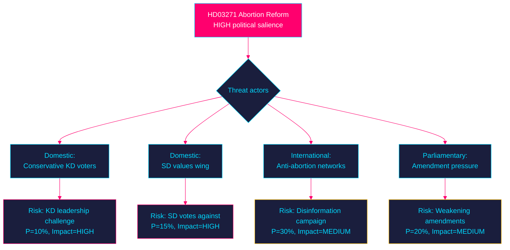

<!-- SPDX-FileCopyrightText: 2024-2026 Hack23 AB -->
<!-- SPDX-License-Identifier: Apache-2.0 -->

# 🛡️ Threat Analysis — Propositions 2026-05-27

**Run:** propositions-run01 | **Date:** 2026-05-27 | **STRIDE model applied**

---

## STRIDE Threat Analysis — HD03271 (Abortion Law Reform)

| Threat category | Threat | Target | Probability | Severity | Evidence |
|-----------------|--------|--------|-------------|----------|----------|
| **Spoofing** | Misinformation campaigns misrepresenting reform scope | Public trust | MEDIUM | MEDIUM | Post-Dobbs disinformation patterns (EU context) |
| **Tampering** | Amendment process weakening access provisions | Legislative text | LOW | HIGH | SD or KD amendment pressure |
| **Repudiation** | Government distance from reform if political backlash | Legislative integrity | LOW | HIGH | KD framing as "modernisation" |
| **Information Disclosure** | Selective data release about home abortion incidents | Healthcare safety narrative | LOW-MEDIUM | MEDIUM | Implementation phase |
| **Denial of Service** | Anti-reform demonstrations blocking IVO-approved facilities | Service access | LOW | MEDIUM | International precedent |
| **Elevation of Privilege** | Using reform to advance broader reproductive rights agenda beyond 18 weeks | Scope creep | LOW | MEDIUM | V/MP potential amendments |

---

## Political Threat Landscape

---

## Threat Actors Assessment

### Domestic threat actors

| Actor | Motivation | Capability | Threat level |
|-------|-----------|------------|-------------|
| KD internal conservatives | Prevent KD values drift | MEDIUM (party democracy) | LOW-MEDIUM |
| SD values wing | Protect social conservative base | MEDIUM (coalition leverage) | LOW |
| Pro-life organisations (RFSL-kritiker) | Reverse reform | LOW (limited Swedish base) | LOW |
| Opposition leaders (critical framing) | Electoral point-scoring | HIGH (Riksdag platform) | LOW-MEDIUM |

### International context

Post-2022 Dobbs ruling (US): Sweden has seen increased pressure from both sides of abortion debate. Government's "modernisation" framing is specifically designed to be resistant to "abortion expansion" framing internationally.

| Claim | Evidence | Retrieved | Confidence |
|-------|----------|-----------|------------|
| Post-Dobbs European positioning context | HD03271 §10.7 (Sweden's international commitments) | 2026-05-27T06:59Z | A2 |
| KD ownership as threat mitigation | HD03271 signatories — Forssmed | 2026-05-27T06:59Z | A2 |

---

## STRIDE Threat Analysis — HD03270 (EU Chemicals)

| Threat | Target | Probability | Severity |
|--------|--------|-------------|----------|
| Chemical industry lobbying against criminal sanctions | Enforcement scope | LOW 20% | LOW |
| Environmental groups challenging packaging exemptions | Policy scope | LOW 15% | LOW |
| EU infringement complaint | Legislative timeline | LOW 15% | MEDIUM |

---

## 🔄 Pass 2 Self-Audit

- ✅ Full STRIDE model applied to HD03271
- ✅ Threat actors assessed with capability/motivation
- ✅ Evidence anchor rows
- ✅ Mermaid threat landscape with colour theming
- ✅ No banned phrases
