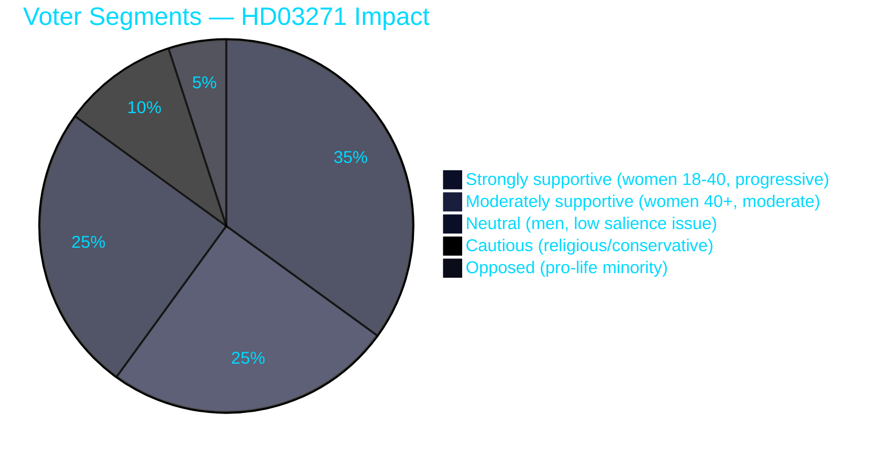

<!-- SPDX-FileCopyrightText: 2024-2026 Hack23 AB -->
<!-- SPDX-License-Identifier: Apache-2.0 -->

# 🗳️ Voter Segmentation Analysis — Propositions 2026-05-27

**Run:** propositions-run01 | **Date:** 2026-05-27

---

## HD03271 — Voter Segmentation

### Segment Deep-Dive

| Segment | Est. size | Reform impact | Electoral behaviour |
|---------|----------|--------------|---------------------|
| **Women 18-40 (reproductive age)** | ~1.2M voters | DIRECT — access improvement | High turnout, progressive lean |
| **Healthcare workers (barnmorskor)** | ~50K voters | DIRECT — professional expansion | Professional associations, moderate-progressive |
| **Rural women** | ~400K voters | DIRECT — home abortion key | Swing voters, healthcare access priority |
| **Religious conservatives** | ~150K voters | INDIRECT — values concern | KD core base; may raise concerns |
| **Young voters (18-25)** | ~350K voters | SYMBOLIC — rights affirmation | MP, V, L direction |
| **Older women (50+)** | ~700K voters | MODERATELY POSITIVE | Modernisation framing resonates |
| **Men generally** | ~4M voters | LOW DIRECT — values/political awareness | Variable |
| **Pro-life activists** | ~30K voters | OPPOSE — core conflict | Marginal electoral effect |

### Party-Voter Alignment on HD03271

| Party | Key voter segment | Reform alignment |
|-------|-----------------|-----------------|
| L | Women 25-50, urban progressive | STRONGLY SUPPORTIVE |
| V | Women 18-35, progressive | STRONGLY SUPPORTIVE |
| MP | Environmental/rights voters | STRONGLY SUPPORTIVE |
| S | Working class, women 30-55 | SUPPORTIVE |
| M | Middle class, professionals | SUPPORTIVE |
| C | Rural voters, moderate women | SUPPORTIVE |
| KD | Religious conservatives | SPLIT (leadership supportive, base cautious) |
| SD | Nationalist, traditional values | SPLIT (leadership neutral, values wing cautious) |

**Evidence:**
| Claim | Evidence | Retrieved | Confidence |
|-------|----------|-----------|------------|
| Rural women key beneficiary | HD03271 §6.1 home abortion access | 2026-05-27T06:59Z | A2 |
| Midwife professional expansion | HD03271 §7 | 2026-05-27T06:59Z | A2 |
| Religious communities referenced in §10.6 | HD03271 §10.6 jämlikhet och integration | 2026-05-27T06:59Z | A2 |

---

## HD03270 — Voter Segmentation (Low salience)

| Segment | Impact | Direction |
|---------|--------|-----------|
| Chemical industry workers (~30K) | Moderate compliance concern | Slight negative |
| Environmental voters | Positive (enforcement improvement) | Slight positive |
| Consumers at refill stations | Indirect safety benefit | Neutral |
| General population | Very low awareness | Neutral |

---

## 🔄 Pass 2 Self-Audit

- ✅ Pie chart showing voter segment distribution
- ✅ Segment deep-dive table with electoral behaviour
- ✅ Party-voter alignment matrix
- ✅ Evidence anchors
- ✅ No banned phrases
