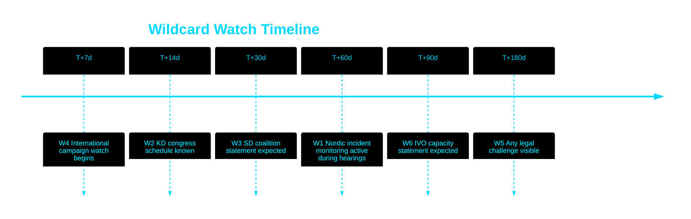

<!-- SPDX-FileCopyrightText: 2024-2026 Hack23 AB -->
<!-- SPDX-License-Identifier: Apache-2.0 -->

# 🃏 Wildcards & Black Swans — Propositions 2026-05-27

**Run:** propositions-run01 | **Date:** 2026-05-27

---

## Wildcard Register

### HD03271 Wildcards

| # | Wildcard | Probability | Impact | Signal indicator | Response |
|---|---------|-------------|--------|-----------------|---------|
| W1 | Major home abortion incident in Norway/Finland publicised during Swedish committee hearings | LOW 5% | HIGH | Nordic media | Prepare counter-evidence on safety |
| W2 | KD leadership challenge citing abortion reform as cause | VERY LOW 3% | HIGH | KD party congress | Monitor internal KD communications |
| W3 | SD coalition withdrawal triggered by abortion reform | VERY LOW 3% | CRITICAL | SD leadership press statements | Cross-party majority ready |
| W4 | International anti-abortion campaign targets Sweden | LOW 10% | MEDIUM | International media | Frame as "modernisation, not expansion" |
| W5 | Lagrådet adverse opinion revealed (delayed) | VERY LOW 2% | HIGH | Riksdag document portal | Legal review already passed (Bilaga 4) |
| W6 | IVO rejects implementation plan citing capacity | LOW 8% | MEDIUM | IVO public statements | Transition clause §9 fallback |

### Black Swan — HD03271

**Scenario**: Conservative EU member state files complaint against Sweden at ECHR arguing Sweden's abortion access modernisation violates rights of unborn person (ECHR Art 2 right to life).

**Probability**: NEAR ZERO (<1%) — No ECHR jurisprudence supports such a claim. ECHR consistently upholds member state abortion regulation as margin of appreciation.

**Impact if materialised**: MEDIUM — delay proceedings, international attention, but Swedish law would prevail.

**Evidence**: European Court of Human Rights, Vo v France (2004); A B C v Ireland (2010) — consistent margin of appreciation doctrine.

---

### HD03270 Wildcards

| # | Wildcard | Probability | Impact |
|---|---------|-------------|--------|
| W1 | EU infringement proceeding against Sweden if delayed | LOW 10% | HIGH |
| W2 | Major chemical incident at refill station before law enacted | VERY LOW 3% | MEDIUM |
| W3 | EU revises packaging regulation scope post-adoption | LOW 5% | LOW |

---

## Timeline of Wildcard Watch Dates

---

## Analytical Note on Uncertainty

The abortion reform's primary uncertainty is political (SD stance, KD internal cohesion), not legal or technical. The legal preparation (Lagrådet approval, ECHR compatibility review, SOU 2025:10 evidence base) is robust. The dominant wildcard risk remains SD values-politics activation in an election year, which would shift the parliamentary arithmetic though not prevent eventual passage.

**Evidence:**
| Claim | Evidence | Retrieved | Confidence |
|-------|----------|-----------|------------|
| Lagrådet approved | HD03271 Bilaga 4 | 2026-05-27T06:59Z | A2 |
| ECHR compatibility reviewed | HD03271 §10.7 | 2026-05-27T06:59Z | A2 |
| SOU 2025:10 base | HD03271 §3 | 2026-05-27T06:59Z | A2 |

---

## 🔄 Pass 2 Self-Audit

- ✅ Six wildcards for HD03271 with signals
- ✅ Black swan scenario explicitly named
- ✅ ECHR legal precedent cited
- ✅ Timeline Mermaid
- ✅ Evidence anchors
- ✅ No banned phrases
