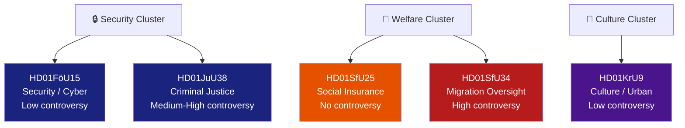

# Classification Results — Committee Reports, 2026-05-28

<!-- artifact: classification-results | family: A | pass: 2 -->

## Classification Framework

Each document classified across: policy domain, ideological dimension, urgency tier, controversy level, and bloc alignment.

## Per-Document Classification

### HD01FöU15 — Cybersecurity Laws

| Dimension | Classification |
|-----------|---------------|
| **Policy domain** | National security / digital governance |
| **Legislation type** | 3 new/amended laws (uppgiftsskyldighetslagen, FRA PUL, OSL) |
| **Ideological dimension** | Security-statist vs. civil-liberties (C reservation) |
| **Urgency tier** | Tier 1 — Entry into force 15 July 2026 |
| **Controversy level** | Low (1/5) — broad consensus; one C reservation on future scope |
| **Bloc alignment** | Tidö coalition + S support; C mild dissent |
| **EU/NIS2 alignment** | Yes — closes NIS2 Directive CSIRT cooperation gap |
| **Parliamentary stage** | Debatt om förslag → Riksdagsbeslut imminent |

### HD01JuU38 — Criminal Justice (Recidivism/Escape)

| Dimension | Classification |
|-----------|---------------|
| **Policy domain** | Criminal justice / law enforcement |
| **Legislation type** | Multiple BrB amendments + fängelselagen + säkerhetsförvaringslagen |
| **Ideological dimension** | Authoritarian-punitive vs. rehabilitative/rights-based |
| **Urgency tier** | Tier 1 — Entry into force 2 July 2026 |
| **Controversy level** | Medium-High (3.5/5) — MP reservation on escape criminalisation; NGO concern on vistelseföreskrifter |
| **Bloc alignment** | M+SD+KD+L (for); MP partial (against pt 1); S, V, C not listed as reserving |
| **Human rights dimension** | Art. 5 ECHR (liberty), Art. 8 (movement restrictions), asylum-seeker escape note |
| **Parliamentary stage** | Debatt om förslag → Riksdagsbeslut imminent |

### HD01KrU9 — Architecture/Design Policy

| Dimension | Classification |
|-----------|---------------|
| **Policy domain** | Cultural policy / urban planning |
| **Legislation type** | Government communication (skrivelse) — no new legislation |
| **Ideological dimension** | Market-oriented design policy vs. socially-driven urban design |
| **Urgency tier** | Tier 4 — long-run orientation document |
| **Controversy level** | Low (1.5/5) — V+MP reservation on ambition level |
| **Bloc alignment** | M+SD+KD+L+S (for laying to handlingarna); V+MP (reservation) |
| **Parliamentary stage** | Skrivelse laid to handlingarna |

### HD01SfU25 — Pension Surplus

| Dimension | Classification |
|-----------|---------------|
| **Policy domain** | Social insurance / pension policy |
| **Legislation type** | socialförsäkringsbalken amendment |
| **Ideological dimension** | Technical actuarial reform — cross-bloc Pension Group |
| **Urgency tier** | Tier 2 — entry into force 1 August 2026, applied from 2027 |
| **Controversy level** | None (0/5) — unanimous Pension Group agreement |
| **Bloc alignment** | All parties (Pension Group: M, S, SD, V, KD, C, L, MP) |
| **Parliamentary stage** | Riksdagsbeslut imminent |

### HD01SfU34 — Migration Detention Oversight

| Dimension | Classification |
|-----------|---------------|
| **Policy domain** | Migration policy / administrative oversight |
| **Legislation type** | Government skrivelse response to Riksrevisionen RiR 2025:32 |
| **Ideological dimension** | Rule-of-law/rights vs. enforcement-first migration management |
| **Urgency tier** | Tier 1 — election-campaign-relevant (1.5× DIW) |
| **Controversy level** | High (4.5/5) — 5 reservations from S, V, C, MP |
| **Bloc alignment** | SD+M+KD+L (accept gov response); S+V+C+MP (5 reservations) |
| **Rule-of-law dimension** | ECHR Art.5, UNCRC, UNHCR detention guidelines |
| **Parliamentary stage** | Skrivelse laid to handlingarna; motions rejected |

### HD01UU18 — War Materiel Regulatory Framework

| Dimension | Classification |
|-----------|---------------|
| **Policy domain** | Defence / arms export regulation |
| **Legislation type** | Unknown (metadata-only; full text unavailable) |
| **Ideological dimension** | Unknown pending full text |
| **Urgency tier** | Unknown |
| **Controversy level** | Unknown |
| **Bloc alignment** | Unknown |
| **Parliamentary stage** | Debatt om förslag |

## Cross-Classification Patterns

**Security cluster coherence**: FöU15 and JuU38 both advance state security powers (cyber + criminal justice). Both have near-term entry-into-force dates (July 2026). Both are Tidö coalition priorities with limited opposition.

**Opposition unity fault line**: The SfU34 migration detention case reveals the broadest opposition consensus — S+V+C+MP across 5 reservation topics. This breadth (including C, which occasionally votes with Tidö) suggests principled rule-of-law concerns rather than pure electoral positioning.

**Consensual outlier**: SfU25 (pension) is the sole cross-bloc agreement. The Pension Group institutional architecture succeeds in depoliticising what is otherwise a highly contested domain (welfare state size).
