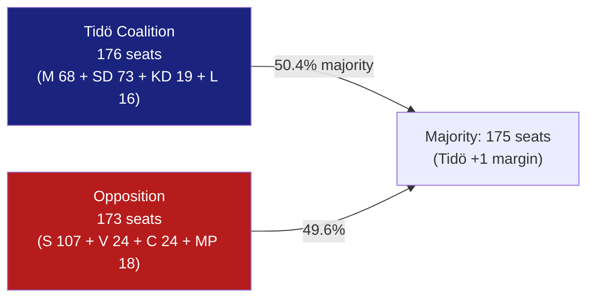

# Coalition Mathematics — Committee Reports, 2026-05-28

<!-- artifact: coalition-mathematics | family: D | pass: 2 -->

## Current Riksdag Seat Distribution (2022 election)

Total seats: 349

| Party | Seats | % | Bloc |
|-------|-------|---|------|
| S (Socialdemokraterna) | 107 | 30.7% | Opposition |
| SD (Sverigedemokraterna) | 73 | 20.9% | Coalition (Tidö) |
| M (Moderaterna) | 68 | 19.5% | Coalition (Tidö) |
| V (Vänsterpartiet) | 24 | 6.9% | Opposition |
| C (Centerpartiet) | 24 | 6.9% | Opposition |
| KD (Kristdemokraterna) | 19 | 5.4% | Coalition (Tidö) |
| MP (Miljöpartiet) | 18 | 5.2% | Opposition |
| L (Liberalerna) | 16 | 4.6% | Coalition (Tidö) |
| **Tidö total** | **176** | **50.4%** | M+SD+KD+L |
| **Opposition total** | **173** | **49.6%** | S+V+C+MP |

## Vote Analysis: Committee Report Decisions

### HD01FöU15 (Cybersecurity) — FöU vote breakdown

Committee approval pattern: All parties except C reservation (pt 2 only).

**Projected chamber vote**: ~331 Ja (S, SD, M, V, KD, L, MP all expected to vote for pt 1); C reservation on pt 2 only → C 24 votes against pt 2, 317 votes for.

**Reservation significance**: C's 24 seats are insufficient to block. Not a close vote.

---

### HD01JuU38 (Criminal Justice) — JuU vote breakdown

Committee approval pattern: All except MP reservation (pt 1 — escape criminalisation).

**Projected chamber vote pt 1**: MP 18 votes against + some C (?) → ~325-331 for; 18-24 against. Majority: YES.

**Projected chamber vote pt 2**: Unanimous.

---

### HD01SfU25 (Pension Surplus) — SfU vote breakdown

Unanimously approved in committee (Pension Group all parties).

**Projected chamber vote**: ~349 Ja (unanimous or near-unanimous). No reservations.

---

### HD01SfU34 (Migration Detention) — SfU vote breakdown

Committee voted: Tidö coalition (SD+M+KD+L = 176) accepts government response; S+V+C+MP (173) reserve.

| Motion | Filed by | For (if passed) | Against | Outcome |
|--------|----------|-----------------|---------|---------|
| 3968 yr.1 (oversight) | S (mot) | 173 opp. | 176 coal. | REJECTED |
| 3968 yr.2 (coordination) | S (mot) | 173 opp. | 176 coal. | REJECTED |
| 3968 yr.3–4 (competence+child) | S (mot) | 173 opp. | 176 coal. | REJECTED |
| 3976 yr.2 (detention decisions) | C (mot) | 173 opp. | 176 coal. | REJECTED |
| 3983 yr.1–2 (rättssäkerhet) | MP (mot) | 42 (V+MP) | ~307 | REJECTED |

**Coalition stability**: 176-173 margin is the thinnest possible majority (3-seat buffer). Any defection from coalition on migration matters could alter outcomes. Today's 5-reservation pattern shows the opposition is cohesive on this domain.

---

## 2026 Election Seat Projection

Based on hypothetical polling scenarios:

### Scenario A — Status quo (current polls, approximately):
- S: ~98–107 seats (slight decline from 107)
- SD: ~75–80 seats (modest gain)
- M: ~62–68 seats (holding)
- V: ~22–25 seats
- C: ~22–25 seats (near threshold recovery)
- KD: ~17–20 seats (near threshold risk)
- MP: ~17–20 seats (near threshold)
- L: ~15–17 seats (threshold risk)

**Projected coalition**: If Tidö holds 175+, Kristersson government continues. If coalition drops below 175, negotiation scenario opens.

### Scenario B — Governance crisis impact:
If SfU34 migration narrative crystallises (Scenario 2 from scenario-analysis.md), C could gain 2–3 seats at M's expense, potentially creating a 174-175 cliff scenario for Tidö.

### Coalition alternative scenarios (post-election):
| Scenario | Parties | Seats | Viability |
|----------|---------|-------|-----------|
| Tidö continuation | M+SD+KD+L | 174–180 | Likely if S poll stays |
| S-led bloc government | S+V+C+MP | 172–178 | Depends on C positioning |
| S minority government | S + issue-by-issue | ~107 | Unlikely (insufficient) |
| Grand coalition | S+M (historical: never) | ~170 | Very unlikely |

**Assessment**: The 176-173 current seat split makes the 2026 election a genuine toss-up. Each vote counts. The five SfU34 reservations and their election-narrative potential are strategically significant precisely because of this mathematical thinness.
