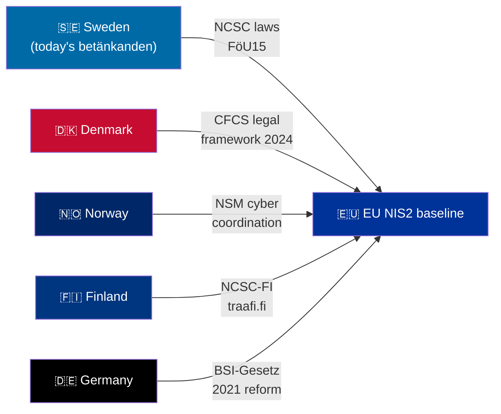

# Comparative International Analysis — Committee Reports, 2026-05-28

<!-- artifact: comparative-international | family: C | pass: 2 -->

## Framework

Comparative analysis across Nordic peers and EU on three key domains: (1) national cybersecurity centre legal frameworks, (2) criminal recidivism sentencing escalation, (3) migration detention governance.

## Domain 1 — National Cybersecurity Centre Legal Frameworks

| Country | NCSC equivalent | Legal basis | Information-sharing model | Key gap addressed |
|---------|-----------------|-------------|--------------------------|-------------------|
| 🇸🇪 Sweden | NCSC (at FRA) | **New: prop 2025/26:214** | Mandatory uppgiftsskyldighet law | OSL secrecy gap closed |
| 🇩🇰 Denmark | CFCS (at FE) | CFCS-lov 2014 + 2024 reform | Statutory information-sharing with KRITIS entities | Aligns with NIS2 Article 13 |
| 🇳🇴 Norway | NSM (Nasjonal sikkerhetsmyndighet) | Sikkerhetsloven 2019 | NSM coordinates; no mandatory cross-agency sharing law | Voluntary sector agreements |
| 🇫🇮 Finland | NCSC-FI (Traficom) | Kyberturvallisuuslaki 2023 | Mandatory incident reporting; NIS2-aligned | Reporting obligations strong |
| 🇩🇪 Germany | BSI (Bundesamt für Sicherheit) | BSIG 2021 reform (IT-Sicherheitsgesetz 2.0) | BSI-Meldepflicht for KRITIS | Broader than NIS2 requirements |
| 🇪🇺 EU baseline | ENISA + national CSIRTs | NIS2 Directive (2022/2555) | Peer-learning network (CyCLONe) | Proactive threat sharing |

**Assessment**: Sweden's FöU15 brings it into line with Denmark's CFCS model. Finland's 2023 kyberturvallisuuslaki and Germany's BSI reforms are arguably more comprehensive, but Sweden's NCSC approach of hosting within FRA (signals intelligence) creates a unique integration depth not matched by civilian NCSC models in Denmark/Finland.

## Domain 2 — Criminal Recidivism Sentencing Escalation

| Country | Recidivism weighting | Gang/organised crime provisions | Prison-escape criminal offence | Notes |
|---------|---------------------|--------------------------------|-------------------------------|-------|
| 🇸🇪 Sweden (JuU38) | **Increased weight** (BrB amendment) | Vistelseföreskrifter for gang-adjacent | **New** (BrB 17:12) | In force 2 July 2026 |
| 🇩🇰 Denmark | Mandatory recidivism escalation in straffeloven | Bandelov (gang provisions, 2021 update) | Yes — straffeloven §123 | More prescriptive than Swedish approach |
| 🇳🇴 Norway | Aggravating circumstance (strl. §§77–80) | Organised crime aggravation §79 | Yes — strl §332 (flukt) | Long-established |
| 🇫🇮 Finland | Aggravating factor (RL 6:5) | Organised crime §6:5.1 | Yes — RL 16:15 | Established |
| 🇩🇪 Germany | BtMG/StGB recidivism provisions | RICO-like §129 StGB (Kriminelle Vereinigung) | Yes — §120 StGB (Gefangenenbefreiung) | Comprehensive |

**Assessment**: Sweden's JuU38 moves Swedish criminal law toward the Nordic median. The escape criminalisation aligns Sweden with Denmark, Norway, Finland, and Germany where prison escape was already a criminal offence. The vistelseföreskrifter (movement restrictions) is analogous to but less prescriptive than Denmark's "opholdsforbud" (ban zones) introduced under 2021 bandelov.

## Domain 3 — Migration Detention Governance

| Country | Detention legal framework | Oversight mechanism | Riksrevisionen-equivalent findings | Child rights compliance |
|---------|--------------------------|--------------------|------------------------------------|------------------------|
| 🇸🇪 Sweden (SfU34) | Utlänningslagen ch.10 | **Gap documented** (RiR 2025:32) | "Costly tool without clear governance" | Deficient (res.5) |
| 🇩🇰 Denmark | Udlændingeloven | Parliamentary questionnaire oversight; CPT visits | CPT 2023 report: conditions adequate | Child separation concerns |
| 🇳🇴 Norway | Utlendingsloven ch.12 | Sivilombudet annual review | Sivilombudet 2022: limited use proportionality | UNCRC compliant |
| 🇫🇮 Finland | Ulkomaalaislaki ch.7 | Non-discrimination Ombudsman oversight | Generally compliant | UNCRC aligned |
| 🇩🇪 Germany | AufenthG §§ 62, 62a–b | Administrativgericht; LfD oversight | CPT 2022: concerns on conditions | Separate child facilities required |

**Assessment**: Sweden is the outlier in the Nordic comparison. Norway and Finland operate detention with established proportionality frameworks and ombudsman oversight. Denmark faces CPT concerns on conditions but has structured oversight. Sweden's RiR 2025:32 finding — "kostsamt verktyg utan tydlig styrning" — is more damning than any recent Nordic peer review. The government's response (administrative guidelines only) is below the statutory frameworks Norway, Finland, and Germany have enacted.

## IMF/SCB Economic Context

> ⚠️ **IMF context unavailable**: IMF Datamapper offline (WEO/FM timeout). CPI SDMX OK. WEO-2026-04 cache used.

Sweden GDP growth 2026e: +1.3% (IMF WEO April 2026 cache). Nordic comparison: Denmark +1.8%, Norway +1.9%, Finland +0.9% (IMF WEO-2026-04 cached estimates). The Swedish growth context is moderate — security spending increases (FöU15, JuU38 implementation) are fiscally manageable but add implementation pressure in a period of subdued domestic demand.

*Economic provenance: provider=imf; dataflow=WEO; indicator=NGDP_RPCH; vintage=WEO-2026-04; retrieved_at=cache (Datamapper unavailable); annotation=inferred from cache.*
