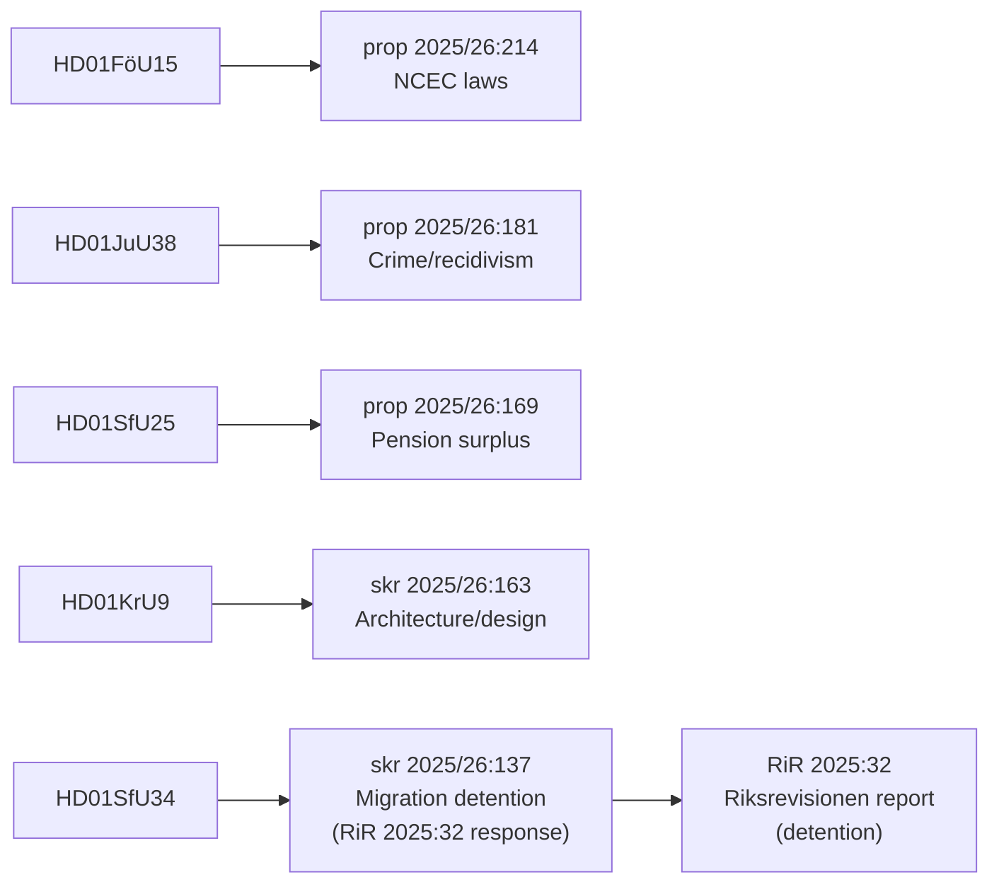

# Cross-Reference Map — Committee Reports, 2026-05-28

<!-- artifact: cross-reference-map | family: B | pass: 2 -->

## Document Inter-Dependencies

## Cross-References by Theme

### Theme: Security & Coercive Powers
| Document | Links to | Relationship |
|----------|----------|--------------|
| HD01FöU15 | HD01UU18 (UU) | Both expand state security/defence legal framework; UU18 on war materiel |
| HD01JuU38 | SfU34 | Escape criminalisation in JuU38 explicitly covers migration detention escape; SfU34 addresses detention governance |
| HD01FöU15 | FöU14, FöU13 (prior sessions) | NCSC legislative chain — FöU15 is the 4th instalment |

### Theme: Migration Policy
| Document | Links to | Relationship |
|----------|----------|--------------|
| HD01SfU34 | HD01JuU38 | Migration detention escape criminalized by JuU38; SfU34 addresses detention governance |
| HD01SfU34 | RiR 2025:32 | SfU34 is parliament's response to Riksrevisionen's direct report |
| HD01SfU34 | Previous SfU betänkanden on migration | Governance gap identified in prior Riksdag reviews |

### Theme: Social Insurance & Welfare
| Document | Links to | Relationship |
|----------|----------|--------------|
| HD01SfU25 | prop 2025/26:169 | Pension Group cross-party agreement |
| HD01SfU25 | socialförsäkringsbalken | Primary statutory vehicle |

### Theme: Cultural & Urban Policy  
| Document | Links to | Relationship |
|----------|----------|--------------|
| HD01KrU9 | skr 2025/26:163 | Architecture policy communication |
| HD01KrU9 | Previous PBL (Plan- och bygglagen) reviews | Urban design governance links |

## Motion Cross-Reference

| Motion | Filed by | Target document | Outcome |
|--------|----------|-----------------|---------|
| 2025/26:4093 | Niels Paarup-Petersen + Mikael Larsson (C) | HD01FöU15 pt 2 | Rejected (res. C) |
| 2025/26:4062 | Ulrika Westerlund m.fl. (MP) | HD01JuU38 pt 1 | Rejected (res. MP) |
| 2025/26:4053 | Mats Berglund m.fl. (MP) yr.1–7 | HD01KrU9 pt 2 | Rejected (res. V+MP) |
| 2025/26:3983 | Annika Hirvonen m.fl. (MP) yr.1–2 | HD01SfU34 pt 1 | Rejected (res. V+MP) |
| 2025/26:3976 | Niels Paarup-Petersen m.fl. (C) yr.1–2 | HD01SfU34 pts 2,4 | Rejected (res. S+V+C+MP) |
| 2025/26:3968 | Ida Karkiainen m.fl. (S) yr.1–4 | HD01SfU34 pts 3,4,5 | Rejected (res. S+V+C+MP) |

## Legislative Chain Summary

| Proposition/Skrivelse | Committee | Betänkande | In-force date |
|----------------------|-----------|------------|---------------|
| prop 2025/26:214 | FöU | HD01FöU15 | 15 July 2026 |
| prop 2025/26:181 | JuU | HD01JuU38 | 2 July 2026 |
| skr 2025/26:163 | KrU | HD01KrU9 | N/A (communication) |
| prop 2025/26:169 | SfU | HD01SfU25 | 1 August 2026 |
| skr 2025/26:137 | SfU | HD01SfU34 | N/A (communication) |
| Unknown | UU | HD01UU18 | Unknown |
