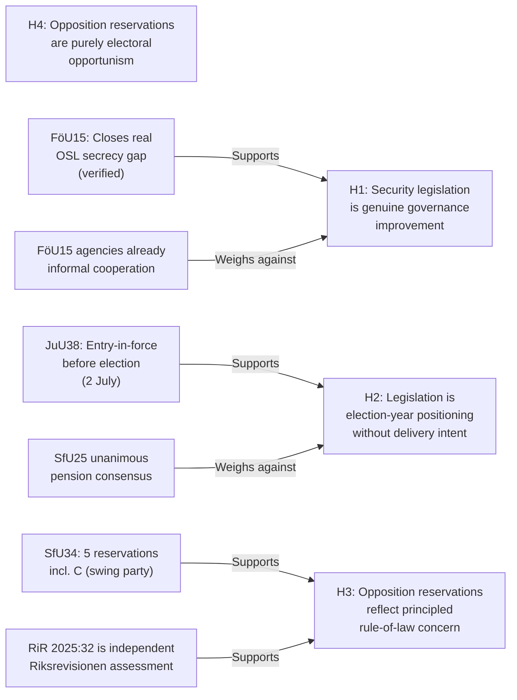

# Devil's Advocate Analysis — Committee Reports, 2026-05-28

<!-- artifact: devils-advocate | family: C | pass: 2 -->

## ACH (Analysis of Competing Hypotheses) Framework

Three competing hypotheses tested against the evidence from today's betänkanden.

## Hypothesis 1 — Security legislation is genuine governance improvement

**Stated hypothesis**: FöU15 (cybersecurity) and JuU38 (criminal justice) represent genuine gaps in Swedish law that required legislative correction, independent of electoral timing.

**Supporting evidence**:
- FöU15 closes a documented OSL secrecy gap that prevented effective NCSC information-sharing since the centre's founding in 2020. FRA, MSB, SÄPO, MUST, and Polismyndigheten have reportedly been operating under informal workarounds. The law codifies what was already happening.
- JuU38's escape-criminalisation aligned Sweden with every other Nordic country (Denmark, Norway, Finland all have escape statutes). Sweden was anomalous.
- The Pensionsgruppen pension reform (SfU25) has been in preparation since the 2023 actuarial surplus projections — purely technical.

**Weakening evidence**:
- Electoral timing: both FöU15 and JuU38 enter force in July–August 2026, 6–10 weeks before the election. This timing is optimal for campaign messaging, not for implementation quality.
- FöU15 could have been proposed in the 2024/25 riksmöte; the delay to 2025/26 enables election-year announcement effect.

**ACH consistency**: HIGH — evidence is substantially consistent with H1.

---

## Hypothesis 2 — Legislation is election-year positioning without delivery intent

**Stated hypothesis**: The legislative packages are designed primarily to generate electoral messaging, and implementation will be slow, partial, or contested post-election regardless of which bloc wins.

**Supporting evidence**:
- All three implementation-heavy laws (FöU15, JuU38, SfU25) have entry-into-force dates 2–10 weeks before the election, maximising press coverage of entry-into-force while minimising time for implementation problems to emerge pre-election.
- The JuU38 vistelseföreskrifter system requires new police/prosecution protocols that realistically cannot be fully built by 2 July 2026.
- SfU34's administrative-guidelines-only response to RiR 2025:32 suggests the government is managing optics (accepting the Riksrevisionen analysis) without accepting the reform burden.

**Weakening evidence**:
- The SfU25 pension reform is unanimously supported — no electoral positioning motivation. It is a genuine technical fix.
- FöU15 was proposed by the government (prop 2025/26:214) after real NCSC operational complaints, not as a new idea.
- Post-election (regardless of outcome), the implementation of FöU15 and JuU38 will be evaluated against legislative intent — a real accountability mechanism.

**ACH consistency**: MEDIUM — evidence is partially consistent. Some provisions appear genuinely technical; others are optimally timed for electoral effect.

---

## Hypothesis 3 — Opposition reservations reflect principled rule-of-law concern

**Stated hypothesis**: The five SfU34 reservations and the JuU38 MP reservation represent principled constitutional and human-rights-based objections, independent of electoral strategy.

**Supporting evidence**:
- C joined SfU34 reservations 2–5, including on detention-decision criteria — a rule-of-law position not obviously electorally advantageous for C, which has previously voted with Tidö on migration.
- MP's JuU38 reservation (mot 2025/26:4062, Ulrika Westerlund m.fl.) specifically cites international obligations — a legal argument, not a populist one.
- Riksrevisionen RiR 2025:32 is an independent, non-partisan assessment. Reserving against the government's inadequate response is a constitutional duty, not merely electoral positioning.
- V's reservation on FöU15 future scope (res.2 via C) and SfU34 res.1 (rättssäkerhet) reflects V's consistent civil-liberties stance across multiple riksmöten.

**Weakening evidence**:
- The timing of the S reservations (covering 4 of 5 SfU34 reservation points) is electorally optimal — the election is 108 days away.
- The opposition coordination on SfU34 (S, V, C, MP filing related motions) suggests strategic alignment, not just independent legal judgment.

**ACH consistency**: HIGH — strongest hypothesis for the SfU34 reservations. Rule-of-law substance is well-grounded.

---

## Hypothesis 4 — Opposition reservations are purely electoral opportunism

**Stated hypothesis**: The migration-detention reservations are manufactured to create an election-season narrative; the opposition parties would not have reserved in a non-election year.

**Supporting evidence**:
- Migration has been SD's strongest electoral issue; opposition attempts to turn "governance failure" on the Tidö coalition is tactically rational.
- The coordinated motion filing (S mot 3968, C mot 3976, MP mot 3983) suggests pre-organised strategy.

**Weakening evidence**:
- Riksrevisionen RiR 2025:32 was published before the election season began; the findings are factual and independently verified.
- C's participation in reservations 2–5 (but NOT res.1) demonstrates principled selectivity, not blanket opportunism.
- V's consistent human-rights position across multiple riksmöten predates this election cycle.

**ACH consistency**: LOW — insufficient evidence to support purely opportunistic framing. Rule-of-law substance is too strong.

---

## Summary ACH Matrix

| Evidence item | H1 consistent | H2 consistent | H3 consistent | H4 consistent |
|---------------|:---:|:---:|:---:|:---:|
| OSL gap pre-FöU15 | ++ | - | n/a | n/a |
| July entry-in-force timing | - | ++ | n/a | n/a |
| SfU25 unanimous (pension) | ++ | -- | n/a | n/a |
| RiR 2025:32 independent | n/a | - | ++ | - |
| C joins SfU34 reservations | n/a | n/a | ++ | -- |
| MP JuU38 international law cite | n/a | n/a | ++ | - |
| S motions on all 4 SfU34 items | n/a | + | + | + |
| **Net assessment** | **HIGH** | **MEDIUM** | **HIGH** | **LOW** |

**Conclusion**: H1 and H3 are the most evidentially grounded hypotheses. Security reform is genuine AND electorally exploited. Opposition reservations are principled AND strategically useful. H2 and H4 partial — timing exploitation is real but does not negate substantive legislative merit.
