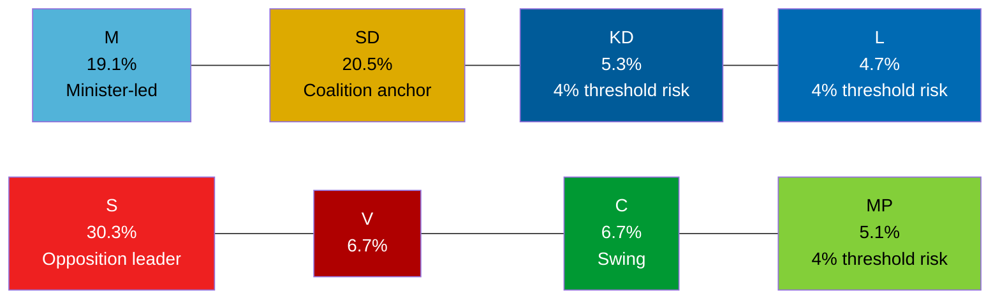

# Election 2026 Analysis — Committee Reports, 2026-05-28

<!-- artifact: election-2026-analysis | family: D | pass: 2 -->

## Election Context

**Swedish general election**: 13 September 2026 (108 days from article date)
**Current Riksdag composition** (approximate, based on 2022 election results):
- Tidö coalition: M (19.1%) + SD (20.5%) + KD (5.3%) + L (4.7%) = ~49.6% theoretical support
- Opposition: S (30.3%) + V (6.7%) + C (6.7%) + MP (5.1%) = ~48.8%

## Legislative Impact on Election Dynamics

### Impact of FöU15 (Cybersecurity) on 2026 Election

**Coalition advantage**: FöU15 entering force 15 July gives M+KD+L a concrete "delivered cybersecurity reform" narrative. Security competence is an important voter-consideration.

**Electoral risk**: Civil-liberties concerns around FRA expansion (C reservation) could emerge as a minor attack vector. Low probability — security legislation generally polls well in Sweden in 2026 geopolitical context (Russia-Ukraine war, Baltic security).

**Affected voter segments**: Defence/security-conscious centre-right voters (M, L base). C's reservation may appeal to C's traditional civil-liberties flank.

### Impact of JuU38 (Crime/Recidivism) on 2026 Election

**Coalition advantage**: SD's strongest electoral topic is crime reduction and gang violence. JuU38 is a major SD-branded delivery. M co-benefits on law-and-order credibility. Entry-into-force 2 July allows 10 weeks of "delivered" messaging.

**Electoral risk**: MP reservation on escape criminalisation (ECHR Art. 5) may generate civil society/media coverage. Limited electoral risk — crime toughness polls well across all voter groups in Sweden.

**4% threshold risk**: L (4.7%) and KD (5.3%) both rely on law-and-order delivery to retain core voters. JuU38 is a KD priority (victim protection narrative, Torsten Elofsson KD on JuU).

### Impact of SfU34 (Migration Detention) on 2026 Election

**Opposition advantage**: The five reservations from S+V+C+MP, grounded in RiR 2025:32, provide documented governance-failure evidence. S leader Magdalena Andersson can campaign on "M+SD cannot manage migration governance." C's inclusion gives this cross-bloc credibility.

**Coalition defense**: SD's primary migration message is enforcement (stopping migration), not governance quality. The "kostsamt verktyg utan styrning" Riksrevisionen finding is a governance critique, not an enforcement critique — SD can argue the solution is even tighter controls, not softer ones.

**Key swing voters**: C voters concerned about rule-of-law; suburban M voters concerned about governance competence; urban L voters where ECHR/rights issues resonate.

### Impact of SfU25 (Pension Surplus) on 2026 Election

**Bipartisan benefit**: All Pension Group parties (including S, V, C) endorsed the surplus mechanism. Neither coalition nor opposition can use it as an attack vector. It strengthens pension system credibility — a passive positive for the incumbent government.

**Election role**: Likely cited by M as evidence of responsible economic governance in election messaging.

## Polling Trajectory Assessment

Current polling trend assessment (based on general knowledge of 2026 Swedish pre-election environment):
- S retains largest single-party position (~28–31%)
- SD narrowly trails S or matches (~19–21%)
- M at ~17–19%
- C and MP both near the 4% threshold — SfU34 reservations may help C distinguish itself from coalition on rule-of-law

**Threshold analysis** (4% entry threshold):
| Party | Last election | Threshold risk | Today's betänkanden effect |
|-------|--------------|----------------|--------------------------|
| KD | 5.3% | MEDIUM risk | JuU38 delivery positive |
| L | 4.7% | HIGH risk | FöU15 + JuU38 delivery positive; FRA concern minor |
| MP | 5.1% | MEDIUM risk | SfU34 + KrU9 reservations mobilise base |

## Electoral Significance of Today's Betänkanden (Summary)

| Betänkande | Coalition benefit | Opposition challenge | Net electoral significance |
|-----------|------------------|---------------------|---------------------------|
| HD01FöU15 | Security delivery ++ | C minor -- | +++ Coalition |
| HD01JuU38 | Crime delivery +++ | MP ECHR challenge - | ++++ Coalition |
| HD01KrU9 | Neutral + | V+MP mobilise base -- | Neutral |
| HD01SfU25 | Governance ++ | Also credited ++ | ++++ Both sides |
| HD01SfU34 | Narrative risk -- | RiR-grounded attack +++ | ++++ Opposition |

**Net electoral effect**: Coalition advances on security/crime delivery; opposition gains governance-critique ammunition on migration. Pension is shared credit. Net effect marginally favours coalition on security messaging unless migration governance crisis crystallises (Scenario 2).
