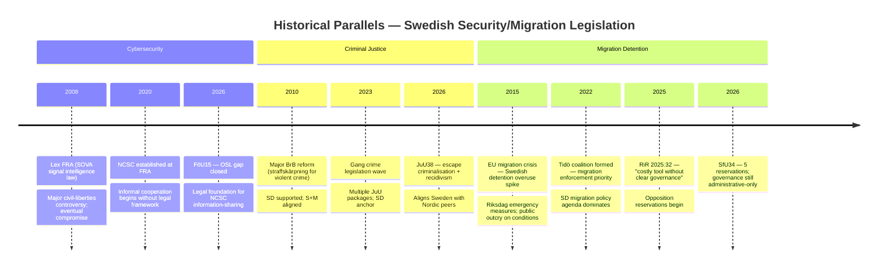

# Historical Parallels — Committee Reports, 2026-05-28

<!-- artifact: historical-parallels | family: D | pass: 2 -->

## Methodology

Identified historical precedents for today's legislative clusters using Swedish parliamentary records and Nordic policy history. Each parallel assessed for applicability to 2026 dynamics.

## Parallel 1 — Lex FRA 2008 (FöU15 Cybersecurity)

**Historical event**: In 2008, Sweden's Riksdag passed the Försvarsunderrättelselag (FRA law) allowing FRA to conduct bulk signals intelligence on cable traffic. The law passed with a government majority but triggered a major public controversy, civil society mobilisation, and intra-coalition tension (including an FP/L defection that threatened the government).

**Applicability to FöU15 (2026)**: FöU15 extends FRA's authority into NCSC personal-data processing. The civil-liberties controversy is lower today (post-Lex FRA compromise, SIUN oversight, geopolitical context of Russia-Ukraine war). However, C's reservation (future framework demand) echoes the 2008 FP/L concerns about FRA authority without comprehensive oversight legislation.

**Key difference**: 2008 controversy was about mass surveillance; FöU15 is about targeted information-sharing within a defined institutional framework. Lower controversy risk, but the governance-without-framework concern is structurally similar.

**Analyst assessment**: Monitoring indicator — if FöU15 triggers civil society campaign, Lex FRA 2008 trajectory (controversy → compromise → supplementary legislation) could repeat within 12–18 months.

---

## Parallel 2 — 2010–2013 Straffskärpning Wave (JuU38 Criminal Justice)

**Historical event**: 2010–2013 saw a wave of criminal justice toughening under the Reinfeldt government (M+FP+C+KD alliance). Multiple BrB amendments increased minimum sentences for violent crime, expanded gang-aggravation provisions, and extended preventive detention. SD supported from outside the coalition. S and V opposed most measures.

**Applicability to JuU38 (2026)**: JuU38 is the most recent iteration of a 15-year trajectory of Swedish criminal justice hardening. The escape criminalisation specifically addresses a gap noted in 2010–2013 reviews. The current Tidö coalition's version is more SD-driven (chair Henrik Vinge SD) and includes gang-movement restriction mechanisms not present in 2013.

**Key difference**: The 2010–2013 wave faced S opposition more broadly; JuU38 shows S not reserving on the main provisions. S is tacitly accepting the criminal justice hardening trajectory, focusing electoral fire on migration governance instead.

---

## Parallel 3 — 2015 Migration Crisis Legislative Response (SfU34)

**Historical event**: In 2015–2016, Sweden received approximately 163,000 asylum applications (highest per capita in EU). The Riksdag passed emergency measures including temporary residence permits and increased detention authority. Riksrevisionen subsequently (2017–2019) issued multiple reports on Migrationsverket governance weaknesses.

**Applicability to SfU34 (2026)**: RiR 2025:32 is the latest in a line of Riksrevisionen reports documenting persistent governance weaknesses in migration detention. The 2015 crisis expanded detention use; the structural governance gaps documented then have persisted for a decade.

**Key difference**: In 2016, all parties (including C, L, S) supported emergency restrictions under crisis conditions. In 2026, the opposition (including C) is using Riksrevisionen findings to challenge governance quality — the political dynamics have inverted from emergency consensus to partisan contestation.

---

## Parallel 4 — Pension System Balance Crisis 2009–2011 (SfU25)

**Historical event**: In 2009–2011, the automatic balance mechanism (balanstalet) in Sweden's income pension system fell below 1.0 due to the financial crisis. This triggered automatic pension reductions for retirees — politically embarrassing. The Pension Group subsequently agreed modifications to smooth the mechanism.

**Applicability to SfU25 (2026)**: The "gas" mechanism (surplus distribution) is the mirror-image problem — what happens when the balance ratio rises above 1.0. The 2009–2011 crisis created the template for cross-party actuarial agreement; SfU25 extends that template to the surplus side.

**Key difference**: 2009–2011 was a crisis-driven reform; SfU25 is preventive mechanism design. Cross-party success model is well-established.

---

## Analytical Summary

| Parallel | Applicability | Key risk signal |
|----------|--------------|-----------------|
| Lex FRA 2008 | MEDIUM — FöU15 has lower controversy risk | Monitor civil society response post-15 July |
| 2010–13 straffskärpning | HIGH — JuU38 is direct continuation | S acceptance signals opposition strategy shift |
| 2015 migration crisis | HIGH — governance gaps persistent | Ten-year governance gap validates opposition RiR narrative |
| 2009–11 pension balance | HIGH — same institutional mechanism | SfU25 is proven cross-party model; low risk |
