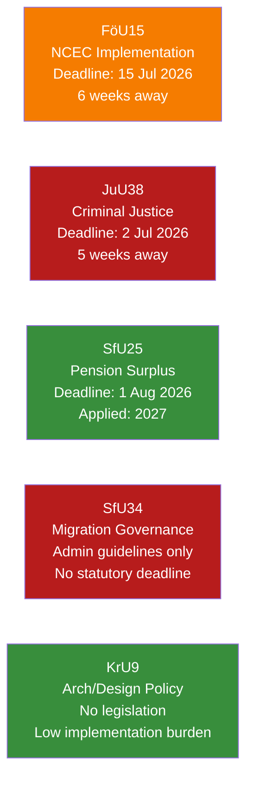

# Implementation Feasibility — Committee Reports, 2026-05-28

<!-- artifact: implementation-feasibility | family: D | pass: 2 -->

## Feasibility Overview

Three laws require operational implementation before the 13 September 2026 election. Assessment of delivery risk for each.

## Per-Law Feasibility Assessment

### FöU15 — NCSC Cybersecurity Laws (Deadline: 15 July 2026)

**Implementing agencies**: FRA (primary), MSB, SÄPO, MUST, Polismyndigheten

**Key implementation tasks**:
1. FRA must publish internal föreskrifter for personal-data processing within NCSC (new FRA PUL)
2. All 5 participating agencies must execute formal uppgiftsskyldighetsprotokoll (information-sharing agreements) with NCSC
3. OSL secrecy markings must be updated in document management systems

**Feasibility rating**: MEDIUM-HIGH (6/10)
- Positive: Agencies have been informally cooperating since 2020; the legal forms codify existing practice
- Risk: FRA's new PUL requires Datainspektionen/IMY consultation for new personal-data categories — unclear if this was completed pre-legislation

**Statskontoret relevance**: Statskontoret previously reviewed NCSC governance (2022). No current review but NCSC's inter-agency structure falls within Statskontoret's myndighetssamordning mandate. [https://www.statskontoret.se — none found for current NCSC review]

**Implementation monitoring**: FRA annual transparency report (Q3 2026); SIUN monitoring; C Riksdag motion requesting 2027 evaluation.

---

### JuU38 — Criminal Justice Package (Deadline: 2 July 2026)

**Implementing agencies**: Kriminalvården (primary), Polismyndigheten, Åklagarmyndigheten, Domstolsverket

**Key implementation tasks**:
1. **Kriminalvården**: Replace 4-category release-preparation taxonomy with "frigivningsförberedande åtgärder" — requires IT system update, staff training, revised KVFS föreskrifter
2. **Polismyndigheten**: Operationalise gang-affiliation assessment for permission and vistelseföreskrift decisions — requires register integration protocols
3. **Åklagarmyndigheten**: Updated charging templates for escape criminalisation (17:12 BrB new offence)
4. **Domstolsverket**: Guidance for courts on vistelseföreskrift proportionality assessment

**Feasibility rating**: LOW-MEDIUM (4/10)
- Risk 1: The vistelseföreskrift system requires Polismyndigheten-Kriminalvården data-sharing protocols that likely do not exist in their current form
- Risk 2: Kriminalvården KVFS update for release-preparation reform requires Board approval — 5 weeks is tight
- Risk 3: Staff training across all 45 Kriminalvården facilities before 2 July is logistically demanding

**Statskontoret relevance**: Kriminalvården is a major Statskontoret-monitored agency. [Statskontoret 2023 review of Kriminalvårdens kostnadseffektivitet exists — partial relevance to JuU38 implementation capacity]. See: https://www.statskontoret.se/publicerat/publikationer/2023/

**ECHR proportionality risk**: Domstolsverket must provide courts with guidance on ECHR Art. 8 (movement restrictions) proportionality — no confirmed guidance issued yet.

---

### SfU25 — Pension Surplus Distribution (Deadline: 1 August 2026, applied 2027)

**Implementing agency**: Pensionsmyndigheten

**Key implementation tasks**:
1. Update socialförsäkringsbalken balance-index calculation in Pensionsmyndigheten's actuarial model
2. Write off historical state debt in the accounting ledger (administrative bookkeeping change)
3. Communicate the "gas" mechanism to pension savers via mypension.se and annual statements

**Feasibility rating**: HIGH (8/10)
- Pensionsmyndigheten has world-class actuarial capacity (Sweden's pension system is internationally regarded)
- The formula change is technically additive to existing calculations
- Debt write-off is a bookkeeping entry, not a new operational system

**Statskontoret relevance**: Pensionsmyndigheten falls under Statskontoret oversight. [https://www.statskontoret.se — previous review of Pensionsmyndigheten's administrative efficiency 2021 — none found for 2026 SfU25 specific].

---

### SfU34 — Migration Detention Governance (No statutory deadline)

**Implementing agencies**: Migrationsverket (primary), Polismyndigheten, Migrationsdomstolarna

**Key implementation tasks** (from government's stated response):
1. Issue clarifying guidelines on detention criteria proportionality — UNCLEAR TIMELINE
2. Review cooperation agreement between Migrationsverket and Polismyndigheten — UNCLEAR TIMELINE
3. Strengthen monitoring and follow-up mechanisms — UNCLEAR TIMELINE

**Feasibility rating**: LOW (3/10)
- No statutory implementation deadline
- Administrative guidelines only — no legal enforcement mechanism
- The five opposition reservations document that all reforms requested (statutory criteria, oversight, cooperation mandate, child rights) were rejected

**Statskontoret relevance**: Migrationsverket. [See: Statskontoret, "Migrationsverkets förvarsverksamhet" — if exists]. Given RiR 2025:32, Statskontoret may be asked to conduct a follow-up evaluation.

**Risk**: The absence of a statutory deadline means implementation can be deferred indefinitely. Post-election, a new government (regardless of composition) could restart the SfU34 statutory reform debate.

## Aggregate Implementation Risk

| Law | Entry into force | Feasibility | Primary risk |
|-----|-----------------|-------------|-------------|
| FöU15 | 15 Jul 2026 | MEDIUM-HIGH | FRA PUL consult lag |
| JuU38 | 2 Jul 2026 | LOW-MEDIUM | Kriminalvården IT + vistelseföreskrift protocols |
| SfU25 | 1 Aug 2026 (applied 2027) | HIGH | Minimal |
| SfU34 | No deadline | LOW | Administrative drift without enforcement |
| KrU9 | N/A | N/A | Non-legislative |
